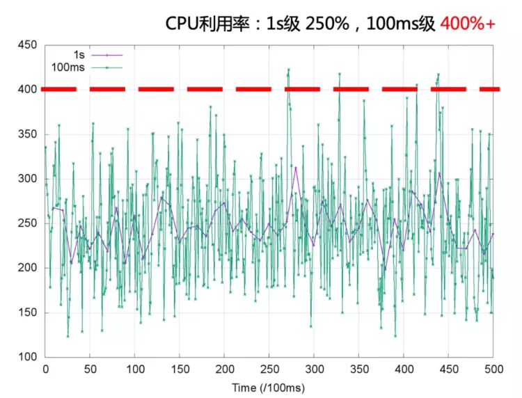

# cpu throttle导致的延迟问题

## 1. 概述

通过 Cgroups 限制容器 CPU 使用量时，实际上限制的是对应进程的 CPU 的使用时间。

内核 CFS 调度是通过 cfs_period 和 cfs_quota 两个参数来管理容器 CPU 时间片消耗的，cfs_period 一般为固定值 100 ms，cfs_quota 对应容器的 CPU Limit。

例如对于一个 CPU Limit = 2 的容器，其 cfs_quota 会被设置为 200ms，表示该容器在每 100ms 的时间周期内最多使用 200ms 的 CPU 时间片，即 2 个 CPU 核心。当其 CPU 使用量超出预设的 limit 值时，容器中的进程会受内核调度约束而被限流。

比如每次 CPU 切换周期为 100ms，**限制该进程只能使用20% CPU 实际是 100ms 的周期内，该进程只能使用 20ms**，而剩下 80ms 该进程无法使用 CPU，一直停在那里。一直到下一个周期时，该进程又可以使用 20ms。

那么问题来了，如果一个请求在 21ms 时过来，就需要先等待 80ms，到下一周期时才能执行，因此会出现 CPU 利用率不高的情况下接口尾延迟也特别高。

## 2. 你看到的 CPU 利用率不是全部真相

受内核调度控制周期（cfs_period）影响，容器的 CPU 利用率往往具有一定的**欺骗性**，下图展示了某容器一段时间的 CPU 使用情况（单位为0.01核），可以看到在 1s 级别的粒度下（图中紫色折线），容器的 CPU 用量较为稳定，平均在 2.5 核左右。根据经验，管理员会将 CPU Limit设置为 4 核。

本以为这已经保留了充足的弹性空间，然而若我们将观察粒度放大到 100ms 级别（图中绿色折线），容器的 CPU 用量呈现出了严重的毛刺现象，峰值达到 4 核以上。此时容器会产生频繁的 CPU Throttle，进而导致应用性能下降、RT 抖动，但我们从常用的 CPU 利用率指标中竟然完全无法发现！

> **CPU 利用率是一段时间内 CPU 使用的平均**，以较粗的粒度统计 CPU 的使用需求，CPU 利用率趋向稳定；当观察的粒度变细，CPU 使用的突发特征更明显。

r如果根据秒级观察到的 CPU 利用率 250% 设置容器 quota 和 period 分别为 400ms 和 100ms ，容器进程的细粒度突发被 Bandwidth Controller 限流，容器进程的 CPU 使用受到影响。

## 3. CPU Burst 

我们用 CPU Burst 技术来满足这种细粒度 CPU 突发需求，在传统的 CPU Bandwidth Controller quota 和 period 基础上引入 burst 的概念。当容器的 CPU 使用低于 quota 时，可用于突发的 burst 资源累积下来；当容器的 CPU 使用超过 quota，允许使用累积的 burst 资源。最终达到的效果是将容器更长时间的平均 CPU 消耗限制在 quota 范围内，允许短时间内的 CPU 使用超过其 quota。

**类似于从漏斗桶限流算法切换到了令牌桶算法,可以在请求量低时存一部分令牌用于 burst**。

在容器场景中使用 CPU Burst 之后，测试容器的服务质量显著提升。

观察到 RT 均值下降 68%（从 30+ms 下降到 9.6ms ）；99%  RT 下降 94.5%（从 500+ms 下降到 27.37ms ）。

## 4. 使用 CPU Burst 的影响

出于改善服务质量的需要，我们使用 CPU Burst 允许突发的 CPU 使用之后，对调度器的稳定性产生什么影响？

答案是：**当多个 cgroup 同时突发使用 CPU，调度器稳定性约束和任务实时性保证`有可能`被打破**。

这时候两个约束得到保证的概率是关键：

* 如果两个约束得到保证的概率很高，对大多数周期来任务实时性都得到保证，可以放心大胆使用 CPU Burst；
* 如果任务实时性得到保证的概率很低，这时候要改善服务质量不能直接使用 CPU Burst，应该先降低部署密度提高 CPU 资源配置。

## 5.相关阅读

[让容器跑得更快：CPU Burst 技术实践](https://mp.weixin.qq.com/s?__biz=MzUzNzYxNjAzMg==&mid=2247519934&idx=1&sn=e87d2ab211516965ae3ffb51297df767&chksm=fae68571cd910c67b203d0d95023357a29ef9cd1ff956b3784ac3ebf490edfeb1f1ac6d75f74&scene=21#wechat_redirect)

[如何合理使用 CPU 管理策略，提升容器性能](https://mp.weixin.qq.com/s/N7UWOjqEnZ8oojWgFGBOlQ)

[cpu throttle原理浅析](https://blog.csdn.net/huang987246510/article/details/118424808)