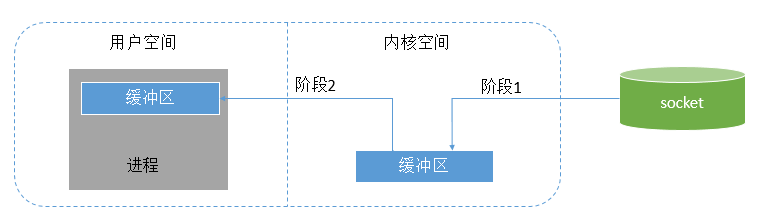
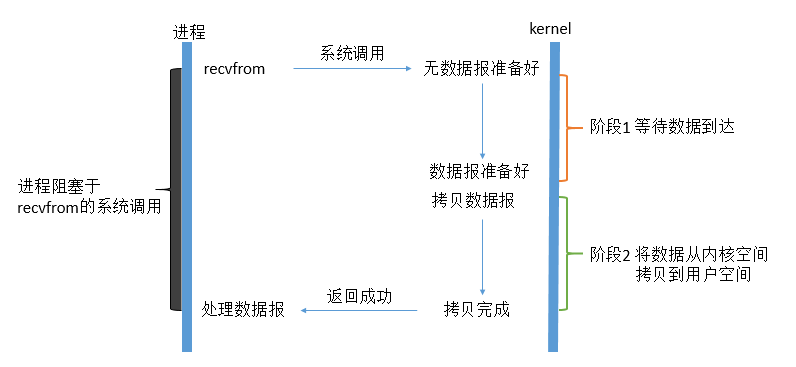
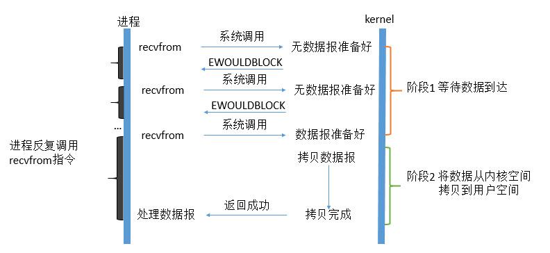
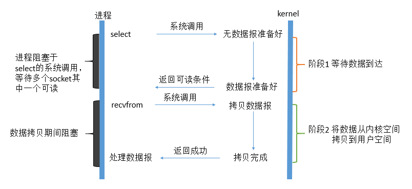

 # Unix 五种 IO 模型

## 1. 概述

IO 是主存和外部设备 ( 硬盘、终端和网络等 ) 拷贝数据的过程。 IO 是操作系统的底层功能实现，底层通过 I/O 指令进行完成。在本教程中，我们所说的IO指的都是网络IO。

技术的出现一定是为了解决当前技术的某些痛点，IO 模型演化也是如此。

最初 BIO 到 NIO 、select、epoll 都是为了解决某些不得不解决的问题。

五种模型

* 1）阻塞式I/O：blocking IO
* 2）非阻塞式I/O： nonblocking IO
* 3）I/O复用（select，poll，epoll...）：IO multiplexing
* 4）信号驱动式I/O（SIGIO）：signal driven IO
* 5）异步I/O（POSIX的aio_系列函数）：asynchronous IO

在这里，我们以一个网络IO来举例，对于一个network IO (以read举例)，它会涉及到两个系统对象：一个是调用这个IO的进程，另一个就是系统内核(kernel)。当一个read操作发生时，它会经历两个阶段：

**阶段1：**等待数据准备 (Waiting for the data to be ready)

**阶段2：** 将数据从内核拷贝到进程中 (Copying the data from the kernel to the process)



当进程请求 I/O 操作的时候，它执行一个系统调用 syscall 将控制权移交给内核。当内核以这种方式被调用，它随即采取任何必要步骤，找到进程所需数据，并把数据传送到用户空间内的指定缓冲区。内核试图对数据进行高速缓存或预读取，因此进程所需数据可能已经在内核空间里了。如果是这样，该数据只需简单地拷贝出来即可。如果数据不在内核空间，则进程被挂起，内核着手把数据读进内存。

## 2. BIO

在linux中，默认情况下所有的socket都是blocking，一个典型的读操作流程大概是这样：

第一步通常涉及等待数据从网络中到达。当所有等待数据到达时，它被复制到内核中的某个缓冲区。

第二步就是把数据从内核缓冲区复制到应用程序缓冲区。



当用户进程调用了recvfrom这个系统调用，kernel就开始了IO的第一个阶段：准备数据。对于network io来说，很多时候数据在一开始还没有到达（比如，还没有收到一个完整的UDP包），这个时候kernel就要等待足够的数据到来。而在用户进程这边，整 个进程会被阻塞。当kernel一直等到数据准备好了，它就会将数据从kernel中拷贝到用户内存，然后kernel返回结果，用户进程才解除 block的状态，重新运行起来。

**所以，blocking IO的特点就是在IO执行的两个阶段都被block了。**

代码如下，一个简单的 socket server

```go
func main() {
	//建立socket，监听端口  第一步:绑定端口
	netListen, err := net.Listen("tcp", "localhost:9800")
	if err != nil {
		panic(err)
	}
	//defer延迟关闭改资源，以免引起内存泄漏
	defer netListen.Close()
	Log("Waiting for clients")
	for {
		//第二步:等待连接
		conn, err := netListen.Accept()
		if err != nil {
			continue
		}
		Log(conn.RemoteAddr().String(), " tcp connect success")
		// 使用goroutine来处理用户的请求
		go handleConnection(conn)
	}
}
```

**说明**

首先 listen 监听端口，然后在一个死循环中 等待 accept（accept 过程是阻塞的），也就是说每次只能在处理某个请求或者阻塞在 accept。于是每次请求都开一个新的 goroutine 来处理`go handleConnection(conn)`。

具体的调用

```shell
# 获取socket fd 文件描述符 假设是 fd5
socket = fd5
# 绑定端口
bind 9800
# 监听 这个 文件描述符
listen fd5
# 然后 accept 等待连接过来 比如这里 fd6 就是进来的连接
accept fd5 = fd6
# 然后从 fd6 读取数据
recvfrom fd6       
```

会发生很多 syscall 系统调用。

**问题**

> 这样做存在很多问题，需要为每个链接开一个 goroutine ，如果有 1W 链接那就要开 1W goroutine 。

* 1）消耗资源，每个 goroutine  是需要一定内存的。
* 2）cpu 对这么多 goroutine 调度也会浪费资源
* 3）最大问题是 这个 accept 是阻塞的，所以才需要开这么多 goroutine 

当前了 goroutine 协程 相对于 线程 是非常轻量级的，调度也是有自己的 GPM 模型，goroutine 的切换也全是在用户态，相较之下已经比线程好很多了。

但是一旦涉及到系统调用 就会很慢，那么能不能让 accept 不阻塞呢？

> 就是因为 accept 是阻塞的，所以只能开多个 线程 or 协程 来勉强使用。

kernel 中 提供了 sock_nonblock 方法，可以非阻塞


## 3. NIO

linux下，可以通过设置socket使其变为non-blocking。当对一个non-blocking socket执行读操作时，流程是这个样子：



从图中可以看出，当用户进程发出read操作时，如果kernel中的数据还没有准备好，那么它并不会block用户进程，而是立刻返回一个error。 从用户进程角度讲 ，它发起一个read操作后，并不需要等待，而是马上就得到了一个结果。用户进程判断结果是一个error时，它就知道数据还没有准备好，于是它可以再次 发送read操作。一旦kernel中的数据准备好了，并且又再次收到了用户进程的system call，那么它马上就将数据拷贝到了用户内存，然后返回。

**所以，用户进程第一个阶段不是阻塞的,需要不断的主动询问kernel数据好了没有；第二个阶段依然总是阻塞的。**


使用 sock_nonblock 使得该过程非阻塞

```shell
# 获取socket fd 文件描述符 假设是 fd5
socket = fd5
# 绑定端口
bind 9800
# 监听 这个 文件描述符
listen fd5
# 然后 accept 等待连接过来 比如这里 fd6 就是进来的连接
accept fd5 = fd6
# 然后从 fd6 读取数据
recvfrom fd6       
```

虽然是非阻塞了，但是还是存在另外的问题，比如 C10K 问题。

假设有 1W 客户端，那么每次循环都需要对每个客户端进行一个 系统调用，假设 1W 客户端里其实就只有 1 个是有消息的，相当于另外 9999 次都是浪费。


> 每次循环时间复杂度为 O(n),但是实际上只需要处理有消息的连接，即O(m)。
>
> n 为连接数，m 为有消息的连接数

同样的 kernel 通过 提供 select 方法来解决这个问题。

## 4. 多路复用

IO复用同非阻塞IO本质一样，不过利用了新的select系统调用，由内核来负责本来是请求进程该做的轮询操作。看似比非阻塞IO还多了一个系统调用开销，不过因为可以支持多路IO，才算提高了效率。


### select

它的基本原理就是select /epoll这个function会不断的轮询所负责的所有socket，当某个socket有数据到达了，就通知用户进程。它的流程如图：



select 方法接收多个 文件描述符，最后会返回需要处理的那几个文件描述符。

所以前面的程序流程就可以修改一下了，

假设有 1W 连接，即 1W 个文件描述符。

以前是 循环中 为了处理那几个有消息的连接，调用 1W 次 syscall，现在就先调用 `select(fds)` ,把 1W 个 文件描述符发给 kernel，内核处理后，假设只有 2个 连接是有消息的，需要处理，就只会返回对应的 fd,比如这里是 fd6、fd7。

然后程序拿到需要处理的 fd 列表后再挨个处理，这样就减少了 9998 次 syscall。

> **注意** 多路复用返回的是状态，具体读写操作还是由程序来控制。

那么这个模型有没有问题呢？

问题就是 每次 都要发 1W 个 fd 到 kernel ,然后内核中也要完成 1W 次遍历O(n)，但是以前是 1W 次系统调用，现在是 1次系统调用，里面遍历 1W 次，还有优化了不少的。

* 1） 每次要传 1W 个 fd 给内核
* 2） 内核每次要遍历 1W 个 fd,才能返回需要处理的 fds

如何优化呢？

在内核中开辟一块空间，每次有新的 fd 就直接存到这个空间里，不需要了就移除掉。这样问题1 就解决了。

问题2 的话就不好处理了，除非内核中提供某种机制，不需要自己去遍历 fds，等有消息来的时候 主动通知内核哪个 fd 来消息了，这样就很完美了。

于是 kernel 中就提供了 epoll 来解决这些问题。

### epoll

epoll 与 select 相比就是 不需要自己去遍历 fds 了,由事件驱动的方式，有消息了就主动通知。

一共有 3 个方法

* 1）epoll_create()
* 2）epoll_ctl()
* 3）epoll_wait()

具体信息都可以通过`man name`进行查看，比如`man epoll_create()`

> 如果提示 未找到 man 手册的话 可以手动安装一下 以下是 ubuntu 的安装命令 centos 用 yum install 应该是一样的
>
> apt-get install manpages-de  manpages-de-dev  manpages-dev glibc-doc manpages-posix-dev manpages-posix

```shell
epoll_create()
epoll_create() returns a file descriptor referring to the new epoll in‐
       stance. 
# 返回一个文件描述符。
# 这个就是前面说的，开内核中开辟一块空间来存放 fds 返回的文件描述符就是描述这块空间的
```

```shell
epoll_ctl()
# 用于管理 前面创建的空间中的 fds
# 比如新增一个 fd，或者删除某个 fd
```

```shell
epoll_wait()
# 这个就是等 等着某个 fd需要处理了就返回 不用自己去遍历了
```


伪代码

```shell
# 获取socket fd 文件描述符 假设是 fd5
socket = fd5
# 绑定端口
bind 9800
# 监听 这个 文件描述符
listen fd5
# 开辟一块用于存储 fds 的空间，假设为 fd8
epoll_create fd8
# 然后第一件事就是把 前面的 server 端 socket fd5 存进去
apoll_ctl(fd8,add,fd5,accept)
# 然后就开始等待了
epoll_wait(fd8)

# 假设此时有连接进来了 假设为 fd6
accept fd5---> fd6
# 也是 第一件事就存进去
apoll_ctl(fd8,fd6)
...
# 最后 epoll 空间里肯定就存了很多 fd
```

那么问题来了，他是如何指定那个 fd 需要处理的?

就是靠的**事件驱动**，收到消息后，网卡向 CPU 发送一个 中断事件,CPU 根据这个中断号就能判断出具体是什么事件了，然后通过回调方法就去拿到数据。


## 5. 小结

在那些地方也用到了 `epoll`？

redis、nginx等等

可以通过以下命令来追踪

```shell
# strace 追踪系统调用 trace.log 就是存储的调用日志
strace  -ff -o ./ nginxout /nginx/sbin/nginx /nginx/conf/nginx.conf
```

应该会有多个`nginxout.xxx`文件，第一个是一个外壳用于启动 nginx，第二个应该是 master 进程的，后续几个才是 worker 进程的，所以需要关注的是 后续几个文件。

nginx 的 epoll 是阻塞的，没有消息来的时候就会一直阻塞，什么也不干。

但是 redis 虽然同样是用的 epoll,但却用的轮询方式？

因为 Redis 是单线程架构，还需要去处理其他的事情（比如 LFU、LRU文件过期，RDB AOF 备份等），所以只能轮询

Nginx 则不需要处理其他事情，有连接来了就处理，没有就等着

**零拷贝**

原始的处理流程

```shell
磁盘--->kernel-->程序-->kernel-->用户
```

零拷贝

使用的是 unix 下的 sendfile 这个方法。

```shell
磁盘-->用户
```


**零拷贝的前提：数据不需要加工**，否则必须把数据先读到程序内存中，加工完成后再发送到 kernel 最后给用户。


## 6. 参考

`http://www.tianshouzhi.com/api/tutorials/netty/221`

`https://www.bilibili.com/video/BV11z4y1Q7ns`