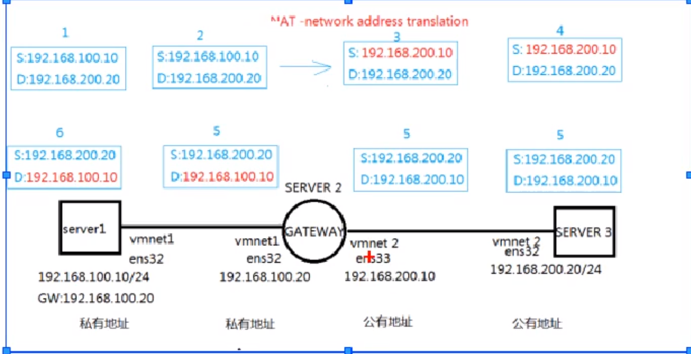

# iptables

> [Linux系统安全_Iptables](https://www.bilibili.com/video/BV1p3411L7JW)


## 1. 概述

4表5链。

4表

* raw
* mangle
* filter
* nat

5链

* prerouting
* input
* output
* forward
* postrouting


##  2. 表链关系

* filter表
  * **INPUT**：对访问本机的数据包进行过滤
  * FORWARD：对途经本机的数据包进行过滤
  * **OUTPUT**：对本机发出的访问其他网络的包进行过滤
  * 总结：根据规则来处理数据包，如转或者丢，实现主机型防火墙的主要表，内核模块 iptable_filter。
* nat 表
  * **PREROUTIBNG**：修改目的地址
  * **POSTROUTING**：修改源地址
  * OUTPUT：主要是控制内部发出的数据包，POSTROUTING中的数据包有可能是直接FORWARD过来的
  * 总结：转换地址的表（改IP、改端口），内核模块 iptable_nat
* mangle 表
  * PREROPUTING、INPUT、OUTPUT、FORWARD、POSTROUTING
  * 流量整形的表，路由标记用的表，改TOS，TTL，Mark标记策略路由等,iptable_mangle
* raw
  * PREROUTING、OUTPUT
  * 新表，数据包跟踪，iptable_raw


同时有多张表生效时的一个先后顺序。表的应用顺序：raw-->mangle-->nat-->filter

同样的，链之间也有先后顺序：入站-->转发-->出站

规则也有顺序：ACL逐条匹配，匹配到即停止。


## 3. 基本操作

命令语法

```shell
iptables -t 表名 管理选项 [链名][匹配条件][-j 控制类型]
```


* -t 表名：raw、mangle、nat、filter，不写默认为 filter表
* 管理选项：操作方式，如添加(A)、插入(I)、查看(L)、删除(D)等
  * 添加：Add，在链的末尾追加一条规则
  * 插入：Insert，在链的开头(或指定位置)插入一条规则
  * 删除：Delete
  * 查看：List
* 链名：PREROPUTING、INPUT、OUTPUT、FORWARD、POSTROUTING
* 匹配条件：数据包特征 ip、端口等
* 控制类型：数据包处理方式
  * ACCEPT：允许
  * REJECT：拒绝，会返回一个拒绝数据包作为回应
  * DROP：丢弃，直接丢弃，不做任何回复
    * [iptables 之 REJECT 与 DROP 对比](https://segmentfault.com/a/1190000012637947)
  * LOG：日志


### 演示

需求：禁止当前机器被ping

具体实现：在 filter 表的 INPUT 链插入一个丢弃 icmp 的规则。

```shell
# 添加
iptables -t filter -A INPUT -p icmp -j REJECT
# 查看
iptables -t filter -L
# 删除
iptables -t filter -D INPUT -p icmp -j REJECT
```


### 其他操作

* 添加规则
  * -A：在链的末尾追加一条规则
  * **-I**：在链的开头(或指定位置)插入一条规则

* 查看规则
  * **-L**：列出所有规则条目
  * -n：以数字形式显示地址、端口等信息
  * -v：以更详细的方式显示规则信息
  * --line-numbers：查看规则时，显示规则的序号，后续可以直接通过序号进行删除，或者插入到具体位置
* 删除、清空规则
  * **-D**：删除链内指定序号(或内容)的一条规则
  * -F：清空所有的规则(-X 是清理自定义的链，用的少，-Z 清零规则序号)
* 设置默认规则
  * -P：为指定的链设置默认规则，默认规则优先级最低，如果其他规则都匹配不上才会进默认规则
  * 示例：`iptables -t filter -P INPUT DROP`


```shell
# 追加一条规则
iptables -t filter -A INPUT -p tcp -j ACCEPT
# 插入到第一行
iptables -t filter -I INPUT -p udp -j ACCEPT
# 插入到第二行
iptables -t filter -I INPUT 2 -p icmp -j ACCEPT
# 查看
iptables -t filter -L
# 删除第三条骨子额
iptables -t filter -D INPUT 3
# 清空所有规则(清不了默认规则)
iptables -t filter -F
# 修改默认规则
iptables -t filter -P INTPUT ACCEPT
```


## 4. 进阶

### 通用匹配

#### 匹配协议

```shell
# 丢弃icmp的包，不让别人ping自己
iptables -t filter -I INPUT -p icmp -j DROP
```


#### 匹配地址

```shell
#禁止源122.1的主机进来(换其他主机是可以进来的)
iptables -t filter -I INPUT -s 192.168.122.1 -j REJECT
#禁止源10网段的数据包
iptables -t filter -I INPUT -s 192.168.122.0/24 -j DROP
```


#### 匹配物理接口

```shell
#谁也连不上
iptables -t filter -I INPUT -o eth0 -j DROP
```


### 隐含匹配


端口匹配

--sprot/--dport，需要协议的前提

```shell
#允许个别端口
iptables -t filter -I INPUT -s 192.168.100.254/24 -p tcp --dport 80 -j ACCEPT
#这是一片端口，表示范围20~21,24500~24600
iptables -t filter -I INPUT -p tcp --dport 20:21 -j ACCEPT
iptables -t filter -I INPUT -p tcp --dport 24500:24600 -j ACCEPT
```

标记位匹配(SYN、ACK、RST)

```shell
iptables -t filter -I INPUT -i eth0 -p tcp --tcp-flags SYNC,RST,ACK SYN -j DROP
```


ICMP类型匹配

ICMP 类型：请求为8，应答为0.

```shell
#自己ping别人可以，反过来不行 icmp-type 8 就是指定把icmp的请求包丢弃了，所以别人不能ping我
# 但是应答包是可以接收的，所以我可以ping别人(前提是ping的那个机器没有禁止ping)
iptables -t filter -I INPUT -p icmp --icmp-type 8 -j DROP
```


### 显式匹配

通过调用模块，lsmod|grep xt_ 来加载内核扩展模块，如端口匹配，IP范围，MAC地址，状态等特殊匹配。

多端口匹配

* -m multiport --sprot：源端口
* -m multiport --dport：目的端口


```shell
iptables -t filter -A INPUT -p tcp -m multiport --dport 80,21,22,24 -j DROP
```


IP范围匹配

* -m iprange --src-range


```shell
iptables -t filter -I INPUT -p tcp -m iprange --src-range 192.168.100.21-192.168.100.28 -j ACCEPT
```


MAC地址匹配

* -m mac --mac-source


```shell
iptables -t filter -I INPUT -m mac --mac-source 00:0C:29:64:E3:8D -j ACCEPT
```


TCP 状态匹配

* -m state --state


```shell
iptables -t filter -I INPUT -p tcp -m state --state ESTABLISHED,RELATED -j ACCEPT
```


## 5. 网络型iptables


网络型iptables主要有两个作用：

* filter表主要做服务器流量控制
* nat表主要做网关路由器，网络地址转换SNAT和DNAT


### SNAT

SNAT：源地址转换，**主要用于内网访问外网**。

具体步骤：

* 1）配置IP，将同一网段打通，注意配置网关地址
* 2）启动机器B的路由转发功能，然后测试内外网互通，成功
* 3）删除机器C的网关，模拟私有IP没有路由的情况，尝试通信失败
* 4）在机器B(即中转路由设备)建立SNAT，通信成功
* 5）通过机器C的web访问日志，可以看出来访者


开启机器的路由转发功能

`/usr/lib/sysctl.d/50-default.conf`文件中增加以下内容，然后**重启**。

```shell
net.ipv4.ip_forward = 1
```

不想重启也可以，执行以下命令，直接更改以下内存中的数据

```shell
echo 1 >/proc/sys/net/ipv4/ip_forward
```

然后使用以下命令查看是否生效：

```shell
sysctl -a |grep ip_forward
```


iptables 配置 nat

```shell
iptables -t nat -A POSTROUTING -s 192.168.100.0/24 -o ens33 -j SNAT --to-source 192.168.200.10
```

把 192.168.100.0/24 出站的数据的源地址全部换成 192.168.200.10。

> 实际生活源地址会被换成我们的公网IP。


### MASQUERADE

MASQUERADE：地址伪装，也是NAT的一种，也是用于**内网访问外网且外网IP地址非固定**的情祝。

一般家庭带宽的公网IP都是动态分配的，SNAT无法使用。因为使用SNAT的时候需要指定一个固定的IP。

> 对于ADSL拨号连接，接口通常为ppp0、ppp1 

```shell
iptables -t nat -A POSTROUTING -s 192.168.100.0/24 -o ens33 -j SNAT --to-source 192.168.200.10
```

 --to-source 这个参数，但我们的IP是固定的，这个就没法用了。
将SNAT规则改为MASQUERADE即可，使动态地址作为SNAT的目标地址,效果和SNAT一致。


```shell
iptables -t nat -A POSTROUTING -s 192.168.100.0/24 -o ens33 -j MASQUERADE
```


### DNAT

DNAT：目的地址转换，适用于**外网访问内网**的场景。

在用于路由的机器上配置以下 iptables规则。

```shell
iptables -t nat -A PREROUTING -i ens33 -d 192.168.200.10 -p tcp --dport 80 -j DNAT --to-destination 192.168.100.10
```


### PNAT

PNAT：端口转换(映射)，安全性更高，比如内网服务器的SSH程序22端口，发布时SSH使用2345端口。


```shell
iptables -t nat -A PREROUTING -i ens33 -d 192.168.200.10 -p tcp --dport 2345 -j DNAT --to-destination 192.168.100.10:22
```

和 DNAT 命令也基本一致，只是最后`--to-destination 192.168.100.10:22`，带上了端口号。


### 流程

具体流程如下图所示：




* 1）首先我们发出去的包 源地址是 100.10,目的地址为200.20，不在同一个网段所以这个包会被发送到网关
* 2）网关收到这个包的时候源地址还是 100.10,目的地址还是200.20
* 3）最重要的一步来了，**SNAT**功能，由于上面配置了 iptables规则的(把 192.168.100.0/24 出站的数据的源地址全部换成 192.168.200.10),，所以到这里的时候源地址就变成了 200.10,目的地址没变还是200.20
* 4）等Server3收到包的时候 源地址是 200.10,目的地址为200.20，成功收到这个包了，
* 5）然后Server3处理完成也要回复一个包，此时回复包的目的地址就是之前收到那个包的源地址，即200.10，然后当前回复包的源地址就是200.20
* 6）Server2成功收到了这个包，源地址200.20，目的地址200.10
* 7）Server2此时会根据自己的NAT转换记录找到，之前这个200.10是100.10在用，所以这个包会进行一个**DNAT**，将目的地址从200.10转成100.10
* 8）最终Server1就收到了这个包，目的地址100.10，源地址200.20

经过一个SNAT和DNAT就完成了一次数据交换。


## 6. FAQ

### 避免重复添加规则

iptables 添加规则时没有做重复校验，因此会出现同一条规则添加多次的情况，为了避免重复添加，我们需要在添加之前使用 ` iptables -C `进行校验。

> 如果时旧版本 iptables 没有 -C 参数的话可以使用` iptables-save | grep -- "-A INPUT -p tcp -m tcp --dport 8080 -j ACCEPT"`

```bash
$ iptables -C INPUT -p tcp --dport 8080 --jump ACCEPT
# 如果不存在的话会报错，提示信息如下，并且 exitcode 为 1
iptables: Bad rule (does a matching rule exist in that chain?).
$ echo $?
1
$ iptables -A INPUT -p tcp --dport 8080 --jump ACCEPT
$ iptables -C INPUT -p tcp --dport 8080 --jump ACCEPT
# 如果脚本存在的话 exitcode 为 0
$ echo $?
0
```

因此可以根据 exitcode 来做判断，脚本如下：

```bash
# 最后 iptables 丢弃 53 端口的请求，保证外部无法访问本机 coredns
# 添加规则之前先判断是否存在，避免重复添加
if  iptables -C INPUT -p tcp --dport 53 -j DROP
then # 进入 then 表示退出码为 0，说明规则已经存在了，不在重复添加
    echo "tcp规则已经存在"
else # else 则表示退出码不为 0，规则不存在,则添加
     echo "tcp规则不存在，添加"
    iptables -I INPUT -p tcp --dport 53 -j DROP
fi

if  iptables -C INPUT -p udp --dport 53 -j DROP
then # 进入 then 表示退出码为 0，说明规则已经存在了，不在重复添加
    echo "udp规则已经存在"
else # else 则表示退出码不为 0，规则不存在,则添加
    echo "udp规则不存在，添加"
    iptables -I INPUT -p udp --dport 53 -j DROP
fi
```

同样的，删除规则之后也可以判断一下是否删除干净

```bash
# 删除 iptables 规则，允许外部访问本机 coredns
# 因为 iptables 规则可以重复添加多次，因此 使用 while 循环，保证删除干净
rule_tcp=1
while [ "${rule_tcp}" == 1 ]
do
  if  iptables -C INPUT -p tcp --dport 53 -j DROP
  then # 进入 then 表示退出码为 0，说明规则已经存在了，需要移除
      echo "tcp规则存在"
      iptables -D INPUT -p tcp --dport 53 -j DROP
  else # else 则表示退出码不为 0，规则不存在,不需要移除
      echo "tcp规则已移除"
      rule_tcp=0
  fi
done

rule_udp=1
while [ "${rule_udp}" == 1 ]
do
  if  iptables -C INPUT -p udp --dport 53 -j DROP
  then # 进入 then 表示退出码为 0，说明规则已经存在了，需要移除
      echo "tcp规则存在"
      iptables -D INPUT -p udp --dport 53 -j DROP
  else # else 则表示退出码不为 0，规则不存在,不需要移除
      echo "udp规则已移除"
      rule_udp=0
  fi
done
```

