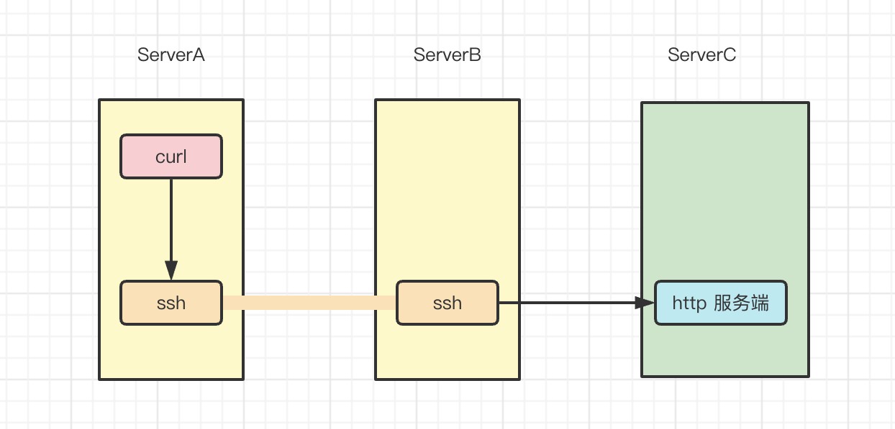
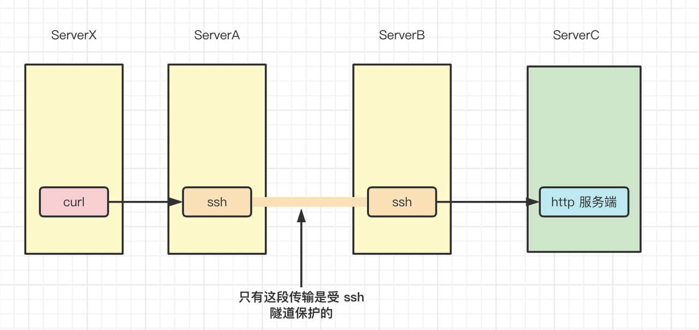
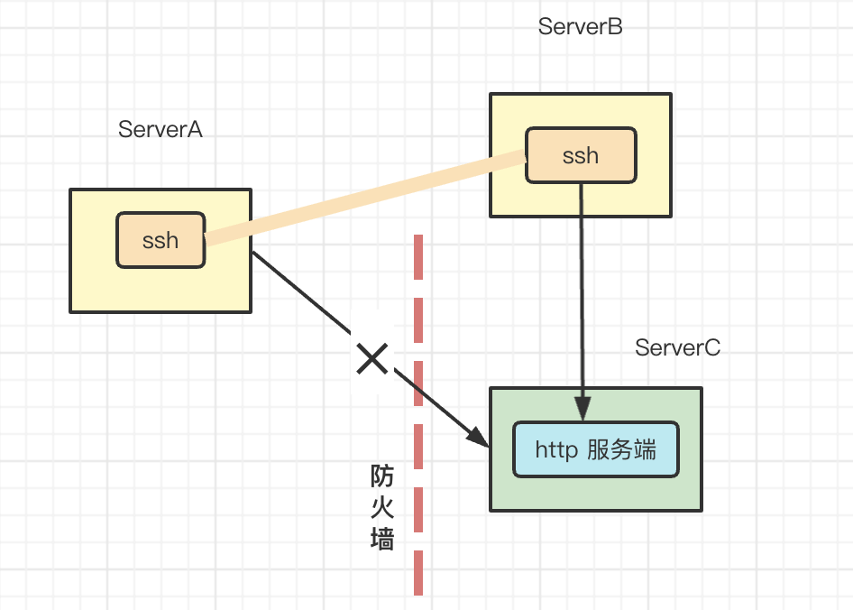

# SSH 隧道

## 概述

**SSH 隧道本质上就是端口转发**。

它能够将其他 TCP 端口的网络数据通过 SSH 链接来转发，并且自动提供了相应的加密及解密服务。这一过程也被叫做“隧道”（tunneling），这是因为 SSH 为其他 TCP 链接提供了一个安全的通道来进行传输而得名。

 SSH 端口转发能够提供两大功能： 

* 1）加密 SSH Client 端至 SSH Server 端之间的通讯数据。
* 2）突破防火墙的限制完成一些之前无法建立的 TCP 连接。


### 本地转发和远程转发

SSH 端口转发自然需要 SSH 连接，而 SSH 连接是有方向的，从 SSH Client 到 SSH Server 。而我们的应用也是有方向的，比如需要连接 MySQL Server 时，MySQL Server 自然就是 Server 端，我们应用连接的方向也是从应用的 Client 端连接到应用的 Server 端。**如果这两个连接的方向一致，那我们就说它是本地转发。而如果两个方向不一致，我们就说它是远程转发**。


### 相关参数

- “-L选项”：local，表示使用本地端口转发创建ssh隧道

- “-R选项”：remote，表示使用远程端口转发创建ssh隧道
- “-D选项”：dynamic，表示使用动态端口转发创建ssh隧道

- “-N选项”： 表示创建隧道以后不连接到sshServer端，通常与”-f”选项连用

- “-f选项”：表示在后台运行ssh隧道，通常与”-N”选项连用

- “-g选项”：表示ssh隧道对应的转发端口将监听在主机的所有IP中，不使用”-g选项”时，转发端口默认只监听在主机的本地回环地址中，”-g”表示开启网关模式，远程端口转发中，无法开启网关功能


## 演示

### 本地转发

**一般是 server 端有 IP 能访问时用本地转发。**

将服务器  172.20.150.199 上的 8888 端口映射到本地的 8888 端口，即将本地 8888 端口流量转发到服务器  172.20.150.199 上的 8888 端口。

> 比如不能直接访问 server 的 8888 端口，此时就可以使用 ssh 隧道来突破该限制。

在服务器 172.20.148.199 上启动一个 http server：

```Bash
python -m SimpleHTTPServer 8888
```

然后在本地执行以下命令，开启 ssh 隧道。

```Bash
ssh -N -L 8888:localhost:8888 root@172.20.148.199

ssh -N -L 8888:172.20.148.199:8888 root@172.20.148.199
```

**该命令表示在本地和 172.20.148.199 之间建立 ssh 隧道，由 ssh 客户端监听本地的 8888 端口并将流量转发到 172.20.148.199:8888。**

每部分参数具体含义如下：

- “-N选项”： 表示创建隧道以后不连接到sshServer端

- “-L选项”：local，表示使用本地端口转发创建ssh隧道

- 8888:localhost:8888：本地的 8888 端口会被转发到 localhost:8888 端口上去。
  - 这里的 localhost 实际上指的是下面的 172.20.148.199，因此换成 8888:172.20.148.199:8888 效果也是一样的

- root@172.20.148.199：我们创建的 ssh 隧道是连接到 172.20.148.199 上的 root 用户的

测试一下，请求本地 8888 端口能否访问到 远程服务器上的 http server。

```Bash
curl http://localhost:8888
```

**这时转发数据流是**： client 上的应用客户端将数据发送到本地的 8888 端口上， client 上的 ssh 客户端将本地 8888 端口收到的数据发送到 server 端的 ssh server上，ssh server 会解密收到的数据并将之转发到监听的 8888 端口 最后再将从 http server 返回的数据原路返回以完成整个流程。

可以看到，本地已经开启的 8888 端口的监听。

```Plain
[root@kc-1 ~]# netstat -tunlp|grep 8888                                                                                                                                        
tcp        0      0 127.0.0.1:8888          0.0.0.0:*               LISTEN      10933/ssh                                                                                      
tcp6       0      0 ::1:8888                :::*                    LISTEN      10933/ssh
```

现在默认是在监听本地回环地址，可以设置监听非本地回环地址,比如执行下面这个命令就可以在 ip  192.168.10.205 上监听：

```Bash
ssh -N -L 192.168.10.205:8888:192.168.10.20:8888 root@192.168.10.20
```

具体如下：

```Plain
[root@kc-1 ~]# netstat -tunlp|grep 8888                                                                                                                                        
tcp        0      0 192.168.10.205:8888     0.0.0.0:*               LISTEN      11576/ssh
```

如果你觉得这还不够，希望所有 IP 地址的 8888 端口都被监听，那么可以在建立隧道时开启”网关功能”，使用”-g”选项可以开启”网关功能”：

```Bash
ssh -g -N -L 8888:192.168.10.20:8888 root@192.168.10.20
```

监听情况如下：

```Plain
[root@kc-1 ~]# netstat -tunlp|grep 8888                                                                                                                                        
tcp        0      0 0.0.0.0:8888            0.0.0.0:*               LISTEN      13287/ssh                                                                                      
tcp6       0      0 :::8888                 :::*                    LISTEN      13287/ssh 
```

至此，我们已经了解 ssh 本地转发功能了，接下来看一下远程转发。


### 远程转发

当 server 端没有可以直接访问的 IP 时就无法使用本地转发了，如果本地有 IP 可以直接访问那么还可以使用远程转发。

在服务器 172.20.148.199 上启动一个 http server：

```Bash
python -m SimpleHTTPServer 8888
```

然后假设本地有一个 server 端能访问的 IP 172.20.150.199，然后在 server 上执行以下命令将端口转发到本地端口

```Bash
ssh -N -R 8888:localhost:8888 root@172.20.150.199
```

> 可以看做是在 server 端执行的一个本地转发🙃，因为 server 端没有 ip 所以需要反过来操作。

命令执行后会在本地(172.20.150.199)监听端口，并将流量转发到我们的 server 端。之前本地转发时也是在本地监听端口

将本地服务器(172.20.150.199 ) 的 8888 端口转发到 server 端的 8888 端口。

唯一区别是**远程转发模式下 只能监听本地回环地址**，不能监听其他IP，也不能开启网关模式，**即无法让其他机器通过 本地服务器(172.20.150.199 ) 来访问 server**。


### 扩展-跨机器转发

具体场景如下图所示：



如上图所示，我们想要在A与B之间创建隧道，最终通过隧道访问到ServerC中的 http 服务。

ServerAIP：192.168.10.205

ServerBIP：192.168.10.85

ServerCIP：192.168.10.134

ServerA与ServerB上没有开启任何 http 服务，ServerC中开启了 http 服务，监听了 8888 端口。

我们需要在 ServerA 上执行以下命令开启 ssh 隧道：

```Bash
ssh -N -L 8888:192.168.10.134:8888 root@192.168.10.85
```

执行后 serverA 上已经开始监听 8888 端口了，默认是在本地回环地址上，需要其他机器访问的话可以指定 ip 或者增加 -g 参数开启网关模式。

```Bash
[root@kc-1 ~]# netstat -tunlp|grep 8888                                                                                                                                        
tcp        0      0 127.0.0.1:8888          0.0.0.0:*               LISTEN      32464/ssh                                                                                      
tcp6       0      0 ::1:8888                :::*                    LISTEN      32464/ssh 
```

然后测试一下

```Bash
$ curl http://localhost:8888                                                                                                                                      
 Directory listing for /                                                                                                                                                                                                                                                                                                                    
.bash_history                                                                                                                                  
.bash_logout                                                                                                                                    
.bash_profile                                                                                                                                  
.bashrc                                                                                                                                              
.cshrc                                                                                                                                                
.pki/                                                                                                                                                  
.ssh/                                                                                                                                                  
.tcshrc                                                                                                                                              
anaconda-ks.cfg                                                                                                                              
original-ks.cfg                                                                                                                              
tmp/
```

**注意**

上述场景中存在一个问题，就是数据安全性的问题，我们之所以使用ssh隧道，就是为了用它来保护明文传输的数据，从而提升安全性，不过，在上例的场景中，只有ServerA与ServerB之间的传输是受ssh隧道保护的，**ServerB与ServerC之间的传输，仍然是明文的**，所以，如果想要在上述场景中使用ssh隧道进行数据转发，首先要考虑ServerB与ServerC之间的网络是否可靠。

其实，**当我们在创建隧道时如果开启了网关功能，那么应用客户端与ServerA之间的通讯也会面临同样的问题。**



**其实一般这种场景主要是为了绕过防火墙。**




### 动态转发

对于**本地端口转发**和**远程端口转发**，都存在两个一一对应的端口，分别位于SSH的客户端和服务端，而**动态端口转发**则只是绑定了一个**本地端口**，而**目标地址:目标端口**则是不固定的。**目标地址:目标端口**是由发起的请求决定的，比如，请求地址为**192.168.1.100:3000**，则通过SSH转发的请求地址也是**192.168.1.100:3000**。

在本地执行以下命令，

```Bash
ssh -N -D localhost:2000 root@192.168.10.85
```

会在本地开启一个 sock 代理，监听 2000 端口

```Bash
[root@kc-1 tmp]# netstat -tunlp|grep 2000                                                                                                                                      
tcp        0      0 127.0.0.1:2000          0.0.0.0:*               LISTEN      25496/ssh                                                                                      
tcp6       0      0 ::1:2000                :::*                    LISTEN      25496/ssh
```

我们只需要在本地配置上 socks 代理，localhost:2000 即可把所有请求通过 ssh 2000 端口转发到 192.168.10.85 这台机器上去了。


## 小结

经过上述描述，我想你应该已经了解的ssh隧道的作用。通常，ssh隧道可以帮助我们达到如下目的：

* 1）保护tcp会话，保护会话中明文传输的内容。

* 绕过2）防火墙或者穿透到内网，访问对应的服务。

相关命令：

创建**本地转发模式**的ssh隧道，命令如下

```Bash
ssh -g -N -L forwardingPort:targetIP:targetPort user@sshServerIP
```

本机上的forwardingPort将会被监听，访问本机的forwardingPort，就相当于访问targetIP的targetPort，ssh隧道建立在本机与sshServer之间。

 

创建**远程转发模式**的ssh隧道，命令如下

```Bash
ssh -N -R forwardingPort:targetIP:targetPort user@sshServerIP
```

sshServer上的forwardingPort将会被监听，访问sshServer上的forwardingPort，就相当于访问targetIP的targetPort，ssh隧道建立在本机与sshServer之间。


## 参考

[ssh & scp 如何配置跳板机? - marsggbo - 博客园](https://www.cnblogs.com/marsggbo/p/15746277.html)

[ssh端口转发:ssh隧道-朱双印博客](https://www.zsythink.net/archives/2450)