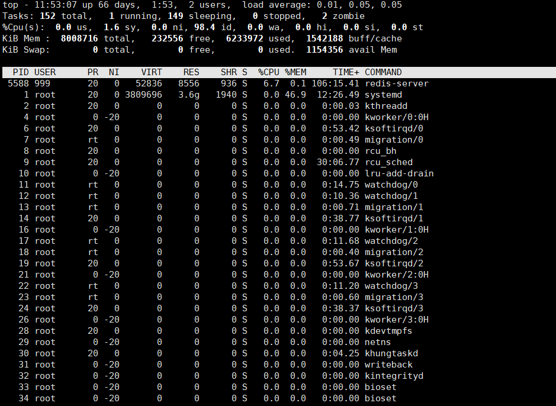

# top命令

## 1. 概述

 Linux中的top命令显示系统上正在运行的进程。它是系统管理员最重要的工具之一。被广泛用于监视服务器的负载。 

## 2. Top 命令输出

 首先，让我们了解一下输出。top命令会显示系统的很多信息。我们需要理解不同部分输出的意义：默认运行时，top命令会显示如下输出： 

 前几行水平显示了不同系统参数的概括，接下来是进程和它们在列中的属性。 

### 2.1 系统运行时间和平均负载

这些字段显示：

- 当前时间
- 系统已运行的时间
- 当前登录用户的数量
- 相应最近5、10和15分钟内的平均负载。

可以使用`l`命令切换uptime的显示与否。

### 2.2 任务

 第二行显示的是任务或者进程的总结。进程可以处于不同的状态。这里显示了全部进程的数量。除此之外，还有正在运行、睡眠、停止、僵尸进程的数量（僵尸是一种进程的状态）。

这些进程概括信息可以用`t`切换显示与否。 

### 2.3 cpu

下一行显示的是CPU状态。这里显示了不同模式下的所占CPU时间的百分比。这些不同的CPU时间表示:

- us, user：运行(未调整优先级的) 用户进程的CPU时间
- sy，system: 运行内核进程的CPU时间
- ni，niced：运行已调整优先级的用户进程的CPU时间
- wa，IO wait: 用于等待IO完成的CPU时间
- hi：处理硬件中断的CPU时间
- si: 处理软件中断的CPU时间
- st：这个虚拟机被hypervisor偷去的CPU时间（译注：如果当前处于一个hypervisor下的vm，实际上hypervisor也是要消耗一部分CPU处理时间的）。

可以用`t`切换显示与否。 

### 2.4 内存

接下来两行显示内存使用率，有点像’free’命令。第一行是物理内存使用，第二行是虚拟内存使用(交换空间)。

物理内存显示如下:全部可用内存、已使用内存、空闲内存、缓冲内存。相似地：交换部分显示的是：全部、已使用、空闲和缓冲交换空间。

内存显示可以用’m’命令切换。

### 2.5 字段、列

在横向列出的系统属性和状态下面，是以列显示的进程。不同的列代表下面要解释的不同属性。

默认上，top显示这些关于进程的属性：

* PID
  * 进程ID，进程的唯一标识符
* USER
  * 进程所有者的实际用户名。

* PR
  * 进程的调度优先级。这个字段的一些值是`rt`。这意味这这些进程运行在实时态。

* NI
  * 进程的nice值（优先级）。越小的值意味着越高的优先级。

* VIRT
  * 进程使用的虚拟内存。

* RES
  * 驻留内存大小。驻留内存是任务使用的非交换物理内存大小。

* SHR
  * SHR是进程使用的共享内存。

* S
  * 这个是进程的状态。它有以下不同的值:
    * D – 不可中断的睡眠态。
    * R – 运行态
    * S – 睡眠态
    * T – 被跟踪或已停止
    * Z – 僵尸态

* %CPU
  * 自从上一次更新时到现在任务所使用的CPU时间百分比。

* %MEM
  * 进程使用的可用物理内存百分比。

* TIME+
  * 任务启动后到现在所使用的全部CPU时间，精确到百分之一秒。

* COMMAND
  * 运行进程所使用的命令。

还有许多在默认情况下不会显示的输出，它们可以显示进程的页错误、有效组和组ID和其他更多的信息。

## 3. 交互命令

 我们之前说过top是一个交互命令。上一节我们已经遇到了一些命令。这里我们会探索更多的命令。 

### 3.1  `h`: 帮助

 首先，我们可以用’h’或者’?’显示交互命令的帮助菜单。 

### 3.2 刷新显示

 top命令默认在一个特定间隔(3秒)后刷新显示。要手动刷新，用户可以输入回车或者空格。 

### 3.3 `d` 或`s`: 设置显示的刷新间隔

 当按下’d’或’s’时，你将被提示输入一个值（以秒为单位），它会以设置的值作为刷新间隔。如果你这里输入了1，top将会每秒刷新。 

### 3.4 `A`: 切换交替显示模式

这个命令在全屏和交替模式间切换。在交替模式下会显示4个窗口（译注：分别关注不同的字段）:

1. Def （默认字段组）
2. Job （任务字段组）
3. Mem （内存字段组）
4. Usr （用户字段组）

这四组字段共有一个独立的可配置的概括区域和它自己的可配置任务区域。4个窗口中只有一个窗口是当前窗口。当前窗口的名称显示在左上方。（译注：只有当前窗口才会接受你键盘交互命令）

 我们可以用`a`和`w`在4个 窗口间切换。`a`移到后一个窗口`w`’移到前一个窗口。`g`命令你可以输入一个数字来选择当前窗口。 

### 3.5 `B`: 触发粗体显示

 一些重要信息会以加粗字体显示。这个命令可以切换粗体显示。 

### 3.6 `l`、`t`、`m`: 切换负载、任务、内存信息的显示

 这会相应地切换顶部的平均负载、任务/CPU状态和内存信息的概况显示。 

### 3.7 `f`: 字段管理

 用于选择你想要显示的字段。用’*’标记的是已选择的。 

上下光标键在字段内导航,`d`或者`空格`切换显示or不显示。`q`退出编辑。

### 3.8 `R`: 反向排序

切换反向/常规排序。

### 3.9  `c`: 触发命令

 切换是否显示进程启动时的完整路径和程序名。 

### 3.10  `i`: 空闲任务

 切换显示空闲任务。 

### 3.11 `V`: 树视图

 切换树视图。 

### 3.12 `Z`: 改变配色

 按下’Z’向用户显示一个改变top命令的输出颜色的屏幕。可以为8个任务区域选择8种颜色。 

按`a`切换颜色

 下面显示的是4中颜色显示的top视图。 

### 3.13 `z`: 切换彩色显示

切换彩色，即打开或关闭彩色显示。

### 3.14  `x`或者`y`切换高亮信息

`x`将排序字段高亮显示（纵列）；`y`将运行进程高亮显示（横行）。

依赖于你的显示设置，你可能需要让输出彩色来看到这些高亮。 

### 3.15 `u` 特定用户的进程

 显示特定用户的进程。你会被提示输入用户名。空白将会显示全部用户。 

### 3.16  `n` 或 `#`: 任务的数量

 设置最大显示的任务数量 

### 3.17  `k`: 结束任务

 top命令中最重要的一个命令之一。用于发送信号给任务（通常是结束任务）。 

### 3.18 `r`: 重新设置优先级

 重新设置一个任务的调度优先级。 

## 4. 命令行选项

 这些命令行选项与上面讨论的命令大多相同。top的输出可以用命令交互操作，但是你也可以带参数运行top来设置你想要的效果。 

### 4.1 -b: 批处理模式

-b选项以批处理模式启动top命令。当你想要在文件中保存输出时是很有用的。

### 4.2 -c: 命令/程序名 触发

如上面所讨论到的命令，这个选项会以上次记住的程序/命令显示的状态显示（是否显示完整路径）。

### 4.3 -d: 设置延迟间隔

设置top的显示间隔(以秒计)。比如：

> $ top -d 1

将会以1秒的刷新间隔启动top。

### 4.4 -n: 设置迭代数量

用-n选项，你可以设置top退出前迭代的次数。

> $ top -n 3

将会在刷新输出3次后退出。

> $ top -d 1 -n 3

1秒刷新显示1次 刷新3次后退出

### 4.5 -i: 切换显示空闲进程

这个选项设置top命令的上一次记住的相反的‘i’状态。

### 4.6 -p: 监控特定的PID

你可以用-p选项监控指定的PID。PID的值为0将被作为top命令自身的PID。

### 4.7 -u 或 -U: 用户名 或者 UID

可以用这些选项浏览特定用户的进程。用户名或者UID可以在选项中指定。

-p、-u和-U选项是互斥的，同时只可以使用这其中一个选项。当你试图组合使用这些选项时，你会得到一个错误:

> $ top -p 28453 -u raghu
>
> top: conflicting process selections (U/p/u)