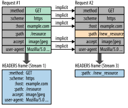

# HTTP2 总结

## 原理小结

**Http2.0 引入了一个二进制帧层，将并发的请求转成不同的stream流传输，每个stream的分帧都带有特定的序号id，这就保证了请求响应的数据可以在二进制帧层进行重组，即使传输过程是无序的。**

TCP层传输，是将上一层协议的数据分割成多个不同序号的报文进行传输，通过滑动窗口协议和一些ACK、Syn等字段进行全双工通信（两端需要对传输报文序号进行确认，双向通信，信道冲突时候可能会采用csma/cd等算法进行处理）。

Http1.1 直接将字符形式的请求报文交付给TCP层进行传输，在应用层必须解析出请求head和body才能完成通信。

Http2.0 将应用层的数据经过二进制帧层处理，将不同的请求拆成不同的stream，由stream的id进行标记，请求的stream被分割成多种类型的帧，其中包括head帧和data数据帧。正是因为有了stream的id标记、以及各种不同类型的帧，确保了请求和响应的有序重组。

例如请求a.js和b.css，a.js对应的stream的id为1，b.css对应的stream的id为2，a.js的head帧为head1，数据帧为data1，b.js的head帧为head2，数据帧为data2。浏览器可以将head1、data1、head2、data2同时放入TCP信道进行报文传输，在TCP层，可能会进一步对这些数据进行拆分，拆成不同报文序号进行传输，但是可以无需关注这层是如何拆分、组装的。因为可以在Http2.0的二进制帧层进行有序处理，将接收到的stream的id为1的放一起处理，接收到的stream的id为2的放一起处理。

通过这种方式就可以解决Http1.1中存在的请求阻塞问题，试想：假如a.js的处理很慢，服务器可以先将b.css的处理结果返回，因为采用了stream的id编号，所以可以在Http2.0的二进制帧层先对b.css的stream的id进行重组，将b.css的响应交付于应用层处理。

## 核心功能

### 二进制分帧（Binary Format）- http2.0的基石

HTTP/2 所有性能增强的核心在于新的二进制分帧层，它定义了如何封装 HTTP 消息并在客户端与服务器之间传输。

### 数据流、消息和帧

新的二进制分帧机制改变了客户端与服务器之间交换数据的方式。 为了说明这个过程，我们需要了解 HTTP/2 的三个概念：

- **数据流**：已建立的连接内的双向字节流，可以承载一条或多条消息。
- **消息**：与逻辑请求或响应消息对应的完整的一系列帧。
- **帧**：HTTP/2 通信的最小单位，每个帧都包含帧头，至少也会标识出当前帧所属的数据流。

这些概念的关系总结如下：

- 所有通信都在一个 TCP 连接上完成，此连接可以承载任意数量的双向数据流。
- 每个数据流都有一个唯一的标识符和可选的优先级信息，用于承载双向消息。
- 每条消息都是一条逻辑 HTTP 消息（例如请求或响应），包含一个或多个帧。
- 帧是最小的通信单位，承载着特定类型的数据，例如 HTTP 标头、消息负载等等。 来自不同数据流的帧可以交错发送，然后再根据每个帧头的数据流标识符重新组装。

### 请求与响应复用

在 HTTP/1.x 中，如果客户端要想发起多个并行请求以提升性能，则必须使用多个 TCP 连接。

HTTP/2 中新的二进制分帧层突破了这些限制，实现了完整的请求和响应复用：客户端和服务器可以将 HTTP 消息分解为互不依赖的帧，然后交错发送，最后再在另一端把它们重新组装起来。

快照捕捉了同一个连接内并行的多个数据流。 客户端正在向服务器传输一个 `DATA` 帧（数据流 5），与此同时，服务器正向客户端交错发送数据流 1 和数据流 3 的一系列帧。因此，一个连接上同时有三个并行数据流。

将 HTTP 消息分解为独立的帧，交错发送，然后在另一端重新组装是 HTTP 2 最重要的一项增强。事实上，这个机制会在整个网络技术栈中引发一系列连锁反应，从而带来巨大的性能提升，让我们可以：

- 并行交错地发送多个请求，请求之间互不影响。
- 并行交错地发送多个响应，响应之间互不干扰。
- 使用一个连接并行发送多个请求和响应。
- 不必再为绕过 HTTP/1.x 限制而做很多工作（请参阅[针对 HTTP/1.x 进行优化](https://hpbn.co/optimizing-application-delivery/#optimizing-for-http1x)，例如级联文件、image sprites 和域名分片。
- 消除不必要的延迟和提高现有网络容量的利用率，从而减少页面加载时间。
- *等等…*

HTTP/2 中的新二进制分帧层解决了 HTTP/1.x 中存在的队首阻塞问题，也消除了并行处理和发送请求及响应时对多个连接的依赖。 结果，应用速度更快、开发更简单、部署成本更低。

### 数据流优先级

将 HTTP 消息分解为很多独立的帧之后，我们就可以复用多个数据流中的帧，客户端和服务器交错发送和传输这些帧的顺序就成为关键的性能决定因素。 为了做到这一点，HTTP/2 标准允许每个数据流都有一个关联的权重和依赖关系：

- 可以向每个数据流分配一个介于 1 至 256 之间的整数。
- 每个数据流与其他数据流之间可以存在显式依赖关系。

数据流依赖关系和权重的组合让客户端可以构建和传递“优先级树”，表明它倾向于如何接收响应。 反过来，服务器可以使用此信息通过控制 CPU、内存和其他资源的分配设定数据流处理的优先级，在资源数据可用之后，带宽分配可以确保将高优先级响应以最优方式传输至客户端。

### 每个来源一个连接

有了新的分帧机制后，HTTP/2 不再依赖多个 TCP 连接去并行复用数据流；每个数据流都拆分成很多帧，而这些帧可以交错，还可以分别设定优先级。 因此，所有 HTTP/2 连接都是永久的，而且仅需要每个来源一个连接，随之带来诸多性能优势。

通过重用相同的连接，HTTP/2 既可以更有效地利用每个 TCP 连接，也可以显著降低整体协议开销。 不仅如此，使用更少的连接还可以减少占用的内存和处理空间，也可以缩短完整连接路径（即，客户端、可信中介和源服务器之间的路径） 这降低了整体运行成本并提高了网络利用率和容量。 因此，迁移到 HTTP/2 不仅可以减少网络延迟，还有助于提高通量和降低运行成本。

### 流控

流控制是一种阻止发送方向接收方发送大量数据的机制，以免超出后者的需求或处理能力：发送方可能非常繁忙、处于较高的负载之下，也可能仅仅希望为特定数据流分配固定量的资源。 例如，客户端可能请求了一个具有较高优先级的大型视频流，但是用户已经暂停视频，客户端现在希望暂停或限制从服务器的传输，以免提取和缓冲不必要的数据。 再比如，一个代理服务器可能具有较快的下游连接和较慢的上游连接，并且也希望调节下游连接传输数据的速度以匹配上游连接的速度来控制其资源利用率；等等。

TCP 同样存在流控， 不过，由于 HTTP/2 数据流在一个 TCP 连接内复用，TCP 流控制既不够精细，也无法提供必要的应用级 API 来调节各个数据流的传输。 为了解决这一问题，HTTP/2 提供了一组简单的构建块，这些构建块允许客户端和服务器实现其自己的数据流和连接级流控制：

### 服务器推送

HTTP/2 打破了严格的请求-响应语义。新增的另一个强大的新功能是，服务器可以对一个客户端请求发送多个响应。 换句话说，除了对最初请求的响应外，服务器还可以向客户端推送额外资源，而无需客户端明确地请求。

> ，支持一对多和服务器发起的推送工作流.

### 头部压缩

每个 HTTP 传输都承载一组标头，这些标头说明了传输的资源及其属性。 在 HTTP/1.x 中，此元数据始终以纯文本形式，通常会给每个传输增加 500–800 字节的开销。如果使用 HTTP Cookie，增加的开销有时会达到上千字节。 

 为了减少此开销和提升性能，HTTP/2 使用 HPACK 压缩格式压缩请求和响应标头元数据，这种格式采用两种简单但是强大的技术：

1. 这种格式支持通过静态霍夫曼代码对传输的标头字段进行编码，从而减小了各个传输的大小。
2. 这种格式要求客户端和服务器同时维护和更新一个包含之前见过的标头字段的索引列表（换句话说，它可以建立一个共享的压缩上下文），此列表随后会用作参考，对之前传输的值进行有效编码。

利用霍夫曼编码，可以在传输时对各个值进行压缩，而利用之前传输值的索引列表，我们可以通过传输索引值的方式对重复值进行编码，索引值可用于有效查询和重构完整的标头键值对。

作为一种进一步优化方式，HPACK 压缩上下文包含一个静态表和一个动态表：静态表在规范中定义，并提供了一个包含所有连接都可能使用的常用 HTTP 标头字段（例如，有效标头名称）的列表；动态表最初为空，将根据在特定连接内交换的值进行更新。 因此，为之前未见过的值采用静态 Huffman 编码，并替换每一侧静态表或动态表中已存在值的索引，可以减小每个请求的大小。

