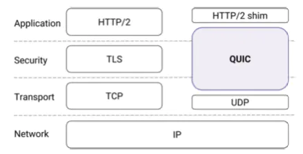

# QUIC 和 HTTP/3

虽然HTTP/2经过一系列的优化，性能上比HTTP/1.1有很大的提示，但是依旧存在一些问题：
* 1）HTTP/2通过二进制分帧层解决了HTTP/1.1的队头阻塞问题，但是TCP的队头阻塞问题依旧存在
* 2）HTTP/2基于TCP，建立连接需要3次握手，如果是HTTPS则还需要TLS握手，效率太低
* 3）HTTP/2弱网环境表现不佳，甚至不如HTTP/1.1,因为HTTP/1.1会建立多个连接，而HTTP/2只建立一个连接

于是Google基于UDP研发了QUIC协议，然后HTTP/3也是基于QUIC协议了。

> HTTP/2也是在Google的SPDY协议衍生出来了

QUIC基于UDP实现，不过也可以看做一个传输层。

> QUIC 是用来替代 TCP、SSL/TLS 的传输层协议

QUIC的3大特性：

**1）更快速**

首先体现在低延迟连接上，相比 HTTPS，QUIC 建立连接的过程中至少少一个 RTT；与 TCP 不同，UDP 不是面向连接的，因此 QUIC 连接只需首次建立一次 QUIC 握手，后续便可在 0RTT 完成。

其次是优化了多路复用，解决了 TCP 连接下请求丢包导致的队头阻塞的问题。

**2）更灵活**

主要体现两个方面：

一是拥塞控制，QUIC 将拥塞控制放在应用层，更新拥塞控制算法不需要停机升级，使得在某些场景下可更有效地改变拥塞策略，达到更优的效果；

二是连接迁移，TCP 使用四元组 (源 IP，源端口，目的 IP，目的端口) 标识连接，网络切换时会导致重连，而 QUIC 使用自定义的 Connection ID 作为链接标识，只要客户端使用的 Connection ID 不变，即使网络切换也能保证链接不中断。

**3）更安全**

TCP 协议头部未经过加密和认证，但 QUIC 所有的头部信息均经过认证，并且对所有信息进行加密，可有效避免数据传输过程中被中间设备截取并篡改。

