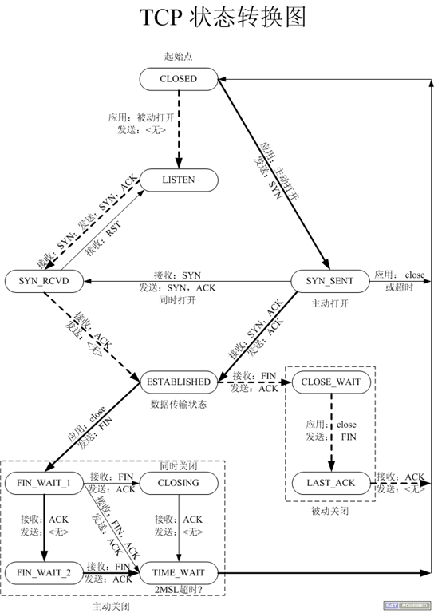

# TCP/IP

## 1. 概述

关于 TCP 三次握手、四次挥手网上一搜一大把，看了很多之后还是不怎么清楚，今天好好梳理一下，做个总结。

> 大部分内容来源网络，只是做了整理工作，如有错误请一定指出~。

## 1. 三次握手

具体过程如图所示


### 1. 详解

* 1）**第一次握手（SYN =1,seq=x）**

建立连接时，客户端发送 `SYN` 包到服务器，其中包含客户端的初始序号 `seq = x（随机值）`，并进入 **`SYN_SENT`** 状态，等待服务器确认。

发送完毕客户端进入**`SYN_SENT`** 状态

> 其中**SYN 标志位置 1**，表示这是一个 TCP 连接请求数据报文；序号 seq=x，表明传输数据时的第一个数据字节的序号是 x。


* 2）**第二次握手（ACK=1,ack=x+1;SYN=1,seq=y;）**

服务器收到请求后，根据其中的 SYN 标识位为 1，知道这是一个 TCP 连接请求数据报文。如果可以建立连接则回复确认收到客户端的数据包，即把 ACK 标识位置 1（表示确认），同时需要返回一个 ack 序号，用于通知客户端自己收到了哪些数据（这里服务端收到的是序号为 x,那么就要回复 x+1 表示自己已经收到了 x+1 之前的所有数据包）。

同时自己也需要建立连接，于是也把 SYN 标识位置 1，也随机一个序号 seq=y；

发送完毕服务端进入**`SYN_RECEIVED`** 状态

> 标识位SYN=1，ACK=1，表示这是一个TCP连接响应数据报文。


* 3）**第三次握手（ACK=1,ack=y+1;seq=x+1;）**

客户端收到服务器的 SYN + ACK 包，再次向服务器回复确认。ACK 标识位置 1，同样跟上确认序号ack=y+1（表示收到了服务端的 y+1 序号之前的所有数据），然后跟上自己的序号 req =x+1;

发送完毕客户端进入**`ESTABLISHED `** 状态，服务端收到这个包之后也进入**`ESTABLISHED `** 状态，TCP 连接成功建立。

### 2. 问题

**1）为什么需要 3 次握手？**

```
建立连接前要确认客户端和服务端的接收和发送功能是否正常。
第一次客户端发送SYN时 什么也确认不了
第二次服务端发送SYN+ACK 可以确认服务端发送功能正常
第三次 客户端收到服务端发送的YSN+ACK 可以确认客户端发送接收功能正常
最后客户端发送ACK 服务端接收到后 可以确认服务端发送功能正常
到此就确认完毕了。
```

## 2. 四次挥手

具体流程如图所示


### 1. 详解

*  1）**第一次挥手（FIN=1;seq=x）**

首先，客户端发送一个标识位 FIN=1的包，用来关闭客户端到服务器的数据传送，同时也要跟上自己的序号，seq=x; 然后等待服务器的确认

发送完毕客户端进入**FIN_WAIT1**状态

* 2）**第二次挥手（ACK=1,ack=x+1）**

服务端收到数据包后，根据 FIN 标识位为 1，知道客户端准备关闭连接了，如果可以就回复确认，ACK 标识位置1，同时跟上确认序号 seq=x+1;

发送完毕服务端进入**CLOSE_WAIT**状态,客户端收到ACK应答后进入**FIN_WAIT2**状态。

> 你可能会问了，这里怎么没有发送 seq 呢？
>
> 书上写的是 ACK 报文是可以携带数据，比如上面三次握手的时候 ACK 和 SYN 一起发。
>
> 如果不携带数据则不消耗序列号，这样的话应该就可以不带序列号吧。
>
> 反过来，带了数据就要消耗序列号，所以 三次握手中发送了 seq 的。


* 3）**第三次挥手（FIN=1,seq=y）**

服务端真正关闭服务器到客户端的连接，发送一个 FIN 标识位为 1给客户端，同时跟上序列号 seq=y；。

服务端发送完毕进入**LAST_ACK**状态，等待来自客户端的最后一个 ACK。


* 4）**第四次挥手（ACK=1，ack=y+1）**

客户端接收到来自服务器端的关闭请求，发送一个确认包，并进入 `TIME_WAIT`状态，等待可能出现的要求重传的 ACK 包。

服务器端接收到这个确认包之后，关闭连接，进入 `CLOSED` 状态。

客户端等待了某个固定时间（两个最大段生命周期，2MSL，2 Maximum Segment Lifetime）之后，没有收到服务器端的 ACK ，认为服务器端已经正常关闭连接，于是自己也关闭连接，进入 `CLOSED` 状态。


### 2. 问题

```shell
Client端收到FIN报文后，"就知道可以关闭连接了，所以发送ACK。但是他还是不相信网络，怕Server端不知道要关闭，所以发送ACK后没有立即，而是进入TIME_WAIT状态，如果Server端没有收到ACK那么自己还可以重传。Server端收到ACK后，"就知道可以断开连接了"。Client端等待了2MSL后依然没有收到回复，则证明Server端已正常关闭，那好，我Client端也可以关闭连接了。Ok，TCP连接就这样关闭了！
```


**1）为什么 Client 要先进入 TIME-WAIT 状态，等待 2MSL 时间后才进入 CLOSED 状态？**

> 1）为了保证TCP协议的全双工连接能够可靠关闭
>
> 2）保证这次连接的重复数据段从网络中消失

假设由于 IP 协议的不可靠性或者是其它网络原因，导致 Server 没有收到 Client 最后回复的 ACK。那么 Server 就会在超时之后继续发送 FIN，如果 Client 端在等待 2MSL 时间后都没收到信息，就可以说明 Server 端已经收到自己发送的 ACK 并且成功关闭了，此时自己也可以关闭了。


**2）假设Client 不等待，直接关闭会发生什么呢？**

**情况一：Server 超时重传**

> 假设：由于IP协议的不可靠性或者是其它网络原因，导致Server没有收到Client最后回复的ACK。

那么Server就会在超时之后继续发送FIN，此时由于Client已经CLOSED了，**就找不到与重发的FIN对应的连接**，最后Server就会收到RST而不是ACK，Server就会以为是连接错误把问题报告给高层。这样的情况虽然不会造成数据丢失，但是却**导致TCP协议不符合可靠连接的要求**。

所以，Client不是直接进入CLOSED，而是要保持TIME_WAIT，当再次收到FIN的时候，能够保证对方收到ACK，最后正确的关闭连接。

**情况二: Client 再次连接**

> 假设：Client 直接 CLOSED，然后又向 Server 发起一个新连接。

我们**不能保证这个新连接与刚关闭的旧连接的端口号是不同的**。也就是说有可能新连接和旧连接的端口号是相同的。

一般来说不会发生什么问题，但是还是有特殊情况出现：如果旧连接的某些数据仍然滞留在网络中，这些延迟数据在建立新连接之后才到达 Server，由于新连接和旧连接的端口号是一样的，又因为**TCP协议判断不同连接的依据是socket pair**，于是，TCP协议就认为那个延迟的数据是属于新连接的，这样就和真正的新连接的数据包发生混淆了。所以TCP连接还要在 TIME_WAIT 状态等待2倍MSL，这样可以**保证本次连接的所有数据都从网络中消失**。


**3）2MSL 是什么**

Maximum Segment Lifetime 即数据在网络中保存的最大时间。


**4）简单易懂的说法**

```
假设Client端发起中断连接请求，也就是发送FIN报文。Server端接到FIN报文后，意思是说"我Client端没有数据要发给你了"，但是如果你还有数据没有发送完成，则不必急着关闭Socket，可以继续发送数据。所以你先发送ACK，"告诉Client端，你的请求我收到了，但是我还没准备好，请继续你等我的消息"。这个时候Client端就进入FIN_WAIT状态，继续等待Server端的FIN报文。当Server端确定数据已发送完成，则向Client端发送FIN报文，"告诉Client端，好了，我这边数据发完了，准备好关闭连接了"。Client端收到FIN报文后，"就知道可以关闭连接了，但是他还是不相信网络，怕Server端不知道要关闭，所以发送ACK后进入TIME_WAIT状态，如果Server端没有收到ACK则可以重传。“，Server端收到ACK后，"就知道可以断开连接了"。Client端等待了2MSL后依然没有收到回复，则证明Server端已正常关闭，那好，我Client端也可以关闭连接了。Ok，TCP连接就这样关闭了！
```

## 3. 有限状态机

> 图源`https://blog.csdn.net/xy010902100449/article/details/48274635`




## 4. 参考

`https://draveness.me/whys-the-design-tcp-three-way-handshake/`

`https://www.cnblogs.com/Jessy/p/3535612.html`

`https://hit-alibaba.github.io/interview/basic/network/TCP.html`

`https://blog.csdn.net/whuslei/article/details/6667471`

