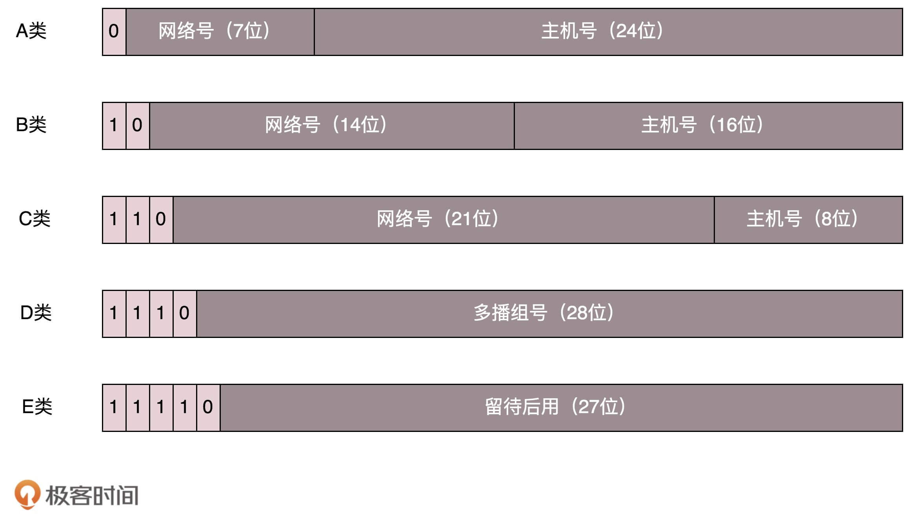
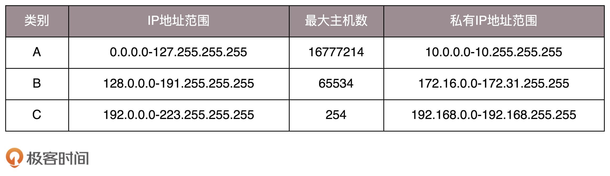

# CIDR 子网划分

## IP地址分类

IP 地址被分为了5类：



下面这个表格，详细地展示了 A、B、C 三类地址所能包含的主机的数量



这里面有个尴尬的事情，

* C 类地址能包含的最大主机数量实在太少了，只有 254 个,
* 而 B 类地址能包含的最大主机数量又太多了。6 万多台机器放在一个网络下面，一般的企业基本达不到这个规模，闲着的地址就是浪费。


## 无类型域间选路（CIDR）

于是有了一个折中的方式叫作**无类型域间选路**，简称**CIDR**。这种方式打破了原来设计的几类地址的做法，将 32 位的 IP 地址一分为二，前面是**网络号**，后面是**主机号**。

比如 10.100.122.2/24，这个 IP 地址中有一个斜杠，斜杠后面有个数字 24。这种地址表示形式，就是 CIDR。

> 后面 24 的意思是，32 位中，前 24 位是网络号，后 8 位是主机号。

伴随着 CIDR 存在的，一个是**广播地址**，10.100.122.255。如果发送这个地址，所有 10.100.122 网络里面的机器都可以收到。另一个是**子网掩码**，255.255.255.0。

* 广播地址：网络号+主机号全1
* 子网掩码：网络号+主机号全0

**将子网掩码和 IP 地址按位计算 AND，就可得到网络号**。


## 例子

我们来看 16.158.165.91/22 这个 CIDR。求一下这个网络的第一个地址、子网掩码和广播地址。

22 不是 8 的整数倍，不好办，只能先变成二进制来看。16.158 的部分不会动，它占了前 16 位。中间的 165，变为二进制为‭10100101‬。除了前面的 16 位，还剩 6 位。所以，这 8 位中前 6 位是网络号，16.158.<101001>，而 <01>.91 是机器号。

* 第一个地址是 16.158.<101001><00>.1，即 16.158.164.1。
* 子网掩码是 255.255.<111111><00>.0，即 255.255.252.0。
* 广播地址为 16.158.<101001><11>.255，即 16.158.167.255。


## ip addr 输出结果分析

```shell
$ ip addr
1: lo: <LOOPBACK,UP,LOWER_UP> mtu 65536 qdisc noqueue state UNKNOWN group default qlen 1000
    link/loopback 00:00:00:00:00:00 brd 00:00:00:00:00:00
    inet 127.0.0.1/8 scope host lo
       valid_lft forever preferred_lft forever
    inet6 ::1/128 scope host 
       valid_lft forever preferred_lft forever
2: eth0: <BROADCAST,MULTICAST,UP,LOWER_UP> mtu 1452 qdisc fq_codel state UP group default qlen 1000
    link/ether 52:54:00:80:7b:34 brd ff:ff:ff:ff:ff:ff
    inet 10.27.79.207/16 brd 10.27.255.255 scope global noprefixroute eth0
       valid_lft forever preferred_lft forever
    inet6 fe80::5054:ff:fe80:7b34/64 scope link 
       valid_lft forever preferred_lft forever
```

> [ip addr 输出详解](https://blog.csdn.net/wangyunzhong/article/details/109224075)


### ip 地址

首先看这部分：

```shell
	inet 10.27.79.207/16 brd 10.27.255.255 scope global noprefixroute eth0
	valid_lft forever preferred_lft forever
   inet6 fe80::5054:ff:fe80:7b34/64 scope link 
       valid_lft forever preferred_lft forever
```

**inet 10.27.79.207/16**：IPv4地址。“/16”告诉我们在子网掩码中设置了16个连续的前导位。那是八位的二组。八位二进制数等于255；因此，子网掩码是255.255.0.0。

**brd 10.27.255.255**：此子网的广播地址。

**scope global **：IP的有效范围，global 表示该IP在此网络上的所有地方均有效，host 则表示该IP仅仅可以供本机相互通信。

**noprefixroute**: 添加此IP地址后，请勿在路由表中创建路由。如果某人想使用该IP地址，则必须手动添加一条路由。同样，如果此IP地址被删除，则不要寻找要删除的路由。

**eth0**: 与该IP地址关联的接口。

**valid_lft**: 有效生存期。IP地址被视为有效的时间。

**preferred_lft**: 首选寿命。IP地址运行的时间没有任何限制。

**inet6 **：ipv6版本，其他都是一样的。


### MAC 地址

输出结果中的这部分就称作 MAC 地址。

```shell
link/ether 52:54:00:80:7b:34 brd ff:ff:ff:ff:ff:ff
```

**MAC 地址更像是身份证，是一个唯一的标识**。它的唯一性设计是为了组网的时候，不同的网卡放在一个网络里面的时候，可以不用担心冲突。从硬件角度，保证不同的网卡有不同的标识。

MAC 地址是有一定定位功能的，只不过范围非常有限，**MAC 地址的通信范围比较小，局限在一个子网里面**。


### 网络设备的状态标识

下面看这一部分：

```shell
eth0: <BROADCAST,MULTICAST,UP,LOWER_UP> mtu 1452 qdisc fq_codel state UP group default qlen 1000
```

eth0：是这个网卡的名字。

下面这个叫做 **net_device flags，网络设备的状态标识**。

```shell
<BROADCAST,MULTICAST,UP,LOWER_UP>
```

* UP 表示网卡处于启动的状态；
* BROADCAST 表示这个网卡有广播地址，可以发送广播包；
* MULTICAST 表示网卡可以发送多播包；
* LOWER_UP 表示 L1 是启动的，也即网线插着呢。

**mtu 1452**：表示最大传输单元 MTU 为 1452，这是以太网的默认值。

MTU 是二层 MAC 层的概念。MAC 层有 MAC 的头，以太网规定正文部分不允许超过 1500 个字节。正文里面有 IP 的头、TCP 的头、HTTP 的头。如果放不下，就需要分片来传输。

**qdisc fq_codel**：Aqdisc是一种排队机制。它计划数据包的传输。fq_codel 意味着调度程序正在使用一种称为“公平队列,受控延迟”的规则。

**state UP**：网络可以运行并且存在连接

**group default**：接口可以按逻辑分组。默认值是将它们全部放在称为“default”的组中。

**qlen 1000**：传输队列的最大长度。