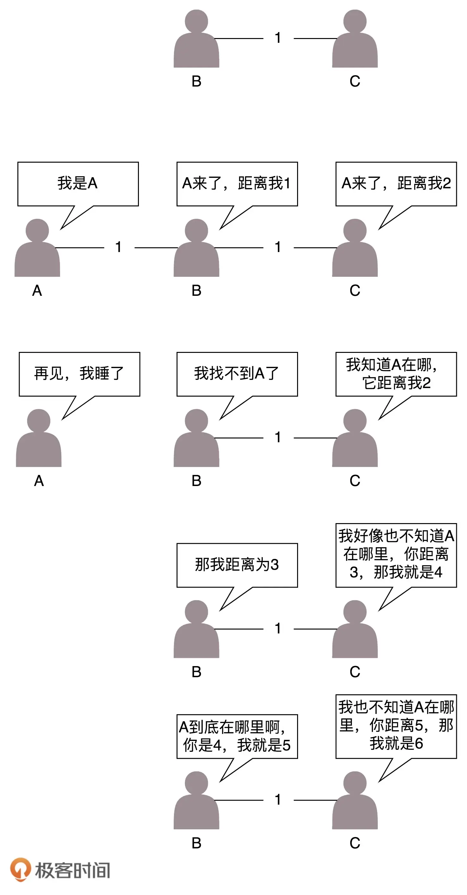

# 路由

## 1. 概述

路由器就是一台网络设备，它有多张网卡。当一个入口的网络包送到路由器时，它会根据一个本地的转发信息库，来决定如何正确地转发流量。这个转发信息库通常被称为**路由表**。

一张路由表中会有多条路由规则。每一条规则至少包含这三项信息。

* 目的网络：这个包想去哪儿？
* 出口设备：将包从哪个口扔出去？
* 下一跳网关：下一个路由器的地址。

通过 route 命令和 ip route 命令都可以进行查询或者配置。

```shell
$ ip route add 10.176.48.0/20 via 10.173.32.1 dev eth0
```

上述命令添加的路由规则表示：要去 10.176.48.0/20 这个目标网络，要从 eth0 端口出去，经过 10.173.32.1。

这种配置方式的一个核心思想是：**根据目的 IP 地址来配置路由**。


## 2. 策略路由

**策略路由**：可以配置多个路由表，可以根据源 IP 地址、入口设备、TOS 等选择路由表，然后在路由表中查找路由。这样可以使得来自不同来源的包走不同的路由。

例如，我们设置：

```shell
$ ip rule add from 192.168.1.0/24 table 10 
$ ip rule add from 192.168.2.0/24 table 20
```

表示从 192.168.1.10/24 这个网段来的，使用 table 10 中的路由表，而从 192.168.2.0/24 网段来的，使用 table20 的路由表。

在一条路由规则中，也可以走多条路径。例如，在下面的路由规则中：

```shell
$ ip route add default scope global nexthop via 100.100.100.1 weight 1 nexthop via 200.200.200.1 weight 2
```

下一跳有两个地方，分别是 100.100.100.1 和 200.200.200.1，权重分别为 1 比 2。

> 多租户情况下就可以为每个租户单独维护一张路由表


## 3. 动态路由算法

上面说的都是静态的路由，一般来说网络环境简单的时候，在自己的可控范围之内，自己捣鼓还是可以的。但是有时候网络环境复杂并且多变，如果总是用静态路由，一旦网络结构发生变化，让网络管理员手工修改路由太复杂了，因而需要**动态路由算法**。

使用动态路由路由器，可以根据路由协议算法生成动态路由表，随网络运行状况的变化而变化。

路由算法核心问题就是：**如何在途中找到最短路径的问题。**

求最短路径常用的有两种方法，一种是 **Bellman-Ford 算法**，一种是 **Dijkstra 算法**。在计算机网络中基本也是用这两种方法计算的。


### 1. 距离矢量路由算法

第一大类的算法称为**距离矢量路由（distance vector routing）**。它是基于 Bellman-Ford 算法的。


这种算法的**基本思路**是，每个路由器都保存一个路由表，包含多行，每行对应网络中的一个路由器，每一行包含两部分信息，一个是要到目标路由器，从那条线出去，另一个是到目标路由器的距离。

> 路由表更新：每个路由器都知道自己和邻居之间的距离，每过几秒，每个路由器都将自己所知的到达所有的路由器的距离告知邻居，每个路由器也能从邻居那里得到相似的信息。

**第一个问题就是好消息传得快，坏消息传得慢。**

* **新路由器加入网络**后，它的邻居就能很快发现它，然后将消息广播出去，很快整个网络都知道了
* **如果某个路由器挂了**，当每个路由器发现原来的道路到不了这个路由器的时候，感觉不到它已经挂了，而是试图通过其他的路径访问，直到试过了所有的路径，才发现这个路由器是真的挂了。

具体如下例所示：

原来的网络包括两个节点，B 和 C。A 加入了网络，它的邻居 B 很快就发现 A 启动起来了。于是它将自己和 A 的距离设为 1，同样 C 也发现 A 起来了，将自己和 A 的距离设置为 2。

但是如果 A 挂掉，情况就不妙了。B 本来和 A 是邻居，发现连不上 A 了，但是 C 还是能够连上，只不过距离远了点，是 2，于是将自己的距离设置为 3。殊不知 C 的距离 2 其实是基于原来自己的距离为 1 计算出来的。C 发现自己也连不上 A，并且发现 B 设置为 3，于是自己改成距离 4。依次类推，数越来越大，直到超过一个阈值，我们才能判定 A 真的挂了。




**这种算法的第二个问题是，每次路由信息变化的时候，都要发送整个全局路由表给相邻的路由器。**

网络大了，谁也受不了，所以最早的路由协议 RIP 就是这个算法。它适用于小型网络（小于 15 跳）。


### 2. 链路状态路由算法

第二大类算法是**链路状态路由（link state routing）**，基于 Dijkstra 算法。

这种算法的**基本思路**是：当一个路由器启动的时候，首先是发现邻居，向邻居 say hello，邻居都回复。然后计算和邻居的距离，发送一个 echo，要求马上返回，除以二就是距离。然后将自己和邻居之间的链路状态包广播出去，发送到整个网络的每个路由器。这样每个路由器都能够收到它和邻居之间的关系的信息。因而，每个路由器都能在自己本地构建一个完整的图，然后针对这个图使用 Dijkstra 算法，找到两点之间的最短路径。

**路状态路由协议只广播更新的或改变的网络拓扑**，这使得更新信息更小，节省了带宽和 CPU 利用率。而且一旦一个路由器挂了，它的邻居都会广播这个消息，可以使得坏消息迅速收敛。


## 4. 动态路由协议

### 1. 基于链路状态路由算法的 OSPF

**OSPF（Open Shortest Path First，开放式最短路径优先）**就是这样一个基于链路状态路由协议，广泛应用在数据中心中的协议。

由于主要用在数据中心内部，用于路由决策，因而称为**内部网关协议（Interior Gateway Protocol**，简称 **IGP**）。


内部网关协议的重点就是找到最短的路径。在一个组织内部，路径最短往往最优。当然有时候 OSPF 可以发现多个最短的路径，可以在这多个路径中进行负载均衡，这常常被称为**等价路由**。


### 2. 基于距离矢量路由算法的 BGP

但是外网的路由协议，也即国家之间的，又有所不同。我们称为 **外网路由协议（Border Gateway Protocol**，简称 **BGP**）。

BGP 协议使用的算法是**路径矢量路由协议（path-vector protocol）**。它是距离矢量路由协议的升级版。

在网络世界，每个网络都可以看做是一个**自治系统 AS（Autonomous System）**。

自治系统分几种类型。

* Stub AS：对外只有一个连接。这类 AS 不会传输其他 AS 的包。例如，个人或者小公司的网络。
* Multihomed AS：可能有多个连接连到其他的 AS，但是大多拒绝帮其他的 AS 传输包。例如一些大公司的网络。
* Transit AS：有多个连接连到其他的 AS，并且可以帮助其他的 AS 传输包。例如主干网。

每个自治系统都有边界路由器，通过它和外面的世界建立联系。


BGP 又分为两类，**eBGP** 和 **iBGP**。

* 自治系统间，边界路由器之间使用 eBGP 广播路由。
* 通过运行 iBGP，使得内部的路由器能够找到到达外网目的地的最好的边界路由器。


## 5. 小结

* 路由分静态路由和动态路由，静态路由可以配置复杂的策略路由，控制转发策略；
* 动态路由主流算法有两种，距离矢量算法和链路状态算法。基于两种算法产生两种协议，BGP 协议和 OSPF 协议。