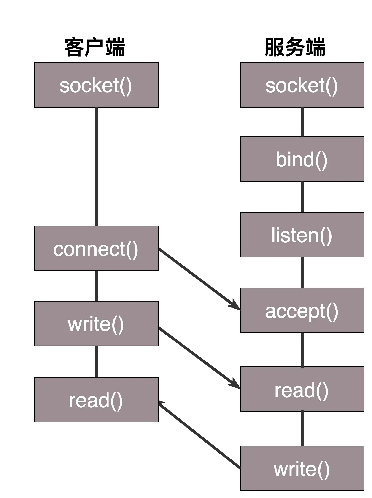
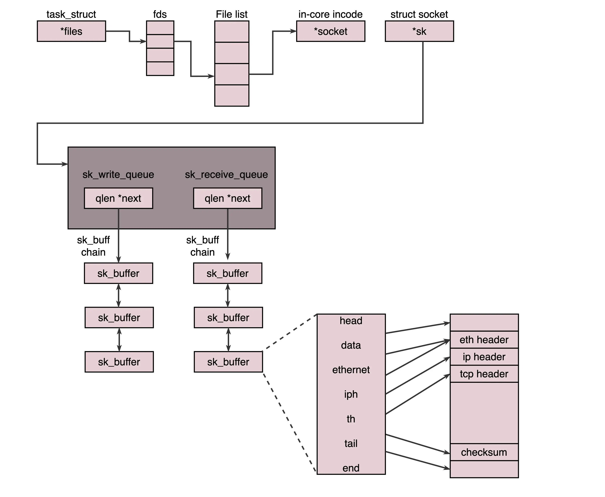
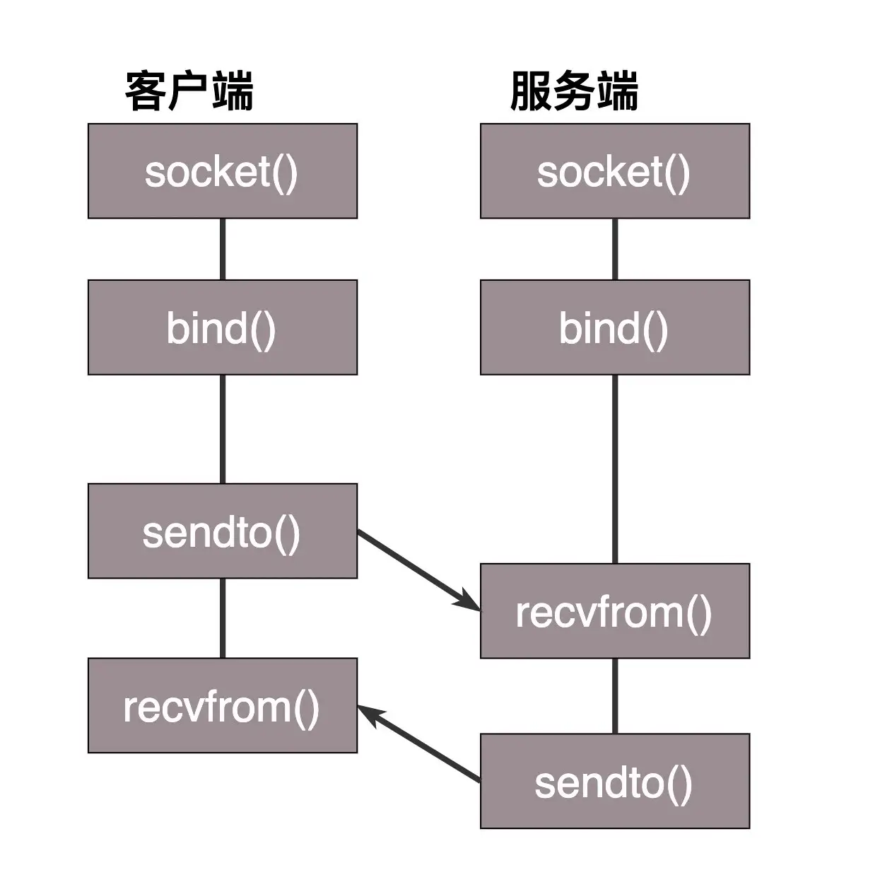

#  Socket

## 1. 概述

### 什么是Socket？

实际上 Socket 是对 TCP/IP 协议的封装，它的出现只是使得程序员更方便地使用TCP/IP 协议栈而已。Socket 本身并不是协议，它是应用层与 TCP/IP 协议族通信的中间软件抽象层，是一组调用接口（TCP/IP网络的API函数） 。

TCP/IP只是一个协议栈，就像操作系统的运行机制一样，必须要具体实现，同时还要提供对外的操作接口。Socket 就是这个对外提供的编程接口。

> 就像操作系统会提供标准的编程接口，比如 win32 编程接口一样。


### Socket 参数

在网络层，Socket 函数需要指定到底是 IPv4 还是 IPv6，分别对应设置为 AF_INET 和 AF_INET6。

另外，还要指定到底是 TCP 还是 UDP。TCP 协议是基于数据流的，所以设置为 SOCK_STREAM，而 UDP 是基于数据报的，因而设置为 SOCK_DGRAM。


## 2. 基于 TCP 协议的 Socket 程序函数调用过程

具体函数调用过程如下：



### bind

TCP 的服务端要先监听一个端口，一般是先调用 **bind** 函数，给这个 Socket 赋予一个 IP 地址和端口。

**为什么需要端口**：当一个网络包来的时候，内核要通过 TCP 头里面的这个端口，来找到你这个应用程序，把包给你

**为什么需要IP**：有时候，一台机器会有多个网卡，也就会有多个 IP 地址，你可以选择监听所有的网卡，也可以选择监听一个网卡，这样，只有发给这个网卡的包，才会给你。

> 指定为 0.0.0.0 就是监听全部网卡，指定为 localhost 就是只监听本地的 loopback 网卡，因此只能本地访问。


### listen

当服务端有了 IP 和端口号，就可以调用 **listen** 函数进行监听。

在内核中，**为每个 Socket 维护两个队列**：

* 一个是已经建立了连接的队列（**全连接队列**），这时候连接三次握手已经完毕，处于 established 状态；
* 一个是还没有完全建立连接的队列（**半连接队列**），这个时候三次握手还没完成，处于 syn_rcvd 的状态。


### accept

接下来，服务端调用 **accept** 函数，拿出一个已经完成的连接进行处理。如果还没有完成，就要等着。


### connect

在服务端等待的时候，客户端可以通过 **connect** 函数发起连接。先在参数中指明要连接的 IP 地址和端口号，然后开始发起三次握手。内核会给客户端分配一个临时的端口。一旦握手成功，就会加入服务端的全连接队列，然后被服务端的 accept 函数就能取到这个 Socket 了。


### 监听Socket和已连接Socket

就是监听的 Socket 和真正用来传数据的 Socket 是两个，一个叫作**监听 Socket**，一个叫作**已连接 Socket**。

* 监听 socket 是 socket 函数创建的，整个服务生命周期内只有这一个。
* 已连接 socket 是 accpet 函数返回的，此socket 代表网络中的点对点连接，所以可以用这个 socket 进行通信。

***为什么需要两个 socket？***

如果使用一个 socket 的话，那么它的功能太多，使得使用很不直观，同时在内核确实产生了一个这样的新的 socket 描述字。

> 即：监听Socket只负责监听新的连接，具体通信由已连接Socket负责。


### Socket具体结构

**Socket 在 Linux 中就是以文件的形式存在的**。除此之外，还存在文件描述符。写入和读出，也是通过文件描述符。

既然是一个文件，就会有一个 inode，只不过 Socket 对应的 inode 不像真正的文件系统一样，保存在硬盘上的，而是在内存中的。在这个 inode 中，指向了 Socket 在内核中的 Socket 结构。

在这个结构里面，主要的是两个队列，一个是**发送队列**，一个是**接收队列**。在这两个队列里面保存的是一个缓存 sk_buff。这个缓存里面能够看到完整的包的结构

具体结构如下图所示：




## 3. 基于 UDP 协议的 Socket 程序函数调用过程

UDP 是没有连接的，所以不需要三次握手，也就不需要调用 listen 和 connect，但是，UDP 的交互仍然需要 IP 和端口号，因而也需要 bind。UDP 是没有维护连接状态的，因而不需要每对连接建立一组 Socket，而是只要有一个 Socket，就能够和多个客户端通信。也正是因为没有连接状态，每次通信的时候，都调用 sendto 和 recvfrom，都可以传入 IP 地址和端口。

具体函数调用过程如下：




## 4. 如何处理更多的连接

### 理论最大连接数

系统会用一个四元组来标识一个 TCP 连接：

```shell
{本机IP, 本机端口, 对端IP, 对端端口}
```

程序监听的 IP 和 端口都是固定的，因此只有客户端的 IP 和对端的端口可以变，那么理论上：**最大 TCP 连接数 = 客户端 IP 数×客户端端口数**。

对 IPv4，客户端的 IP 数最多为 2^32，客户端的端口数最多为 2^16，也就是服务端单机最大 TCP 连接数，约为 2^48。

当然，服务端最大并发 TCP 连接数远不能达到理论上限。

* 首先主要是**文件描述符限制**，按照上面的原理，Socket 都是文件，所以首先要通过 ulimit 配置文件描述符的数目；
* 另一个就是**内存限制**，按上面的数据结构，每个 TCP 连接都要占用一定内存，操作系统是有限的。


### 常见解决方案

这个其实就是 IO 方案了。

* 多进程
  * 每个连接通过fork开一个新的进程来处理
* 多线程
  * 每个连接通过pthread_create创建一个新线程来处理
* IO多路复用
  * select：一个线程维护多个 Socket，一旦有变化，就会依次查看(轮询)每个文件描述符，找到可读写的FD。
  * epoll：通过注册 callback 函数的方式，当某个文件描述符发送变化的时候，就会主动通知，以此来代替轮询。

