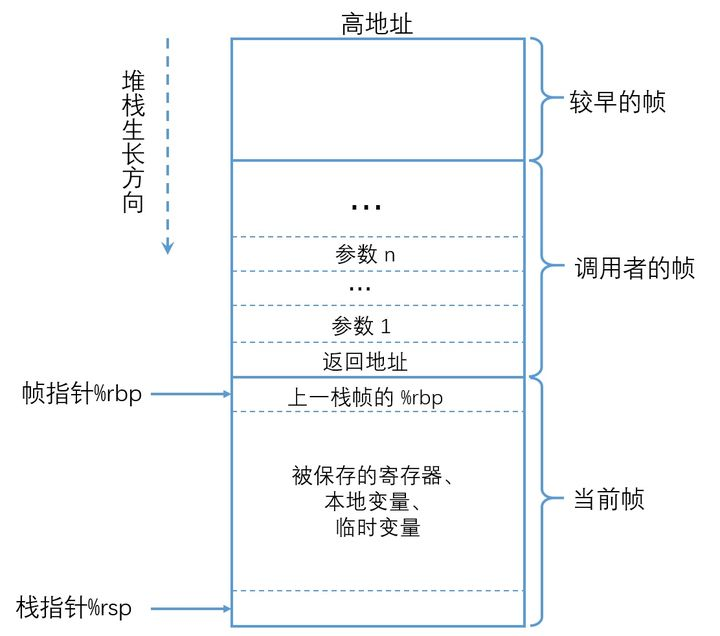
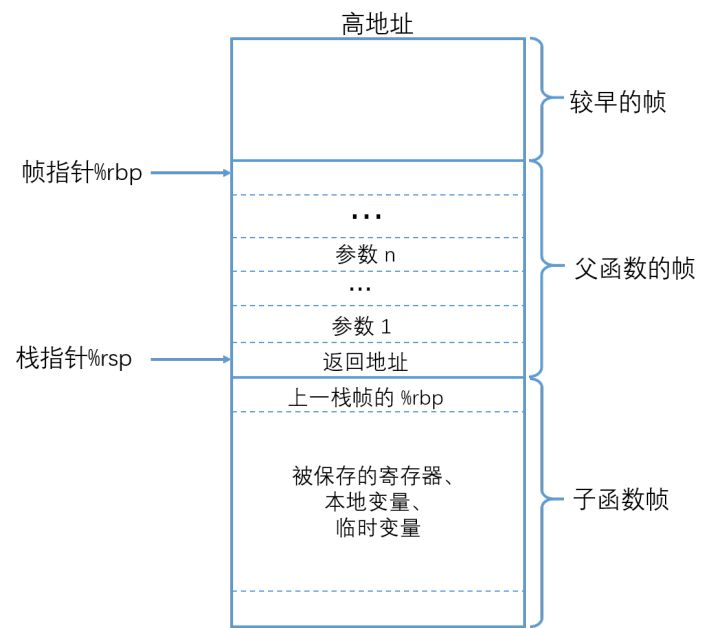

# 函数调用原理

> [x86_64架构下的函数调用及栈帧原理](https://zhuanlan.zhihu.com/p/107455887)
>
> [简单函数的调用原理](https://zhuanlan.zhihu.com/p/64915630)
>
> [调用一个函数之后发生了什么？](https://segmentfault.com/a/1190000040387043)


[译：深入理解x64的代码模型](https://zhuanlan.zhihu.com/p/58774036)

[函数调用栈](https://www.jianshu.com/p/0299f56edab5)


首先需要关注下面这几个寄存器：

- `%rsp`：保存栈顶指针
- `%rbp`：保存栈底指针
- `%rbp~%rsp` 这一段向下伸展的区域，就是栈帧。
- `%rip`：保存下条指令的地址
- `%rdi`：保存函数的第一个参数
- `%rsi`：保存函数的第二个参数
- `%rax`：保存返回值


从rsp到rbp之间的这段内存就是当前函数的栈帧。

> 所以函数调用就是改变这两个值


### 函数调用

在对子函数进行调用时，栈帧情况如下：




- 调用者栈帧中，保存了被调用函数的参数以及调用者的返回地址，其流程大致如下：
  **父函数将调用参数从右到左依次压栈->返回地址入栈->跳转到子函数起始地址->子函数将父函数栈帧起始地址（%rbp）压栈->将%rbp 的值设置为当前 %rsp 的值，开辟栈帧空间**

- 函数调用时的汇编指令如下：
  `... ;参数压栈`
  `call Func ;将返回地址压栈，并跳转到子函数处执行`
  `... ;函数调用的返回位置`

  `Func: ;子函数入口`
  `pushq``%rbp ;保存父函数的帧指针，创建新栈帧`
  `movq ``%rsp,``%rbp ;让``%rbp 指向新栈帧的起始位置`
  `subq $N,``%rsp ;开辟栈帧空间供子程序使用`

以上过程由编译器自动完成。需要注意的是，父函数中进行参数压栈时，顺序为从右到左，但并不是固定，要看编译器的具体实现（gcc使用的是从右到左）。


### 函数返回

函数返回时，我们需要的数据是函数的返回值（%rax），然后将栈结构恢复到函数调用之前的状态，最后跳转到父函数的返回地址继续执行。需要执行以下两条指令：

```assembly
movq %rbp, %rsp
popq %rbp
```


* `movq %rbp, %rsp`：使`%rsp` 和`%rbp` 指向同一位置，即子栈帧的起始处, 收回子栈帧空间。

* `popq %rbp`：将栈中保存的父栈帧的` %rbp` 的值赋值给` %rbp`，并且` %rsp` 上移一个位置指向父栈帧的结尾处


为了便于栈帧恢复，x86_64 架构中提供了 leave 指令来实现上述两条命令的功能。





调用 leave 后，%rsp 指向返回地址；ret 指令，从栈顶弹出数据，并跳转到此数据指向的地址处。在leave 执行后，%rsp 指向返回地址，因而 ret 的作用就是把 %rsp 上移一个位置，并跳转到返回地址执行。

所以，leave 指令用于恢复父函数的栈帧，ret 用于跳转到返回地址处，leave 和ret 配合共同完成了子函数的返回。当执行完成 ret 后，%rsp 指向的是父栈帧的结尾处，父栈帧尾部存储的调用参数由编译器自动释放。


### 简单理解

数的几个重要要素如下：

* 函数参数： 在call之前入栈，当然也可能是使用寄存器传递。
* 函数名： 在call的时候将函数地址给IP寄存器。
* 返回地址： 在call的时候将call的下一条指令的地址入栈。
* 局部变量： 如果需要局部变量空间，则继续移动SP指针，预留更多的栈空间。

SP永远指向栈顶，而BP用来寻址栈上空间时作为基地址。


个人理解：

栈帧的具体范围是由 rbp到rsp这之间的这部分内存，那么想要开辟一块新的栈帧只需要改变rbp和rsp的值即可。

由于等函数调用完成后需要回到调用者栈帧使其能正常执行下去，所以需要把旧的rbp先记录下来（一般是push到栈上）

> pop/push的时候rsp的值也会跟着变，所以不会出现这里多了一段内存的问题

然后把rbp指向现在的rsp，然后再把rsp向下移动，这样就开辟了一个新的栈帧
等函数调用完成后再把rsp指向现在的rbp(也就是以前的rsp)，这样就完成了rsp的恢复
接着在从栈上把之前存的rbp给pop出来，这样rbp也恢复了

调用者又可以继续执行了。


### 参数和返回值

关于参数和返回值，不同语言有不同的处理。

**参数**

一般是把参数存到调用者的栈帧中，被调用者通过rbp+offset方式取值。

也有把参数存到寄存器的，毕竟从寄存器取值比内存快多了，但是寄存器个数有限。

**返回值**

一般是通过寄存器存储返回值，callee把值写入寄存器，然后caller去寄存器取。

c 语言中就是用的 rax 寄存器来存放返回值，因为只用了一个寄存器，所以c函数都只有一个返回值。
而go则是用的栈来存返回值，因此go能有多个返回值。不过在go1.17中对函数调用方式也进行了调整，返回值不是太多的时候是用寄存器存放，寄存器不够用的时候还是存到栈上，性能上会有所提升。


### 小结

1. **参数传递。****gcc编译的c/c++代码一般通过寄存器传递参数，在AMD64 Linux 平台，gcc约定函数调用时前面6个参数分别通过rdi, rsi, rdx, r10, r8及r9传递；****而go语言函数调用时参数是通过栈传递给被调用函数的，最后一个参数最先入栈，第一个参数最后入栈，参数在调用者的栈帧之中，被调用函数通过rsp加一定的偏移量来获取参数；**
2. **call指令负责把执行call指令时的rip寄存器（函数返回地址）入栈；**
3. **gcc通过rbp加偏移量的方式来访问局部和临时变量，而go编译器则使用rsp寄存器加偏移量的方式来访问它们；**
4. **ret指令负责把call指令入栈的返回地址出栈给rip，从而实现从被调用函数返回到调用函数继续执行；**
5. **gcc使用rax寄存器返回函数调用的返回值，而go使用栈返回函数调用的返回值。**