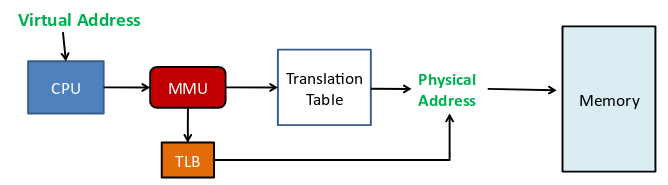

# MMU和TLB

> [TLB与MMU](https://blog.csdn.net/wagsyang/article/details/79234491)
>
> [Linux 内核内存管理：地址转换和 MMU](https://xie.infoq.cn/article/02b129db3f9c9f2b782053e0f)

## 进程 /线程切换

### 线程切换

因此从调度器的角度来说，线程至少包含以下3个重要内容：

- **一组通用寄存器的值**
- **将要执行的下一条指令的地址**，rip 寄存器
- **栈**，rbp和rsp寄存器

因此线程切换至少需要保存这些上下文。

### 进程切换

在 Linux 中进程和线程都是一个`task_struct`，对操作系统来说其实没有进程和线程的概念，因此进程切换和线程切换的直接开销是差不多的。

但是进程中可以包含多个线程，进程是资源分配的最小单位。所以多线程且换实际还是用的同一个进程的资源，但是多进程切换则就会用到不同的资源。

> 程序里用到的都是虚拟地址，实际上CPU使用时需要转换成物理地址才能用。

而这个转换是由CPU中的一个叫MMU的组件实现了，MMU实际也是根据虚拟地址去内存中查询对应的物理地址，为了加快查询速度引入了TLB，TLB也叫快表，就是一个缓存，但是空间小存不了太多信息。

> MySQL中查询慢，引入了 Redis，但是Redis容量小，只能存很少一部分热点数据。

所以进程切换后，TLB里的缓存可能都用不了了，导致速度变慢，这就是进程切换的间接开销。

> 所以才会有进程切换消耗比线程切换消耗大的说法。

## MMU&TLB

### MMU

MMU：memory management unit，称为内存管理单元，或者是存储器管理单元，MMU是硬件设备，它被保存在主存(main memory)的两级也表控制，并且是由协处理器CP15的寄存器1的M位来决定是enabled还是disabled。**MMU的主要作用是负责从CPU内核发出的虚拟地址到物理地址的映射**，并提供硬件机制的内存访问权限检查。MMU使得每个用户进程拥有自己的地址空间(对于WINCE5.0，每个进程是32MB;而对于WINCE6.0，每个进程的独占的虚拟空间是2GB)，并通过内存访问权限的检查保护每个进程所用的内存不被其他进程破坏。

### VA和PA

VA：virtual address称为虚拟地址，PA：physical address称为物理地址。

CPU通过地址来访问内存中的单元：

如果CPU没有MMU，或者有MMU但没有启动，那么CPU内核在取指令或者访问内存时发出的地址(此时必须是物理地址，假如是虚拟地址，那么当前的动作无效)将直接传到CPU芯片的外部地址引脚上，直接被内存芯片(物理内存)接收，这时候的地址就是物理地址。

如果CPU启用了MMU(一般是在bootloader中的eboot阶段的进入main()函数的时候启用)，CPU内核发出的地址将被MMU截获，这时候从CPU到MMU的地址称为虚拟地址，而MMU将这个VA翻译成为PA发到CPU芯片的外部地址引脚上，也就是将VA映射到PA中。

### TLB

TLB:Translate lookside buffer, 是MMU的一部分，也是硬件。

TLB 里面存放的是页表的缓存。页表本来是放在内存里的。但是对于常用的或刚刚用到的页，会被放进TLB暂存, 这样MMU拿到虚拟地址，可以直接在TLB里匹配到物理地址，不用去访问内存里的页表，速度快。

> 其实TLB也就是一些寄存器，比如32个等，每个TLB寄存器里面存放一个内存页面信息（page)，包含：**有效位，虚页面号，修改位，保护码，和页面所在的物理页面号。**它们和页面表中的表项一一对应。

TLB 就是 VA和PA的映射缓存，主要用于加快提示访问速度。

### 流程图

