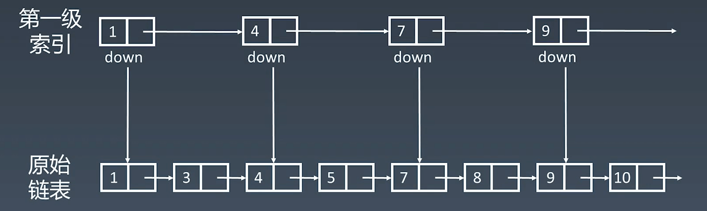
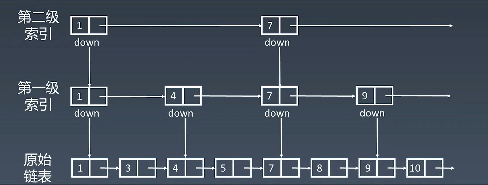
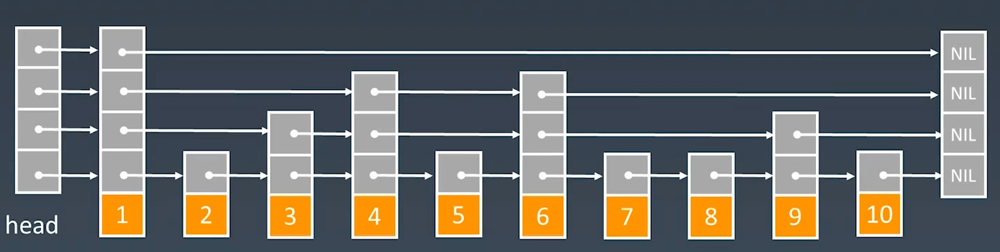

# 数组、链表、跳表基本实现与特性


## 1. 数组 Array

```go
// syntax: var variable_name [SIZE] variable_type
var array [1]int
```

申请数组的时候，计算机实际上是在内存中 开辟了一块连续的地址，每个地址都可以通过内存管理器进行访问。

* 优点：能随机访问任何一个元素，速度非常快。

* 缺点：增加删除操作的时候慢，会移动相关的元素。


| 操作      | 时间复杂度 |
| --------- | ---------- |
| preappend | O(1)       |
| append    | O(1)       |
| lookup    | O(1)       |
| insert    | O(n)       |
| delete    | O(n)       |

> preappend：从头增加元素  append：从尾部增加元素 insert：随机位置增加元素


## 2. 链表 Linked List

为了弥补前面数组增删慢的缺点。

```go
type ListNode struct {
	Val  int
	Next *ListNode
}
```

* 优点：增删元素很快，只需要修改附近两个元素的指针即可。
* 缺点：访问很慢，只能一个一个挨着访问。

时间复杂度


| 操作      | 时间复杂度 |
| --------- | ---------- |
| preappend | O(1)       |
| append    | O(1)       |
| lookup    | O(n)       |
| insert    | O(1)       |
| delete    | O(1)       |


## 3. 跳表 Skip List

为了优化链表的缺陷而设计出来的。在 Redis 中有运用到。

**优化思想：升维，空间换时间**

> 有头指针，所以访问头部几个元素会比较快
>
> 假设 增加一个尾指针，这样访问尾部元素就会比较快了。
>
> 然后在增加一个中指针，访问中间元素也快了。
>
> 那在增加更多的指针呢，以达到访问所有元素都比较快的地步。

大概就是这样：



一级索引相比原始链表跨度更大（一次走两个元素），访问起来就就会更快。

为了更快可以增加第二级索引



第二级索引的速度在第一级索引基础上在乘以 2，相当于每次跨 4 个元素。


以此类推，增加多级索引，对于有 n 个元素的链表来说，可以增加 **log 2n** 级索引


**时间复杂度分析**

n/2、n/4、n/8、第 K 级索引节点个数就是 n/2^k

假设索引有 h 级，最高的索引有两个节点。n/2^h = 2,从而求得 h = log2(n)-1


最终**跳表的时间复杂度就是 O(logn)**


现实中，由于链表会进行增删元素等操作，所以会有一点不同




同时跳表的索引维护比较麻烦，每次增删元素后都需要更新一遍索引，所以增删情况下时间复杂度提升到了O(logn)


| 操作      | 时间复杂度 |
| --------- | ---------- |
| preappend | O(logn)    |
| append    | O(logn)    |
| lookup    | O(logn)    |
| insert    | O(logn)    |
| delete    | O(logn)    |

## 4. 小结

* 1）数组、链表、跳表的原理和实现
* 2）三者的时间复杂度、空间复杂度
  * 特别是数组和链表的时间复杂度
* 3）工程运用
* 4）跳表：升维思想 + 空间换时间

**数组、链表需要特别熟悉，跳表主要知道原理。**