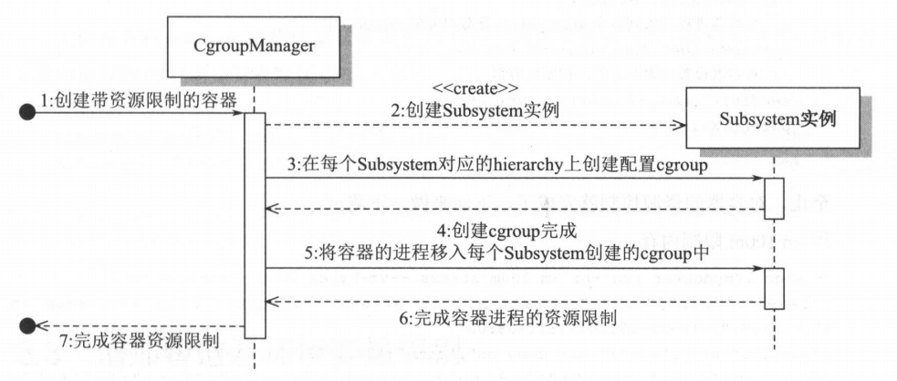
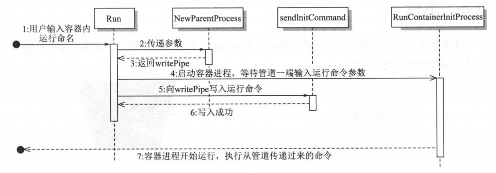

# 增加 Cgroups 资源限制

## 1. 概述

上一节中，已经可以通过命令行`mydocker run -it`的方式创建并启动容器。这一节，将**通过cgroup对容器的资源进行限制**。
这一节中，将实现通过`mydocker run -it -m 100m -cpuset 1 -cpushare 512 /bin/sh`的方式控制容器的内存和CPU配置。


## 2. cgroups 具体实现

核心思想就是解析`mydocker run`后面的参数，然后创建对应的 cgroups 并配置 subsystem。


### 定义 Subsystem

首先定义 Subsystem，抽象为一个接口以适应各种 subsystem：

```go
// ResourceConfig 用于传递资源限制配置的结构体，包含内存限制，CPU 时间片权重，CPU核心数
type ResourceConfig struct {
	MemoryLimit string
	CpuShare    string
	CpuSet      string
}

// Subsystem 接口，每个Subsystem可以实现下面的4个接口，
// 这里将cgroup抽象成了path,原因是cgroup在hierarchy的路径，便是虚拟文件系统中的虚拟路径
type Subsystem interface {
	// Name 返回当前Subsystem的名称,比如cpu、memory
	Name() string
	// Set 设置某个cgroup在这个Subsystem中的资源限制
	Set(path string, res *ResourceConfig) error
	// Apply 将进程添加到某个cgroup中
	Apply(path string, pid int) error
	// Remove 移除某个cgroup
	Remove(path string) error
}

// SubsystemsIns 通过不同的subsystem初始化实例创建资源限制处理链数组
var SubsystemsIns = []Subsystem{
	&CpusetSubSystem{},
	&MemorySubSystem{},
	&CpuSubSystem{},
}
```


#### memory subsystem

memory subsystem 实现如下：

```go
type MemorySubSystem struct {
}

// Set 设置cgroupPath对应的cgroup的内存资源限制
func (s *MemorySubSystem) Set(cgroupPath string, res *ResourceConfig) error {
	if res.MemoryLimit == "" {
		return nil
	}
	subsysCgroupPath, err := getCgroupPath(s.Name(), cgroupPath, true)
	if err != nil {
		return err
	}
	// 设置这个cgroup的内存限制，即将限制写入到cgroup对应目录的memory.limit_in_bytes 文件中。
	if err := ioutil.WriteFile(path.Join(subsysCgroupPath, "memory.limit_in_bytes"), []byte(res.MemoryLimit), 0644); err != nil {
		return fmt.Errorf("set cgroup memory fail %v", err)
	}
	return nil
}

// Remove 删除cgroupPath对应的cgroup
func (s *MemorySubSystem) Remove(cgroupPath string) error {
	subsysCgroupPath, err := getCgroupPath(s.Name(), cgroupPath, false)
	if err != nil {
		return err
	}
	return os.RemoveAll(subsysCgroupPath)
}

// Apply 将pid加入到cgroupPath对应的cgroup中
func (s *MemorySubSystem) Apply(cgroupPath string, pid int) error {
	subsysCgroupPath, err := getCgroupPath(s.Name(), cgroupPath, false)
	if err != nil {
		return errors.Wrapf(err, "get cgroup %s", cgroupPath)
	}
	if err := ioutil.WriteFile(path.Join(subsysCgroupPath, "tasks"), []byte(strconv.Itoa(pid)), 0644); err != nil {
		return fmt.Errorf("set cgroup proc fail %v", err)
	}
	return nil
}

// Name 返回cgroup名字
func (s *MemorySubSystem) Name() string {
	return "memory"
}
```

其实就是将操作 cgroups 的命令换成了 Go 语法罢了：

* 比如限制内存则是往`memory.limit_in_bytes`里写入指定值
* 添加某个进程到 cgroup 中就是往对应的 tasks 文件中写入对应的 pid
* 删除 cgroup 就是把对应目录删掉


另外的 subsystem 就不在贴代码了。


#### 工具类

其中的  `getCgroupPath` 函数是找到对应 subsystem 挂载的 hierarchy 相对路径对应的 cgroup 在虚拟文件
系统中的路径，然后通过这个目录的读写去操作 cgroup。

**那么，是如何找到挂载了 subsystem 的 hierarchy 的挂载目录的呢?**

先来熟悉下`/proc/{pid}/mountinfo`文件，如下：

```shell
$ cat /proc/24334/mountinfo 
613 609 0:59 / /sys ro,nosuid,nodev,noexec,relatime - sysfs sysfs ro
620 613 0:61 / /sys/fs/cgroup rw,nosuid,nodev,noexec,relatime - tmpfs tmpfs rw,mode=755
624 620 0:26 /docker/fa4b9c67d031dd83cedbad7b744b4ae64eb689c5089f77d0c95379bd3b66d791 /sys/fs/cgroup/systemd ro,nosuid,nodev,noexec,relatime master:5 - cgroup cgroup rw,xattr,release_agent=/usr/lib/systemd/systemd-cgroups-agent,name=systemd
625 620 0:29 /docker/fa4b9c67d031dd83cedbad7b744b4ae64eb689c5089f77d0c95379bd3b66d791 /sys/fs/cgroup/perf_event ro,nosuid,nodev,noexec,relatime master:6 - cgroup cgroup rw,perf_event
627 620 0:30 /docker/fa4b9c67d031dd83cedbad7b744b4ae64eb689c5089f77d0c95379bd3b66d791 /sys/fs/cgroup/net_cls,net_prio ro,nosuid,nodev,noexec,relatime master:7 - cgroup cgroup rw,net_cls,net_prio
629 620 0:31 /docker/fa4b9c67d031dd83cedbad7b744b4ae64eb689c5089f77d0c95379bd3b66d791 /sys/fs/cgroup/cpu,cpuacct ro,nosuid,nodev,noexec,relatime master:8 - cgroup cgroup rw,cpu,cpuacct
631 620 0:32 /docker/fa4b9c67d031dd83cedbad7b744b4ae64eb689c5089f77d0c95379bd3b66d791 /sys/fs/cgroup/pids ro,nosuid,nodev,noexec,relatime master:9 - cgroup cgroup rw,pids
634 620 0:33 / /sys/fs/cgroup/rdma ro,nosuid,nodev,noexec,relatime master:10 - cgroup cgroup rw,rdma
641 620 0:38 /docker/fa4b9c67d031dd83cedbad7b744b4ae64eb689c5089f77d0c95379bd3b66d791 /sys/fs/cgroup/hugetlb ro,nosuid,nodev,noexec,relatime master:15 - cgroup cgroup rw,hugetlb
644 620 0:39 /docker/fa4b9c67d031dd83cedbad7b744b4ae64eb689c5089f77d0c95379bd3b66d791 /sys/fs/cgroup/freezer ro,nosuid,nodev,noexec,relatime master:16 - cgroup cgroup rw,freezer
646 611 0:52 / /dev/mqueue rw,nosuid,nodev,noexec,relatime - mqueue mqueue rw
647 611 0:63 / /dev/shm rw,nosuid,nodev,noexec,relatime - tmpfs shm rw,size=65536k
648 609 253:1 /var/lib/docker/containers/fa4b9c67d031dd83cedbad7b744b4ae64eb689c5089f77d0c95379bd3b66d791/resolv.conf /etc/resolv.conf rw,relatime - xfs /dev/vda1 rw,attr2,inode64,noquota
649 609 253:1 /var/lib/docker/containers/fa4b9c67d031dd83cedbad7b744b4ae64eb689c5089f77d0c95379bd3b66d791/hostname /etc/hostname rw,relatime - xfs /dev/vda1 rw,attr2,inode64,noquota
650 609 253:1 /var/lib/docker/containers/fa4b9c67d031dd83cedbad7b744b4ae64eb689c5089f77d0c95379bd3b66d7
# ... 省略
```

通过`/proc/self/mountinfo` 可以找出 与当前进程相关的 mount 信息。

而 Cgroups 的 hierarchy 的虚拟文件系统是以 cgroup 类型文件系统的 mount 挂载上去的，
option 中加上 subsystem,代表挂载的 subsystem 类型，根据这个就可以在 mountinfo 中找到对应的
subsystem 的挂载目录了，比如 memory：

```shell
/sys/fs/cgroup/memory ro,nosuid,nodev,noexec,relatime master:11 - cgroup cgroup rw,memory
```

通过最后的 option 是 `rw, memory` 看出这一条挂载的 subsystem 是 memory,那么在`/sys/fs/cgroup/memory`中创建文件夹对应创建的 cgroup,就可以用来做内存的限制，实现如下。


```go
// getCgroupPath 找到cgroup在文件系统中的绝对路径
/*
实际就是将根目录和cgroup名称拼接成一个路径，如果对应的目录不存在，则说明cgroup不存在，这里就给创建一个
*/
func getCgroupPath(subsystem string, cgroupPath string, autoCreate bool) (string, error) {
	cgroupRoot := findCgroupMountpoint(subsystem)
	if _, err := os.Stat(path.Join(cgroupRoot, cgroupPath)); err == nil || (autoCreate && os.IsNotExist(err)) {
		if os.IsNotExist(err) {
			if err := os.Mkdir(path.Join(cgroupRoot, cgroupPath), 0755); err == nil {
			} else {
				return "", fmt.Errorf("error create cgroup %v", err)
			}
		}
		return path.Join(cgroupRoot, cgroupPath), nil
	} else {
		return "", fmt.Errorf("cgroup path error %v", err)
	}
}

// findCgroupMountpoint 通过/proc/self/mountinfo找出挂载了某个subsystem的hierarchy cgroup根节点所在的目录
func findCgroupMountpoint(subsystem string) string {
	// /proc/self/mountinfo 为当前进程的 mountinfo 信息
	// 可以直接通过 cat /proc/self/mountinfo 命令查看
	f, err := os.Open("/proc/self/mountinfo")
	if err != nil {
		return ""
	}
	defer f.Close()
	// 这里主要根据各种字符串处理来找到目标位置
	scanner := bufio.NewScanner(f)
	for scanner.Scan() {
		// txt 大概是这样的：104 85 0:20 / /sys/fs/cgroup/memory rw,nosuid,nodev,noexec,relatime - cgroup cgroup rw,memory
		txt := scanner.Text()
		// 然后按照空格分割
		fields := strings.Split(txt, " ")
		// 对最后一个元素按逗号进行分割，这里的最后一个元素就是 rw,memory
		// 其中的的 memory 就表示这是一个 memory subsystem
		subsystems := strings.Split(fields[len(fields)-1], ",")
		for _, opt := range subsystems {
			if opt == subsystem {
				// 如果等于指定的 subsystem，那么就返回这个挂载点跟目录，就是第四个元素，
				// 这里就是`/sys/fs/cgroup/memory`,即我们要找的根目录
				return fields[4]
			}
		}
	}
	if err := scanner.Err(); err != nil {
		return ""
	}

	return ""
}
```


### CgroupManager

定义一个 CgroupManager 来统一管理各个 subsystem。实现也很简单，就是循环调用每个 subsystem 中的方法。

```go
type CgroupManager struct {
	// cgroup在hierarchy中的路径 相当于创建的cgroup目录相对于root cgroup目录的路径
	Path string
	// 资源配置
	Resource *subsystems.ResourceConfig
}

func NewCgroupManager(path string) *CgroupManager {
	return &CgroupManager{
		Path: path,
	}
}

// Apply 将进程pid加入到这个cgroup中
func (c *CgroupManager) Apply(pid int) error {
	for _, subSysIns := range subsystems.SubsystemsIns {
		err := subSysIns.Apply(c.Path, pid)
		if err != nil {
			logrus.Errorf("apply subsystem:%s err:%s", subSysIns.Name(), err)
		}
	}
	return nil
}

// Set 设置cgroup资源限制
func (c *CgroupManager) Set(res *subsystems.ResourceConfig) error {
	for _, subSysIns := range subsystems.SubsystemsIns {
		err := subSysIns.Set(c.Path, res)
		if err != nil {
			logrus.Errorf("apply subsystem:%s err:%s", subSysIns.Name(), err)
		}
	}
	return nil
}

// Destroy 释放cgroup
func (c *CgroupManager) Destroy() error {
	for _, subSysIns := range subsystems.SubsystemsIns {
		if err := subSysIns.Remove(c.Path); err != nil {
			logrus.Warnf("remove cgroup fail %v", err)
		}
	}
	return nil
}
```


通过 CgroupManager ，将资源限制的配置，以及将进程移动到 cgroup 中的操作交给各个 subsystem 去处理。具体 cgroups 和 subsystem 的调用流程如下所示：




如图所示，CgroupManager 在配置容器资源限制时，首先会初始化 Subsystem 实例，然后遍历调用 Subsystem 实例的 Set 方法，创建和配置不同 Subsystem 挂载的 hierarchy 中的 cgroup，最后再通过调用 Subsystem 实例的 Apply 方法将容器的进程分别加入到那些 cgroup 中，以实现容器的资源限制。


到此，整个 Cgroups 的实现就算是完成了，后续剩下的就是在启动的时候，解析参数，并配置对应的 Cgroups 即可。

## 3. 配置Cgroups

Cgroups 实现后，还差参数解析和配置生成。

比如解析`-m` 参数得到用户指定的内存大小限制量，然后添加对应的 Cgroup。

### runCommand

首先就是 runCommand 增加了一些参数，主要用于接收 cgroups 限制值，比如 -mem 用于指定内存。

```go
var runCommand = cli.Command{
	Name: "run",
	Usage: `Create a container with namespace and cgroups limit
			mydocker run -it [command]`,
	Flags: []cli.Flag{
		cli.BoolFlag{
			Name:  "it", // 简单起见，这里把 -i 和 -t 参数合并成一个
			Usage: "enable tty",
		},
		cli.StringFlag{
			Name:  "mem", // 为了避免和 stress 命令的 -m 参数冲突 这里使用 -mem,到时候可以看下解决冲突的方法
			Usage: "memory limit",
		},
		cli.StringFlag{
			Name:  "cpushare",
			Usage: "cpushare limit",
		},
		cli.StringFlag{
			Name:  "cpuset",
			Usage: "cpuset limit",
		},
	},
	/*
		这里是run命令执行的真正函数。
		1.判断参数是否包含command
		2.获取用户指定的command
		3.调用Run function去准备启动容器:
	*/
	Action: func(context *cli.Context) error {
		if len(context.Args()) < 1 {
			return fmt.Errorf("missing container command")
		}

		var cmdArray []string
		for _, arg := range context.Args() {
			cmdArray = append(cmdArray, arg)
		}

		tty := context.Bool("it")
		resConf := &subsystems.ResourceConfig{
			MemoryLimit: context.String("mem"),
			CpuSet:      context.String("cpuset"),
			CpuShare:    context.String("cpushare"),
		}
		log.Info("resConf:", resConf)

		Run(tty, cmdArray, resConf)
		return nil
	},
}
```


### Run

然后 Run 方法则根据前面解析好的 config 设置对应的 Cgroups。

```go
func Run(tty bool, comArray []string, res *subsystems.ResourceConfig) {
	parent, writePipe := container.NewParentProcess(tty)
	if parent == nil {
		log.Errorf("New parent process error")
		return
	}
	if err := parent.Start(); err != nil {
		log.Errorf("Run parent.Start err:%v", err)
	}
	// 创建cgroup manager, 并通过调用set和apply设置资源限制并使限制在容器上生效
	cgroupManager := cgroups.NewCgroupManager("mydocker-cgroup")
	defer cgroupManager.Destroy()
	_ = cgroupManager.Set(res)
	_ = cgroupManager.Apply(parent.Process.Pid)
	// 再子进程创建后才能通过匹配来发送参数
	sendInitCommand(comArray, writePipe)
	_ = parent.Wait()
}
```

核心代码如下：

```go
cgroupManager := cgroups.NewCgroupManager("mydocker-cgroup")
	defer cgroupManager.Destroy()
	_ = cgroupManager.Set(res)
	_ = cgroupManager.Apply(parent.Process.Pid)
```

创建一个 Cgroups，然后调用 Set 方法写入对应的配置信息，最后调用 Apply 将子进程 pid 加入到这个 Cgroups 中。

这样就完成了 Cgroups 全部配置，已经可以限制子进程的资源使用了。


## 4. 管道传递参数

还有一个注意点是，代码中加入了匿名管道，主要用于在父进程和子进程之间传递参数。

不用管道也可以实现，就像这样：

```go
cmd := exec.Command("/proc/self/exe", "init",args)
```

在 fork 子进程时，把参数全部跟在 init 后面，然后再 init 进程中解析参数。

这种方式最大的问题是，如果用户输入参数特别长，或者里面有一些特殊字符时该方案就会失效。

因此通过管道来传递是比较好的选择，[runC](https://github.com/opencontainers/runc) 中也是用的这种方案。

管道从本质上来说，管道也是文件的一种，但是它和文件通信的区别在于，管道有一个固定大小的缓冲区，一般是4KB。当管道被写满时，写进程就会被阻塞，直到有读进程把管道的内容读出来。同样地，当读进程从管道内拿数据的时候，如果这时管道的内容是空的，那么读进程同样会被阻塞，一直等到有写进程向管道内写数据。

管道使用很简单：

```go
readPipe, writePipe, err := os.Pipe()
```

返回的两个 FD 一个代表管道的读端，另一个代表写端。这里可以把 readPipe 放到子进程，writePipe 放在父进程。

父进程将参数写入到 writePipe ，然后子进程从 readPipe 中读取即可。

传入子进程的实现是这样的：

```go
func NewParentProcess(tty bool) (*exec.Cmd, *os.File) {
	// 创建匿名管道用于传递参数，将readPipe作为子进程的ExtraFiles，子进程从readPipe中读取参数
	// 父进程中则通过writePipe将参数写入管道
	readPipe, writePipe, err := os.Pipe()
	if err != nil {
		log.Errorf("New pipe error %v", err)
		return nil, nil
	}
	cmd := exec.Command("/proc/self/exe", "init")
	cmd.SysProcAttr = &syscall.SysProcAttr{
		Cloneflags: syscall.CLONE_NEWUTS | syscall.CLONE_NEWPID | syscall.CLONE_NEWNS | syscall.CLONE_NEWNET | syscall.CLONE_NEWIPC,
	}
	if tty {
		cmd.Stdin = os.Stdin
		cmd.Stdout = os.Stdout
		cmd.Stderr = os.Stderr
	}
	cmd.ExtraFiles = []*os.File{readPipe}
	return cmd, writePipe
}
```

主要是这句：

```go
cmd.ExtraFiles = []*os.File{readPipe}
```

通过 ExtraFiles 的方式将 readPipe 传递给子进程。这样 cmd 执行时就会外带着这个文件句柄去创建子进程。


具体的读写代码如下：

```go
// sendInitCommand 通过writePipe将指令发送给子进程
func sendInitCommand(comArray []string, writePipe *os.File) {
	command := strings.Join(comArray, " ")
	log.Infof("command all is %s", command)
	_, _ = writePipe.WriteString(command)
	_ = writePipe.Close()
}

func readUserCommand() []string {
	// uintptr(3 ）就是指 index 为3的文件描述符，也就是传递进来的管道的另一端，至于为什么是3，具体解释如下：
	/*	因为每个进程默认都会有3个文件描述符，分别是标准输入、标准输出、标准错误。这3个是子进程一创建的时候就会默认带着的，
		前面通过ExtraFiles方式带过来的 readPipe 理所当然地就成为了第4个。
		在进程中可以通过index方式读取对应的文件，比如
		index0：标准输入
		index1：标准输出
		index2：标准错误
		index3：带过来的第一个FD，也就是readPipe
		由于可以带多个FD过来，所以这里的3就不是固定的了。
		比如像这样：cmd.ExtraFiles = []*os.File{a,b,c,readPipe} 这里带了4个文件过来，分别的index就是3,4,5,6
		那么我们的 readPipe 就是 index6,读取时就要像这样：pipe := os.NewFile(uintptr(6), "pipe")
	*/
	pipe := os.NewFile(uintptr(3), "pipe")
	msg, err := ioutil.ReadAll(pipe)
	if err != nil {
		log.Errorf("init read pipe error %v", err)
		return nil
	}
	msgStr := string(msg)
	return strings.Split(msgStr, " ")
}
```


子进程 fork 出来后，执行到`readUserCommand`函数就会开始读取参数，此时父进程还没有开始发送参数，根据管道的特性，子进程会阻塞在这里，一直到父进程发送数据过来后子进程才继续执行下去。

整个参数传递流程如下图所示：




到此我们的 Cgroups 就添加完成了，由于篇幅问题，只贴了一部分代码，具体完整代码见 GitHub。

## 5. 测试

这里还是通过跑 `stress` 命令来测试 Cgroups 限制是否生效。

> 宿主机上需要先安装 stress。

### memory

`stress --vm-bytes 200m`指定占用200M内存，通过`-mem 100m`将进程最大使用内存限制到100M，看下是否生效：

```shell
$ sudo ./mydocker run -it -mem 100m stress --vm-bytes 200m --vm-keep -m 1

{"level":"info","msg":"command all is stress --vm-bytes 200m --vm-keep -m 1","time":"2022-02-08T21:38:10+08:00"}
{"level":"info","msg":"init come on","time":"2022-02-08T21:38:10+08:00"}
{"level":"info","msg":"Find path /usr/bin/stress","time":"2022-02-08T21:38:10+08:00"}
stress: info: [1] dispatching hogs: 0 cpu, 0 io, 1 vm, 0 hdd
```

查看内存占用情况：

```shell
  PID USER      PR  NI    VIRT    RES    SHR S  %CPU  %MEM     TIME+ COMMAND
11223 root      20   0  208664 100684    208 D  35.9   1.2   0:06.38 stress
```

RES 100684，差不多 100M，说明我们的 memory cgroup 已经生效了。


### cpu

`stress -c 1 -t 100`默认会占满CPU，通过`-cpu 10`限制只能使用10%的CPU，看下是否生效：

```shell
$ sudo ./mydocker run -it -cpu 10 stress -c 1 -t 100
```


查看CPU占用情况：

```shell
  PID USER      PR  NI    VIRT    RES    SHR S  %CPU  %MEM     TIME+ COMMAND
 6226 root      20   0    3860    100      0 R  10.0   0.0   0:00.82 stress
```

稳稳的被限制在了10%，说明也是生效的。


> 其他的 subsystem 没有实现，不过大致原理都是一样的。


## 6. 小结

整个实现不算复杂，由于书上配套的源码比较老了，还是存在各种小问题。不过只要理解了实现原理，在写就很简单了。

这次实现的时候在其中有问题的地方也加上了注释，还是比较容器理解的。


具体流程就是：

* 1）解析命令行参数，取到 Cgroups 相关参数
  * 比如 -mem 100m 表示把内存限制到100m
  * 又比如 -cpu 20 表示把cpu限制在20%
* 2）根据参数，创建对应 Cgroups 并配置对应的 subsystem，最后把 fork 出来的子进程 pid 加入到这个 Cgroups 中即可。
  * 1）创建 Cgroups
  * 2）配置 subsystem
  * 3）fork 出子进程
  * 4）把子进程pid加入到 Cgroups 中

最后为了便于传递参数，在父进程和子进程间使用了匿名管道来传递参数。
