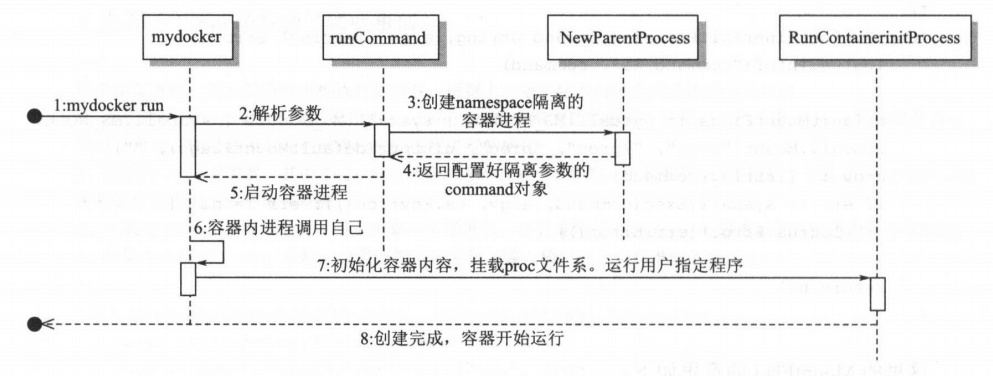

# 构造容器


## Linux proc 文件系统

Linux 下的 proc 文件系统 由内核提供的，它其实不是一个真正的文件系统，只包含了系统运行时的信息（ 比如系统内存、 ount 设备信息、一些硬件配直等），它只存在于内存中。

它以文件系统的形式，为访问内核数据的操作提供接口。实际上，很多系统工具都是简单地去读取这个 件系统的某个文件内 容，比如 lsmod 其实就是 cat proc modules。

当遍历这个目录的时候，会发现很多数字，这些都是为每个进程创建的空间，数字就是它们的 PID。

```shell
[root@iZ2zefmrr626i66omb40ryZ ~]# ls /proc
1     103   106   12    16     22     24252  24334  25309  25345  25380  3    34   374  420  431  541   677   715  8044  882   buddyinfo  crypto       fb           irq        kpagecgroup  meminfo  pagetypeinfo  self      sysrq-trigger  version
10    1041  1061  1255  17     23     24265  24445  25312  25348  26     30   35   375  421  432  574   679   716  818   886   bus        devices      filesystems  kallsyms   kpagecount   misc     partitions    slabinfo  sysvipc        vmallocinfo
100   105   1065  13    19     23493  24271  25150  25315  25350  26013  31   36   376  427  433  6     6970  720  819   9     cgroups    diskstats    fs           kcore      kpageflags   modules  pressure      softirqs  thread-self    vmstat
1008  1051  1078  1337  2      24229  24286  25215  25329  25354  27     32   367  38   428  434  6211  705   721  8203  958   cmdline    dma          interrupts   keys       loadavg      mounts   sched_debug   stat      timer_list     zoneinfo
101   1055  1079  14    21     24235  24287  25251  25332  25358  28     33   37   4    429  435  6355  707   729  822   960   consoles   driver       iomem        key-users  locks        mtrr     schedstat     swaps     tty
102   1057  11    15    21379  24247  24330  25255  25333  25359  29     335  373  401  430  49   674   711   8    8483  acpi  cpuinfo    execdomains  ioports      kmsg       mdstat       net      scsi          sys       uptime

```

下面介绍几个比较重要的：


* /proc/N：PID为N的进程信息
* /proc/N/cmdline： 进程启动命令
* /proc/N/cwd：  链接到进程当前工作目录
* /proc/N/environ ：进程环境变量列表
* /proc/N/exe：链接到进程的执行命令文件
* /proc/N/fd：包含进程相关的所有文件描述符
* /proc/N/ maps：与进程相关的内存映射信息
* /proc/N/ mem：指代进程持有的内存，不可读
* /proc/N/root：链接到进程的根目录
* /proc/N/stat：进程的状态
* /proc/N/statm：进程使用的内存状态
* /proc/N/status：进程状态信息，比stat/statm更具可读性
* /proc/self/：链接到当前正在运行的进程


## 实现 run 命令

首先实现 个简单版本的 run 命令，类似于 `docker run -it [command]`。

> 该版本参考 runC 的实现。


### urfave/cli

主要用到了 [urfave/cli](https://github.com/urfave/cli) 来实现命令行工具，具体用法参考官方文档。

一个简单的 Demo 如下：

```go
// urfaveCli cli 包简单使用，具体可以参考官方文档
func urfaveCli() {
	app := cli.NewApp()

	// 指定全局参数
	app.Flags = []cli.Flag{
		cli.StringFlag{
			Name:  "lang, l",
			Value: "english",
			Usage: "Language for the greeting",
		},
		cli.StringFlag{
			Name:  "config, c",
			Usage: "Load configuration from `FILE`",
		},
	}
	// 指定支持的命令列表
	app.Commands = []cli.Command{
		{
			Name:    "complete",
			Aliases: []string{"c"},
			Usage:   "complete a task on the list",
			Action: func(c *cli.Context) error {
				log.Println("run command complete")
				for i, v := range c.Args() {
					log.Printf("args i:%v v:%v\n", i, v)
				}
				return nil
			},
		},
		{
			Name:    "add",
			Aliases: []string{"a"},
			// 每个命令下面还可以指定自己的参数
			Flags: []cli.Flag{cli.Int64Flag{
				Name:  "priority",
				Value: 1,
				Usage: "priority for the task",
			}},
			Usage: "add a task to the list",
			Action: func(c *cli.Context) error {
				log.Println("run command add")
				for i, v := range c.Args() {
					log.Printf("args i:%v v:%v\n", i, v)
				}
				return nil
			},
		},
	}

	err := app.Run(os.Args)
	if err != nil {
		log.Fatal(err)
	}
}
```

具体效果如下：

```shell
$ go run main.go -h
NAME:
   main - A new cli application

USAGE:
   main [global options] command [command options] [arguments...]

COMMANDS:
   complete, c  complete a task on the list
   add, a       add a task to the list
   help, h      Shows a list of commands or help for one command

GLOBAL OPTIONS:
   --lang value, -l value  Language for the greeting (default: "english")
   --config FILE, -c FILE  Load configuration from FILE
   --help, -h              show help
```

可以看到指定的指令和参数，就是这么简单。


### 目录结构

目录结构如下：

```shell
$ tree .
.
├── LICENSE
├── Makefile
├── README.md
├── container
│   ├── container_process.go
│   └── init.go
├── example
│   └── main.go
├── go.mod
├── go.sum
├── main.go
├── main_command.go
└── run.go
```


### main.go

首先是 main 文件：

使用 [urfave/cli](https://github.com/urfave/cli) 提供 的命令行工具定义了 mydocker 的几个基本命令，包括 `runCommand`和 `initCommand` ，然后在 app.Before 内初始化 logrus 的日志配置。

```go
package main

import (
	"os"

	log "github.com/sirupsen/logrus"

	"github.com/urfave/cli"
)

const usage = `mydocker is a simple container runtime implementation.
			   The purpose of this project is to learn how docker works and how to write a docker by ourselves
			   Enjoy it, just for fun.`

func main() {
	app := cli.NewApp()
	app.Name = "mydocker"
	app.Usage = usage

	app.Commands = []cli.Command{
		initCommand,
		runCommand,
	}

	app.Before = func(context *cli.Context) error {
		// Log as JSON instead of the default ASCII formatter.
		log.SetFormatter(&log.JSONFormatter{})

		log.SetOutput(os.Stdout)
		return nil
	}

	if err := app.Run(os.Args); err != nil {
		log.Fatal(err)
	}
}
```


### main_command.go

然后是具体的命令定义：

```go
var runCommand = cli.Command{
	Name: "run",
	Usage: `Create a container with namespace and cgroups limit
			mydocker run -it [command]`,
	Flags: []cli.Flag{
		cli.BoolFlag{
			Name:  "it", // 简单起见，这里把 -i 和 -t 参数合并成一个
			Usage: "enable tty",
		},
	},
	/*
		这里是run命令执行的真正函数。
		1.判断参数是否包含command
		2.获取用户指定的command
		3.调用Run function去准备启动容器:
	*/
	Action: func(context *cli.Context) error {
		if len(context.Args()) < 1 {
			return fmt.Errorf("missing container command")
		}
		cmd := context.Args().Get(0)
		tty := context.Bool("it")
		Run(tty, cmd)
		return nil
	},
}

var initCommand = cli.Command{
	Name:  "init",
	Usage: "Init container process run user's process in container. Do not call it outside",
	/*
		1.获取传递过来的 command 参数
		2.执行容器初始化操作
	*/
	Action: func(context *cli.Context) error {
		log.Infof("init come on")
		cmd := context.Args().Get(0)
		log.Infof("command: %s", cmd)
		err := container.RunContainerInitProcess(cmd, nil)
		return err
	},
}
```


### run.go

接着看下 Run 函数做了写什么：

```go
// Run 执行具体 command
/*
这里的Start方法是真正开始前面创建好的command的调用，它首先会clone出来一个namespace隔离的
进程，然后在子进程中，调用/proc/self/exe,也就是调用自己，发送init参数，调用我们写的init方法，
去初始化容器的一些资源。
*/
func Run(tty bool, cmd string) {
	parent := container.NewParentProcess(tty, cmd)
	if err := parent.Start(); err != nil {
		log.Error(err)
	}
	_ = parent.Wait()
	os.Exit(-1)
}
```

```go
// NewParentProcess 启动一个新进程
/*
这里是父进程，也就是当前进程执行的内容。
1.这里的/proc/se1f/exe调用中，/proc/self/ 指的是当前运行进程自己的环境，exec 其实就是自己调用了自己，使用这种方式对创建出来的进程进行初始化
2.后面的args是参数，其中init是传递给本进程的第一个参数，在本例中，其实就是会去调用initCommand去初始化进程的一些环境和资源
3.下面的clone参数就是去fork出来一个新进程，并且使用了namespace隔离新创建的进程和外部环境。
4.如果用户指定了-it参数，就需要把当前进程的输入输出导入到标准输入输出上
*/
func NewParentProcess(tty bool, command string) *exec.Cmd {
	args := []string{"init", command}
	cmd := exec.Command("/proc/self/exe", args...)
	cmd.SysProcAttr = &syscall.SysProcAttr{
		Cloneflags: syscall.CLONE_NEWUTS | syscall.CLONE_NEWPID | syscall.CLONE_NEWNS |
			syscall.CLONE_NEWNET | syscall.CLONE_NEWIPC,
	}
	if tty {
		cmd.Stdin = os.Stdin
		cmd.Stdout = os.Stdout
		cmd.Stderr = os.Stderr
	}
	return cmd
}
```


### init.go

最后再看下 initCommand 的具体内容：

```go
// RunContainerInitProcess 启动容器的init进程
/*
这里的init函数是在容器内部执行的，也就是说，代码执行到这里后，容器所在的进程其实就已经创建出来了，
这是本容器执行的第一一个进程。
使用mount先去挂载proc文件系统，以便后面通过ps等系统命令去查看当前进程资源的情况。
*/
func RunContainerInitProcess(command string, args []string) error {
	log.Infof("command:%s", command)
	defaultMountFlags := syscall.MS_NOEXEC | syscall.MS_NOSUID | syscall.MS_NODEV
	_ = syscall.Mount("proc", "/proc", "proc", uintptr(defaultMountFlags), "")
	argv := []string{command}
	if err := syscall.Exec(command, argv, os.Environ()); err != nil {
		log.Errorf(err.Error())
	}
	return nil
}
```

这里 Mount 意思如下：

* MS_NOEXEC 在本文件系统 许运行其 程序。

* MS_NOSUID 在本系统中运行程序的时候， 允许 set-user-ID set-group-ID

* MS_NOD 这个参数是自 Linux 2.4 ，所有 mount 的系统都会默认设定的参数。

本函数最后的`syscall.Exec`是最为重要的一句黑魔法，正是这个系统调用实现了完成初始化动作并将用户进程运行起来的操作。
首先，使用 Docke r创建起来一个容器之后，会发现容器内的第一个程序，也就是PID为1的那个进程，是指定的前台进程。但是，我们知道容器创建之后，执行的第一个进程并不是用户的进程，而是init 初始化的进程。 这时候，如果通过ps 命令查看就会发现，容器内第一个进程变成了自己的init,这和预想的是不一样的。

**有没有什么办法把自己的进程变成PID为1的进程呢？**

这里 execve 系统调用就是用来做这件事情的。

syscall.Exec 这个方法，其实最终调用了 Kernel 的 `int execve(const char *filename, char
*const argv[], char *const envp[);`这个系统函数。**它的作用是执行当前filename对应的程序,它会覆盖当前进程的镜像、数据和堆栈等信息，包括PID，这些都会被将要运行的进程覆盖掉**。

也就是说，调用这个方法，将用户指定的进程运行起来，把最初的init 进程给替换掉，这样当进入到容器内部的时候，就会发现容器内的第一个程序就是我们指定的进程了。

> 这其实也是目前Docker使用的容器引擎runC的实现方式之一。

具体启动流程如下图：




### 测试

```shell
~/projects/docker/mydocker $ go build .
~/projects/docker/mydocke $ sudo ./mydocker run -it /bin/zsh
{"level":"info","msg":"init come on","time":"2022-02-07T20:09:38+08:00"}
{"level":"info","msg":"command: /bin/zsh","time":"2022-02-07T20:09:38+08:00"}
{"level":"info","msg":"command:/bin/zsh","time":"2022-02-07T20:09:38+08:00"}
DESKTOP-9K4GB6E# ps
  PID TTY          TIME CMD
    1 pts/0    00:00:00 zsh
    8 pts/0    00:00:00 ps
```

在容器运行 ps  时，可以发现 /bin/sh 程是容器内的第一个进程， PID 为 1。 ps 进程是 PID 为1的父进程创建出来的。来对比 Docker 运行的容器的效果，如下：

```shell
$ docker run -it ubuntu /bin/sh
$ ps
  PID TTY          TIME CMD
    1 pts/0    00:00:00 sh
    7 pts/0    00:00:00 ps
```

> 不能说很相似，只能说是一模一样了。

这里的 /bin/sh 是一个会在前台一直运行的进程，那么可以试一下如果指定一个运行完就会退出的进程会是什么效果：

```shell
$ sudo ./mydocker run -it /bin/ls
{"level":"info","msg":"init come on","time":"2022-02-07T20:14:49+08:00"}
{"level":"info","msg":"command: /bin/ls","time":"2022-02-07T20:14:49+08:00"}
{"level":"info","msg":"command:/bin/ls","time":"2022-02-07T20:14:49+08:00"}
LICENSE  Makefile  README.md  container  example  go.mod  go.sum  main.go  main_command.go  mydocker  run.go
```

由于没有 chroot ，所以目前的系统文件系统是继承自父进程的。运行了一下 ls 命令，发现容器启动起来以后，打印出了当前目录的内容，然后便退出了，这个结果和 Docker 要求容器必须有一个一直在前台运行的进程的要求一致。