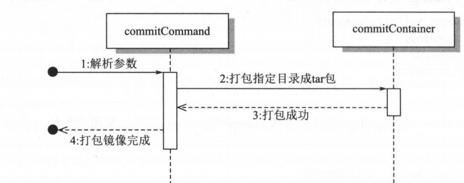

# 实现简单镜像打包

## 1. 概述

容器在退出时会删除所有可写层的内容，mydocker commit 命令的目的就是把运行状态容器的内容存储成镜像保存下来。


## 2. 实现

在 main_ command.go 文件中实现 commitCommand 命令,从用户的输入获取image name。

```shell
var commitCommand = cli.Command{
	Name:  "commit",
	Usage: "commit a container into image",
	Action: func(context *cli.Context) error {
		if len(context.Args()) < 1 {
			return fmt.Errorf("Missing container name")
		}
		imageName := context.Args().Get(0)
		commitContainer(imageName)
		return nil
	},
}
```

然后在 main 方法中添加 commit 命令：

```go

func main() {
	app := cli.NewApp()
	app.Name = "mydocker"
	app.Usage = usage

	app.Commands = []cli.Command{
		initCommand,
		runCommand,
		commitCommand,
	}
	// 省略其他
}
```

添加 commit.go文件，通过 commitContainer 函数实现将容器文件系统打包成`$ {imagename}.tar` 文件。

```go
func commitContainer(imageName string) {
	mntURL := "/root/merged"
	imageTar := "/root/" + imageName + ".tar"
	fmt.Printf("commitContainer imageTar:%s", imageTar)
	if _, err := exec.Command("tar", "-czf", imageTar, "-C", mntURL, ".").CombinedOutput(); err != nil {
		log.Errorf("tar folder %s error %v", mntURL, err)
	}
}
```


具体流程如下图所示：




## 3. 测试

首先，启动一个容器。

```shell
$ go build .
$ sudo ./mydocker run -it /bin/sh
{"level":"info","msg":"createLower","time":"2022-02-16T19:01:29+08:00"}
{"level":"info","msg":"mountOverlayFS cmd:/usr/bin/mount -t overlay overlay -o lowerdir=/root/busybox,upperdir=/root/upper,workdir=/root/work /root/merged","time":"2022-02-16T19:01:29+08:00"}
{"level":"info","msg":"command all is /bin/sh","time":"2022-02-16T19:01:29+08:00"}
{"level":"info","msg":"init come on","time":"2022-02-16T19:01:29+08:00"}
{"level":"info","msg":"Current location is /root/merged","time":"2022-02-16T19:01:29+08:00"}
{"level":"info","msg":"Find path /bin/sh","time":"2022-02-16T19:01:29+08:00"}
/ #
```


另外打开 terminal 窗口，先查看／root 目录的内容，

```shell
root@DESKTOP-9K4GB6E:~# ls
busybox  busybox.tar  merged  upper  volume  work
```

然后执行 mydocker commit 命令，

```shell
$ sudo ./mydocker commit myimage
commitContainer imageTar:/root/myimage.tar
```

再次查看／root 目录的内容，多了 myimage.tar 文件

```shell
root@DESKTOP-9K4GB6E:~# ls
busybox  busybox.tar merged  myimage.tar  upper  volume  work
```

解压 myimage.tar 查看内容：

```shell
# mkdir myimage
# cd myimage
# tar -xvf /root/myimage.tar
# ls
bin  dev  etc  home  proc  root  sys  tmp  usr  var
```


## 4. 总结

本章首先使用 busybox 作为基础镜像创建了一个容器，理解了什么是 rootfs，以及如何使用 rootfs 来打造容器的基本运行环境。

然后，使用 OverlayFS 来构建了一个拥有二层模式的镜像，对于最上层可写层的修改不会影响到基础层。这里就基本解释了镜像分层存储的原理。

之后使用 -v参 数做了一个 volume 挂载的例子，介绍了如何将容器外部的文件系统挂载到容器中，并且让它可以访问。

最后实现了一个简单版本的容器镜像打包。

这一章主要针对镜像的存储及文件系统做了基本的原理性介绍，通过这几个例子，可以很好地理解镜像是如何构建的，第 5 章会基于这些基础做更多的扩展。
