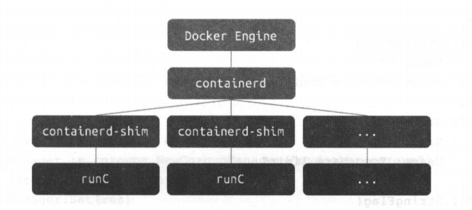

# 实现容器后台运行

## 1. 概述

经过前面的铺垫，我们又了解了关于镜像的知识，明白了基本的容器镜像的构成。

不过与 Docker 创建的容器相比，我们还缺少后台运行的容器，也就是 detach 类型的容器功能，并且不能通过 docker ps 查看目前处于运行中的容器，也不能通过docker logs 查看容器的输出，更不能通过 docker exec 进入到一个已经创建好了的容器中。

从本章开始，会去一一实现这些功能。

## 2. 原理分析


在 Docker 早期版本，所有的容器 init 进程都是从 docker daemon 这个进程 fork出来的，这也就会导致一个众所周知的问题，如果 docker daemon 挂掉，那么所有的容器都会宕掉，这给升级 docker daemon 带来很大的风险。

后来，Docker 使用了 containerd， 也就是现在的runC，便可以实现即使 daemon挂掉，容器依然健在的功能了，其结构如下图所示。



我们并不想去实现一个 daemon,因为这和容器的关联不是特别大，而且，查看Docker 的运行引擎 runC 可以发现，runC 也提供一.种 detach 功能，可以保证在runC 退出的情况下容器依然可以运行。因此，我们将会使用 detach 功能去实现创建完成容器后，mydocker 就会退出,但是容器依然继续运行的功能。

容器，在操作系统看来，其实就是一个进程。当前运行命令的 mydocker 是主进程，容器是被当前 mydocker 进程 fork 出来的子进程。子进程的结束和父进程的运行是一个异步的过程，即父进程永远不知道子进程到底什么时候结束。如果创建子进程的父进程退出，那么这个子进程就成了没人管的孩子，俗称孤儿进程。为了避免孤儿进程退出时无法释放所占用的资源而僵死，进程号为 1 的 init 进程就会接受这些孤儿进程。

**这就是父进程退出而容器进程依然运行的原理**。虽然容器刚开始是由当前运行的 mydocker 进程创建的，但是当 mydocker 进程退出后，容器进程就会被进程号为 1 的 init 进程接管，这时容器进程还是运行着的，这样就实现了 mydocker 退出、容器不宕掉的功能。


## 3. 实现

首先，需要在 main-command.go 里面添加 -d 标签，表示这个容器启动的时候后台在运行。

```go
var runCommand = cli.Command{
	Name: "run",
	Usage: `Create a container with namespace and cgroups limit
			mydocker run -it [command]`,
	Flags: []cli.Flag{
		cli.BoolFlag{
			Name:  "it", // 简单起见，这里把 -i 和 -t 参数合并成一个
			Usage: "enable tty",
		},
		cli.BoolFlag{
			Name:  "d",
			Usage: "detach container",
		},
        // 省略其他代码
	},
	/*
		这里是run命令执行的真正函数。
		1.判断参数是否包含command
		2.获取用户指定的command
		3.调用Run function去准备启动容器:
	*/
	Action: func(context *cli.Context) error {
		if len(context.Args()) < 1 {
			return fmt.Errorf("missing container command")
		}

		var cmdArray []string
		for _, arg := range context.Args() {
			cmdArray = append(cmdArray, arg)
		}
		// tty和detach只能同时生效一个
		tty := context.Bool("it")
		detach := context.Bool("d")

		if tty && detach {
			return fmt.Errorf("it and d paramter can not both provided")
		}
		resConf := &subsystems.ResourceConfig{
			MemoryLimit: context.String("mem"),
			CpuSet:      context.String("cpuset"),
			CpuCfsQuota: context.Int("cpu"),
		}
		volume := context.String("v")
		Run(tty, cmdArray, resConf, volume)
		return nil
	},
}
```

然后调整 Run 方法,只有指定 tty 的时候才执行 parent.Wait。parent.Wait() 主要是用于父进程等待子进程结束，这在交互式创建容器的步骤里面是没问题的，但是在这里，如果detach创建了容器，就不能再去等待，创建容器之后，父进程就已经退出了。因此,这里只是将容器内的 init 进程启动起来，就已经完成工作,
紧接着就可以退出，然后由 init 进程去接管容器进程。

```go
func Run(tty bool, comArray []string, res *subsystems.ResourceConfig, volume string) {
	parent, writePipe := container.NewParentProcess(tty, volume)
	if parent == nil {
		log.Errorf("New parent process error")
		return
	}
	if err := parent.Start(); err != nil {
		log.Errorf("Run parent.Start err:%v", err)
	}
	// 创建cgroup manager, 并通过调用set和apply设置资源限制并使限制在容器上生效
	cgroupManager := cgroups.NewCgroupManager("mydocker-cgroup")
	defer cgroupManager.Destroy()
	_ = cgroupManager.Set(res)
	_ = cgroupManager.Apply(parent.Process.Pid, res)
	// 再子进程创建后才能通过管道来发送参数
	sendInitCommand(comArray, writePipe)
	if tty {
		_ = parent.Wait()
	}
	mntURL := "/root/merged"
	rootURL := "/root"
	container.DeleteWorkSpace(rootURL, mntURL, volume)
}
```


## 4. 测试

运行一个 top 命令：

```shell
$ go build .
$ sudo ./mydocker run -d top
[sudo] password for lixd:
{"level":"info","msg":"createLower","time":"2022-02-17T19:49:49+08:00"}
{"level":"info","msg":"mountOverlayFS cmd:/usr/bin/mount -t overlay overlay -o lowerdir=/root/busybox,upperdir=/root/upper,workdir=/root/work /root/merged","time":"2022-02-17T19:49:49+08:00"}
{"level":"info","msg":"command all is top","time":"2022-02-17T19:49:49+08:00"}
```

可以看到，直接退出了。

使用 top 作为容器内前台进程。然后在宿主机上执行 ps -ef 看一下 建的容器进程是否存在：

```shell
$ ps -ef
UID        PID  PPID  C STIME TTY          TIME CMD
root     22255     1  0 20:19 ?        00:00:00 /init
root     22256 22255  0 20:19 ?        00:00:00 /init
root     23242 22256  0 20:20 pts/4    00:00:00 top
```

可以看到，top 命令的进程正在运行着，它的父进程是 22256,22256的父进程是22255,22255的父进程是1，而且都是叫做 init。这说明虽然 mydocker 主进程退出了，但是容器进程依然存在，由于父进程消失，它就被进程ID为1的 init 进程给托管了，由此就实现了 mydocker run -d 命令，即容器的后台运行。

> 书上这里 top 的父进程就是 1 ，不知道是不是系统的问题。