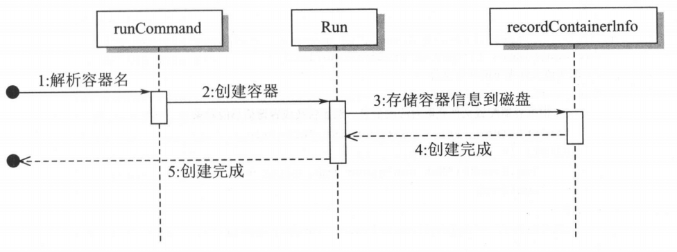
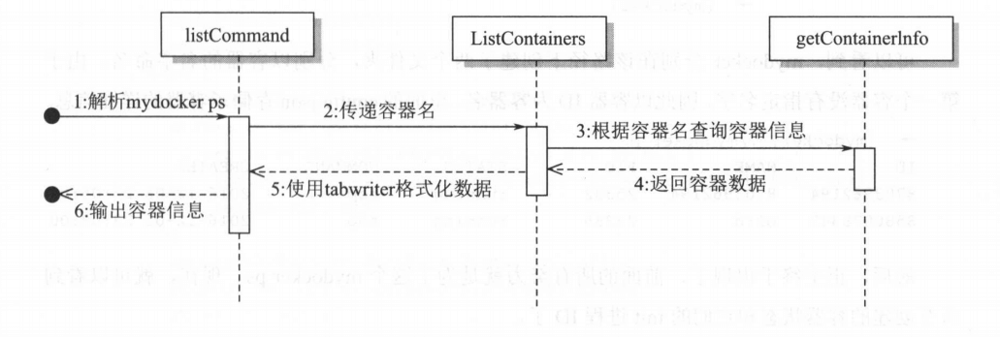

# 实现查看运行中的容器功能

## 1. 概述

上一节已经实现了 mydocker run -d 命令，可以让容器脱离父进程在后台独立运行，那么我们怎么知道有哪些容器在运行，而且它们的信息又是什么呢?

这里就需要实现 mydocker ps 命令了。其实 mydocker ps 命令比较简单，主要是去约定好的位置查询一下容器的信息数据，然后显示出来，因此数据准备就显得尤为重要。


## 2. 记录容器信息

在前面章节创建的容器中，所有关于容器的信息，比如PID、容器创建时间、容器运行命令等，都没有记录，这导致容器运行完后就再也不知道它的信息了，因此需要把这部分信息保留下来。

### -name 参数

首先，要在 main_command.go 文件的 runCommand 参数里面增加一个 name 标签,方便用户指定容器的名字。

```go
var runCommand = cli.Command{
	Name: "run",
	Usage: `Create a container with namespace and cgroups limit
			mydocker run -it [command]`,
	Flags: []cli.Flag{
		// 省略其他内容
		cli.StringFlag{
			Name:  "name",
			Usage: "container name",
		},
	},
    	Action: func(context *cli.Context) error {
		// 把namne传递给Run方法
		containerName := context.String("name")
		Run(tty, cmdArray, resConf, volume, containerName)
		return nil
	},
```


### recordContainerInfo 方法

然后，需要增加一个 record 方法记录容器的相关信息。在增加之前，需要-一个 ID 生成器，用来唯一标识容器。使用过 Docker 的都知道，每个容器都会有一个 ID,为了方便起见，就用 10 位数字来表示一个容器的ID。

```go
func randStringBytes(n int) string {
	letterBytes := "1234567890"
	rand.Seed(time.Now().UnixNano())
	b := make([]byte, n)
	for i := range b {
		b[i] = letterBytes[rand.Intn(len(letterBytes))]
	}
	return string(b)
}
```

另外就是记录容器信息这个重要的环节，我们先定义了一个容器的一些基本信息，比如 PID 和创建时间等，然后默认把容器的信息以 json 的形式存储在宿主机的`/var/run/mydocker/容器名/config.json`文件里面。容器的基本格式如下:

```json
type Info struct {
	Pid         string `json:"pid"`        // 容器的init进程在宿主机上的 PID
	Id          string `json:"id"`         // 容器Id
	Name        string `json:"name"`       // 容器名
	Command     string `json:"command"`    // 容器内init运行命令
	CreatedTime string `json:"createTime"` // 创建时间
	Status      string `json:"status"`     // 容器的状态
}
```


然后就开始记录容器信息：

```go
func recordContainerInfo(containerPID int, commandArray []string, containerName string) (string, error) {
	id := randStringBytes(10)
	createTime := time.Now().Format("2006-01-02 15:04:05")
	command := strings.Join(commandArray, "")
	if containerName == "" {
		containerName = id
	}
	containerInfo := &container.Info{
		Id:          id,
		Pid:         strconv.Itoa(containerPID),
		Command:     command,
		CreatedTime: createTime,
		Status:      container.RUNNING,
		Name:        containerName,
	}

	jsonBytes, err := json.Marshal(containerInfo)
	if err != nil {
		log.Errorf("Record container info error %v", err)
		return "", err
	}
	jsonStr := string(jsonBytes)

	dirUrl := fmt.Sprintf(container.DefaultInfoLocation, containerName)
	if err := os.MkdirAll(dirUrl, 0622); err != nil {
		log.Errorf("Mkdir error %s error %v", dirUrl, err)
		return "", err
	}
	fileName := dirUrl + "/" + container.ConfigName
	file, err := os.Create(fileName)
	defer file.Close()
	if err != nil {
		log.Errorf("Create file %s error %v", fileName, err)
		return "", err
	}
	if _, err := file.WriteString(jsonStr); err != nil {
		log.Errorf("File write string error %v", err)
		return "", err
	}

	return containerName, nil
}
```

经过上面的步骤，就实现了把创建容器的信息持久化到磁盘的`/var/run/容器名/config.json`文件上。

### Run 方法修改

最后，在 Run 函数上加上对于这个函数的调用，代码如下：

```go
func Run(tty bool, comArray []string, res *subsystems.ResourceConfig, volume, containerName string) {
	parent, writePipe := container.NewParentProcess(tty, volume)
	if parent == nil {
		log.Errorf("New parent process error")
		return
	}
	if err := parent.Start(); err != nil {
		log.Errorf("Run parent.Start err:%v", err)
	}
	// record container info
	containerName, err := recordContainerInfo(parent.Process.Pid, comArray, containerName)
	if err != nil {
		log.Errorf("Record container info error %v", err)
		return
	}
	// 创建cgroup manager, 并通过调用set和apply设置资源限制并使限制在容器上生效
	cgroupManager := cgroups.NewCgroupManager("mydocker-cgroup")
	defer cgroupManager.Destroy()
	_ = cgroupManager.Set(res)
	_ = cgroupManager.Apply(parent.Process.Pid, res)
	// 在子进程创建后才能通过管道来发送参数
	sendInitCommand(comArray, writePipe)
	if tty { // 如果是tty，那么父进程等待
		_ = parent.Wait()
		deleteContainerInfo(containerName)
	}
	// mntURL := "/root/merged"
	// rootURL := "/root"
	// container.DeleteWorkSpace(rootURL, mntURL, volume)
}
```

可以看到，如果最后是使用需要创建 tty 方式的容器，那么在容器退出后，就会删除容器的相关信息，实现也很简单，把对应目录的信息都删除就好了。

```go
func deleteContainerInfo(containerName string) {
	dirURL := fmt.Sprintf(container.DefaultInfoLocation, containerName)
	if err := os.RemoveAll(dirURL); err != nil {
		log.Errorf("Remove dir %s error %v", dirURL, err)
	}
}
```

到此为止，就完成了信息的收集。容器创建后，所有需要的信息都被存储到`/var/run/mydocker/容器名`下，下面就可以通过读取遍历这个目录下的容器去实现 mydocker ps 命令了。


### 流程图




## 3. 实现 mydocker ps

### listCommand

首先在main_command.go 中增加 listCommand：

```go
var listCommand = cli.Command{
	Name:  "ps",
	Usage: "list all the containers",
	Action: func(context *cli.Context) error {
		ListContainers()
		return nil
	},
}
```

在 main.go 中引用该命令：

```go
func main {
    // 省略其他内容
	app.Commands = []cli.Command{
		initCommand,
		runCommand,
		commitCommand,
		listCommand,
	}
}
```


具体实现如下：

```go
func ListContainers() {
	// 读取存放容器信息目录下的所有文件
	files, err := ioutil.ReadDir(container.InfoLoc)
	if err != nil {
		log.Errorf("read dir %s error %v", container.InfoLoc, err)
		return
	}
	containers := make([]*container.Info, 0, len(files))
	for _, file := range files {
		tmpContainer, err := getContainerInfo(file)
		if err != nil {
			log.Errorf("get container info error %v", err)
			continue
		}
		containers = append(containers, tmpContainer)
	}
	// 使用tabwriter.NewWriter在控制台打印出容器信息
	// tabwriter 是引用的text/tabwriter类库，用于在控制台打印对齐的表格
	w := tabwriter.NewWriter(os.Stdout, 12, 1, 3, ' ', 0)
	_, err = fmt.Fprint(w, "ID\tNAME\tPID\tSTATUS\tCOMMAND\tCREATED\n")
	if err != nil {
		log.Errorf("Fprint error %v", err)
	}
	for _, item := range containers {
		_, err = fmt.Fprintf(w, "%s\t%s\t%s\t%s\t%s\t%s\n",
			item.Id,
			item.Name,
			item.Pid,
			item.Status,
			item.Command,
			item.CreatedTime)
		if err != nil {
			log.Errorf("Fprint error %v", err)
		}
	}
	if err = w.Flush(); err != nil {
		log.Errorf("Flush error %v", err)
	}
}
```


```go
func getContainerInfo(file os.FileInfo) (*container.Info, error) {
	// 根据文件名拼接出完整路径
	containerName := file.Name()
	configFileDir := fmt.Sprintf(container.InfoLocFormat, containerName)
	configFileDir = configFileDir + container.ConfigName
	// 读取容器配置文件
	content, err := ioutil.ReadFile(configFileDir)
	if err != nil {
		log.Errorf("read file %s error %v", configFileDir, err)
		return nil, err
	}
	info := new(container.Info)
	if err = json.Unmarshal(content, info); err != nil {
		log.Errorf("json unmarshal error %v", err)
		return nil, err
	}

	return info, nil
}
```


### 流程图




## 4. 测试

首先，创建一个不指定容器名的 detach 容器；

```shell
$ go build .
$ sudo ./mydocker run -d top
{"level":"info","msg":"createTty false","time":"2022-02-21T20:46:37+08:00"}
{"level":"info","msg":"createLower","time":"2022-02-21T20:46:37+08:00"}
{"level":"error","msg":"mkdir dir /root/upper error. mkdir /root/upper: file exists","time":"2022-02-21T20:46:37+08:00"}
{"level":"error","msg":"mkdir dir /root/work error. mkdir /root/work: file exists","time":"2022-02-21T20:46:37+08:00"}
{"level":"error","msg":"mountOverlayFS mkdir dir /root/merged error. mkdir /root/merged: file exists","time":"2022-02-21T20:46:37+08:00"}
{"level":"info","msg":"mountOverlayFS cmd:/usr/bin/mount -t overlay overlay -o lowerdir=/root/busybox,upperdir=/root/upper,workdir=/root/work /root/merged","time":"2022-02-21T20:46:37+08:00"}
{"level":"info","msg":"command all is top","time":"2022-02-21T20:46:37+08:00"}
```

然后，再创建一个指定容器名的 detach 容器。

```shell
$ sudo ./mydocker run -d --name brird top
{"level":"info","msg":"createTty false","time":"2022-02-21T20:46:49+08:00"}
{"level":"info","msg":"createLower","time":"2022-02-21T20:46:49+08:00"}
{"level":"error","msg":"mkdir dir /root/upper error. mkdir /root/upper: file exists","time":"2022-02-21T20:46:49+08:00"}
{"level":"error","msg":"mkdir dir /root/work error. mkdir /root/work: file exists","time":"2022-02-21T20:46:49+08:00"}
{"level":"error","msg":"mountOverlayFS mkdir dir /root/merged error. mkdir /root/merged: file exists","time":"2022-02-21T20:46:49+08:00"}
{"level":"info","msg":"mountOverlayFS cmd:/usr/bin/mount -t overlay overlay -o lowerdir=/root/busybox,upperdir=/root/upper,workdir=/root/work /root/merged","time":"2022-02-21T20:46:49+08:00"}
{"level":"info","msg":"command all is top","time":"2022-02-21T20:46:49+08:00"}
```


接着查看一下`/var/run/mydocker`目录结构：

```shell
root@DESKTOP-9K4GB6E:/var/run/mydocker# tree .
.
├── 4263121223
│   └── config.json
└── brird
    └── config.json
```

可以看到，mydocker 分别在该路径下创建了两个文件夹，分别以容器的名字命名。由于第一个容器没有指定名字，因此以容器 ID 为容器名。里面的config.json 存储了容器的详细信息。

最后试一下 `mydocker ps`命令：

```shell
$ sudo ./mydocker ps
ID           NAME         PID         STATUS      COMMAND     CREATED
4263121223   4263121223   28264       running     top         2022-02-21 20:46:37
4022230465   brird        28321       running     top         2022-02-21 20:46:49
```

成功输出了运行中的容器信息。

