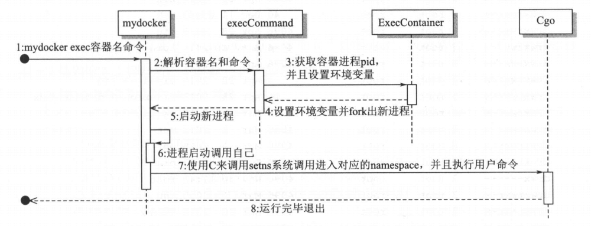

# 实现进入容器 Namespace

## 1. 概述

docker exec 功能实际就是把当前进程添加到指定容器的 namespace，这样就看起来像是进入到容器中了一样。

本节我们也实现一个自己的 mydocker exec 命令。


## 2. 基础知识

### setns

setns 是一个系统调用，可以根据提供的 PID 再次进入到指定的 Namespace中。它需要先打开`/proc/[pid/ns/`文件夹下对应的文件，然后使当前进程进入到指定的 Namespace 中。

系统调用描述非常简单，但是有一点对于 Go 来说很麻烦。因为对于 Mount Namespace 来说，一个具有多线程的进程是无法通过 setns 调用进入到的。

而 Go 每启动一个程序就会进入多线程状态，因此无法简简单单地在 Go 里面直接调用系统调用，使当前的进程进入对应的 MountNamespace。这里需要借助C 来实现这个功能。


### Cgo

Cgo 是一个很炫酷的功能，允许 Go 程序去调用 C 的函数与标准库。你只需要以一种特殊的方式在 Go 的源代码里写出需要调用的 C 的代码，Cgo 就可以把你的 C 源码文件和 Go 文件整合成一个包。

下面举一个最简单的例子，在这个例子中有两个函数一Random 和 Seed,在
它们里面调用了 C 的 random 和 srandom 函数。

```go
package main

/*
#include <stdlib.h>
*/
import "C"
import (
	"fmt"
)

func main() {
	Seed(123)
	// Output：Random:  128959393
	fmt.Println("Random: ", Random())
}

// Seed 初始化随机数产生器
func Seed(i int) {
	C.srandom(C.uint(i))
}

// Random 产生一个随机数
func Random() int {
	return int(C.random())
}
```


这段代码导入了一个叫 C 的包，但是你会发现在 Go 标准库里面并没有这个包，那是因为这根本就不是一个真正的包，而只是 Cgo 创建的一个特殊命名空间，用来与 C 的命名空间交流。

这两个函数都分别调用了 C 里面的 random 和 uint 函数，然后对它们进行了类型转换。这就实现了 G o代码里面调用 C 的功能。


## 3. 实现

### setns

加入对应的 Namespace 很简单，Linux提供了 [setns](https://man7.org/linux/man-pages/man2/setns.2.html) 系统调用给我们使用。

但是用 Go 来实现则存在一个致命问题：**setns 调用需要单线程上下文，而 GoRuntime 是多线程的**。

为了解决该问题，我们只能在 Go Runtime 启动之前，执行 setns 调用。

要实现这种提前调用，可以利用 cgo 的 constructor 技巧，该技巧能够在 Go Runtime 启动之前，执行一个任意的 C 函数。

> runC 中的  [nsenter ](https://github.com/opencontainers/runc/blob/v1.1.0/libcontainer/nsenter/nsenter.go)也是借助 cgo 实现的。

具体实现如下：

```go
package nsenter

/*
#include <errno.h>
#include <sched.h>
#include <stdio.h>
#include <stdlib.h>
#include <string.h>
#include <fcntl.h>

__attribute__((constructor)) void enter_namespace(void) {
   // 这里的代码会在Go运行时启动前执行，它会在单线程的C上下文中运行
	char *mydocker_pid;
	mydocker_pid = getenv("mydocker_pid");
	if (mydocker_pid) {
		// fprintf(stdout, "got mydocker_pid=%s\n", mydocker_pid);
	} else {
		// fprintf(stdout, "missing mydocker_pid env skip nsenter");
		// 如果没有指定PID就不需要继续执行，直接退出
		return;
	}
	char *mydocker_cmd;
	mydocker_cmd = getenv("mydocker_cmd");
	if (mydocker_cmd) {
		// fprintf(stdout, "got mydocker_cmd=%s\n", mydocker_cmd);
	} else {
		// fprintf(stdout, "missing mydocker_cmd env skip nsenter");
		// 如果没有指定命令也是直接退出
		return;
	}
	int i;
	char nspath[1024];
	// 需要进入的5种namespace
	char *namespaces[] = { "ipc", "uts", "net", "pid", "mnt" };

	for (i=0; i<5; i++) {
		// 拼接对应路径，类似于/proc/pid/ns/ipc这样
		sprintf(nspath, "/proc/%s/ns/%s", mydocker_pid, namespaces[i]);
		int fd = open(nspath, O_RDONLY);
		// 执行setns系统调用，进入对应namespace
		if (setns(fd, 0) == -1) {
			//fprintf(stderr, "setns on %s namespace failed: %s\n", namespaces[i], strerror(errno));
		} else {
			//fprintf(stdout, "setns on %s namespace succeeded\n", namespaces[i]);
		}
		close(fd);
	}
	// 在进入的Namespace中执行指定命令，然后退出
	int res = system(mydocker_cmd);
	exit(0);
	return;
}
*/
import "C"
```

可以看到，这段程序还是很怪异的，和普通的 Go 代码是不一样的。这里主要使用了构造函数，然后导入了 C 模块，一旦这个包被引用，它就会在所有 Go 运行的环境启动之前执行，这样就避免了 Go 多线程导致的无法进入 mnt Namespace 的问题。这段程序执行完毕后，Go 程序才会执行。

但是这会带来一个问题，就是只要这个包被导入，它就会在所有 Go 代码前执行，那么即使那些不需要使用 exec 这段代码的地方也会运行这段程序。

举例来说，使用 mydocker run 来创建容器，但是这段 C 代码依然会执行，这就会影响前面已经完成的功能。因此，在这段 C 代码前面一开始的位置就添加了环境变量检测，没有对应的环境变量时，就直接退出。对于不使用 exec 功能的 Go 代码，只要不设置对应的环境变量，这段 C 代码就不会运行，这样就不会影响原来的逻辑。

**注意：只有在你的 Go 应用程序中注册、导入了这个包，才会调用这个构造函数**。
就像这样：

```go
import (
	_ "mydocker/nsenter"
)
```


使用 cgo 我们无法直接获取传递给程序的参数，可用的做法是，通过 go exec 创建一个自身运行进程，然后通过传递环境变量的方式，传递给 cgo 参数值。

体现在 runc 中就是 `runc create → runc init` ，runc 中有很多细节，他通过环境变量传递 netlink fd，然后进行通信。

### execCommand

在 main_command.go 中增加一个 execCommand，具体如下：

```go
var execCommand = cli.Command{
	Name:  "exec",
	Usage: "exec a command into container",
	Action: func(context *cli.Context) error {
		// 如果环境变量存在，说明C代码已经运行过了，即setns系统调用已经执行了，这里就直接返回，避免重复执行
		if os.Getenv(EnvExecPid) != "" {
			log.Infof("pid callback pid %v", os.Getgid())
			return nil
		}
		// 格式：mydocker exec 容器名字 命令，因此至少会有两个参数
		if len(context.Args()) < 2 {
			return fmt.Errorf("missing container name or command")
		}
		containerName := context.Args().Get(0)
		// 将除了容器名之外的参数作为命令部分
		var commandArray []string
		for _, arg := range context.Args().Tail() {
			commandArray = append(commandArray, arg)
		}
		ExecContainer(containerName, commandArray)
		return nil
	},
}

```


然后添加到 main 函数中去：

```go
func main(){
    // 省略其他内容
	app.Commands = []cli.Command{
		initCommand,
		runCommand,
		commitCommand,
		listCommand,
		logCommand,
		execCommand,
    }
}
```

这里主要是将获取到的容器名和需要的命令处理完成后，交给下面的函数，下面看一下 ExecContainer 的实现。


### ExecContainer

```go
// nsenter里的C代码里已经出现mydocker_pid和mydocker_cmd这两个Key,主要是为了控制是否执行C代码里面的setns.
const (
	EnvExecPid = "mydocker_pid"
	EnvExecCmd = "mydocker_cmd"
)

func ExecContainer(containerName string, comArray []string) {
	// 根据传进来的容器名获取对应的PID
	pid, err := getContainerPidByName(containerName)
	if err != nil {
		log.Errorf("Exec container getContainerPidByName %s error %v", containerName, err)
		return
	}

	cmd := exec.Command("/proc/self/exe", "exec")
	cmd.Stdin = os.Stdin
	cmd.Stdout = os.Stdout
	cmd.Stderr = os.Stderr

	// 把命令拼接成字符串，便于传递
	cmdStr := strings.Join(comArray, " ")
	log.Infof("container pid：%s command：%s", pid, cmdStr)
	_ = os.Setenv(EnvExecPid, pid)
	_ = os.Setenv(EnvExecCmd, cmdStr)

	if err = cmd.Run(); err != nil {
		log.Errorf("Exec container %s error %v", containerName, err)
	}
}

func getContainerPidByName(containerName string) (string, error) {
	// 拼接出记录容器信息的文件路径
	dirURL := fmt.Sprintf(container.InfoLocFormat, containerName)
	configFilePath := dirURL + container.ConfigName
	// 读取内容并解析
	contentBytes, err := ioutil.ReadFile(configFilePath)
	if err != nil {
		return "", err
	}
	var containerInfo container.Info
	if err = json.Unmarshal(contentBytes, &containerInfo); err != nil {
		return "", err
	}
	return containerInfo.Pid, nil
}

```

exec 命令简单的 fork 出了一个进程，然后把这个进程的标准输入输出都绑定到宿主机上。

最关键的是设置环境变量的这两句：

```go
	_ = os.Setenv(EnvExecPid, pid)
	_ = os.Setenv(EnvExecCmd, cmdStr)
```

设置了这两个环境变量，于是前面的 nsenter 部分的 C 代码就会执行 setns 命令，从而进入到指定的 Namespace 中进行操作了。

而执行其他命令时，由于没有指定这两个环境变量，因此那段 C 代码不会执行到 setns 这里。

> 这时应该就可以明白前面一段 C 代码的意义了 。

```c
mydocker_pid = getenv("mydocker_pid");
if (mydocker_pid) {
    // fprintf(stdout, "got mydocker_pid=%s\n", mydocker_pid);
} else {
    // 如果没有指定PID就不需要继续执行，直接退出
    return;
}
```

 执行 exec 命令就会设置这两个环境变量，那么问题来了，执行 exec 之后环境变量就已经存在了，C代码也运行了，那么再次执行 exec 命令岂不是会重复执行 setns 系统调用？

为了避免重复执行，在 execCommand 中加了如下判断：如果对应环境变量已经存在了就直接返回，啥也不执行。

> 因为环境变量存在就代表着C代码执行了，即setns系统调用执行了，也就是当前已经在这个 namespace 里了。

```go
var execCommand = cli.Command{
	Name:  "exec",
	Usage: "exec a command into container",
	Action: func(context *cli.Context) error {
		// 如果环境变量存在，说明C代码已经运行过了，即setns系统调用已经执行了，这里就直接返回，避免重复执行
		if os.Getenv(EnvExecPid) != "" {
			log.Infof("pid callback pid %v", os.Getgid())
			return nil
		}
		// 省略其他内容
	},
}
```


### 流程图




## 4. 测试

首先创建一个 detach 容器：

```shell
$ go build .
$ sudo ./mydocker run -d --name bird to
```

查看运行中的容器：

```shell
$ sudo ./mydocker ps
ID           NAME        PID         STATUS      COMMAND     CREATED
8672683704   bird        15684       running     top         2022-02-23 19:17:07
```

然后执行 exec 进入该容器

```shell
$ sudo ./mydocker exec bird sh
{"level":"info","msg":"container pid：21009 command：sh","time":"2022-02-23T19:24:58+08:00"}
/ # ps -ef
PID   USER     TIME  COMMAND
    1 root      0:00 top
    7 root      0:00 sh
    8 root      0:00 ps -ef
```

在容器内部执行 ps -ef 可以发现 PID 为 1 的进程为 top,这也就意味着已经成功进入到了容器内部。

说明我们的 mydocker exec 命令实现是成功了。