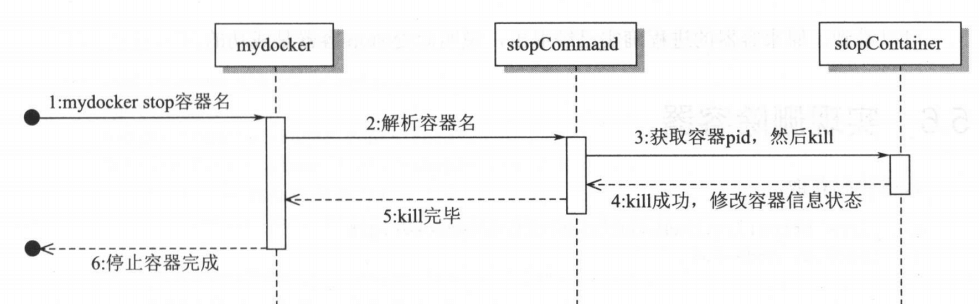

# 实现停止容器

## 1. 概述

之前实现了 detach 容器，让容器能够后台运行，但是没有实现停止功能，导致无法停止后台运行的容器。

其实，stop 容器的原理很简单，主要就是查找到它的主进程 PID,然后发送 SIGTERM 信号，等待进程结束就好。


## 2. 实现

### stopCommand

首先在 main_command.go 中增加 stopCommand：

```go
var stopCommand = cli.Command{
	Name:  "stop",
	Usage: "stop a container",
	Action: func(context *cli.Context) error {
		// 期望输入是：mydocker stop 容器名，如果没有指定参数直接打印错误
		if len(context.Args()) < 1 {
			return fmt.Errorf("missing container name")
		}
		containerName := context.Args().Get(0)
		stopContainer(containerName)
		return nil
	},
}
```

然后在 main 函数中加入该命令：

```go
func main(){
    // 省略其他内容
	app.Commands = []cli.Command{
		initCommand,
		runCommand,
		commitCommand,
		listCommand,
		logCommand,
		execCommand,
		stopCommand,
	}
}
```


### stopContainer

具体实现很简单，就是根据之前记录的容器信息查询到对应 PID，然后发送 SIGTERM 信号，最后更新状态并写回记录容器信息的文件。

```go
func stopContainer(containerName string) {
	// 1. 根据容器名称获取对应 PID
	containerInfo, err := getContainerInfoByName(containerName)
	if err != nil {
		log.Errorf("Get container %s info error %v", containerName, err)
		return
	}
	pidInt, err := strconv.Atoi(containerInfo.Pid)
	if err != nil {
		log.Errorf("Conver pid from string to int error %v", err)
		return
	}
	// 2.发送SIGTERM信号
	if err = syscall.Kill(pidInt, syscall.SIGTERM); err != nil {
		log.Errorf("Stop container %s error %v", containerName, err)
		return
	}
	// 3.修改容器信息，将容器置为STOP状态，并清空PID
	containerInfo.Status = container.STOP
	containerInfo.Pid = " "
	newContentBytes, err := json.Marshal(containerInfo)
	if err != nil {
		log.Errorf("Json marshal %s error %v", containerName, err)
		return
	}
	// 4.重新写回存储容器信息的文件
	dirURL := fmt.Sprintf(container.InfoLocFormat, containerName)
	configFilePath := dirURL + container.ConfigName
	if err := ioutil.WriteFile(configFilePath, newContentBytes, constant.Perm0622); err != nil {
		log.Errorf("Write file %s error:%v", configFilePath, err)
	}
}

func getContainerInfoByName(containerName string) (*container.Info, error) {
	dirURL := fmt.Sprintf(container.InfoLocFormat, containerName)
	configFilePath := dirURL + container.ConfigName
	contentBytes, err := ioutil.ReadFile(configFilePath)
	if err != nil {
		return nil, errors.Wrapf(err, "read file %s", configFilePath)
	}
	var containerInfo container.Info
	if err = json.Unmarshal(contentBytes, &containerInfo); err != nil {
		return nil, err
	}
	return &containerInfo, nil
}
```


### 流程图




## 3. 测试

创建一个 detach 容器：

```shell
$ go build .
$ sudo ./mydocker run -d --name bird top
```

查询一下 PID

```shell
$ ps -ef|grep top
root     30967 15446  0 21:24 pts/2    00:00:00 top
lixd     31013 15447  0 21:24 pts/2    00:00:00 grep --color=auto --exclude-dir=.bzr --exclude-dir=CVS --exclude-dir=.git --exclude-dir=.hg --exclude-dir=.svn --exclude-dir=.idea --exclude-dir=.tox top
```

然后 stop 容器

```shell
$ sudo ./mydocker stop bird
```

通过 mydocker ps 命令查看一下

```shell
$ sudo ./mydocker ps
ID           NAME        PID         STATUS      COMMAND     CREATED
0545302772   bird                   stopped     top         2022-02-23 21:23:56
```

可以看到，状态变成了 stopped，并且 PID 一栏也是空的。


最后执行 ps 查看一下是不是真的停掉了

```shell
$ ps -ef|grep top
lixd     31013 15447  0 21:24 pts/2    00:00:00 grep --color=auto --exclude-dir=.bzr --exclude-dir=CVS --exclude-dir=.git --exclude-dir=.hg --exclude-dir=.svn --exclude-dir=.idea --exclude-dir=.tox top
```

可以看到，原来容器的进程已经退出了，说明 stop 是成功的。
