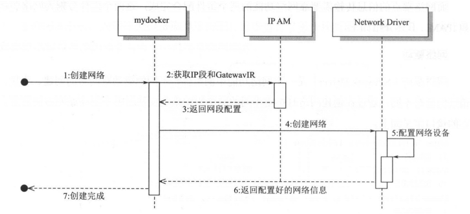
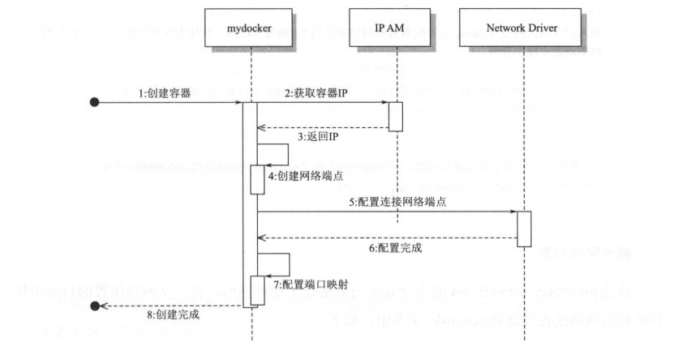
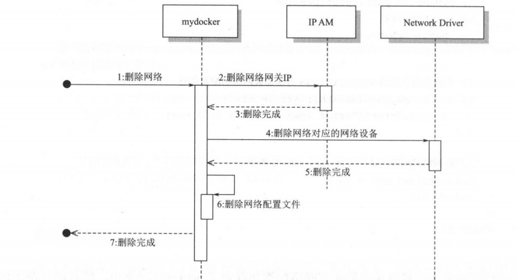

# 构建容器网络模型

## 1. 概述

在上一节中，通过 Linux 的网络虚拟化技术构建了一个网络，连接了容器的网络
Namespace 和宿主机网络，其中做了命名空间创建、设备创建、地址分配、挂载设备和地址转换配置等操作，本节会将这些操作抽象出网络的模型以便于用代码实现上面一系列流程。


## 2. 模型

首先，需要抽象出容器网络的两个对象：网络和网络端点。

### 网络

网络是容器的一个集合，在这个网络上的容器可以通过这个网络互相通信，就像挂载到同一个 Linux Bridge 设备上的网络设备一样， 可以直接通过 Bridge 设备实现网络互连;连接到同一个网络中的容器也可以通过这个网络和网络中别的容器互连。网络中会包括这个网络相关的配置，比如网络的容器地址段、网络操作所调用的网络驱动等信息。

```go
type Network struct {
	Name    string     // 网络名
	IPRange *net.IPNet // 地址段
	Driver  string     // 网络驱动名
}
```


### 网络端点

网络端点是用于连接容器与网络的，保证容器内部与网络的通信。像上一节中用到的 Veth 设备，一端挂载到容器内部，另一端挂载到 Bridge 上，就能使得容器和网络的通信。

网络端点中会包括连接到网络的一些信息，比如地址、Veth 设备、端口映射、连接的容器和网络等信息。

```go
type Endpoint struct {
	ID          string           `json:"id"`
	Device      netlink.Veth     `json:"dev"`
	IPAddress   net.IP           `json:"ip"`
	MacAddress  net.HardwareAddr `json:"mac"`
	Network     *Network
	PortMapping []string
}
```


### 网络驱动

网络驱动(Network Driver) 是一个网络功能中的组件，不同的驱动对网络的创建、连接、销毁的策略不同，通过在创建网络时指定不同的网络驱动来定义使用哪个驱动做网络的配置。

它的接口定义如下：

```go
type Driver interface {
	Name() string
	Create(subnet string, name string) (*Network, error)
	Delete(network Network) error
	Connect(network *Network, endpoint *Endpoint) error
	Disconnect(network Network, endpoint *Endpoint) error
}
```


### IPAM

IPAM(IP Address Management) 也是网络功能中的一个组件，用于网络 IP 地址的分配和释放，包括容器的IP地址和网络网关的IP地址，它的主要功能如下。

* IPAM.Allocate(subnet *net.IPNet) 从指定的 subnet 网段中分配 IP 地址
* IPAM.Release(subnet net.IPNet, ipaddr net.IP) 从指定的 subnet 网段中释放掉指定的 IP 地址。


## 3. 调用关系

### 创建网络

通过`mydocker network create`命令创建一个容器网络：

```shell
mydocker network create --subset 192.168.0.0/24 --deive bridge testbr
```

通过 Bridge 网络驱动创建一个网络，网段是 192.168.0.0/24。

具体流程如下图所示：



在调用命令创建网络时，先通过 IPAM 获取网络的网关 IP,然后再调用网络驱动去设置网络的信息，比如 Bridge 的驱动将会创建 Linux Bridge 网络设备和相应的
iptables规则，最终将网络的信息返回给调用者。

上图中的 IPAM 和 Network Driver 是两个组件，IPAM 负责通过传入的IP网段去分配一个可用的 IP 地址给容器和网络的网关，比如网络的网段是 192.168.0.0/16， 那么通过 IPAM 获取这个网段的容器地址就是在这个网段中的一个 IP 地址，然后用于分配给容器的连接端点，保证网络中的容器 IP 不会冲突。

而 Network Driver 是用于网络的管理的，例如在创建网络时完成网络初始化动作及在容器启动时完成网络端点配置。像 Bridge 的驱动对应的动作就是创建 Linux Bridge 和挂载 Veth 设备。


### 创建容器并连接网络

通过创建容器时指定`-net` 参数，指定容器启动时连接的网络。

```shell
mydocker run -it -p 80:80 --net testbridgenet xxxx
```

这样创建出的容器便可以通过 testbridgenet 这个网络与网络中的其他容器进行通信了。

具体流程图如下：



在调用创建容器时指定网络，首先会调用IPAM,通过网络中定义的网段找到未分配的 IP 分配给容器，然后创建容器的网络端点，并调用这个网络的网络驱动连接网络与网络端点，最终完成网络端点的连接和配置。比如在 Bridge 驱动中就会将Veth 设备挂载到 Linux Bridge 网桥上。

```go
func Connect(networkName string, info *container.Info) error {
	// 从networks字典中取到容器连接的网络的信息，networks字典中保存了当前己经创建的网络
	network, ok := networks[networkName]
	if !ok {
		return fmt.Errorf("no Such Network: %s", networkName)
	}

	// 分配容器IP地址
	ip, err := ipAllocator.Allocate(network.IpRange)
	if err != nil {
		return err
	}

	// 创建网络端点
	ep := &Endpoint{
		ID:          fmt.Sprintf("%s-%s", cinfo.Id, networkName),
		IPAddress:   ip,
		Network:     network,
		PortMapping: info.PortMapping,
	}
	// 调用网络驱动挂载和配置网络端点
	if err = drivers[network.Driver].Connect(network, ep); err != nil {
		return err
	}
	// 到容器的namespace配置容器网络设备IP地址
	if err = configEndpointIpAddressAndRoute(ep, info); err != nil {
		return err
	}

	return configPortMapping(ep, info)
}
```


### 展示网络列表

通过 `mydocker network list`命令显示当前创建了哪些网络。

首先从网络配置的目录中加载所有的网络配置信息到 networks 字典中，如下：

```go
func Init() error {
	// 加载网络驱动
	var bridgeDriver = BridgeNetworkDriver{}
	drivers[bridgeDriver.Name()] = &bridgeDriver
	// 文件不存在则创建
	if _, err := os.Stat(defaultNetworkPath); err != nil {
		if !os.IsNotExist(err) {
			return err
		}
		if err = os.MkdirAll(defaultNetworkPath, constant.Perm0644); err != nil {
			return err
		}
	}
	// 检查网络配置目录中的所有文件,并执行第二个参数中的函数指针去处理目录下的每一个文件
	err := filepath.Walk(defaultNetworkPath, func(nwPath string, info os.FileInfo, err error) error {
		// 如果是目录则跳过
		if info.IsDir() {
			return nil
		}
		// if strings.HasSuffix(nwPath, "/") {
		// 	return nil
		// }
		//  加载文件名作为网络名
		_, nwName := path.Split(nwPath)
		nw := &Network{
			Name: nwName,
		}
		// 调用前面介绍的 Network.load 方法加载网络的配置信息
		if err = nw.load(nwPath); err != nil {
			logrus.Errorf("error load network: %s", err)
		}
		// 将网络的配置信息加入到 networks 字典中
		networks[nwName] = nw
		return nil
	})
	return err
}
```

上面己经把网络配置目录中的所有网络配置加载到了 networks 典中， 然后通过遍历这个字典来展示创建的网络，如下：

```go
func ListNetwork() {
	// 通过tabwriter库把信息打印到屏幕上
	w := tabwriter.NewWriter(os.Stdout, 12, 1, 3, ' ', 0)
	fmt.Fprint(w, "NAME\tIpRange\tDriver\n")
	for _, nw := range networks {
		fmt.Fprintf(w, "%s\t%s\t%s\n",
			nw.Name,
			nw.IPRange.String(),
			nw.Driver,
		)
	}
	if err := w.Flush(); err != nil {
		logrus.Errorf("Flush error %v", err)
		return
	}
}
```


### 删除网络

通过使用命令 `mydocker network remove`命令删除己经创建的网络。

具体流程如下图：




* 1）先调用 IPAM 去释放网络所占用的网关 IP
* 2）然后调用网络驱动去删除该网络创建的一些设备与配置
* 3）最终从网络配置目录中删除网络对应的配置文


```go
func DeleteNetwork(networkName string) error {
	// 网络不存在直接返回一个error
	nw, ok := networks[networkName]
	if !ok {
		return fmt.Errorf("no Such Network: %s", networkName)
	}
	// 调用IPAM的实例ipAllocator释放网络网关的IP
	if err := ipAllocator.Release(nw.IpRange, &nw.IpRange.IP); err != nil {
		return errors.Wrap(err, "remove Network gateway ip failed")
	}
	// 调用网络驱动删除网络创建的设备与配置 后面会以 Bridge 驱动删除网络为例子介绍如何实现网络驱动删除网络
	if err := drivers[nw.Driver].Delete(*nw); err != nil {
		return errors.Wrap(err, "remove Network DriverError failed")
	}
	// 最后从网络的配直目录中删除该网络对应的配置文件
	return nw.remove(defaultNetworkPath)
}

```

其中 network remove 会从网络配置目录中删除网络的配置文件。

```go
func (nw *Network) remove(dumpPath string) error {
	// 检查网络对应的配置文件状态，如果文件己经不存在就直接返回
	fullPath := path.Join(dumpPath, nw.Name)
	if _, err := os.Stat(fullPath); err != nil {
		if !os.IsNotExist(err) {
			return err
		}
		return nil
	}
	// 否则删除这个网络对应的配置文件
	return os.Remove(fullPath)
}
```

