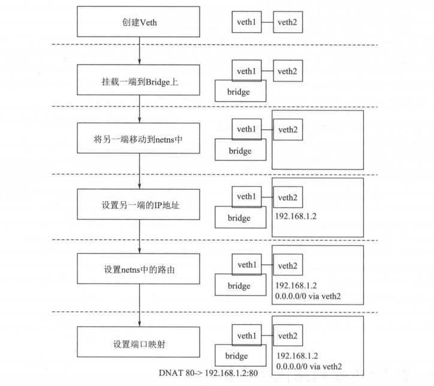

# 在Bridge网络创建容器

## 1. 概述

在这一节中会通过挂载容器端点实现容器的互相通信以及容器外部通信。

最终实现通过`mydocker run -p 80:80 -net testbridge xxx`命令x 命令使容器加入网络及端口映射。


## 2. 实现

### 挂载容器端

#### 流程

之前曾手动配置过容器的网络和容器的端点，先来回忆 下需要哪些步骤，



> 图中的 netns 是 Net Namespace 的缩写。

从上图所示的流程中可以看到，在容器的 Net Namespace 中，就可以通过容器
的 Veth 直接与挂载在同一个 Bridge 上的容器通信，以及通过 Bridge 上创建的iptables 的 MASQUERADE 规则访问外部网络，同时，外部也可以通过机器上的端口经过 iptables 的 DNAT 的转发访问容器内部。


#### 代码实现

那么，下面就用代码来实现上面这些流程，给容器“插上网线”。

```go
// Connect 连接容器到之前创建的网络 mydocker run -net testnet -p 8080:80 xxxx
func Connect(networkName string, info *container.Info) error {
	// 从networks字典中取到容器连接的网络的信息，networks字典中保存了当前己经创建的网络
	network, ok := networks[networkName]
	if !ok {
		return fmt.Errorf("no Such Network: %s", networkName)
	}

	// 分配容器IP地址
	ip, err := ipAllocator.Allocate(network.IPRange)
	if err != nil {
		return errors.Wrapf(err, "allocate ip")
	}

	// 创建网络端点
	ep := &Endpoint{
		ID:          fmt.Sprintf("%s-%s", info.Id, networkName),
		IPAddress:   ip,
		Network:     network,
		PortMapping: info.PortMapping,
	}
	// 调用网络驱动挂载和配置网络端点
	if err = drivers[network.Driver].Connect(network, ep); err != nil {
		return err
	}
	// 到容器的namespace配置容器网络设备IP地址
	if err = configEndpointIpAddressAndRoute(ep, info); err != nil {
		return err
	}
	// 配置端口映射信息，例如 mydocker run -p 8080:80
	return configPortMapping(ep, info)
}
```


### 连接容器网络端点到 Linux Bridge 

就像之前手动配置容器网络那样， Bridge 网络驱动会首先创建 Veth ，并将一端挂载到网络对应的 Linux Bridge ，这样另外一端网络上的包就会通过 Linux Bridge 通信。这样就实现了容器网络端点的创建和挂载，代码如下

```go
// Connect 连接一个网络和网络端点
func (d *BridgeNetworkDriver) Connect(network *Network, endpoint *Endpoint) error {
	bridgeName := network.Name
	// 通过接口名获取到 Linux Bridge 接口的对象和接口属性
	br, err := netlink.LinkByName(bridgeName)
	if err != nil {
		return err
	}
	// 创建 Veth 接口的配置
	la := netlink.NewLinkAttrs()
	// 由于 Linux 接口名的限制,取 endpointID 的前
	la.Name = endpoint.ID[:5]
	// 通过设置 Veth 接口 master 属性，设置这个Veth的一端挂载到网络对应的 Linux Bridge
	la.MasterIndex = br.Attrs().Index
	// 创建 Veth 对象，通过 PeerNarne 配置 Veth 另外 端的接口名
	// 配置 Veth 另外 端的名字 cif {endpoint ID 的前 位｝
	endpoint.Device = netlink.Veth{
		LinkAttrs: la,
		PeerName:  "cif-" + endpoint.ID[:5],
	}
	// 调用netlink的LinkAdd方法创建出这个Veth接口
	// 因为上面指定了link的MasterIndex是网络对应的Linux Bridge
	// 所以Veth的一端就已经挂载到了网络对应的LinuxBridge.上
	if err = netlink.LinkAdd(&endpoint.Device); err != nil {
		return fmt.Errorf("error Add Endpoint Device: %v", err)
	}
	// 调用netlink的LinkSetUp方法，设置Veth启动
	// 相当于ip link set xxx up命令
	if err = netlink.LinkSetUp(&endpoint.Device); err != nil {
		return fmt.Errorf("error Add Endpoint Device: %v", err)
	}
	return nil
}
```

通过调用 Bridge 驱动中的 Connect 方法，容器的网络端点已经挂载到了 Bridge 网络的 Linux Bridge上。那么，下一步就是配置网络端 点的另外一端，即容器的 Net Namespace 那一端。


### 配置容器 Namespace 中的网络设备及路由

容器有自己独立的 NetNamespace,需要将网络端点的 Veth 设备的另外一端移到这个Net Namespace 中并配置，才能给这个容器“插上网线”，下面将配置网络端点的地址和路由。

```go
// configEndpointIpAddressAndRoute 配置容器网络端点的地址和路由
func configEndpointIpAddressAndRoute(ep *Endpoint, info *container.Info) error {
	// 根据名字找到对应Veth设备
	peerLink, err := netlink.LinkByName(ep.Device.PeerName)
	if err != nil {
		return fmt.Errorf("fail config endpoint: %v", err)
	}
	// 将容器的网络端点加入到容器的网络空间中
	// 并使这个函数下面的操作都在这个网络空间中进行
	// 执行完函数后，恢复为默认的网络空间，具体实现下面再做介绍

	defer enterContainerNetNS(&peerLink, info)()
	// 获取到容器的IP地址及网段，用于配置容器内部接口地址
	// 比如容器IP是192.168.1.2， 而网络的网段是192.168.1.0/24
	// 那么这里产出的IP字符串就是192.168.1.2/24，用于容器内Veth端点配置

	interfaceIP := *ep.Network.IPRange
	interfaceIP.IP = ep.IPAddress
	// 设置容器内Veth端点的IP
	if err = setInterfaceIP(ep.Device.PeerName, interfaceIP.String()); err != nil {
		return fmt.Errorf("%v,%s", ep.Network, err)
	}
	// 启动容器内的Veth端点
	if err = setInterfaceUP(ep.Device.PeerName); err != nil {
		return err
	}
	// Net Namespace 中默认本地地址 127 的勺。”网卡是关闭状态的
	// 启动它以保证容器访问自己的请求
	if err = setInterfaceUP("lo"); err != nil {
		return err
	}
	// 设置容器内的外部请求都通过容器内的Veth端点访问
	// 0.0.0.0/0的网段，表示所有的IP地址段
	_, cidr, _ := net.ParseCIDR("0.0.0.0/0")
	// 构建要添加的路由数据，包括网络设备、网关IP及目的网段
	// 相当于route add -net 0.0.0.0/0 gw (Bridge网桥地址) dev （容器内的Veth端点设备)

	defaultRoute := &netlink.Route{
		LinkIndex: peerLink.Attrs().Index,
		Gw:        ep.Network.IPRange.IP,
		Dst:       cidr,
	}
	// 调用netlink的RouteAdd,添加路由到容器的网络空间
	// RouteAdd 函数相当于route add 命令
	if err = netlink.RouteAdd(defaultRoute); err != nil {
		return err
	}

	return nil
}
```


### 进入容器 Net Namespace

上面调用了 enterContainerNetns 的函数，使容器网络端点的 Veth 容器端，以及后续的配置都在容器的 Net Namespace 中执行。这是如何做到的呢?下面来看一下实现。

```go
func enterContainerNetNS(enLink *netlink.Link, info *container.Info) func() {
	// 找到容器的Net Namespace
	// /proc/[pid]/ns/net 打开这个文件的文件描述符就可以来操作Net Namespace
	// 而ContainerInfo中的PID,即容器在宿主机上映射的进程ID
	// 它对应的/proc/[pid]/ns/net就是容器内部的Net Namespace
	f, err := os.OpenFile(fmt.Sprintf("/proc/%s/ns/net", info.Pid), os.O_RDONLY, 0)
	if err != nil {
		logrus.Errorf("error get container net namespace, %v", err)
	}

	nsFD := f.Fd()
	// 锁定当前程序所执行的线程，如果不锁定操作系统线程的话
	// Go语言的goroutine可能会被调度到别的线程上去
	// 就不能保证一直在所需要的网络空间中了
	// 所以先调用runtime.LockOSThread()锁定当前程序执行的线程
	runtime.LockOSThread()

	// 修改网络端点Veth的另外一端，将其移动到容器的Net Namespace 中
	if err = netlink.LinkSetNsFd(*enLink, int(nsFD)); err != nil {
		logrus.Errorf("error set link netns , %v", err)
	}

	// 获取当前的网络namespace
	origns, err := netns.Get()
	if err != nil {
		logrus.Errorf("error get current netns, %v", err)
	}

	// 调用 netns.Set方法，将当前进程加入容器的Net Namespace
	if err = netns.Set(netns.NsHandle(nsFD)); err != nil {
		logrus.Errorf("error set netns, %v", err)
	}
	// 返回之前Net Namespace的函数
	// 在容器的网络空间中执行完容器配置之后调用此函数就可以将程序恢复到原生的Net Namespace
	return func() {
		// 恢复到上面获取到的之前的 Net Namespace
		netns.Set(origns)
		origns.Close()
		// 取消对当附程序的线程锁定
		runtime.UnlockOSThread()
		f.Close()
	}
}
```

以上即是如何使当前程序的执行环境进入到容器的 NetNamespace 用于配置容器地
址和路由等的操作。

当要进入容器的 Net Namespace时，只需要调用 defer enterContainerNetns(&peerLink,cinfo),则在当前函数体结束之前都会在容器的NetNamespace中。在调用 enterContainerNetns(&peerLink, cinfo) 时会使当前执行的函数进入容器的Net Namespace,而用了 defer 关键字后会在函数体结束时执行返回的恢复函数指针，并会在函数结束后恢复到之前所在的网络空间。

需要注意的是这里用的是：

```go
defer enterContainerNetNS(&peerLink, info)()
```

而不是

```go
defer enterContainerNetNS(&peerLink, info)
```


### 配置宿主机到容器的端口映射

现在的容器己经有了自己的网络空间和地址，但是这个地址是访问不到宿主机外部的，所以需要将容器的地址映射到宿主机上。

可以通过 iptables 的 DNAT 规则来实现宿主机上的请求转发到容器上。

```go
func configPortMapping(ep *Endpoint) error {
	var err error
	// 遍历容器端口映射列表
	for _, pm := range ep.PortMapping {
		// 分割成宿主机的端口和容器的端口
		portMapping := strings.Split(pm, ":")
		if len(portMapping) != 2 {
			logrus.Errorf("port mapping format error, %v", pm)
			continue
		}
		// 由于iptables没有Go语言版本的实现，所以采用exec.Command的方式直接调用命令配置
		// 在iptables的PREROUTING中添加DNAT规则
		// 将宿主机的端口请求转发到容器的地址和端口上
		iptablesCmd := fmt.Sprintf("-t nat -A PREROUTING -p tcp -m tcp --dport %s -j DNAT --to-destination %s:%s",
			portMapping[0], ep.IPAddress.String(), portMapping[1])
		cmd := exec.Command("iptables", strings.Split(iptablesCmd, " ")...)
		// 执行iptables命令,添加端口映射转发规则
		output, err := cmd.Output()
		if err != nil {
			logrus.Errorf("iptables Output, %v", output)
			continue
		}
	}
	return err
}
```


## 3. 测试

 首先，创建一个网络，用于让容器挂载。

```shell
$ sudo ./mydocker network create --driver bridge --subnet 192.168.10.1/24 testbridge
```

### 容器与容器互联

分别在创建网络上启动两个容器，并拿到第-一个容器的IP,在第二个容器中去访问。

```shell
$ sudo ./mydocker run -it -net testbridge busybox sh
```

查看容器1的IP地址：

```shell
/ # ip addr
1: lo: <LOOPBACK,UP,LOWER_UP> mtu 65536 qdisc noqueue qlen 1000
    link/loopback 00:00:00:00:00:00 brd 00:00:00:00:00:00
    inet 127.0.0.1/8 scope host lo
       valid_lft forever preferred_lft forever
    inet6 ::1/128 scope host
       valid_lft forever preferred_lft forever
2: tunl0@NONE: <NOARP> mtu 1480 qdisc noop qlen 1000
    link/ipip 0.0.0.0 brd 0.0.0.0
3: sit0@NONE: <NOARP> mtu 1480 qdisc noop qlen 1000
    link/sit 0.0.0.0 brd 0.0.0.0
9: cif-40100@if10: <BROADCAST,MULTICAST,UP,LOWER_UP,M-DOWN> mtu 1500 qdisc noqueue qlen 1000
    link/ether 72:ba:c6:44:99:67 brd ff:ff:ff:ff:ff:ff
    inet 192.168.10.2/24 brd 192.168.10.255 scope global cif-40100
       valid_lft forever preferred_lft forever
    inet6 fe80::70ba:c6ff:fe44:9967/64 scope link
       valid_lft forever preferred_lft forever
/ #
```

可以看到，地址是，192.168.10.2。

然后去另一个容器中尝试连接这个地址。

```shell
/ # ip addr
1: lo: <LOOPBACK,UP,LOWER_UP> mtu 65536 qdisc noqueue qlen 1000
    link/loopback 00:00:00:00:00:00 brd 00:00:00:00:00:00
    inet 127.0.0.1/8 scope host lo
       valid_lft forever preferred_lft forever
    inet6 ::1/128 scope host
       valid_lft forever preferred_lft forever
2: tunl0@NONE: <NOARP> mtu 1480 qdisc noop qlen 1000
    link/ipip 0.0.0.0 brd 0.0.0.0
3: sit0@NONE: <NOARP> mtu 1480 qdisc noop qlen 1000
    link/sit 0.0.0.0 brd 0.0.0.0
11: cif-20338@if12: <BROADCAST,MULTICAST,UP,LOWER_UP,M-DOWN> mtu 1500 qdisc noqueue qlen 1000
    link/ether ea:e5:5c:92:02:12 brd ff:ff:ff:ff:ff:ff
    inet 192.168.10.3/24 brd 192.168.10.255 scope global cif-20338
       valid_lft forever preferred_lft forever
    inet6 fe80::e8e5:5cff:fe92:212/64 scope link
       valid_lft forever preferred_lft forever
```

另一个容器地址是 192.168.10.3。

ping 以下看看

```shell
/ # ping 192.168.10.2
PING 192.168.10.2 (192.168.10.2): 56 data bytes
64 bytes from 192.168.10.2: seq=0 ttl=64 time=0.662 ms
64 bytes from 192.168.10.2: seq=1 ttl=64 time=0.050 ms
^C
--- 192.168.10.2 ping statistics ---
2 packets transmitted, 2 packets received, 0% packet loss
round-trip min/avg/max = 0.050/0.356/0.662 ms
```

由以上结果可以看到，两个容器可以通过这个网络互相连通。


### 容器访问外部网络

由于容器中默认没有配置 DNS 服务器 所以先来配置 DNS 服务器

```shell
$ echo "nameserver 114.114.114.114" > /etc/resolv.conf
$ ping www.baidu.com
```

能 ping 通则说明可以访问外部网络。


### 容器映射端口到宿主机上供外部访问

通过 mydocker run -p 80:80 的方式将容器中的 80 端口映射到宿主机上


```shell
$ sudo ./mydocker run -it -p 80:80 -net testbridge busybox sh
# 容器中使用nc命令监听 80 端口
/ # nc -lp 80
```

然后访问宿主机的 80 端口，看是否能转发到容器中。

```shell
$ telnet 127.0.0.1 80
```

能连上则说明是可以的。


## 4. 总结

在这一章中，首先手动给一个容器配置了网路，并通过这个过程了解了 Linux 虚拟网络设备和操作。然后构建了容器网络的概念模型和模块调用关系、IP 地址分配方案，以及网络模块的接口设计和实现，并且通过实现 Bridge 驱动给容器连上了“网线”。
