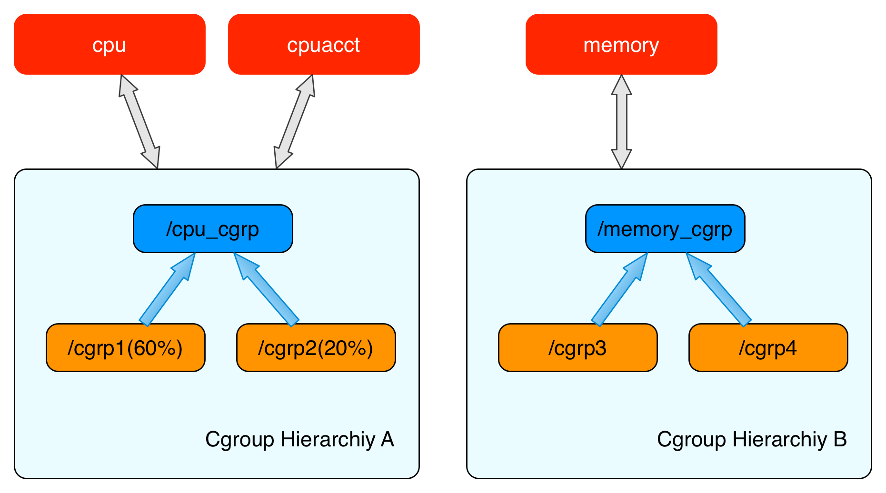
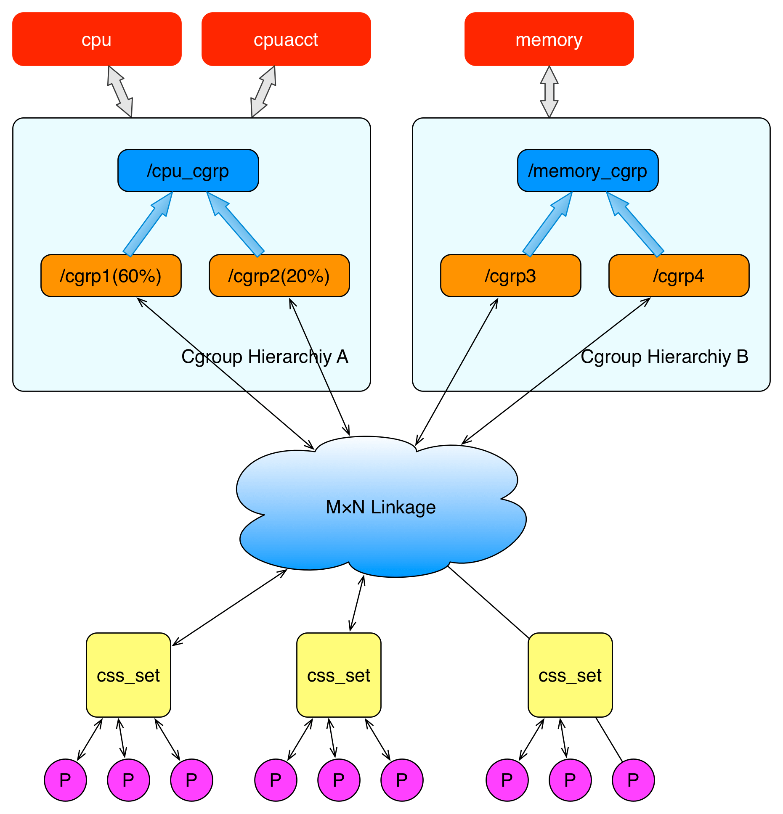

## Linux Cgroups

> 注：本文所有操作在 Ubuntu20.04 下进行。

 

## 1. 什么是 Cgroups

**Cgroups 是 Linux 下的一种将进程按组进行管理的机制，它提供了对一组进程及将来子进程的资源限制控制和统计的能力**。

这些资源包括 CPU、内存、存储、网络等。通过 Cgroups 可以方便地限制某个进程的资源占用，并且可以实时地监控进程的监控与统计信息

Cgroups 分 [v1](https://link.segmentfault.com/?enc=fmG2KlYIlmuPBWA%2BS75wdQ%3D%3D.98u3vavuU%2BB9DEpQfRyd9dBOX7nXmAirC5p02OOH5gqaHj%2BAFOLBgIzzO8UNOveGi7RLa9syda8SekeDfxxK2A%3D%3D) 和 [v2](https://link.segmentfault.com/?enc=uvlqJXHQ79GOOcGOajMwiA%3D%3D.MUeSO3oJAwWsJJbGizZtlyik3Fo%2FvfFBhlMmlgMWOJzxMpqEOk0jKouI9uzphxeOQlBe8SxWfMMvityCERbxGw%3D%3D) 两个版本，v1实现较早，功能比较多，但是由于它里面的功能都是零零散散的实现的，所以规划的不是很好，导致了一些使用和维护上的不便，v2的出现就是为了解决v1中这方面的问题，在最新的4.5内核中，Cgroups v2 声称已经可以用于生产环境了，但它所支持的功能还很有限，随着v2一起引入内核的还有cgroup namespace。

> v1和v2可以混合使用，但是这样会更复杂，所以一般没人会这样用。


### 1. 三部分组件

cgroup主要包括下面几部分：

* **cgroups本身**：cgroup 是对进程分组管理的一种机制，一个 cgroup 包含一组进程，并可以在这个 cgroup上增加 Linux subsystem 的各种参数配置，将一组进程和一组 subsystem 的系统参数关联起来。

- **subsystem**： 一个 subsystem 就是一个内核模块，他被关联到一颗cgroup 树之后，就会在树的每个节点（进程组）上做具体的操作。subsystem 经常被称作"resource controller"，因为它主要被用来调度或者限制每个进程组的资源，但是这个说法不完全准确，因为有时我们将进程分组只是为了做一些监控，观察一下他们的状态，比如 perf_event subsystem。到目前为止，Linux 支持 12种 subsystem，比如限制 CPU 的使用时间，限制使用的内存，统计 CPU 的使用情况，冻结和恢复一组进程等，后续会对它们一一进行介绍。
- **hierarchy**：一个 hierarchy 可以理解为一棵 cgroup 树，树的每个节点就是一个进程组，每棵树都会与零到多个 subsystem 关联。在一颗树里面，会包含 Linux 系统中的所有进程，但每个进程只能属于一个节点（进程组）。系统中可以有很多颗 cgroup 树，每棵树都和不同的 subsystem 关联，一个进程可以属于多颗树，即一个进程可以属于多个进程组，只是这些进程组和不同的 subsystem 关联。目前 Linux 支持 12种 subsystem，如果不考虑不与任何 subsystem关联的情况（systemd 就属于这种情况），Linux 里面最多可以建12颗cgroup树，每棵树关联一个 subsystem，当然也可以只建一棵树，然后让这棵树关联所有的 subsystem。当一颗 cgroup树不和任何 subsystem 关联的时候，意味着这棵树只是将进程进行分组，至于要在分组的基础上做些什么，将由应用程序自己决定，systemd 就是一个这样的例子。


**3个部分间的关系**

- 系统在创建了新的 hierarchy 之后,系统中所有的进程都会加入这个 hierarchy 的cgroup根节点,这个 cgroup 根节点是 hierarchy 默认创建的。
- 一个 subsystem 只能附加到 一 个 hierarchy 上面。
- 一个 hierarchy 可以附加多个 subsystem 。
- 一个进程可以作为多个 cgroup 的成员,但是这些 cgroup 必须在不同的 hierarchy 中。
- 一个进程fork出子进程时,子进程是和父进程在同一个 cgroup 中的,也可以根据需要将其移动到其他 cgroup 中 。

**个人理解：**

* cgroup 用于对进程进行分组。
* hierarchy 则根据继承关系，将多个 cgroup 组成一棵树。
* subsystem 则负责资源限制的工作，将 subsystem 和  hierarchy 绑定后，该 hierarchy  上的所有 cgroup 下的进程都会被 subsystem 给限制。
  * 子 cgroup 会继承父 cgroup 的 subsystem，但是子 cgroup 却可以自定义自己的配置
* 因此：使用时可以直接在某个已存在的 hierarchy 下创建子 cgroup 或者直接创建一个新的 hierarchy 。

> 注：后续的 cgroup树就指的是 hierarchy，cgroup则指hierarchy上的节点。


### 2. 具体架构

看完上面的描述，可能还是搞不清具体的关系，下面几幅图比较清晰的展示了 cgroup 中几部分组件的关系。

> 这部分内容来源于：[美团技术团队---Linux资源管理之cgroups简介](https://tech.meituan.com/2015/03/31/cgroups.html)

hierarchy、cgroup、subsystem 3者的关系：



比如上图表示两个 hierarchiy，每一个 hierarchiy 中是一颗树形结构，树的每一个节点是一个 cgroup （比如cpu_cgrp, memory_cgrp)。

* 第一个 hierarchiy attach 了 cpu 子系统和 cpuacct 子系统， 因此当前 hierarchiy 中的 cgroup 就可以对 cpu 的资源进行限制，并且对进程的 cpu 使用情况进行统计。 

* 第二个 hierarchiy attach 了 memory 子系统，因此当前 hierarchiy 中的 cgroup 就可以对 memory 的资源进行限制。

在每一个 hierarchiy  中，每一个节点（cgroup）可以设置对资源不同的限制权重（即自定义配置）。比如上图中 cgrp1 组中的进程可以使用60%的 cpu 时间片，而 cgrp2 组中的进程可以使用20%的 cpu 时间片。

cgroups 和 进程间的关系：



上面这个图从整体结构上描述了进程与 cgroups 之间的关系。最下面的`P`代表一个进程。

* 每一个进程的描述符中有一个指针指向了一个辅助数据结构`css_set`（cgroups subsystem set）。 指向某一个`css_set`的进程会被加入到当前`css_set`的进程链表中。一个进程只能隶属于一个`css_set`，一个`css_set`可以包含多个进程，隶属于同一`css_set`的进程受到同一个`css_set`所关联的资源限制。

* 上图中的”M×N Linkage”说明的是`css_set`通过辅助数据结构可以与 cgroups 节点进行多对多的关联。但是 cgroups 的实现不允许`css_set`同时关联同一个cgroups层级结构下多个节点。 这是因为 cgroups 对同一种资源不允许有多个限制配置。

* 一个`css_set`关联多个 cgroups 层级结构的节点时，表明需要对当前`css_set`下的进程进行多种资源的控制。而一个 cgroups 节点关联多个`css_set`时，表明多个`css_set`下的进程列表受到同一份资源的相同限制。

一个节点的控制列表中的所有进程都会受到当前节点的资源限制。同时某一个进程也可以被加入到不同的 cgroups 层级结构的节点中，因为不同的 cgroups 层级结构可以负责不同的系统资源。所以说进程和 cgroup 结构体是一个多对多的关系。


## 2. 如何使用 cgroup

cgroup相关的所有操作都是基于内核中的cgroup virtual filesystem，使用cgroup很简单，挂载这个文件系统就可以了。

> 一般情况下都是挂载到/sys/fs/cgroup目录下，当然挂载到其它任何目录都没关系。

分别演示以下直接在某个已存在的 hierarchy 下创建子 cgroup 或者直接创建一个新的 hierarchy 两种方式。

cgroups 以文件的方式提供应用接口，我们可以通过 mount 命令来查看 cgroups 默认的挂载点：

```shell
[root@iZ2zefmrr626i66omb40ryZ ~]# mount | grep cgroup
tmpfs on /sys/fs/cgroup type tmpfs (ro,nosuid,nodev,noexec,mode=755)
cgroup on /sys/fs/cgroup/systemd type cgroup (rw,nosuid,nodev,noexec,relatime,xattr,release_agent=/usr/lib/systemd/systemd-cgroups-agent,name=systemd)
cgroup on /sys/fs/cgroup/perf_event type cgroup (rw,nosuid,nodev,noexec,relatime,perf_event)
cgroup on /sys/fs/cgroup/net_cls,net_prio type cgroup (rw,nosuid,nodev,noexec,relatime,net_cls,net_prio)
cgroup on /sys/fs/cgroup/cpu,cpuacct type cgroup (rw,nosuid,nodev,noexec,relatime,cpu,cpuacct)
cgroup on /sys/fs/cgroup/pids type cgroup (rw,nosuid,nodev,noexec,relatime,pids)
cgroup on /sys/fs/cgroup/rdma type cgroup (rw,nosuid,nodev,noexec,relatime,rdma)
cgroup on /sys/fs/cgroup/memory type cgroup (rw,nosuid,nodev,noexec,relatime,memory)
cgroup on /sys/fs/cgroup/cpuset type cgroup (rw,nosuid,nodev,noexec,relatime,cpuset)
cgroup on /sys/fs/cgroup/blkio type cgroup (rw,nosuid,nodev,noexec,relatime,blkio)
cgroup on /sys/fs/cgroup/devices type cgroup (rw,nosuid,nodev,noexec,relatime,devices)
cgroup on /sys/fs/cgroup/hugetlb type cgroup (rw,nosuid,nodev,noexec,relatime,hugetlb)
cgroup on /sys/fs/cgroup/freezer type cgroup (rw,nosuid,nodev,noexec,relatime,freezer)
```


* 第一行的 tmpfs 说明 /sys/fs/cgroup 目录下的文件都是存在于内存中的临时文件。
* 第二行的挂载点 /sys/fs/cgroup/systemd 用于 systemd 系统对 cgroups 的支持。
* 其余的挂载点则是内核支持的各个子系统的根级层级结构。

需要注意的是，在使用 systemd 系统的操作系统中，/sys/fs/cgroup 目录都是由 systemd 在系统启动的过程中挂载的，并且挂载为只读的类型。换句话说，系统是不建议我们在 /sys/fs/cgroup 目录下创建新的目录并挂载其它子系统的。这一点与之前的操作系统不太一样。


### 1. 相关语法

#### 查看subsystem列表

可以通过查看/proc/cgroups(since Linux 2.6.24)知道当前系统支持哪些subsystem，下面是一个例子：

```shell
DESKTOP-9K4GB6E# cat /proc/cgroups
#subsys_name    hierarchy       num_cgroups     enabled
cpuset          11              1               1
cpu             3               64              1
cpuacct         3               64              1
blkio           8               64              1
memory          9               104             1
devices         5               64              1
freezer         10              4               1
net_cls         6               1               1
perf_event      7               1               1
net_prio        6               1               1
hugetlb         4               1               1
pids            2               68              1
```

从左到右，字段的含义分别是：

1. subsys_name：subsystem的名字
2. hierarchy：subsystem所关联到的cgroup树的ID，如果多个subsystem关联到同一颗cgroup树，那么他们的这个字段将一样，比如这里的cpu和cpuacct就一样，表示他们绑定到了同一颗树。如果出现下面的情况，这个字段将为0：
   - 当前subsystem没有和任何cgroup树绑定
   - 当前subsystem已经和cgroup v2的树绑定
   - 当前subsystem没有被内核开启
3. num_cgroups：subsystem所关联的cgroup树中进程组的个数，也即树上节点的个数
4. enabled：1表示开启，0表示没有被开启(可以通过设置内核的启动参数“cgroup_disable”来控制subsystem的开启).


#### hierarchy 相关操作

**挂载**

Linux中，用户可以使用mount命令挂载 cgroups 文件系统：

语法为: `mount -t cgroup -o subsystems name /cgroup/name`

* 其中 subsystems 表示需要挂载的 cgroups 子系统
*  /cgroup/name 表示挂载点

这条命令同在内核中创建了一个 hierarchy 以及一个默认的 root cgroup。

示例：

挂载一个和cpuset subsystem关联的 hierarchy 到 `./cg1` 目录

```shell
# 首先肯定是创建对应目录
mkdir cg1
# 具体挂载操作--参数含义如下
# -t cgroup 表示操作的是 cgroup 类型，
# -o cpuset 表示要关联 cpuset subsystem，可以写0个或多个，0个则是关联全部subsystem，
# cg1 为 cgroup 的名字，
# ./cg1 为挂载目标目录。
mount -t cgroup -o cpuset cg1 ./cg1
```

```shell
# 挂载一颗和所有subsystem关联的cgroup树到cg1目录
mkdir cg1
mount -t cgroup cg1 ./cg1

#挂载一颗与cpu和cpuacct subsystem关联的cgroup树到 cg1 目录
mkdir cg1
mount -t cgroup -o cpu,cpuacct cg1 ./cg1

# 挂载一棵cgroup树，但不关联任何subsystem，这systemd所用到的方式
mkdir cg1
mount -t cgroup -o none,name=cg1 cg1 ./cg1
```


**卸载**

作为文件系统，同样是使用`umount` 命令卸载。

```shell
# 指定路径来卸载，而不是名字。
$ umount /path/to/your/hierarchy 
```

例如

```shell
umount /sys/fs/cgroup/hierarchy
```


#### cgroup 相关操作

创建 cgroup 比较简单，直接在 hierarchy或 cgroup 目录下创建子目录（mkdir）即可。

删除则是删除对应**目录**（rmdir）。

> 注：不能直接递归删除对应目录，因为目录中的文件是虚拟的，递归删除时会报错。


也可以借助 libcgroup  工具来创建或删除。

使用 libcgroup 工具前，请先安装 libcgroup 和 libcgroup-tools 数据包

redhat系统安装：

```shell
$ yum install libcgroup
$ yum install libcgroup-tools
```

ubuntu系统安装:

```shell
$ apt-get install cgroup-bin
# 如果提示cgroup-bin找不到，可以用 cgroup-tools 替换
$ apt-get install cgroup-tools
```

具体语法：

```shell
# controllers就是subsystem
# path可以用相对路径或者绝对路径
$ cgdelete controllers:path
```

例如：

```shell
cgdelete cpu:./mycgroup
```


## 3. 演示

### 1. 新 hierarchy 方式

**创建 hierarchy **

首先，要创建并挂载一个 hierarchy。

```shell
# 创建一个目录作为挂载点
lixd  ~ $ mkdir cgroup-test
# 创建一个不挂载任何subsystem的hierarchy，由于 name=cgroup-test 的 cgroup 不存在，所以这里会由hierarchy默认创建出来
 ✘ lixd  ~ $ sudo mount -t cgroup -o none,name=cgroup-test cgroup-test ./cgroup-test
 lixd  ~ $ cd cgroup-test
 lixd  ~/cgroup-test $ ls
 # 可以发现多了几个文件
cgroup.clone_children  cgroup.procs  cgroup.sane_behavior  notify_on_release  release_agent  tasks
```


这些文件就是 hierarchy 中 cgroup 根节点的配置项。具体含义如下：

* cgroup.clone_ children, cpuset 的subsystem会读取这个配置文件，如果这个值是1 (默认是0)，子cgroup才会继承父cgroup的cpuset的配置。

* cgroup.procs是树中当前节点cgroup中的进程组ID，现在的位置是在根节点，这个文件中会有现在系统中所有进程组的ID。

* notify_ on_ release 和release agent 会一起使用。 notify_on_release 标识当这个cgroup 最后一个进程退出的时候是否执行了release_agent; release_agent 则是一个路径，通常用作进程退出之后自动清理掉不再使用的cgroup。

* tasks 标识该cgroup下面的进程ID，如果把一个进程ID写到tasks文件中，便会将相应的进程加入到这个cgroup中。

**创建子 cgroup**

然后，从刚创建好的 hierarchy 上 cgroup 根节点中扩展出两个子 cgroup：

```shell
 # 创建子cgroup cgroup-1
 lixd  ~/cgroup-test $ sudo mkdir cgroup-1
  # 创建子cgroup cgroup-1
 lixd  ~/cgroup-test $ sudo mkdir cgroup-2
 lixd  ~/cgroup-test $ tree
.
├── cgroup-1
│   ├── cgroup.clone_children
│   ├── cgroup.procs
│   ├── notify_on_release
│   └── tasks
├── cgroup-2
│   ├── cgroup.clone_children
│   ├── cgroup.procs
│   ├── notify_on_release
│   └── tasks
├── cgroup.clone_children
├── cgroup.procs
├── cgroup.sane_behavior
├── notify_on_release
├── release_agent
└── tasks
```

可以看到，在一个 cgroup 的目录下创建文件夹时，Kernel 会把文件夹标记为这个 cgroup 的子 cgroup，它们会继承父 cgroup 的属性。


**在 cgroup 中添加和移动进程**

一个进程在一个Cgroups的hierarchy中，只能在一个cgroup节点上存在，系统的所有进程都会默认在根节点上存在。

想要将进程移动到其他cgroup节点，只需要将进程ID写到目标cgroup节点的tasks文件中即可。

将当前shell所在进程添加到 tasks：

```shell
cgroup-test#cd cgroup-1
# 需要 root 权限
cgroup-1# echo $$ >> tasks
cgroup-1# cat tasks
7575
cgroup-1# cat /proc/7575/cgroup
14:name=cgroup-test:/cgroup-1 # 可以看到该进程已经被加入到cgroup中了
13:rdma:/
12:pids:/
11:hugetlb:/
10:net_prio:/
9:perf_event:/
8:net_cls:/
7:freezer:/
6:devices:/
5:blkio:/a
4:cpuacct:/
3:cpu:/
2:cpuset:/
1:memory:/
0::/
```


**通过subsystem限制 cgroup中的进程**

在上面创建 hierarchy 的时候，这个 hierarchy 并没有关联到任何的subsystem ,所以没办法通过那个 hierarchy 中的 cgroup 节点限制进程的资源占用。

> 即 只能在创建 hierarchy 时指定要关联哪些 subsystem，创建后就无法修改。

其实系统默认已经为每个 subsystem 创建了一个默认的 hierarchy,比如memory 的 hierarchy。


### 2. 子 cgroup 方式

在很多使用 systemd 的系统中，systemd 已经帮我们将各个 subsystem 和cgroup 树关联并挂载好了：

```shell
DESKTOP-9K4GB6E# mount |grep cgroup
tmpfs on /sys/fs/cgroup type tmpfs (rw,nosuid,nodev,noexec,relatime,mode=755)
cgroup2 on /sys/fs/cgroup/unified type cgroup2 (rw,nosuid,nodev,noexec,relatime,nsdelegate)
cgroup on /sys/fs/cgroup/cpuset type cgroup (rw,nosuid,nodev,noexec,relatime,cpuset)
cgroup on /sys/fs/cgroup/cpu type cgroup (rw,nosuid,nodev,noexec,relatime,cpu)
cgroup on /sys/fs/cgroup/cpuacct type cgroup (rw,nosuid,nodev,noexec,relatime,cpuacct)
cgroup on /sys/fs/cgroup/blkio type cgroup (rw,nosuid,nodev,noexec,relatime,blkio)
cgroup on /sys/fs/cgroup/memory type cgroup (rw,nosuid,nodev,noexec,relatime,memory)
cgroup on /sys/fs/cgroup/devices type cgroup (rw,nosuid,nodev,noexec,relatime,devices)
cgroup on /sys/fs/cgroup/freezer type cgroup (rw,nosuid,nodev,noexec,relatime,freezer)
cgroup on /sys/fs/cgroup/net_cls type cgroup (rw,nosuid,nodev,noexec,relatime,net_cls)
cgroup on /sys/fs/cgroup/perf_event type cgroup (rw,nosuid,nodev,noexec,relatime,perf_event)
cgroup on /sys/fs/cgroup/net_prio type cgroup (rw,nosuid,nodev,noexec,relatime,net_prio)
cgroup on /sys/fs/cgroup/hugetlb type cgroup (rw,nosuid,nodev,noexec,relatime,hugetlb)
cgroup on /sys/fs/cgroup/pids type cgroup (rw,nosuid,nodev,noexec,relatime,pids)
cgroup on /sys/fs/cgroup/rdma type cgroup (rw,nosuid,nodev,noexec,relatime,rdma)
cgroup-test on /home/lixd/cgroup-test type cgroup (rw,relatime,name=cgroup-test)
```


因此我们可以直接在对应 cgroup 树下创建子 cgroup 即可。

直接进到 /sys/fs/cgroup/cpu 目录创建 cgroup-cpu 子目录即可：

```shell
DESKTOP-9K4GB6E# cd /sys/fs/cgroup/cpu
DESKTOP-9K4GB6E# mkdir cgroup-cpu
DESKTOP-9K4GB6E# cd cgroup-cpu
DESKTOP-9K4GB6E# ls
cgroup.clone_children  cpu.cfs_period_us  cpu.rt_period_us   cpu.shares  notify_on_release
cgroup.procs           cpu.cfs_quota_us   cpu.rt_runtime_us  cpu.stat    tasks
```


简单跑个程序测试一下,执行下面这条命令

```shell
DESKTOP-9K4GB6E# while : ; do : ; done &
[1] 12887
```

显然，它执行了一个死循环，可以把计算机的 CPU 吃到 100%，根据它的输出，我们可以看到这个脚本在后台运行的进程号（PID）是 12887。

查看一下CPU占用：

```shell
  PID USER      PR  NI    VIRT    RES    SHR S  %CPU  %MEM     TIME+ COMMAND
12887 root      25   5   14912   1912      0 R 100.0   0.0   0:33.31 zsh 
```

果然这个 PID=12887 的进程占用了差不多 100% 的 CPU。

结下来我们就通过 Cgroups 对其进行限制，这里就用前面创建的 cgroup-cpu 控制组。

我们可以通过查看 container 目录下的文件，看到 container 控制组里的 CPU quota 还没有任何限制（即：-1），CPU period 则是默认的 100  ms（100000  us）：

```shell
DESKTOP-9K4GB6E# cat /sys/fs/cgroup/cpu/cgroup-cpu/cpu.cfs_quota_us
-1
DESKTOP-9K4GB6E# cat /sys/fs/cgroup/cpu/cgroup-cpu/cpu.cfs_period_us
100000
```

接下来，我们可以通过修改这些文件的内容来设置限制。比如，向 container 组里的 cfs_quota 文件写入 20 ms（20000 us）：

```shell
$ echo 20000 > /sys/fs/cgroup/cpu/cgroup-cpu/cpu.cfs_quota_us
```

这样意味着在每 100  ms 的时间里，被该控制组限制的进程只能使用 20  ms 的 CPU 时间，也就是说这个进程只能使用到 20% 的 CPU 带宽。

接下来，我们把被限制的进程的 PID 写入 container 组里的 tasks 文件，上面的设置就会对该进程生效了：

```shell
$ echo 12887 > /sys/fs/cgroup/cpu/cgroup-cpu/tasks 
```

使用 top 指令查看一下

```shell
PID USER      PR  NI    VIRT    RES    SHR S  %CPU  %MEM     TIME+ COMMAND
12887 root      25   5   14912   1912      0 R  20.3   0.0   2:51.05 zsh 
```

果然CPU被限制到了20%。


## 4. 小结

cgroups 是 linux 内核提供的功能，由于牵涉的概念比较多，所以不太容易理解。本文试图通过简单的描述和 Demo 帮助大家理解 cgroups。

**Cgroups 是 Linux 下的一种将进程按组进行管理的机制，它提供了对一组进程及将来子进程的资源限制控制和统计的能力**。

cgroups 分为以下三个部分：

* cgroup 本身

* hierarchy 
* subsystem


## 5. 参考

[cgroups(7) — Linux manual page](https://man7.org/linux/man-pages/man7/cgroups.7.html)

[Control groups series by Neil Brown](https://lwn.net/Articles/604609/)

[美团技术团队---Linux资源管理之cgroups简介](https://tech.meituan.com/2015/03/31/cgroups.html)

[Red Hat---资源管理指南](https://access.redhat.com/documentation/zh-cn/red_hat_enterprise_linux/7/html/resource_management_guide/chap-introduction_to_control_groups)

[Linux Cgroup系列（01）：Cgroup概述](https://segmentfault.com/a/1190000006917884)
