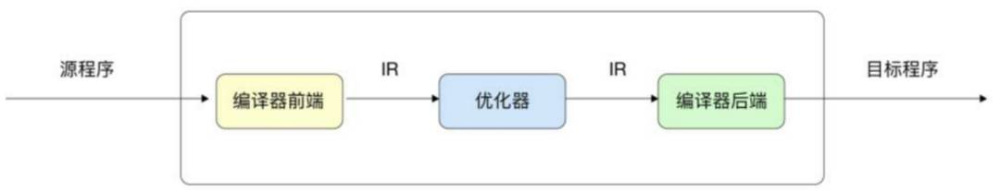
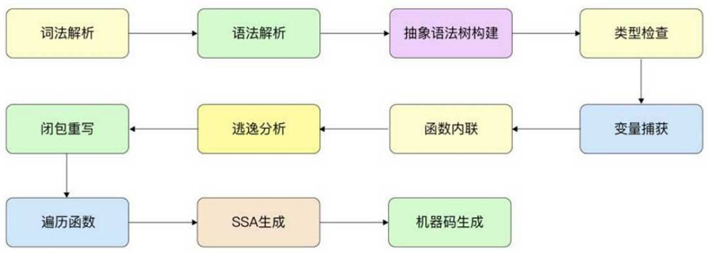
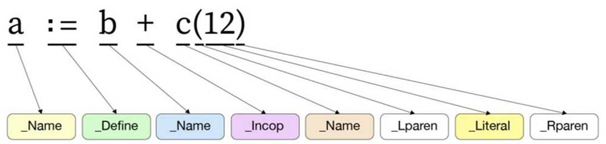
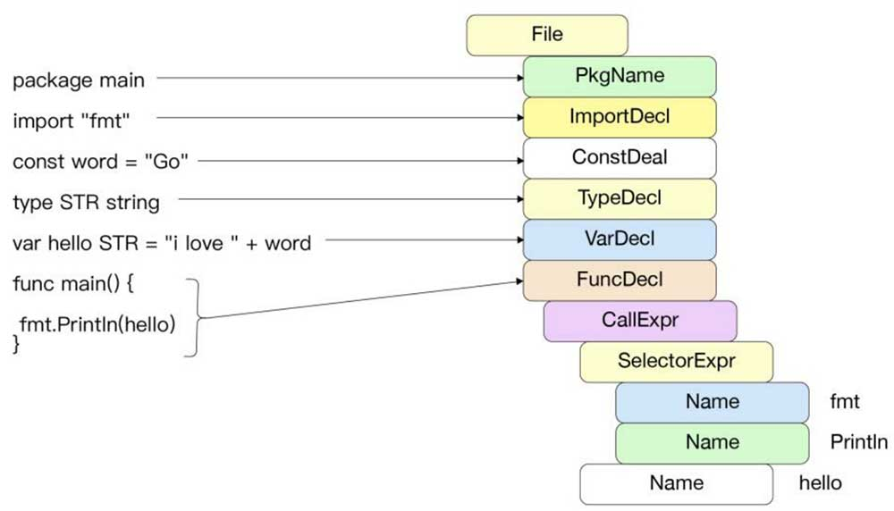
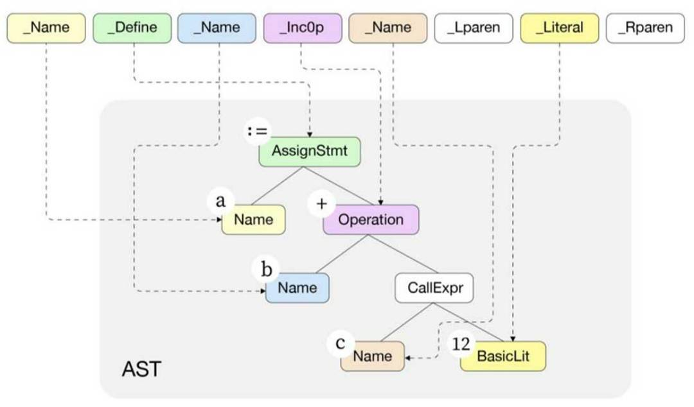
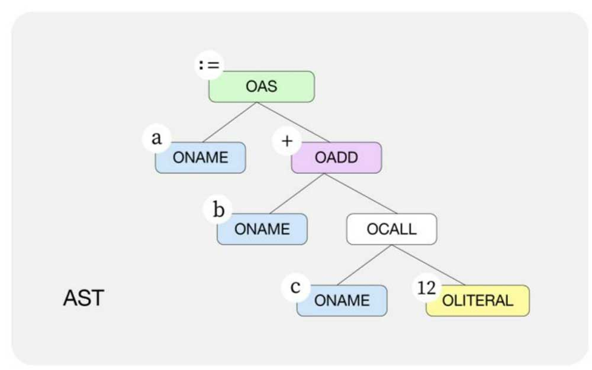
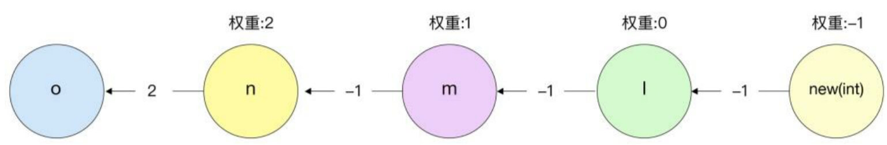
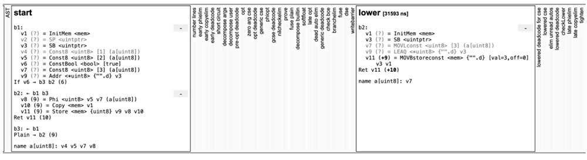

# 编译阶段

### 概述

> Go语言编译器一般缩写为小写的gc（go compiler），需要和大写的GC（垃圾回收）进行区分。

在经典的编译原理中，一般将编译器分为`编译器前端`、`优化器`和`编译器后端`。这种编译器被称为三阶段编译器（three-phase compiler）。

* **编译器前端主要专注于理解源程序、扫描解析源程序并进行精准的语义表达。**

* 编译器的中间阶段（Intermediate Representation，IR）可能有多个，编译器会使用多个IR阶段、多种数据结构表示代码，并**在中间阶段对代码进行多次优化**。
  * 例如，识别冗余代码、识别内存逃逸等。编译器的中间阶段离不开编译器前端记录的细节。

* **编译器后端专注于生成特定目标机器上的程序**，这种程序可能是可执行文件，也可能是需要进一步处理的中间形态obj文件、汇编语言等。



具体流程如下：




### 词法解析

**在词法解析阶段，Go语言编译器会扫描输入的Go源文件，并将其符号（token）化。**

> 和Go语言编译器有关的代码主要位于`src/cmd/compile/internal`目录下，在后面分析中给出的文件路径均默认位于该目录中。

**符号化保留了Go语言中定义的符号，可以识别出错误的拼写。同时，字符串被转换为整数后，在后续的阶段中能够被更加高效地处理。**

例如“+”和“-”操作符会被转换为`_IncOp`，赋值符号“：=”会被转换为`_Define`。这些token实质上是用iota声明的整数，定义在`syntax/tokens.go`中。

Go 词法解析示例如下图：




Go语言标准库go/scanner、go/token也提供了许多接口用于扫描源代码,实例如下：

```go
func TestScanner(t *testing.T) {
	src := []byte("cos(x) + si*sin(x) // Euler")
	var s scanner.Scanner
	fset := token.NewFileSet()
	file := fset.AddFile("", fset.Base(), len(src))
	s.Init(file, src, nil, scanner.ScanComments)
	for {
		pos, tok, lit := s.Scan()
		if tok == token.EOF {
			break
		}
		fmt.Printf("%s\t%s\t%q\n", fset.Position(pos), tok, lit)
	}
}
```

输出如下：

```sh
1:1	IDENT	"cos"
1:4	(	""
1:5	IDENT	"x"
1:6	)	""
1:8	+	""
1:10	IDENT	"si"
1:12	*	""
1:13	IDENT	"sin"
1:16	(	""
1:17	IDENT	"x"
1:18	)	""
1:20	;	"\n"
1:20	COMMENT	"// Euler"
```

可以看到：**每个标识符与运算符都被特定的token代替**，例如2i被识别为复数IMAG，注释被识别为COMMENT。


### 语法解析

词法解析阶段结束后，需要根据Go语言中指定的语法对符号化后的Go文件进行解析。

Go语言采用了标准的**自上而下的递归下降（Top-Down Recursive-Descent）算法**，以简单高效的方式完成无须回溯的语法扫描，核心算法位于`syntax/nodes.go及syntax/parser.go`中

在一个Go源文件中主要有包导入声明（import）、静态常量（const）、类型声明（type）、变量声明（var）及函数声明。

语法解析示例如下图：




源文件中的每一种声明都有对应的语法，递归下降通过识别初始的标识符，例如_const，采用对应的语法进行解析。这种方式能够较快地解析并识别可能出现的语法错误。

每一种声明语法在Go语言规范中都有定义，具体如下：

```sh
// 包导入声明
ImportSpec = [ "." | PackageName ] ImportPath .
ImportPath = string_lit .
// 常量声明
ConstSpec = IdentifierList [ [ Type ] "=" ExpressionList ] .
// 类型定义
TypeSpec = identifier [ TypeParams ] [ "=" ] Type .
```


语法解析丢弃了一些不重要的标识符，例如括号“（”，并将语义存储到了对应的结构体中。语法声明的结构体拥有对应的层次结构，这是构建抽象语法树的基础。

下图为为`a := b + c(12)`语句被语法解析后转换为对应的 syntax.AssignStmt结构体之后的情形：



* 最顶层的Op操作符为 token.Def（:=）。

* Lhs 表达式类型为标识符 syntax.Name，值为标识符“a”。

* Rhs 表达式为 syntax.Operator 加法运算。
  * 加法运算左边为标识符“b”，右边为函数调用表达式，类型为CallExpr。
  * 其中，函数名c的类型为 syntax.Name，参数为常量类型syntax.BasicLit，代表数字12


### 抽象语法树构建

编译器前端必须构建程序的中间表示形式，以便在编译器中间阶段及后端使用。**抽象语法树（Abstract Syntax Tree，AST）**是一种常见的树状结构的中间态。

在Go语言源文件中的任何一种import、type、const、func声明都是一个根节点，在根节点下包含当前声明的子节点。如下decls函数将源文件中的所有声明语句转换为节点（Node）数组。核心逻辑位于`gc/noder.go`中。

```go
func (p *noder) decls(decls []syntax.Decl) (l []ir.Node) {
	var cs constState

	for _, decl := range decls {
		p.setlineno(decl)
		switch decl := decl.(type) {
		case *syntax.ImportDecl:
			p.importDecl(decl)

		case *syntax.VarDecl:
			l = append(l, p.varDecl(decl)...)

		case *syntax.ConstDecl:
			l = append(l, p.constDecl(decl, &cs)...)

		case *syntax.TypeDecl:
			l = append(l, p.typeDecl(decl))

		case *syntax.FuncDecl:
			l = append(l, p.funcDecl(decl))

		default:
			panic("unhandled Decl")
		}
	}

	return
}
```

每个节点都包含了当前节点属性的Op字段，定义在`gc/syntax.go`中，以O开头。与词法解析阶段中的token相同的是，Op字段也是一个整数。不同的是，每个Op字段都包含了语义信息。

```go
// Nodes
const (
OXXX Op = iota

	// names
	ONAME // var or func name
	// Unnamed arg or return value: f(int, string) (int, error) { etc }
	// Also used for a qualified package identifier that hasn't been resolved yet.
	ONONAME
	OTYPE    // type name
	OPACK    // import
	OLITERAL // literal
	ONIL     // nil
// X = Y or (if Def=true) X := Y
	// If Def, then Init includes a DCL node for X.
	OAS
	// Lhs = Rhs (x, y, z = a, b, c) or (if Def=true) Lhs := Rhs
	// If Def, then Init includes DCL nodes for Lhs
	OAS2
)
```

例如，当一个节点的Op操作为OAS时，该节点代表的语义为`Left：=Right`，而当节点的操作为OAS2时，代表的语义为`x，y，z=a，b，c`。




### 类型检查

**类型检查阶段遍历节点树并决定节点的类型**。这其中包括了语法中明确指定的类型，例如var a int，也包括了需要通过编译器类型推断得到的类型。例如，a：=1中的变量a与常量1都未直接声明类型，编译器会自动推断出节点常量1的类型为TINT（），并自动推断出a的类型为TINT（）。

在类型检查阶段，会对一些类型做特别的语法或语义检查。例如：引用的结构体字段是否是大写可导出的？数组字面量的访问是否超过了其长度？数组的索引是不是正整数？

除此之外，在类型检查阶段还会进行其他工作。例如：计算编译时常量、将标识符与声明绑定等。类型检查的核心逻辑位于`gc/typecheck.go`中。


### 变量捕获

Go语言编译器将对抽象语法树进行分析及重构，从而完成一系列优化。**变量捕获主要是针对闭包场景而言的**，由于闭包函数中可能引用闭包外的变量，因此变量捕获需要明确在闭包中通过值引用或地址引用的方式来捕获变量。

例如下面这个例子：

```go
func main() {
	a := 1
	b := 2
	go func() {
		fmt.Println(a, b)
	}()
	a = 100
}
```

在闭包内引入了闭包外的a、b变量，**由于变量a在闭包之后进行了其他赋值操作**，因此在闭包中，a、b变量的引用方式会有所不同。在闭包中，必须采取地址引用的方式对变量a进行操作，而对变量b的引用将通过直接值传递的方式进行。

> 闭包后还有赋值操作，则需要传递指针到闭包中，否则还是值传递。

在Go语言编译的过程中，可以通过如下方式查看当前程序闭包变量捕获的情况：

```shell
$ go tool compile -m=2 main.go|grep capturing
main.go:6:2: main capturing by ref: a (addr=false assign=true width=8)
main.go:7:2: main capturing by value: b (addr=false assign=false width=8)
```

从输出中可以看出，a 采取 ref 引用传递的方式，而 b 采取了值传递的方式。assign = true 代表变量a在闭包完成后又进行了赋值操作。


### 函数内联

**函数内联指将较小的函数直接组合进调用者的函数**。这是现代编译器优化的一种核心技术。函数内联的优势在于，可以减少函数调用带来的开销，同时，函数内联是其他编译器优化（例如无效代码消除）的基础。

测试：

```go
//go:noinline
func max(a, b int) int {
	if a > b {
		return a
	}
	return b
}

var result int

func BenchmarkInline(b *testing.B) {
	var r int
	for i := 0; i < b.N; i++ {
		r = max(-1, i)
	}
	result = r
}
```

函数上存在`//go:noinline`时，表示该函数禁止内联，分别测试内联和禁止内联时的耗时，结果如下：

```shell
# 允许内联
goos: linux
goarch: amd64
cpu: Intel(R) Core(TM) i3-9100F CPU @ 3.60GHz
BenchmarkInline-4       1000000000               0.4294 ns/op

# 禁止内联
goos: linux
goarch: amd64
cpu: Intel(R) Core(TM) i3-9100F CPU @ 3.60GHz
BenchmarkInline-4       751125278                1.576 ns/op
```

可以看到，内联对结果影响还是比较大的。

**Go语言编译器会计算函数内联花费的成本，只有执行相对简单的函数时才会内联**。

> 函数内联的核心逻辑位于`gc/inl.go`中。

当函数内部有for、range、go、select等语句时，该函数不会被内联，当函数执行过于复杂（例如太多的语句或者函数为递归函数）时，也不会执行内联。另外，如果函数前的注释中有`go：noinline`标识，则该函数不会执行内联。

如果希望程序中所有的函数都不执行内联操作，那么可以添加编译器选项`-l`：

```sh
go build -gcflags="-l" main.go
```

在调试时，加入`-m=2`标志可以获取当前函数是否可以内联，以及不可以内联的原因。

```go
func sample() string {
	str := "hello" + "world"
	return str
}

func fib(i int) int {
	if i < 2 {
		return i
	}
	return fib(i-1) + fib(i-2)
}

func main() {
	sample()
	fib(10)
}

```

调试：

```shell
$ go tool compile -m=2 inline.go
inline.go:3:6: can inline sample with cost 7 as: func() string { str := "helloworld"; return str }
inline.go:8:6: cannot inline fib: recursive
inline.go:15:6: can inline main with cost 69 as: func() { sample(); fib(10) }
inline.go:16:8: inlining call to sample func() string { str := "helloworld"; return str }
```

可以看出，sample 函数很简单因此可以被内联，而fib（斐波那契）函数为递归函数，不能被内联。


当函数可以被内联时，该函数将被纳入调用函数。如下所示，a：=b+f（1），其中，f函数可以被内联。

```go
func f(n int)int{
    return n+1
}
a:=b+f(1)
```

函数参数与返回值在编译器内联阶段都将转换为声明语句，并通过goto语义跳转到调用者函数语句中，上述代码的转换形式如下，在后续编译器阶段还将对该内联结构做进一步优化。

```go
n:=1
~r1= n +1
goto end
end:
	a = b + ~r1
```


### 逃逸分析

**逃逸分析是Go语言中重要的优化阶段，用于标识变量内存应该被分配在栈区还是堆区。**

> Go语言采用Bellman Ford算法遍历查找有向图中权重小于0的节点，核心逻辑位于`gc/escape.go`中。

在函数执行完成，栈被销毁后，继续访问被销毁栈上的对象指针，导致出现问题。Go语言能够通过编译时的逃逸分析识别这种问题，自动将该变量放置到堆区，并借助Go运行时的垃圾回收机制自动释放内存。

编译器会尽可能地将变量放置到栈中，因为栈中的对象随着函数调用结束会被自动销毁，减轻运行时分配和垃圾回收的负担。

Go 内存分配时，遵循以下两个原则：

* 原则1：**指向栈上对象的指针不能被存储到堆中**
* 原则2：**指向栈上对象的指针不能超过该栈对象的生命周期**


例如：

```go
var z *int

func escape() {
	a := 1
	z = &a
}
```

在函数中，变量 z 引用了变量 a 的地址。如果变量 a 被分配到栈中，那么最终程序将违背原则 2，即变量 z 超过了变量 a 的生命周期，因此变量 a 最终将被分配到堆中。

调试：

```shell
 $ go tool compile -m=2 main.go  
main.go:5:6: can inline escape with cost 9 as: func() { a := 1; z = &a }
main.go:6:2: a escapes to heap:
main.go:6:2:   flow: {heap} = &a:
main.go:6:2:     from &a (address-of) at main.go:7:6
main.go:6:2:     from z = &a (assign) at main.go:7:4
main.go:6:2: moved to heap: a
```

可以看到 a 已经逃逸到堆上了。

Go 语言通过对抽象语法树的**静态数据流分析（static data-flow analysis）**来实现逃逸分析，这种方式构建了带权重的有向图。

其中权重可以表明当前变量引用与解引用的数量。下例为 p 引用 q 时的权重，当权重大于 0 时，代表存在`*`解引用操作。当权重为 -1 时，代表存在`&`引用操作。

```shell
p=&q // -1
p=q // 0
p=*q // 1
p=**q // 2
p=**&*&q //2
```

并不是权重为 -1 就一定要逃逸，例如在下例中，虽然 z 引用了变量 a 的地址，但是由于变量 z 并没有超过变量 a 的声明周期，因此变量 a 与变量 z 都不需要逃逸。

```go
func escape2() int {
	a := 1
	z = &a
	return *z
}
```


一个更复杂的例子如下：

```go
var o *int

func escape3() {
	l := new(int)
	*l = 42
	m := &l
	n := &m
	o = **n
}
```

最终编译器在逃逸分析中的数据流分析，会被解析成如下图所示的带权重的有向图。



其中，节点代表变量，边代表变量之间的赋值，箭头代表赋值的方向，边上的数字代表当前赋值的引用或解引用的个数。

节点的权重=前一个节点的权重+箭头上的数字，例如节点m的权重为2-1=1，而节点l的权重为1-1=0。

**遍历和计算有向权重图的目的是找到权重为-1的节点**，例如上图中的`new（int）`节点，它的节点变量地址会被传递到根节点o中，这时还需要考虑逃逸分析的分配原则，o节点为全局变量，不能被分配在栈中，因此，new（int）节点创建的变量会被分配到堆中。


### 闭包重写

闭包重写分为闭包定义后被立即调用和闭包定义后不被立即调用两种情况。在闭包被立即调用的情况下，闭包只能被调用一次，这时可以将闭包转换为普通函数的调用形式。

> 闭包重写核心逻辑位于`gc/closure.go`中。

例如：

```go
func do() {
	a := 1
	func() {
		fmt.Println(a)
		a = 2
	}()
}
```

上面的闭包最终会被转换为类似正常函数调用的形式，如下所示：

> 由于变量a为引用传递，因此构造的新的函数参数应该为int指针类型。如果变量是值引用的，那么构造的新的函数参数应该为int类型。

```go
func do2() {
	a := 1
	func1(&a)
}

func func1(a *int) {
	fmt.Println(*a)
	*a = 2
}
```

如果闭包定义后不被立即调用，而是后续调用，那么同一个闭包可能被调用多次，这时需要创建闭包对象。

如果变量是按值引用的，并且该变量占用的存储空间小于2×sizeof（int），那么通过在函数体内创建局部变量的形式来产生该变量。如果变量通过指针或值引用，但是占用存储空间较大，那么捕获的变量（var）转换成指针类型的“&var”。这两种方式都需要在函数序言阶段将变量初始化为捕获变量的值。


### 遍历函数

闭包重写后，需要遍历函数，其逻辑在`gc/walk.go`文件的`walk`函数中。

在该阶段会识别出声明但是并未被使用的变量，遍历函数中的声明和表达式，将某些代表操作的节点转换为运行时的具体函数执行。

例如：

* 获取 map 中的值会被转换为运行时 mapaccess2_fast64 函数。
* 字符串变量的拼接会被转换为调用运行时 concatstrings 函数。
* 对于 new 操作，如果变量发生了逃逸，那么最终会调用运行时 newobject 函数将变量分配到堆区。
* for...range 语句会重写为更简单的 for 语句形式。

在执行walk函数遍历之前，编译器还需要对某些表达式和语句进行重新排序，例如将x/=y替换为x=x/y。根据需要引入临时变量，以确保形式简单，例如x=m[k]或m[k]=x，而k可以寻址。


### SSA 生成

遍历函数后，编译器会将抽象语法树转换为下一个重要的中间表示形态，称为SSA（Static Single Assignment，静态单赋值）。

SSA生成阶段是编译器进行后续优化的保证，例如常量传播（ConstantPropagation）、无效代码清除、消除冗余、强度降低（Strength Reduction）等。

> 大部分与 SSA 相关的代码位于`ssa/`文件夹中，但是将抽象语法树转换为SSA 的逻辑位于`gc/ssa.go`文件中。在`ssa/README.md`文件中，有对SSA生成阶段比较详细的描述。


Go语言提供了强有力的工具查看SSA初始及其后续优化阶段生成的代码片段，可以通过在编译时指定GOSSAFUNC=main实现：

```go
package main

var d uint8

func main() {
	var a uint8 = 1
	a = 2
	if true {
		a = 3
	}
	d = a
}
```

调试

```shell
$ GOSSAFUNC=main go tool compile  main.go
dumped SSA to ssa/ssa.html
```

html 内容如下：



包含许多代码片段，其中一些片段是隐藏的。这些是SSA的初始阶段、优化阶段、最终阶段的代码片段。

以如下最初生成SSA代码的初始（start）阶段为例：

```go
b1:-
v1 (?) = InitMem <mem>
v3 (?) = SB <uintptr>
v7 (?) = Const8 <uint8> [3] (a[uint8])
v8 (?) = Addr <*uint8> {"".d} v3
v9 (+11) = Store <mem> {uint8} v8 v7 v1
v10 (+12) = MakeResult <mem> v9
Ret v10 (12)
name a[uint8]: v7
```

其中，bN代表不同的执行分支，例如b1、b2、b3。

vN代表变量，每个变量只能被分配一次，变量后的Op操作代表不同的语义，与特定的机器无关。例如Addr代表取值操作，Const8代表常量，后接要操作的类型；Store代表赋值是与内存有关的操作。

初始阶段结束后，编译器将根据生成的SSA进行一系列重写和优化。SSA最终的阶段叫作genssa，在上例的genssa阶段中，编译器清除了无效的代码及不会进入的if分支，并且将常量Op操作变为了amd64下特定的MOVBstoreconst操作。

```go
# main.go
00000 (5) TEXT "".main(SB), ABIInternal
00001 (5) FUNCDATA $0, gclocals·33cdeccccebe80329f1fdbee7f5874cb(SB)
00002 (5) FUNCDATA $1, gclocals·33cdeccccebe80329f1fdbee7f5874cb(SB)
v4
00003 (+11) MOVB $3, "".d(SB)
b1
00004 (12) RET
00005 (?) END
```


### 机器码生成——汇编器

在SSA阶段，编译器先执行与特定指令集无关的优化，再执行与特定指令集有关的优化，并最终生成与特定指令集有关的指令和寄存器分配方式。

> 在`ssa/gen/genericOps.go`中，包含了和特定指令集无关的Op操作。`在ssa/gen/AMD64Ops.go`中，包含了和AMD64指令集相关的操作。

在SSA lower阶段之后，就开始执行与特定指令集有关的重写与优化，在genssa阶段，编译器会生成与单个指令对应的obj/link.go中的Prog结构。


在SSA后，编译器将调用与特定指令集有关的汇编器（Assembler）生成obj文件，obj文件作为链接器（Linker）的输入，生成二进制可执行文件。

> internal/obj目录中包含了汇编与链接的核心逻辑，内部有许多与机器码生成相关的包。不同类型的指令集（amd64、arm64、mips64等）需要使用不同的包生成。Go语言目前能在所有常见的CPU指令集类型上编译运行。

汇编和链接是编译器后端与特定指令集有关的阶段。由于历史原因，Go语言的汇编器基于了不太常见的plan9汇编器的输入形式。

Go语言也提供了一些方式用于查看编译器生成的汇编代码,比如`go tool compile -S` ，通过 -S 标志来查看：

```go
package main

import "fmt"

func main() {
	fmt.Println("123")
}
```

查看汇编代码：

```shell
$ go tool compile -S  main.go
"".main STEXT size=103 args=0x0 locals=0x40 funcid=0x0
        0x0000 00000 (main.go:16)       TEXT    "".main(SB), ABIInternal, $64-0
        0x0000 00000 (main.go:16)       CMPQ    SP, 16(R14)
        0x0004 00004 (main.go:16)       PCDATA  $0, $-2
        0x0004 00004 (main.go:16)       JLS     92
        0x0006 00006 (main.go:16)       PCDATA  $0, $-1
        0x0006 00006 (main.go:16)       SUBQ    $64, SP
        0x000a 00010 (main.go:16)       MOVQ    BP, 56(SP)
        0x000f 00015 (main.go:16)       LEAQ    56(SP), BP
        0x0014 00020 (main.go:16)       FUNCDATA        $0, gclocals·33cdeccccebe80329f1fdbee7f5874cb(SB)
        0x0014 00020 (main.go:16)       FUNCDATA        $1, gclocals·f207267fbf96a0178e8758c6e3e0ce28(SB)
        0x0014 00020 (main.go:16)       FUNCDATA        $2, "".main.stkobj(SB)
        0x0014 00020 (main.go:17)       MOVUPS  X15, ""..autotmp_9+40(SP)
        0x001a 00026 (main.go:17)       LEAQ    type.string(SB), DX
        0x0021 00033 (main.go:17)       MOVQ    DX, ""..autotmp_9+40(SP)
        0x0026 00038 (main.go:17)       LEAQ    ""..stmp_0(SB), DX
        0x002d 00045 (main.go:17)       MOVQ    DX, ""..autotmp_9+48(SP)
        0x0032 00050 (<unknown line number>)    NOP
        0x0032 00050 ($GOROOT/src/fmt/print.go:274)     MOVQ    os.Stdout(SB), BX
        0x0039 00057 ($GOROOT/src/fmt/print.go:274)     LEAQ    go.itab.*os.File,io.Writer(SB), AX
        0x0040 00064 ($GOROOT/src/fmt/print.go:274)     LEAQ    ""..autotmp_9+40(SP), CX
        0x0045 00069 ($GOROOT/src/fmt/print.go:274)     MOVL    $1, DI
        0x004a 00074 ($GOROOT/src/fmt/print.go:274)     MOVQ    DI, SI
        0x004d 00077 ($GOROOT/src/fmt/print.go:274)     PCDATA  $1, $0
        0x004d 00077 ($GOROOT/src/fmt/print.go:274)     CALL    fmt.Fprintln(SB)
        0x0052 00082 (main.go:18)       MOVQ    56(SP), BP
        0x0057 00087 (main.go:18)       ADDQ    $64, SP
        0x005b 00091 (main.go:18)       RET
        0x005c 00092 (main.go:18)       NOP
        0x005c 00092 (main.go:16)       PCDATA  $1, $-1
        0x005c 00092 (main.go:16)       PCDATA  $0, $-2
        0x005c 00092 (main.go:16)       NOP
        0x0060 00096 (main.go:16)       CALL    runtime.morestack_noctxt(SB)
        0x0065 00101 (main.go:16)       PCDATA  $0, $-1
        0x0065 00101 (main.go:16)       JMP     0

```


### 机器码生成——链接

**链接就是将编写的程序与外部程序组合在一起的过程。**

链接分为`静态链接`与`动态链接`：

* 静态链接的特点是链接器会将程序中使用的所有库程序复制到最后的可执行文件中，
* 而动态链接只会在最后的可执行文件中存储动态链接库的位置，并在运行时调用。

因此静态链接更快，并且可移植，它不需要运行它的系统上存在该库，但是它会占用更多的磁盘和内存空间。


Go语言在默认情况下是使用静态链接的，但是在一些特殊情况下，如在使用了CGO（即引用了C代码）时，则会使用操作系统的动态链接库。

> 例如，Go语言的 net/http 包在默认情况下会使用 libpthread 与 lib c 的动态链接库

Go 语言也支持在 go build 编译时通过传递参数来指定要生成的链接库的方式，可以使用 go help buildmode  命令查看：

```shell
$ go help buildmode
# 有多种取值
-buildmode=archive
-buildmode=c-archive
-buildmode=c-shared
-buildmode=default
-buildmode=shared
-buildmode=exe
-buildmode=pie
-buildmode=plugin
```


在 go build 时增加 -x 参数来查看 Go 语言编译与链接的过程：

```shell
$ go build -x main.go
```


### ELF文件解析

ELF（Executable and Linkable Format）是类UNIX操作系统下最常见的可执行且可链接的文件格式。

> 在Windows操作系统下，编译后的Go文本文件最终会生成以.exe为后缀的PE格式的可执行文件，而在Linux和类UNIX操作系统下，会生成ELF格式的可执行文件。

除机器码外，在可执行文件中还可能包含调试信息、动态链接库信息、符号表信息。有许多工具可以完成对ELF文件的探索查看，如readelf、objdump。下面使用readelf查看ELF文件的头信息：

```shell
$ go build main.go
$ readelf -h main
ELF Header:
  Magic:   7f 45 4c 46 02 01 01 00 00 00 00 00 00 00 00 00
  Class:                             ELF64
  Data:                              2's complement, little endian
  Version:                           1 (current)
  OS/ABI:                            UNIX - System V
  ABI Version:                       0
  Type:                              EXEC (Executable file)
  Machine:                           Advanced Micro Devices X86-64
  Version:                           0x1
  Entry point address:               0x45c220
  Start of program headers:          64 (bytes into file)
  Start of section headers:          456 (bytes into file)
  Flags:                             0x0
  Size of this header:               64 (bytes)
  Size of program headers:           56 (bytes)
  Number of program headers:         7
  Size of section headers:           64 (bytes)
  Number of section headers:         23
  Section header string table index: 3

```

ELF包含多个segment与section。debug/elf包中给出了一些调试ELF的API，以下程序可以打印出ELF文件中section的信息。

```go
func main() {
	f, err := elf.Open("./main")
	if err != nil {
		return
	}
	for _, section := range f.Sections {
		log.Println(section)
	}
}
```

也可以直接用 readelf 命令查看 section 信息：

```shell
$ readelf -S main
```

查看 section 和 segment 的关系：

```shell
$ readelf -lW main
Elf file type is EXEC (Executable file)
Entry point 0x45c220
There are 7 program headers, starting at offset 64

Program Headers:
  Type           Offset   VirtAddr           PhysAddr           FileSiz  MemSiz   Flg Align
  PHDR           0x000040 0x0000000000400040 0x0000000000400040 0x000188 0x000188 R   0x1000
  NOTE           0x000f9c 0x0000000000400f9c 0x0000000000400f9c 0x000064 0x000064 R   0x4
  LOAD           0x000000 0x0000000000400000 0x0000000000400000 0x07e2c7 0x07e2c7 R E 0x1000
  LOAD           0x07f000 0x000000000047f000 0x000000000047f000 0x08e020 0x08e020 R   0x1000
  LOAD           0x10e000 0x000000000050e000 0x000000000050e000 0x017e00 0x04c080 RW  0x1000
  GNU_STACK      0x000000 0x0000000000000000 0x0000000000000000 0x000000 0x000000 RW  0x8
  LOOS+0x5041580 0x000000 0x0000000000000000 0x0000000000000000 0x000000 0x000000     0x8

 Section to Segment mapping:
  Segment Sections...
   00
   01     .note.go.buildid
   02     .text .note.go.buildid
   03     .rodata .typelink .itablink .gosymtab .gopclntab
   04     .go.buildinfo .noptrdata .data .bss .noptrbss
   05
   06
```

`.go.buildinfo` section包含Go程序的构建信息，“go version”命令就是通过查找该区域的信息获取Go语言版本号的。


### 小结

Go语言可执行文件的生成离不开编译器所做的复杂工作，如果不理解Go语言的编译器，那么对Go语言的理解是不完整的。编译阶段包括词法解析、语法解析、抽象语法树构建、类型检查、变量捕获、函数内联、逃逸分析、闭包重写、遍历并编译函数、SSA生成、机器码生成。编译器不仅能准确地表达语义，还能对代码进行一定程度的优化。可以看到，Go语言的很多语法检查、语法特性都依赖编译时。理解编译时的基本流程、优化方案及一些调试技巧有助于写出更好的程序。


## 相关命令

**编译时禁止内联**

```shell
go build -gcflags="-l" main.go
```

**查看当前程序闭包变量捕获的情况**

```
go tool compile -m=2 main.go|grep capturing
```

**查看当前函数是否可以内联，以及不可以内联的原因**

```shell
go tool compile -m=2 main.go
```

**逃逸分析**

```shell
go tool compile -m=2 main.go
```


**查看SSA初始及其后续优化阶段生成的代码片段**

```shell
GOSSAFUNC=main GOOS=linux GOARCH=amd64 go tool compile  main.go
```

**查看汇编代码**

有两种方法查看汇编代码：

```shell
# 编译，即将源代码编译成 .o 目标文件，并输出汇编代码。
go tool compile -S  main.go
```

```shell
# 反汇编，即从可执行文件反编译成汇编
go build main.go && go tool objdump ./main
```


**查看编译与链接过程**

```shell
go build -x main.go
```


