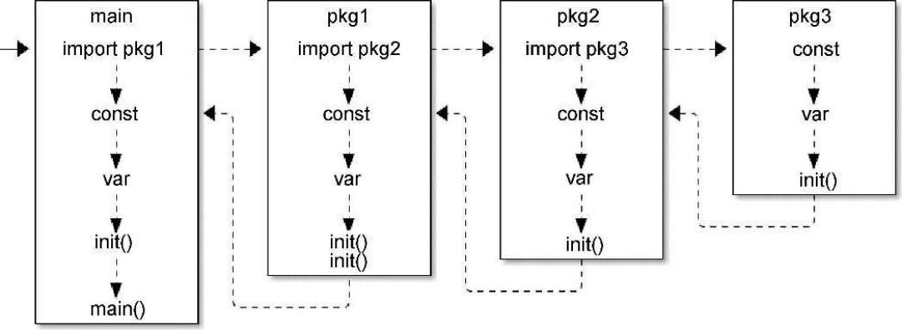

# Go 高级编程笔记

> 《Go 高级编程》相关笔记


## 切片

### 原地删除切片元素

```go
// Filter 原地删除切片
func Filter(s []int64, fn func(s int64) bool) []int64 {
	// 这里借助传进来的切片的底层数组构建一个空切片来用
	// 优点: 省掉了一次空间分配
	// 缺点: 修改了同一个底层数组，这样也会影响到外层的切片s,使用时需要注意
	b := s[:0]
	for _, v := range s {
		if !fn(v) {
			b = append(b, v)
		}
	}
	return b
}
```

测试

```go
func TestFilter(t *testing.T) {
	s := make([]int64, 0, 10)
	for i := int64(0); i < 10; i++ {
		s = append(s, i)
	}
	filter := Filter(s, func(s int64) bool {
		return s%2 == 0
	})

	sh := (*reflect.SliceHeader)(unsafe.Pointer(&s))
	fh := (*reflect.SliceHeader)(unsafe.Pointer(&filter))
	// 根据输出可知，确实是共用的底层数组
	fmt.Printf("sh:%+v\n", sh) // sh:&{Data:824633827728 Len:10 Cap:10}
	fmt.Printf("fh:%+v\n", fh) // fh:&{Data:824633827728 Len:5 Cap:10}
	// 然后s也确实是被影响到了
	fmt.Printf("s:%+v\n", s)      // s:[1 3 5 7 9 5 6 7 8 9]
	fmt.Printf("f:%+v\n", filter) // f:[1 3 5 7 9]
}
```


### 强制转换切片类型

```go
func SortFloat64Fast(a []float64) {
	var b []int
	// 转成成 reflect.SliceHeader，然后通过更新结构体值的方式把[]float64的数据赋值给[]int
	// 二者共享底层数组，因此对b排序就是对a排序
	bh := (*reflect.SliceHeader)(unsafe.Pointer(&b))
	ah := (*reflect.SliceHeader)(unsafe.Pointer(&a))
	*bh = *ah
	sort.Ints(b)
}
```

测试

```go
func TestSortFloat64Fast(t *testing.T) {
	rand.Seed(time.Now().Unix())
	a := []float64{1.1, 11.11, 2.2, 22, 22, 3.3, 33.33}
	fmt.Printf("before :%+v\n", a) // before :[1.1 11.11 2.2 22 22 3.3 33.33]
	SortFloat64Fast(a)
	fmt.Printf("after :%+v\n", a) // after :[1.1 2.2 3.3 11.11 22 22 33.33]
}
```


## Recover

recover() 方法调用的两个注意事项：

* 1）**必须在 defer 中调用** recover() 才会有返回值
* 2）recover 捕获的是**祖父一级**调用函数栈帧的异常
  * 即 recover() 函数调用栈和需要捕获的调用栈相差两层
  * 因此可以对 recover 进行包装，只需要二者保证函数栈帧差两层即可。

具体测试如下：

```go
func TestRecoverBad1(t *testing.T) {
	// 直接调用 recover 无法捕获到
	if r := recover(); r != nil {
		log.Println("recover:", r)
	}
	panic("aaa")
}
```

没有通过 defer 调用，无法捕获到。


```go
func TestRecoverOK(t *testing.T) {
	defer func() {
		// recover 和 panic 所在栈帧刚好差了两层，为祖父级，可以捕获到
		if r := recover(); r != nil {
			log.Println("recover:", r)
		}
	}()
	panic("aaa")
}
```

recover 和 panic 所在栈帧刚好差了两层，为祖父级，可以捕获到。


```go
func TestRecoverBad2(t *testing.T) {
	defer func() {
		// recover 和 panic 所在栈帧差了三层，无法捕获到
		func() {
			if r := recover(); r != nil {
				log.Println("recover:", r)
			}
		}()
	}()
	panic("aaa")
}

func TestRecoverBad3(t *testing.T) {
	// recover 和 panic 所在栈帧只差了一层，同样无法捕获到
	defer recover()
	panic("aaa")
}
```

使用了 defer 调用，但是函数调用栈帧相差分别是三层和一层，由于不是两层因此也无法捕获到。


```go
func TestRecoverCustomBad(t *testing.T) {
	defer func() {
		// 由于被包装了一层，因此 recover 和 panic 所在栈帧差了三层，无法捕获到
		MyRecover()
	}()
	panic("aaa")
}

func TestRecoverCustomGood(t *testing.T) {
	// 被包装了一层，调用时也省略了 defer func 这一层，因此 recover 和 panic 所在栈帧差了两层，可以捕获到
	defer MyRecover()
	panic("aaa")
}

func MyRecover() {
	log.Println("MyRecover")
	if r := recover(); r != nil {
		log.Println("recover:", r)
	}
}
```

对 recover 进行了包装，导致调用栈帧增加了一层，因此常见的`defer func() {MyRecover()}`这样的调用栈帧相差是三层无法捕获到，而`defer MyRecover()`则刚好两层，可以捕获到。


## 可变参数

当可变参数是一个空接口时，调用者是否解包可变参数会导致不同的结果。

> 因为空接口可以是任意类型，也包括空接口切片这个类型。
>
> 所以在可变参数这里有点异常


```go
func Print(a ...interface{}) {
	fmt.Println(a...)
}

```

测试

```go
func TestPrint(t *testing.T) {
	a := []interface{}{"123", "abc"}
	Print(a) // [123 abc]
	Print([]interface{}{"123", "abc"}) // [123 abc]
	Print(a...) // 123 abc 
	Print("123", "abc") // 123 abc 
}
```

根据输出可以知道：

`Print(a)` 等价于直接调用`Print([]interface{}{"123", "abc"})`

`Print(a...)`等价于直接调用`Print("123", "abc")`


## 指针地址动态变化

**Go 中的栈会动态进行扩缩容，因此变量的指针也会随之发送变化。**

> Go 运行时会自动更新引用了地址变化的栈变量的指针。

* **因此不能随意将指针保存到数值变量中。**
* **也不能将 Go 中的地址保存到不在垃圾回收器控制的环境中去**，比如 CGO 时不能再 C 语言中长期持有 Go 语言对象的地址。


## Go 初始化顺序

Go 程序始终会从`main.main`开始初始化：

* 首先是 import 包的初始化，按导入先后顺序进行初始化；
  * 若一个包被导入多次也只会初始化一次
* 同一包中安装 const、var、init方法的顺序初始化；

具体如下图：




## 代码片段

### 基于通道的随机数生成器

主要借助了 `select` 会随机选择一个通道来执行的机制。

```go
func Random(n int64) <-chan int64 {
	ch := make(chan int64)
	go func() {
		defer close(ch)
		for i := int64(0); i < n; i++ {
			select {
			case ch <- 0:
			case ch <- 1:
			}
		}
	}()
	return ch
}
```

测试

```go
func TestRandom(t *testing.T) {
	ch := Random(10)
	for v := range ch {
		fmt.Println(v)
	}
}
输出
// 0110010111
```

