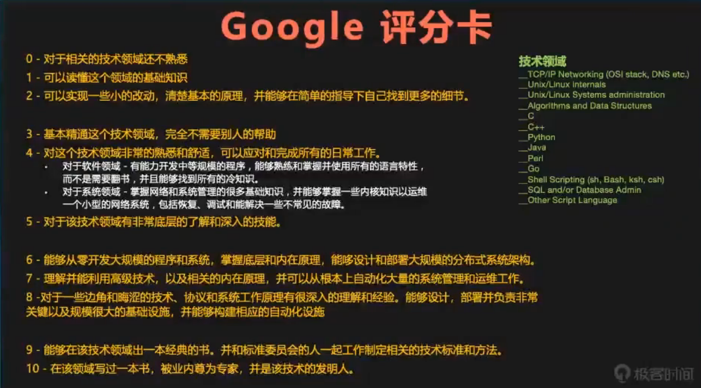

# 焦虑-烦恼-成长

> https://www.bilibili.com/video/BV1C7411F7x3
>
> https://coolshell.cn/articles/20977.html

## 1. 面对焦虑，认识自我

### 技术人员典型的焦虑和烦恼

* 加班
  * 劳动时间过长，没有时间提升

* 搬砖
  * 工作没有技术含量

* 成长
  * 成长到了瓶颈期

* 学习
  * 东西太多学不过来

* 彷徨
  * 失去方向，未来要干什么，要做什么不知道

### 认识世界

* 这个世界是怎么组成的?
  * 基础技术、工具、产品、项目.
  * 大家的分工是怎么来的?

* 这个世界需要什么样的人?以及这些人的特点
  * 劳工、技工、特种工、设计、架构、经理.
  * Google评分卡

* 这个世界的技术趋执和规律是什么样的?
  * 工业化革命、信息化革命
  * 技术更新沟汰、风口是什么样的

### Google 评分卡

* 0~2：刚毕业的学生
* 3~5：高级程序员
* 6~8：大厂大佬
* 9~10：大牛

### 认识自己

* 自己的喜好
  * 找到自己可以坚持不会放弃的东西

* 自己的特长是什么
  * 找到自己可以干成的事
  * 找到别人会来请教你的事
* 自己有什么
  * 找到可以承上启下的东西
  * 即：之前做过的事可以为以后做准备，不要东一下西一下
* 自己可以付出什么
  * 找到自己的本金来投资，找到可以付出和牺牲的东西
  * 比较简单的：牺牲时间、牺牲各种享受