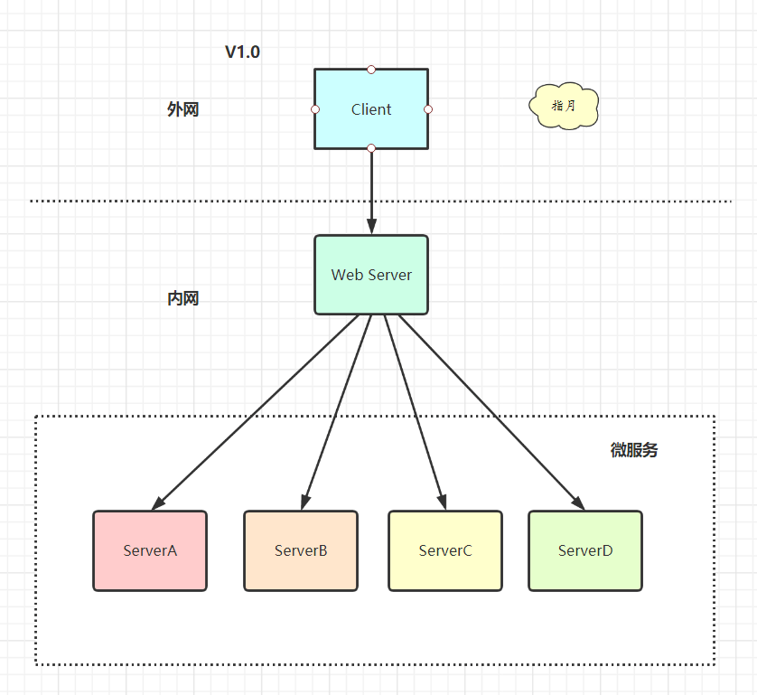
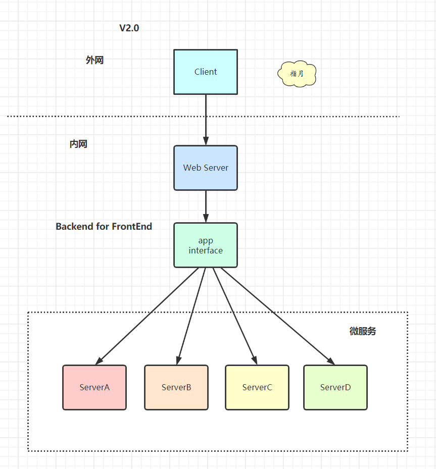
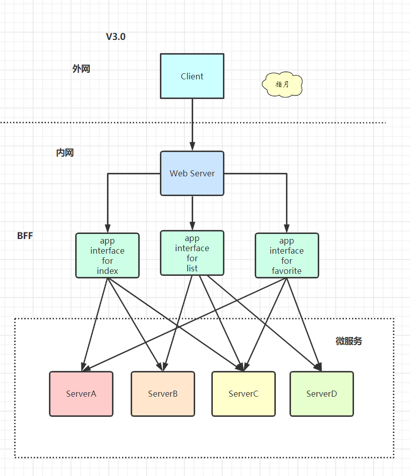

# 微服务

## 1. 目录

* 0）微服务概览

* 1）微服务设计
* 2）gRPC & 服务发现
* 3）多集群 & 多租户

## 2. 微服务概览

### 单体架构

尽管也是模块化逻辑，但是最终它还是会打包并部署为单体式应用。其中最主要问题就是这个应用太复杂，以至于任何单个开发者都不可能搞懂它。应用无法扩展，可靠性很低，最终，敏捷性开发和部署变的无法完成。

应对思路：**化繁为简，分而治之**。

### 微服务起源

SOA 和 微服务 是什么关系？

**你可以把微服务想成是 SOA 的一种实践。**

* 小即是美：小的服务代码少，bug也少，易测试，易维护，也更容易不断迭代完善的精致进而美妙。
* 单一职责：一个服务也只需要做好一件事，专注才能做好。
* 尽可能早地创建原型：尽可能早的提供服务APl,建立服务契约，达成服务间沟通的一致性约定， 至于实现和完善可以慢慢再做。
* 可移植性比效率更重要：服务间的轻量级交互协议在效率和可移植性一者间，首要依然考虑兼容性和移植性。

### 微服务定义

围绕业务功能构建的，服务关注单一业务，服务间采用轻量级的通信机制，可以全自动独立部署，可以使用不同的编程语言和数据存储技术。

微服务架构通过业务拆分实现服务组件化，通过组件组合快速开发系统，业务单一的服务组件又可以独立部署，使得整个系统变得清晰灵活:

* 原子服务
* 独立进程
* 隔离部署
* 去中心化服务治理

### 微服务的不足

* 微服务应用是分布式系统，由此会带来固有的复杂性。开发者不得不使用RPC或者消息传递，来实现进程间通信;此外，必须要写代码来处理消息传递中速度过慢或者服务不可用等局部失效问题。
* 分区的数据库架构，同时更新多个业务主体的事务很普遍。这种事务对于单体式应用来说很容易，因为只有一个数据库。在微服务架构应用中，需要更新不同服务所使用的不同的数据库，从而对开发者提出了更高的要求和挑战。
* 测试一个基于微服务架构的应用也是很复杂的任务。服务模块间的依赖，应用的升级有可能会波及多个服务模块的修改。
* 对运维基础设施的挑战比较大。

### 组件服务化

传统实现组件的方式是通过库(library),库是和应用一起运行在进程中，库的局部变化意味着整个应用的重新部署。通过服务来实现组件，意味着将应用拆散为一系列的服务运行在不同的进程中，那么单一服务的局部变化只需重新部署对应的服务进程。我们用Go实施一个微服务:

* kit：一个微服务的基础库(框架)。

* service：业务代码+ kit 依赖+第三方依赖组成
  的业务微服务

* rpc + message queue：轻量级通讯

本质上等同于，多个微服务组合(compose)完成了一个完整的用户场景(usecase)。

### 按业务组织服务

**康威定律**

you build it，you ifx it。

按业务能力组织服务的意思是服务提供的能力和业务功能对应，比如:订单服务和数据访问服务。前者反应了真实的订单相关业务，后者是一种技术抽象服务不反应真实的业务。所以按微服务架构理念来划分服务时，是不应该存在数据访问服务这样一个服务的。

事实上传统应用设计架构的分层结构正反映了不同角色的沟通结构。所以若要按微服务的方式来构建应用，也需要对应调整团队的组织架构。每个服务背后的小团队的组织是跨功能的，包含实现业务所需的全面的技能。

B 站团队组织模式：大前端(移动Web)=》网关接入=》业务服务=》平台服务=》基础设施(PaaS/Saas)

**开发团队对软件在生产环境的运行负全部责任!**

### 去中心化

每个服务面临的业务场景不同，可以针对性的选择合适的技术解决方案。但也需要避免过度多样化，结合团队实际情况来选择取舍，要是每个服务都用不同的语言的技术栈来实现，想想维护成本真够高的。

* 数据去中心化：数据存储设施(缓存，数据库等)隔离。
* 治理去中心化：去全局热点
* 技术去中心化：

每个服务独享自身的数据存储设施(缓存，数据库等)，不像传统应用共享一个缓存和数据库，这样有利于服务的独立性，隔离相关干扰。

### 基础设施自动化

**无自动化不微服务，自动化包括测试和部署**。单一进程的传统应用被拆分为一系列的多进程服务后，意味着开发、调试、测试、监控和部署的复杂度都会相应增大，必须要有合适的自动化基础设施来支持微服务架构模式，否则开发、运维成本将大大增加。

* CICD: Gitlab + Gitlab Hooks + k8s

* Testing:测试环境、单元测试、API自动化测试

* 在线运行时: k8s,以及一系列Prometheus、ELK、 Conrtol Panle

### 可用性 & 兼容性设计

著名的Design For Failure思想，微服务架构采用粗粒度的进程间通信，引入了额外的复杂性和需要处理的新问题，如网络延迟、消息格式、负载均衡和容错，忽略其中任何一点都属于对“分布式计算的误解”。

* 隔离
* 超时控制
* 负载保护
* 限流
* 降级
* 重试
* 负载均衡

一旦采用了微服务架构模式，那么在服务需要变更时我们要特别小心，服务提供者的变更可能引发服务消费者的兼容性破坏，时刻谨记保持服务契约(接口)的兼容性。
Be conservative in what you send, be liberal in what you accept。
**发送时要保守，接收时要开放**。按照伯斯塔尔法则的思想来设计和实现服务时，发送的数据要更保守意味着最小化的传送必要的信息，接收时更开放意味着要最大限度的容忍冗余数据，保证**兼容性**。

## 3. 微服务设计

### API Gateway

**V1.0**

我们进行了 SOA 服务化的架构演进，按照垂直功能进行了拆分，对外暴露了一批微服务，但是因为缺乏统一的出口面临了不少困难：

* 客户端到微服务直接通信，强耦合。
  * 客户端版本很难收敛，可能需要兼容很早期的版本
* 需要多次请求，客户端聚合数据，工作量巨大，延迟高。
  * 要做面向用户场景的 API，数据由 Server 端聚合好直接返回。
  * 设计理念：前(端)轻后(端)重
* 协议不利于统一，各个部门间有差异，需要端来兼容。
* 面向“端"的 APl 适配，耦合到了内部服务。
  * Android、iOS、IPad 各种不同客户端都需要单独适配
* 多终端兼容逻辑复杂，每个服务都需要处理。
* 统一逻辑无法收敛，比如安全认证、限流。

我们之前提到了我们工作模型，要内聚模式配合。

**V2.0**

我们新增了一个app-interface用于统的协议出口，在服务内进行大量的dataset join,**按照业务场景来设计粗粒度的API**,给后续服务的演进带来的很多优势：

* 轻量交互:协议精简、聚合。
* 差异服务:数据裁剪以及聚合、针对终端定制化API。
* 动态升级:原有系统兼容升级，更新服务而非协议。
* 沟通效率提升，协作模式演进为移动业务+网关小组。

BFF (Backend for Frontend)可以认为是一种适配服务， 将后端的微服务进行适配(主要包括聚合裁剪和格式适配等逻辑)，向无线端设备暴露友好和统一的API,方便无线设备接入访问后端服务。

**V3.0**

最致命的一个问题是整个app-interface属于single point of failure,严重代码缺陷或者流量洪峰可能弓发集群宕机。

* 单个模块也会导致后续业务集成复杂度高，根据康威法则，单块的无线BFF和多团队之间就出现不匹配问题，团队之间沟通协调成本高，交付效率低下。
* 很多跨横切面逻辑，比如安全认证，日志监控，限流熔断等。随着时间的推移，代码变得越来越复杂，技术债越堆越多。

**v4.0**

跨横切面(Cross-Cutting Concerns)的功能，需要协调更新框架升级发版(路由、认证、限流、安全)，因此全部上沉，引入了 **API Gateway**,把业务集成度高的BFF层和通用功能服务层 API Gateway 进行了分层处理。

> 将认证、限流、安全等业务从 BFF 中抽取，引入 API Gateway

在新的架构中，网关承担了重要的角色，它是解耦拆分和后续升级迁移的利器。在网关的配合下，单块BFF实现了解耦拆分，各业务线团队可以独立开发和交付各自的微服务，研发效率大大提升。另外，把跨横切面逻辑从BFF剥离到网关上去以后，BFF 的开发人员可以更加专注业务逻辑交付，实现了架构上的关注分离(Separation of Concerns)。

我们业务流量实际为：
移动端-> API Gateway -> BFF -> Mircoservice,在FE Web业务中，BFF可以是nodejs来做服务端渲染(SSR, Server-Side Rendering),注意这里忽略了上游的CDN、4/7层 负载均衡(ELB)。

### Mircoservice 划分

微服务架构时遇到的第一个问题就是如何划分服务的边界。在实际项目中通常会采用两种不同的方式划分服务边界，即通过业务职能(Business Capability)或是DDD的限界上下文(Bounded Context)。

* Business Capability

由公司内部不同部门提供的职能。例如客户服务部门提供客户服务的职能，财务部们提供财务相关的职能。
* Bounded Context

限界上下文是DDD中用来划分不同业务边界的元素，这里业务边界的含义是“解决不同业务问题”的问题域和对应的解决方案域，为了解决某种类型的业务问题，贴近领域知识，也就是业务。

> 这本质上也促进了组织结构的演进: Service per team

**CQRS，将应用程序分为两部分:命令端和查询端**。命令端处理程序创建，更新和删除请求，并在数据更改时发出事件。查询端通过针对一个或多个物化视图执行查询来处理查询，这些物化视图通过订阅数据更改时发出的事件流而保持最新。

> 在稿件服务演进过程中，我们发现围绕着创作稿件、审核稿件、最终发布稿件有大量的逻辑揉在一块，其中稿件本身的状态也有非常多种，但是最终前台用户只关注稿件能否查看，我们依赖稿件数据库binlog 以及订阅binlog的中间件canal,将我们]的稿件结果发布到消息队列kafka中，最终消费数据独立组建一个稿件查阅结果数据库，并对外提供一个独 立查询服务，来拆分复杂架构和业务。

我们的架构也从 Polling publisher -> Transaction logtailing 进行了演进(Pull VS Push)。

### Microservice 安全

对于外网的请求来说，我们通常在 API Gateway 进行统一的认证拦截， 一旦认证成功， 我们会用 JWT 方式通过 RPC 元数据传递的方式带到 BFF 层，BFF 校验Token 完整性后把身份信息注入到应用的 Context 中，BFF 到其他下层的微服务，建议是直接在 RPC Request 中带入用户身份信息 (UserlD) 请求服务。

* API Gateway -> BFF -> Service
  * Biz Auth > JWT > Request Args

对于服务内部，一般要区分身份认证和授权。

* Full Trust：认证后需要加密通讯
* Half Trust：认证后不需要加密通讯
* Zero Trust：不需要认证也不需要加密通讯

## 4. gRPC & 服务发现

