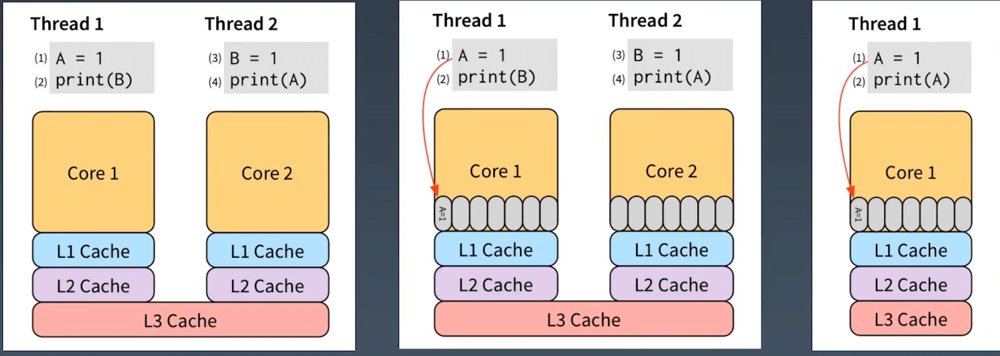

# Go 并发编程

## 1. 概述 

目录如下：

* Goroutine
* Memory model
* Package sync
* chan
* Package context
* References


* Happen Before 
* MESI
* CAS
* Effective Go


## 2. Goroutine

### Processed and Threads

操作系统会为该应用程序创建一个进程。作为一个应用程序，它像一个为所有资源而运行的容器。这些资源包括内存地址空间、文件句柄、设备和线程。

线程是操作系统调度的一种执行路径，用于在处理器执行我们在函数中编写的代码。一个进程从一个线程开始，即主线程，当该线程终止时，进程终止。这是因为主线程是应用程序的原点。然后，主线程可以依次启动更多的线程，而这些线程可以启动更多的线程。

无论线程属于哪个进程，操作系统都会安排线程在可用处理器上运行。每个操作系统都
有自己的算法来做出这些决定。

### Goroutines and Parallelism

Go语言层面支持的 go 关键字，可以快速的让一个函数创建为 goroutine,我们可以认
为 main 函数就是作为 goroutine 执行的。操作系统调度线程在可用处理器上运行，Go
运行时调度 goroutines 在绑定到单个操作系统线程的逻辑处理器中运行(P)。即使使用
这个单一的逻辑处理器和操作系统线程，也可以调度数十万 goroutine 以惊人的效率和
性能并发运行。

Concurrency is not Parallelism。

并发不是并行。并行是指两个或多个线程同时在不同的处理器执行代码。如果将运行时
配置为使用多个逻辑处理器，则调度程序将在这些逻辑处理器之间分配 goroutine,这
将导致 goroutine 在不同的操作系统线程上运行。但是，要获得真正的并行性，您需要
在具有多个物理处理器的计算机上运行程序。否则，goroutines 将针对单个物理处理器
并发运行，即使 Go 运行时使用多个逻辑处理器。

### Keep yourself busy or do the work yourself

```go
// Bad
func main() {
	http.HandleFunc("/", func(w http.ResponseWriter, r *http.Request) {
		fmt.Fprintln(w, "Hello, GopherCon SG")
	})
	// main goroutine 无法感知 go func() 退出与否
	go func() {
		if err := http.ListenAndServe(" :8080", nil); err != nil {
			log.Fatal(err)
		}
	}()
	select {}
}

// Good
func main2() {
	http.HandleFunc("/", func(w http.ResponseWriter, r *http.Request) {
		fmt.Fprintln(w, "Hello, GopherCon SG")
	})
	// 直接由 main goroutine 自己处理，可以省去很多麻烦
	if err := http.ListenAndServe(" :8080", nil); err != nil {
		log.Fatal(err)
	}
}
```

空的 select 语句将永远阻塞。

如果你的 goroutine 在从另一个 goroutine 获得结果之前无法取得进展，那么通常情况
下，你自己去做这项工作比委托它( go func() )更简单。
这通常消除了将结果从 goroutine 返回到其启动器所需的大量状态跟踪和 chan 操作。


### Never start a goroutine without knowning when it will stop

Any time you start a Goroutine you must ask yourself:

* When will it terminate?
* What could prevent it from terminating?


这个简单的应用程序在两个不同的端口上提供 http 流量，端口 8080 用于应用程序流量，
端口 8001 用于访问 `/debug/pprof`端点。

```go
// BLock waiting to either receive from the goroutine 's
package main

import (
	"fmt"
	"net/http"
)

func main() {
	mux := http.NewServeMux()
	mux.HandleFunc("/", func(resp http.ResponseWriter, req *http.Request) {
		fmt.Fprintln(resp, "Hello, QCon!")
	})
	go http.ListenAndServe("127.0.0.1: 8001", http.DefaultServeMux) // debug
	http.ListenAndServe("0.0.0.0: 8080", mux)                       // app traffic

}
```

在上例中同时监听了 8080和 8001 端口，但是两个服务其中一个退出时整个程序都应该退出才行，现在很明显无法做到。


通过将 serveApp 和 serveDebug 处理程序分解为各自的函数，我们将它们与 main.main 解耦，我们还遵循了上面的建议，并确保 serveApp 和 serveDebug 将它们
的并发性留给调用者。
如果 serveApp 返回，则 main.main 将返回导致程序关闭，只能靠类似 supervisor 进
程管理来重新启动。

```go
func main() {
	go serveDebug()
	serveApp()
}

func serveApp() {
	mux := http.NewServeMux()
	mux.HandleFunc("/", func(resp http.ResponseWriter, req *http.Request) {
		fmt.Fprintln(resp, "Hello, QCon!")
	})
	http.ListenAndServe("0.0.0.0: 8080", mux)
}

func serveDebug() {
	http.ListenAndServe("127.0.0.1: 8001", http.DefaultServeMux)
}
```

然而，serveDebug 是在一个单独的goroutine中运行的，如果它返回，那么所在的
goroutine 将退出，而程序的其余部分继续运行。由于/debug处理程序很久以前就停止
工作了，所以其他同学会很不高兴地发现他们无法在需要时从您的应用程序中获取统计
信息。

```go
func main4() {
	go serveDebug()
	go serveApp()
	select {}
}

func serveApp2() {
	mux := http.NewServeMux()
	mux.HandleFunc("/", func(resp http.ResponseWriter, req *http.Request) {
		fmt.Fprintln(resp, "Hello, QCon!")
	})
	if err := http.ListenAndServe("0.0.0.0: 8080", mux); err != nil {
		log.Fatal(err) // 通过log.Fatal(err)在出现错误时直接退出整个应用程序
	}
}

func serveDebug2() {
	if err := http.ListenAndServe("127.0.0.1: 8001", http.DefaultServeMux); err != nil {
		log.Fatal(err)
	}
}
```

虽然看起来没问题了，实际上还存在一些问题：

如果 ListenAndServer 返回 nil error,最终 main.main 无法退出。
如果 err!=nil 则会调用log.Fatal，**log.Fatal 底层调用了os.Exit, 会无条件终止程序; defers 不会被调用到**。

**Only use log.Fatal from main.main or init functions.**


对于函数提供者，不能强制使本函数在后台执行，**而是由调用者决定是在后台执行还是前台执行**。

如果要启动一个 goroutine，一定要知道它什么时候会退出，或者有一个让它退出的手段。

```go
// Bad
func main1(){
	doSomething()
	select {
	
	}
}
func doSomething(){
	go func() {
	// 	xxx
	}()
}
// Good
func main1() {
	go doSomething2()
	select {}
}
func doSomething2() {
	// 	doSomething
}

```


最终版本：

```go
// 最终版 通过 chan 传值来实现优雅关闭
func mainLatest() {
	done := make(chan error, 2)
	stop := make(chan struct{})
	go func() {
		done <- serveDebug3(stop)
	}()

	go func() {
		done <- serveApp3(stop)
	}()
	var stopped bool
	for i := 0; i < cap(done); i++ {
		if err := <-done; err != nil {
			fmt.Printf("error: %v\n", err)
		}
		if !stopped {
			stopped = true
			close(stop)
		}
	}
}

func serve(addr string, handler http.Handler, stop <-chan struct{}) error {
	s := http.Server{
		Addr:    addr,
		Handler: handler,
	}
	go func() {
		<-stop // wait for stop signal
		s.Shutdown(context.Background())
	}()
	return s.ListenAndServe()
}

func serveApp3(stop <-chan struct{}) error {
	mux := http.NewServeMux()
	mux.HandleFunc("/", func(resp http.ResponseWriter, req *http.Request) {
		fmt.Fprintln(resp, "Hello, QCon!")
	})
	return serve("0.0.0.0: 8080", mux, stop)
}

func serveDebug3(stop <-chan struct{}) error {
	return serve("127.0.0.1: 8001", http.DefaultServeMux, stop)
}
```


### Leave concurrency to the caller

这两个 API有什么区别?

```go

// ListDirectory return the contents of dir
func ListDirectory(dir string) ([]string, error)

// ListDirectory returns a channel over which
// directory entries will be published. When the list
// of entries is exhausted, the channel will be closed.
func ListDirectory(dir string) chan string
```


* 将目录读取到一个slice中，然后返回整个切片，或者如果出现错误，则返回错误。这是同步调用的，ListDirectory 的调用方会阻塞，直到读取所有目录条目。 根据目录的大小，这可能需要很长时间，并且可能会分配大量内存来构建目录条目名称的 slice。
* ListDirectory 返回一个 chan string,将通过该 chan 传递目录。当通道关闭时，这表示不再有目录。由于在 ListDirectory 返回后发生通道的填充，ListDirectory 可能内部启动goroutine 来填充通道。

ListDirectory chan 版本还有两个问题: 

* 通过使用一个关闭的通道作为不再需要处理的项目的信号，ListDirectory 无法告诉调用者通过通道返回的项目集不完整，因为中途遇到了错误。调用方无法区分空目录与完全从目录读取的错误之间的区别。这两种方法都会导致从ListDirectory 返回的通道会立即关闭。
* 调用者必须继续从通道读取，直到它关闭，因为这是调用者知道开始填充通道 goroutine已经停止的唯一方法。 这对 ListDirectory 的使用是一个严重的限制， 调用者必须花时间从通道读取数据，即使它可能已经收到了它想要的答案。对于大中型目录，它可能在内存使用方面更为高效，但这种方法并不比原始的基于 slice 的方法快。


推荐做法

```go
// 推荐做法，使用回调的方式，由调用者来控制并发逻辑
func ListDirectory(dir string,fn func(string)) chan string
```

标准库 `filepath. WalkDir`也是类似的模型，如果函数启动 goroutine,则必须向调用方提供显式停止该 goroutine 的方法。**通常，将异步执行函数的决定权交给该函数的调用方通常更容易**。


在这个例子中，goroutine 泄漏可以在code review快速识别出来。不幸的是，生产代
码中的goroutine泄漏通常更难找到。我无法说明goroutine泄漏可能发生的所有可能
方式，您可能会遇到:

```go
// leak is a buggy function. It launches a goroutine that
// blocks receiving from a channel. Nothing will ever be
// sent on that channel and the channel is never closed SO
// that goroutine will be blocked forever,
func leak() {
	ch := make(chan int)
	go func() {
		val:=<-ch
		fmt.Println("We received a value:",val)
	}()
}

```


### Incomplete Work

我们使用服务端埋点来跟踪记录一些事件。

```go
type Tracker struct {
}

func (t *Tracker) Event(data string) {
	time.Sleep(time.Millisecond)
	log.Println(data)
}
```


无法保证创建的goroutine生命周期管理，会导致最场景的问题，就是在服务关闭时候，有一些事件丢失。

```go
type App struct {
	track Tracker
}

func (a *App) Handle(w http.ResponseWriter, r *http.Request) {
	w.WriteHeader(http.StatusCreated)
	// 服务关闭时无法保证 goroutine 能执行完
	go a.track.Event("this event")
}
```

优化后

增加 Shutdown 来保证事件能全部记录完，并使用 ctx 做超时控制。

```go
// Tracker2 knows how to track events for the application .
type Tracker2 struct {
	ch   chan string
	stop chan struct{}
}

func NewTracker2() *Tracker2 {
	return &Tracker2{
		ch: make(chan string, 10),
	}
}

func (t *Tracker2) Event(ctx context.Context, data string) error {
	select {
	case t.ch <- data:
		return nil
	case <-ctx.Done():
		return ctx.Err()
	}
}
func (t *Tracker2) Run() {
	for data := range t.ch {
		time.Sleep(1 * time.Second)
		fmt.Println(data)
	}
	t.stop <- struct{}{}
}
func (t *Tracker2) Shutdown(ctx context.Context) {
	close(t.ch)
	select {
	case <-t.stop:
	case <-ctx.Done():
	}
}

func main() {
	tr := NewTracker2()
	go tr.Run()
	_ = tr.Event(context.Background(), "test")
	_ = tr.Event(context.Background(), "test")
	_ = tr.Event(context.Background(), "test")
	ctx, cancel := context.WithDeadline(context.Background(), time.Now().Add(2*time.Second))
	defer cancel()
	tr.Shutdown(ctx)
}
```


### 小结

* 1）将是否并发运行交给调用者
* 2）搞清楚 goroutine 的生命周期
* 3）能够控制 goroutine 的退出


## 3. Memory model

必读文章:`https://golang.org/ref/mem`


如何保证在一个 goroutine 中看到在另个 goroutine 修改的变量的值， 如果程序中修改数据时
有其他 goroutine 同时读取，那么必须将读取串行化。为了串行化访问，请使用 channe l或其他同步原语，例如 sync 和 sync/atomic 来保护数据。
*Happen-Before*
在一个 goroutine 中，读和写定是按照程序中的顺序执行的。即编译器和处理器只有在不会改
变这个 goroutine 的行为时才可能修改读和写的执行顺序。由于**重排**，不同的 goroutine 可能会看到不同的执行顺序。

> CPU 或者编译器进行重排主要为了提升效率。

例如，一个 goroutine 执行 a= 1;b=2;另一个 goroutine 可能看到 b在 a 之前更新。

* 1）线程1：A=1
* 2）线程1：print(B)
* 3）线程2：B=1
* 4）线程2：print(B)


### Memory Reording

必读文章:`https://www.jianshu.com/p/5e44168f47a3`


用户写下的代码，先要编译成汇编代码，也就是各种指令，包括读写内存的指令。
CPU 的设计者们，为了榨干 CPU 的性能，无所不用其极，各种手段都用上了，你可能
听过不少，像流水线、分支预测等等。其中，为了提高读写内存的效率，会对读写指令
进行重新排列，这就是所谓的**Memory Reordering(内存重排)**。 
这一部分说的是 CPU 重排，其实还有编译器重排。比如：

```c
x:=0
for i int range(100):
	x=1 // 在循环中执行了100次x=1
    print x
```

编译器能自动进行优化，如以下代码：

```c
x:=1 // 优化为在外部直接赋值为1
for i int range(100):
    print x
```

如果在单线程环境下，两者是相等的，但是，如果这时有另外一个线程同时干了这么一件事:

```c
x=0
```

那么，在多核心场景下，没有办法轻易地判断两段程序是“等价”的。

前者可能是`111110111...`,只会打印1个0，而后者可能是`11100000...`,由于不会重新赋值，所以被改成0后打印的都会是0，此时二者就不相等了。

**为什么会出现这种问题？**

因为两个线程同时访问某个内存中的变量时没有任何手段能进行限制。


现代 CPU 为了“抚平”内核、内存、硬盘之间的速度差异，搞出了各种策略，例如三级
缓存等。

为了让指令2 不必等待指令1的执行“效果”可见之后才能执行，我们可以把指令1的效果保存到 store buffer（**CPU CacheLine**）: 

> 可以理解为：主存和CPU之间的缓存



先执行指令1和指令3，将他们直接写入store buffer,接着执行(2)和(4)。

“奇迹”要发生了: 

* (2)看了下store buffer,并没有发现有B的值，于是从Memory读出了0，
* (4)同样从Memory读出了0。

最后，打印出了00。

因此，对于多线程的程序，所有的 CPU 都会提供“锁”支持，称之为 **barrier（内存屏障）**,或者 fence。

**barrier 指令要求所有对内存的操作都必须要“扩散’到memory 之后才能继续执行其他对memory的操作**。

因此，我们可以用高级点的 atomic compare-and-swap,或者直接用更高级的锁，通常是标准库提供。


为了说明读和写的必要条件，我们定义了**先行发生(Happens Before)**。

* 如果事件 e1 发生在 e2前，我们可以说 e2 发生在 e1 后。
* 如果 e1 不发生在 e2 前也不发生在 e 2后，我们就说e1和e2是并发的。

**在单一的独立的 goroutine 中`先行发生(Happens Before)`的顺序即是程序中表达的顺序。**

当下面条件满足时，对变量 v 的读操作 r 是被允许看到对 v 的写操作 w 的:

* 1）r 不先行发生于 w。
* 2）在 w 后 r 前没有对 v 的其他写操作

为了保证对变量 v 的读操作 r 看到对 v 的写操作 w,要确保 w 是 r 允许看到的唯一写操作。即当下面条件满足时，r 被保证看到 w:
* 1）w先行发生于r。
* 2）其他对共享变量v的写操作要么在w前，要么在r后。

> 这一对条件比前面的条件更严格，需要没有其他写操作与w或r并发发生。


单个 goroutine 中没有并发，所以上面两个定义是相同的：读操作 r 看到最近一次的写操作 w 写入 v 的值。

当多个 goroutine 访问共享变量 v 时，它们必须使用同步事件来建立先行发生这一条件来保证读操作能看到需要的写操作。

* 对变量 v 的零值初始化在内存模型中表现的与写操作相同。
* 对大于 single machine word 的变量的读写操作表现的像以不确定顺序对多个 single machine word的变量的操作。

> single machine word: 对于 64 位 CPU一次性可以操作8 byte的内存，即 64 位 CPU的 single machine word 为 8 byte。
>
> 如果是 32 位的 CPU 则需要两次才能完成对 8 byte 大小变量的赋值。

### 小结

* 1）CPU 内存重排
* 2）编译器重排
* 3）内存模型（Happen before）
* 4）原子赋值（single machine word ）


## 4. Package sync

### Share Memory By Communicating

传统的线程模型(通常在编写 Java、C++ 和 Python 程序时使用)程序员在线程之间通信需要使用共享内存。通常，共享数据结构由锁保护，线程将争用这些锁来访问数据。在某些情况下，通过使用线程安全的数据结构(如 Python 的 Queue),这会变得更容易。

Go的并发原语 goroutines 和 channels 为构造并发软件提供了一种优雅 而独特的方法。**Go 没有显式地使用锁来协调对共享数据的访问，而是鼓励使用 chan 在 goroutine 之间传递对数据的引用**。这种方法确保在给定的时间只有一个 goroutine 可以访问数据。

> **Do not communicate by sharing memory; instead, share memory by communicating.**


### Detecting Race Conditions With Go

data race 是两个或多个 goroutine 访问同一个资源(如变量或数据结构)，并尝试对该资源进行读写而不考虑其他 goroutine。这种类型的代码可以创建您见过的最疯狂和最随机的 bug。通常需要大量的日志记录和运气才能找到这些类型的 bug。

早在 6 月份的 Go 1.1 中，Go 工具引入了一个 racedetector。竞争检测器是在构建过程中内置到程序中的代码。然后，一旦你的程序运行， 它就能够检测并报告它发现的任何竞争条件。它非常酷，并且在识别罪魁祸首的代码方面做了令人难以置信的工作。

```sh
go build -race
go test -race
```


**demo**

```go
package main

import "fmt"

var counter int

func main() {
	counter++
	fmt.Println(counter)
}

```

试图通过 `i++`方式来解决原子赋值的问题，但是
我们通过查看底层汇编:

```sh
$  go tool compile -S 1.go
		0x0028 00040 (1.go:8)   MOVQ    "".counter(SB), AX # 把 counter赋值给AX
        0x002f 00047 (1.go:8)   INCQ    AX # 让AX值+1
        0x0032 00050 (1.go:8)   MOVQ    AX, "".counter(SB) # 再把AX的值赋给counter
```

**实际上有三行汇编代码在执行以增加计数器**。这三行汇编代码看起来很像原始的Go代码。在这三行汇编代码之后可能有一个上下文切换。尽管程序现在正在运行，但从技术上讲，这个bug仍然存在。我们的Go代码看起来像是在安全地访问资源，而实际上底层的程序集代码根本就不安全。

我们应该使用Go同步语义: Mutex、Atomic

**data race**

```go
package main

import (
	"fmt"
)

type IceCreamMaker interface {
	// Hello greets a customer
	Hello()
}
type Ben struct {
	id   int
	name string
}

func (b *Ben) Hello() {
	fmt.Printf("Ben says, \"Hello my name is %s\"\n", b.name)
}

type Jerry struct {
	name string
}

// type Jerry struct {
// 	field1 *[5]byte
// 	field2 int
// }

func (j *Jerry) Hello() {
	fmt.Printf("Jerry says, \"Hello my name is %s\"\n", j.name)
}

func main() {
	var ben = &Ben{name: "Ben"}
	var jerry = &Jerry{" Jerry"}
	var maker IceCreamMaker = ben
	var loop0, loop1 func()
	// loop0 和 loop1 互相调用，内部只是对maker进行赋值
	// interface类型是8byte按道理说是刚好等于64位CPU的 single machine word,是一个原子操作，整个程序不会出现任何问题。
	// 实际上 interface 结构体有两个字段组成，一个 type 一个 data字段，需要赋值两次，所以在并发情况下可能会出现 type 和data 对应不上的情况
	// 所以程序会出现异常
	loop0 = func() {
		maker = ben
		go loop1()
	}
	loop1 = func() {
		maker = jerry
		go loop0()
	}
	go loop0()
	for {
		maker.Hello()
	}
}

```

interface类型是8byte按道理说是刚好等于64位CPU的 single machine word,是一个原子操作，整个程序不会出现任何问题。
实际上 interface 结构体有两个字段组成，一个 type 一个 data字段，需要赋值两次，所以在并发情况下可能会出现 type 和data 对应不上的情况

> 因为 ben 和 jerry 两个结构体不一致导致的这个问题，如果一致则不会出现问题。

所以程序会出现异常


没有安全的 data race(safe data race)。您的程序要么没有 data race,要么其操作未定义。

* 原子性
* 可见性

### sync.atomic

**atomic.Value** 用于存储共享数据。相比于Atomic，Mutex 更重。因为涉及到更多的 goroutine 之间的上下文切换 pack blocking goroutine,以及唤醒 goroutine.

```go
package main

import (
	"fmt"
	"sync"
	"sync/atomic"
)

type config struct {
	a []int
}

func (c *config) T() {
	fmt.Printf("%+v\n", c.a)
}

func main() {
	var v atomic.Value
	v.Store(&config{})
	go func() {
		i := 0
		for {
			i++
			cfg := &config{a: []int{i, i + 1, i + 2, i + 3, i + 4, i + 5}}
			v.Store(cfg)
		}
	}()

	var wg sync.WaitGroup
	for i := 0; i < 4; i++ {
		wg.Add(1)
		go func() {
			for j := 0; j < 100; j++ {
				cfg := v.Load().(*config)
				cfg.T()
			}
			wg.Done()
		}()
	}
	wg.Wait()
}
```


**Copy-On-Write** 思路在微服务降级或者 local cache 场景中经常使用。写时复制指的是，写操作时候复制全量老数据到一个新的对象中，携带上本次新写的数据，之后利用原子替换(atomic.Value),更新调用者的变量。来完成无锁访问共享数据。


### Mutex

#### Demo

这个案例基于两个 goroutine:

* goroutine 1持有锁很长时间
* goroutine 2每100ms持有一次锁

```go
package main

import (
	"sync"
	"time"
)

func main() {
	done := make(chan struct{}, 1)
	var mu sync.Mutex
	// goroutine 1
	go func() {
		for {
			select {
			case <-done:
				return
			default:
				mu.Lock()
				time.Sleep(100 * time.Microsecond)
				mu.Unlock()
			}
		}
	}()
	// goroutine 2
	for i := 0; i < 10; i++ {
		time.Sleep(100 * time.Microsecond)
		mu.Lock()
		mu.Unlock()
	}
	done <- struct{}{}
}
```


都是100ms的周期，但是由于goroutine 1不断的请求锁，可预期它会更频繁的持续到锁。我们基于Go1.8循环了10次，下面是锁的请求占用分布:

```sh
Lock acquired pre goroutine
g1: 7200216
g2: 10
```
Mutex 被 g1 获取了 700 多万次，而 g2 只获取了 10 次。

> 说明在此案例中，g2 基本上不能获取到锁。

首先，goroutine1 将获得锁并休眠 100ms。当 goroutine2 试图获取锁时，它将被添加到锁的队列中-FIFO顺序，goroutine 将进入等待状态。然后，当 goroutine1 完成它的工作时，它将释放锁。此版本将通知队列唤醒 goroutine2。goroutine2 将被标记为可运行的，并且正在等待 Go 调度程序在线程上运行。

#### Mutex 锁实现

我们看看几种Mutex锁的实现：

* Barging：这种模式是为了提高吞吐量，当锁被释放时，它会唤醒第一个等待者，然后把
  锁给第一个等待者或者给第一个请求锁的人。
  * 如果第一个等待者暂时没有准备好获取锁，没有ready，那这个锁就会被其他goroutine给拿去
* Handsoff：当锁释放时候，锁会一直持有直到第一个等待者准备好获取锁。它降低了吞吐
  量，因为锁被持有，即使另一个 goroutine 准备获取它。
  * 如果第一个等待者暂时没有准备好获取锁也不会唤醒后续等待者，会一直持有锁直到第一个等待着准备好
  * 吞吐量比较差，但是相对比较公平
  * 一个互斥锁的 handsoff 会完美地平衡两个 goroutine 之间的锁分配，但是会降低性能，因为它会迫使第一个 goroutine 等待锁。
* Spinning：自旋在等待队列为空或者应用程序重度使用锁时效果不错。parking 和 unparking goroutines 有不低的性能成本开销，相比自旋来说要慢得多。
  * 自旋即在一个 for 循环中不断尝试获取锁，会消耗一些CPU，但是没有上下文切换比较快。


Go1.8 使用了 Barging 和 Spining 的结合实现。当试图获取已经被持有的锁时，如果本地队列为空并且 P 的数量大于1，goroutine 将自旋几次(用一个 P 旋转会阻塞程序)。自旋后，goroutine park。在程序高频使用锁的情况下，它充当了一个快速路径（fast lock）。

Go1.9 通过添加一个新的饥饿模式来解决先前解释的问题， 该模式将会在释放时候触发 handsoff。所有等待锁超过一毫秒的 goroutine( 也称为有界等待)将被诊断为饥饿。当被标记为饥饿状态时，unlock 方法会 handsoff 把锁直接扔给第一个等待者。

在饥饿模式下，自旋也被停用，因为传入的 goroutines 将没有机会获取为下一个等待者保留的锁。

> 虽然吞吐量有所降低，但是锁的获取比较公平。


### errgroup

我们把一个复杂的任务，尤其是依赖多个微服务 RPC 需要聚合数据的任务，分解为依赖和并行。

* 依赖：需要上游a的数据才能访问下游b的数据进行组合。

* 并行:分解为多个小任务并行执行，最终等全部执行完毕。

推荐文章`https://pkg.go.dev/golang.org/x/sync/errgroup`

核心原理: 利用sync.Waitgroup 管理并行执行的 goroutine。

* 并行工作流
* 错误处理 或者 优雅降级
* context 传播和取消
* 利用局部变量+闭包

demo

```go
https://github.com/go-kratos/kratos/tree/v1.0.x/pkg/sync/errgroup
```

并发调用多个RPC最容易想到的处理方法，用多个error来分别接收每个RPC的错误，最后通过chan将结果传递回去，这种方案能用但是不好用:

```go
func main() {
	var (
		a, b       int
		err1, err2 error
		ch         = make(chan result)
	)
	go func() {
		// call rpc1
		a, err1 = rpc()
		ch <- result{res: a, err: err1}
	}()
	go func() {
		// call rpc2
		b, err2 = rpc()
		ch <- result{res: b, err: err2}
	}()
}

func rpc() (int, error) {
	return 1, nil
}

type result struct {
	res int
	err error
}
```

errgroup 已经将这些逻辑都封装好了，可以并发请求，最后还可以知道到底哪些请求报错了。

存在的问题：

* 1）新开 Goroutine未管理。errgroup.Go 方法新开了 goroutine 但是没有做生命周期管理和 recover 处理，如果出现panic整个程序都会挂掉

```go
// https://github.com/golang/sync/blob/master/errgroup/errgroup.go
func (g *Group) Go(f func() error) {
	g.wg.Add(1)

	go func() {
		defer g.wg.Done()

		if err := f(); err != nil {
			g.errOnce.Do(func() {
				g.err = err
				if g.cancel != nil {
					g.cancel()
				}
			})
		}
	}()
}
```

* 2）没有限定 goroutine 数量，如果大量开 goroutine 会影响性能，可以增加一个最大并发限制，超出的进行排队处理
* 3）ctx 返回到外部了,但是根据上面代码可以指定， Go 方法中如果报错会调用 cancel 将ctx取消，如果调用者将这个ctx传递到后续的方法去了，那么都会被取消

```go
func WithContext(ctx context.Context) (*Group, context.Context) {
	ctx, cancel := context.WithCancel(ctx)
	return &Group{cancel: cancel}, ctx
}
```

修改后的 errgroup

```sh
https://github.com/go-kratos/kratos/blob/v1.0.x/pkg/sync/errgroup/errgroup.go
```


### sync.Pool

**sync.Pool 的场景是用来保存和复用临时对象，以减少内存分配，降低GC压力(Request-Driven 特别合适)**。

Get 返回 Pool 中的任意一个对象。 如果 Pool 为空，则调用 New 返回一个新创建的对象。放进Pool中 的对象，会在说不准什么时候被回收掉。所以如果事先 Put 进去100个对象，下次 Get的时候发现 Pool 是空也是有可能的。不过这个特性的一个好处就在于不用担心 Poo l会一直增长，因为 Go 已经帮你在 Pool 中做了回收机制。

这个清理过程是在每次垃圾回收之前做的。之前每次 GC 时都会清空 pool,而在 Go 1. 13 版本中引入了 victimcache ,会将 pool 内数据拷贝一份，避免 GC 将其清空，即使没有引用的内容也可以保留最多两轮 GC。

使用 ring buffer （定长FIFO）+双向链表的方式，头部只能写入，尾部可以并发读取。


## 5. Package Context

### Request-scoped context

在 Go 服务中，每个传入的请求都在其自己的 goroutine 中处理。请求处理程序通常启动额外的goroutine 来访问其他后端，如数据库和 RPC 服务。处理请求的 goroutine 通常需要访问特定于请求 (request-specific context) 的值，例如最终用户的身份、授权令牌和请求的截止日期(deadline)。当一个请求被取消或超时时，处理该请求的所有 goroutine 都应该快速退出(fail fast),这样系统就可以回收它们正在使用的任何资源。

Go 1.7引入一个 context 包，它使得跨 API 边界的请求范围元数据、取消信号和截止日期很容易传递给处理请求所涉及的所有 goroutine (显示传递)。

> 其他语言: Thread Local Storage(TLS), XXXContext

如何将context集成到API中?

在将 context 集成到API中时，要记住的最重要的一点是，**它的作用域是请求级别的**。例如，沿单个数据库查询存在是有意义的，但沿数据库对象存在则没有意义。

目前有两种方法可以将context 对象集成到API中:

* The first parameter of a function call

首参数传递 context 对象，比如，参考 net 包 Dialer.DialContext。此函数执行正常的 Dial 操作，但可以通过 context 对象取消函数调用。

```go
func (d *Dialer) DialContext(ctx context. Context, network, address string) (Conn, error)
```

* Optional config on a request structure

在第一个request对象中携带一个 可选的context对象。例如net/http库的Request. WithContext,通过携带给定的context对象，返回一个新的Request对象。

```go
func(r *Request)WithContext(ctx context.Context) *Request
```


### Do not store Contexts inside a struct type

尽量将 ctx 放在第一个参数进行传递，不要将其包到结构体中进行传递。

Do not store Contexts inside a struct type; instead, pass a Context explicitly to each function
that needs it. The Context should be the first parameter, typically named ctx:

```go
func DoSomething(ctx context.Context,arg Arg)error{
    // ... use ctx ...
}
```

Incoming requests to a server should create a Context.

使用 context 的一个很好的心智模型是它应该在程序中流动，应该贯穿你的代码。这通常意味着您不希望将其存储在结构体之中。它从一个函数传递到另一个函数，并根据需要进行扩展。理想情况下，每个请求都会创建一个 context 对象，并在请求结束时过期。

不存储上下文的一个例外是，当您需要将它放入一个结构中时，该结构纯粹用作通过通道传递的消息。如下例所示。

```go
type message struct {
    respoonseChan chan<-int
    parameter string
    cxt context.Context
}
```


### context.WithValue

context. WithValue内部基于 valueCtx 实现:

```go
// A valueCtx carries a key-value pair. It implements Value for that key and
// delegates all other calls to the embedded Context.
type valueCtx struct {
	Context
	key, val interface{}
}
```

为了实现不断的 WithValue,构建新的 context,内部在查找key时候，使用递归方式不断从当前，从父节点寻找匹配的 key,直到 root context(Backgrond和TODO Value 函数会返回nil)。

```go
func (c *valueCtx) Value(key interface{}) interface{} {
	if c.key == key {
		return c.val
	}
	return c.Context.Value(key)
}

```


context. WithValue 方法允许上下文携带请求范围的数据。这些数据必须是安全的，以便多个goroutine 同时使用。这里的数据，更多是面向请求的元数据，不应该作为函数的可选参数来使用(比如context里面挂了一个sql.Tx对象，传递到Dao层使用)，因为**元数据相对函数参数更加是隐含的，面向请求的，而参数是更加显示的**。

同一个 context 对象可以传递给在不同 goroutine 中运行的函数;上下文对于多个 goroutine 同时使用是安全的。对于值类型最容易犯错的地方，在于 **context value 应该是 immutable(不可变) 的，每次重新赋值应该是新的 context,**即:

```go
context. WithValue(ctx, oldvalue)
```

Context. Value should inform, not control

Use context values only for request-scoped data that transits processesand APls, not for passing optionalparameters to functions.
比如染色，API重要性，Trace

> https://github.com/go-kratos/kratos/blob/master/pkg/net/metadata/key.go
>
> https://pkg.go.dev/google.golang.org/grpc/metadata


比如我们新建了一个基于context. Background()的 ctx1,携带了一个 map 的数据，map 中包含了"k1": “v1”的一个键值对，ctx1 被两个 goroutine 同时使用作为函数签名传入，如果我们修改了这个 map,会导致另外进行读 context.Value 的 goroutine 和修改 map 的 goroutine 在 map 对象上产生 data race。因此我们]要使用 **copy-on-write** 的思路，解决跨多个 goroutine使用数据、修改数据的场景。

> Replace a Context using WithCancel,WithDeadline, With Timeout, or With Value.

**Copy On Write**: 从 ctx1 中获取 map1(可以理解为v1版本的map数据)。构建一个新的 map 对象map2,复制所有 map1数据,同时追加新的数据“k2"; “v2”键值对，使用 context.WithValue 创建新的ctx2, ctx2 会传递到其他的 goroutine 中。这样各自读取的副本都是自己的数据，写行为追加的数据，在 ctx2 中也能完整读取到，同时也不会污染 ctx1中的数据。

> The chain of function calls between them must propagate the Context.

### When a Context is canceled, all Contexts derived from it are also canceled

当一个 context 被取消时，从它派生的所有 context 也将被取消。WithCancel(ctx) 参数 ctx 认为是 parent ctx,在内部会进行一个传播关系链的关联。Done() 返回一个 chan,**当我们取消某个parent context,实际上会递归层层 cancel 掉自己的 child context的done chan从而让整个调用链中所有监听 cancel 的 goroutine 退出。**


### Final Notes

一些使用 context 的姿势：

* Incoming requests to a server should create a Context.
  * 请求来的时候首先创建一个 ctx
* Outgoing calls to servers should accept a Context.
  * 调用其他服务的时候一定要传递 ctx
* Do not store Contexts inside a struct type; instead, pass a Context explicitly to
  each function that needs it.
  * 通过参数传递 ctx，不要包到结构体中
* The chain of function calls between them must propagate the Context.
  * 函数调用链必须传递 ctx
* Replace a Context using WithCancel, WithDeadline, With Timeout, or WithValue.
  * 只能通过 WithXXX 方法来替换 ctx，不能直接修改
* When a Context is canceled, all Contexts derived from it are also canceled.
  * 当一个 ctx 取消后，由该 ctx 派生出的所有 ctx 都会被取消
* The same Context may be passed to functions running in different goroutines;Contexts are safe for simultaneous use by multiple goroutines.
  * ctx 是线程安全的
* Do not pass a nil Context, even if a function permits it. Pass a TODO context if
  you are unsure about which Context to use.
  * 不要传 nil ctx，就算被调用的函数运行传 nil 也不建议传，不知道传啥的时候可以传 TODO ctx
* Use context values only for request-scoped data that transits processes and APIs,
  not for passing optional parameters to functions.
  * 不要在 ctx 中传递业务逻辑相关的参数，业务逻辑相关参数尽量显式传递
* All blocking/long operations should be cancelable.
  * 所有阻塞或者耗时操作进行使用 ctx 进行超时控制或取消。
* Context.Value obscures your program's flow.
  * Context.Value 不应该影响业务流程
* Context.Value should inform, not control.
  * Context.Value 不应该影响业务流程
* Try not to use context.Value.
  * 尽量少用 context.Value，一般都用不好

```sh
https://talks.golang.org/2014/gotham-context.slide#1
```


## 6. Channels

Do not communicate by sharing memory; instead, share memory by communicating.

channels 是一种类型安全的消息队列，充当两个 goroutine 之间的管道，将通过它同步的进行任意资源的交换。**chan 控制 goroutines 交互的能力从而创建了 Go 同步机制**。当创建的 chan 没有容量时，称为无缓冲通道。反过来，使用容量创建的 chan 称为缓冲通道。

要了解通过 chan 交互的 goroutine 的同步行为，是什么，我们需要知道通道的类型和状态。根据我们使用的是无缓冲通道还是缓冲通道，场景会有所不同，所以让我们单独讨论每个场景。

### Unbuffered Channels

```go
ch := make(chan struct{}) 
```

无缓冲 chan 没有容量，因此进行任何交换前需要两个 goroutine 同时准备好。当 goroutine 试图将一个资源发送到一个无缓冲的通道并且没有 goroutine 等待接收该资源时，该通道将锁住发送goroutine 并使其等待。当 goroutine 尝试从无缓冲通道接收，并且没有 goroutine 等待发送资源时，该通道将锁住接收 goroutine 并使其等待。

**无缓冲信道的本质是保证同步。**

第一个 goroutine 在发送消息之后被阻塞,因为还没有接收者准备好。规范中对这种行为进行了很好的解释:

```sh
https://golang.org/ref/spec#Channel_types
```

“If the capacity is zero or absent, the channel is unbuffered and communication succeeds only when both a sender and receiver are ready."

```sh
https://golang.org/doceffective_ go.html#channels
```


“If the channel is unbuffered, the sender blocks until the receiver has received the value”

* Receive 先于Send发生。
* 好处: 100%保证能收到。
* 代价: 延迟时间未知。


### Buffered Channels 

buffered channel 具有容量，因此其行为可能有点不同。当 goroutine 试图将资源发送到缓冲通道，而该通道已满时，该通道将锁住 goroutine 并使其等待缓冲区可用。如果通道中有空间，发送可以立即进行，goroutine 可以继续。当 goroutine 试图从缓冲通道接收数据，而缓冲通道为空时，该通道将锁住 goroutine 并使其等待资源被发送。

* Send先于Receive发生。
* 好处:延迟更小。
* 代价:不保证数据到达，越大的buffer,越小的保障到达。buffer= 1时，给你延迟一个消息的保障。


### L atencies due to under-sized buffer

我们在 chan 创建过程中定义的缓冲区大小可能会极大地影响性能。我将使用密集使用 chan 的扇出模式来查看不同缓冲区大小的影响。在我们的基准测试中，一个 producer 将在通道中注入百万个整数元素，而 5 个 worker 将读取并将它们追加到一个名为 total 的结果变量中。

测试结果：

buffer 较大时性能会比较好，但是需要注意：并不是越大越好。

为什么？

因为 buffer 较小时，woker 从 chan 中取数据可能会等待，导致 goroutine park。

> 因为 chan 也是基于锁实现的

当 buffer 较大时会降低 work 等待的几率。


### GO Concurrency Patterns

* Timing out
* Moving on
* Prpeline
* Fan-out,Fan-in
* Cancellation
  * Close 先于 Receive 发生(类似 Buffered)
  * 不需要传递数据，或者传递 nil
  * 非常适合去做超时控制
* Contex

```sh
https://blog.golang.org/concurrency-timeouts
https:/blog.golang.org/pipelines
https://talks.golang.org/2013/advconc.slide#1
https://github.com/go-kratos/kratos/tree/master/pkg/sync
```

**注意：一定要交给发送者来关闭 Channel**


**timing out**

```go
// https://blog.golang.org/concurrency-timeouts
timeout := make(chan bool, 1)
go func() {
    time.Sleep(1 * time.Second)
    timeout <- true
}()
select {
case <-ch:
    // a read from ch has occurred
case <-timeout:
    // the read from ch has timed out
}
```

**pipeline**

类似于流水线，fn1 处理后结果以channel形式返回，fn2 将 fn1的结果作为输入继续处理，处理后同样以 channel 形式将结果返回。

```go
//https:/blog.golang.org/pipelines
func gen(nums ...int) <-chan int {
    out := make(chan int)
    go func() {
        for _, n := range nums {
            out <- n
        }
        close(out)
    }()
    return out
}
func sq(in <-chan int) <-chan int {
    out := make(chan int)
    go func() {
        for n := range in {
            out <- n * n
        }
        close(out)
    }()
    return out
}
func main() {
    // Set up the pipeline.
    c := gen(2, 3)
    out := sq(c)

    // Consume the output.
    fmt.Println(<-out) // 4
    fmt.Println(<-out) // 9
}
```


**Fan-out,Fan-in**

扇出、扇入，master-workers（打工人）模型。

```go
// https://github.com/go-kratos/kratos/blob/v1.0.x/pkg/sync/pipeline/fanout/fanout.go
// 通过参数 f 将要执行的func传入channel 由 master 来管理 func
func (c *Fanout) Do(ctx context.Context, f func(ctx context.Context)) (err error) {
	if f == nil || c.ctx.Err() != nil {
		return c.ctx.Err()
	}
	nakeCtx := metadata.WithContext(ctx)
	if tr, ok := trace.FromContext(ctx); ok {
		tr = tr.Fork("", "Fanout:Do").SetTag(traceTags...)
		nakeCtx = trace.NewContext(nakeCtx, tr)
	}
	select {
	case c.ch <- item{f: f, ctx: nakeCtx}:
	default:
		err = ErrFull
	}
	_metricChanSize.Set(float64(len(c.ch)), c.name)
	return
}
// 执行的时候则不断从channel中取出func并执行 由 worker 来执行，从ch中取数据，所以很容易就能开多个 worker 出来执行。
func (c *Fanout) proc() {
	defer c.waiter.Done()
	for {
		select {
		case t := <-c.ch:
			wrapFunc(t.f)(t.ctx)
			_metricChanSize.Set(float64(len(c.ch)), c.name)
			_metricCount.Inc(c.name)
		case <-c.ctx.Done():
			return
		}
	}
}
// wrap 则对传入的 func 进行简单的包装，捕获panic之类的
func wrapFunc(f func(c context.Context)) (res func(context.Context)) {
	res = func(ctx context.Context) {
		defer func() {
			if r := recover(); r != nil {
				buf := make([]byte, 64*1024)
				buf = buf[:runtime.Stack(buf, false)]
				log.Error("panic in fanout proc, err: %s, stack: %s", r, buf)
			}
		}()
		f(ctx)
		if tr, ok := trace.FromContext(ctx); ok {
			tr.Finish(nil)
		}
	}
	return
}
```


### Design Philosophy

* If any given Send on a channel CAN cause the sending goroutine to block:
  * Not allowed to use a Buffered channel larger than 1.
    * Buffers larger than 1 must have reason/measurements. 
  * Must know what happens when the sending goroutine blocks.
* If any given Send on a channel WON'T cause the sending goroutine to block:
  * You have the exact number of buffers for each send.
    * Fan Out pattern
  * You have the buffer measured for max capacity.
    * Drop pattern
* Less is more with buffers.
  * Don't think about performance when thinking about buffers.
  * Buffers can help to reduce blocking latency between signaling.
    * Reducing blocking latency towards zero does not necessarily mean better throughput.
    * If a buffer of one is giving you good enough throughput then keep it.
    * Question buffers that are larger than one and measure for size.
    * Find the smallest buffer possible that provides good enough throughput.

设置有缓冲channel大小时需要测量或者根据经验来指定，太小时会导致频繁切换，太大则浪费内存。


## 必看文章

https://golang.org/ref/mem

https://www.jianshu.com/p/5e44168f47a3