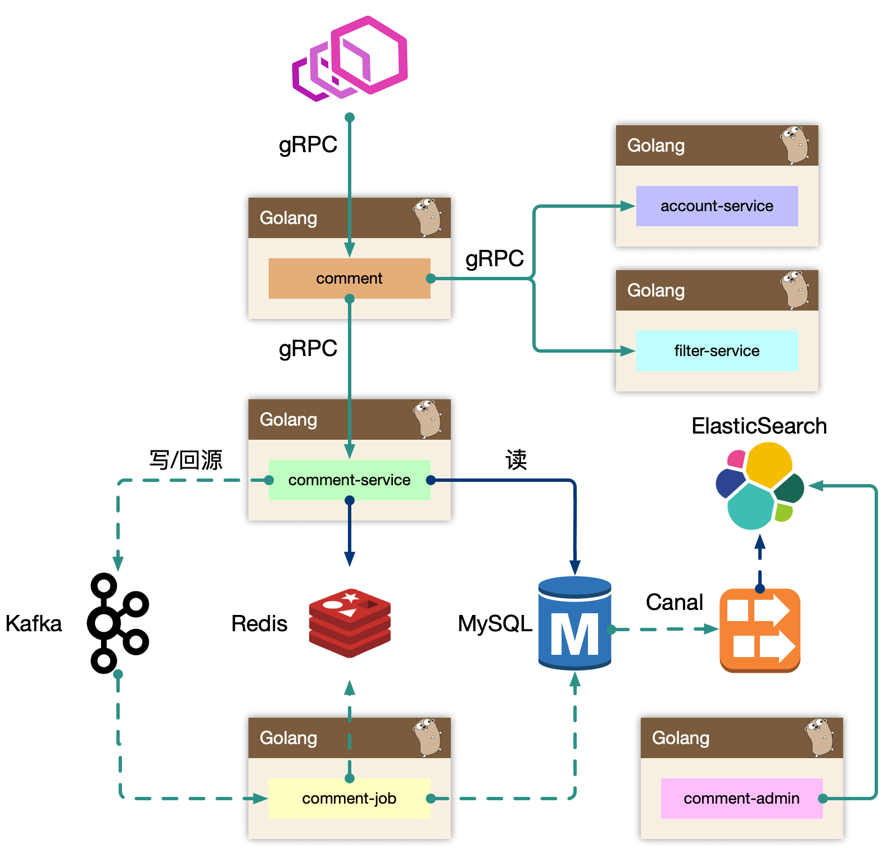
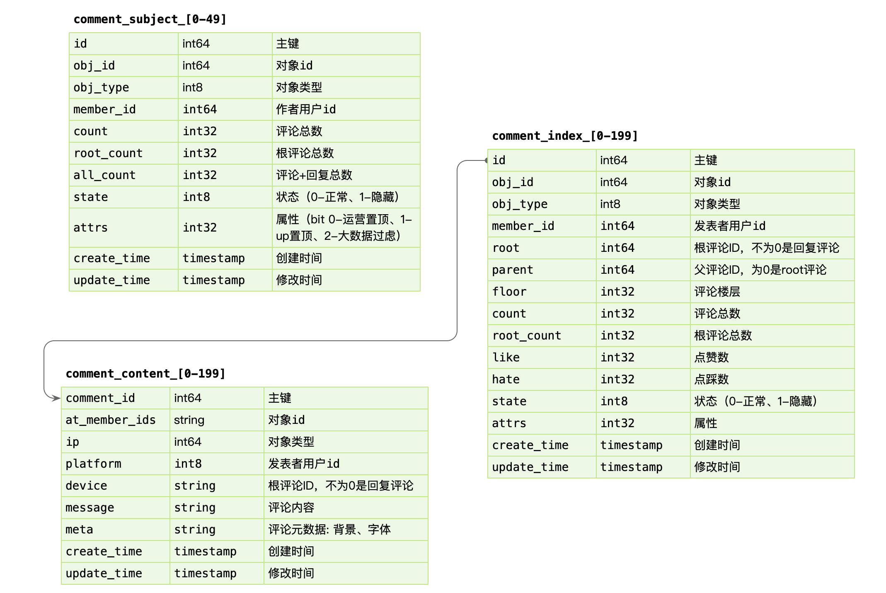
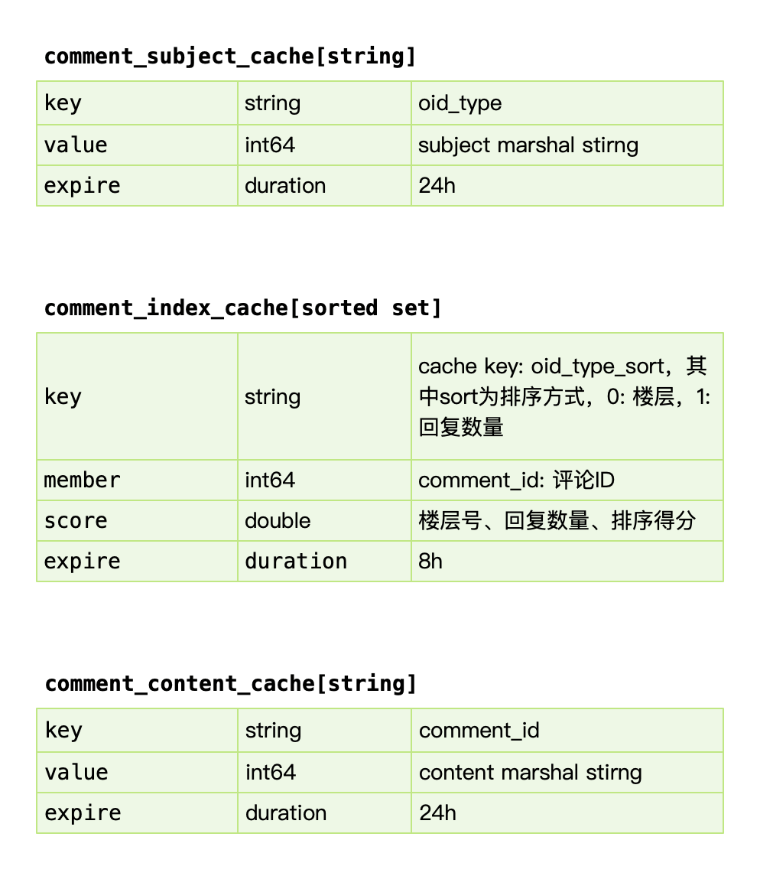

# 评论系统架构设计

## 功能模块

```sh
https://www.bilibili.com/video/BV1Sa4y1H7cy
```

**架构设计最重要的就是理解整个产品体系在系统中的定位**。搞清楚系统背后的背景，才能做出最佳的设计和抽象。不要做需求的翻译机，先理解业务背后的本质，事情的初衷。

评论系统，我们往小里做就是视频评论系统，往大里做就是评论平台，可以接入各种业务形态。

* 发布评论: 支持回复楼层、楼中楼。
  * 一般只做两层楼中楼
* 读取评论: 按照时间、热度排序。
* 删除评论: 用户删除、作者删除。
* 管理评论: 作者置顶、后台运营管理(搜索、删除、审核等)。

**在动手设计前，反复思考，真正编码的时间只有5%。**


## 架构设计

### 概览




* **BFF**: comment

复杂评论业务的服务编排，比如访问账号服务进行等级判定，同时需要在 BFF 面向移动端/WEB场景来设计 API，这一层抽象把评论的本身的内容列表处理(加载、分页、排序等)进行了隔离，关注在业务平台化逻辑上。
* **Service**: comment-service

服务层，去平台业务的逻辑，专注在评论功能的 API 实现上，比如发布、读取、删除等，关注在稳定性、可用性上，这样让上游可以灵活组织逻辑把基础能力和业务能力剥离。
* **Job**: comment-job

消息队列的最大用途是消峰处理。

* Admin: comment-admin

管理平台，按照安全等级划分服务，尤其划分运营平台，他们会共享服务层的存储层(MySQL、Redis)。运营体系的数据大量都是检索，我们使用 canal 进行同步到 ES 中，整个数据的展示都是通过 ES，再通过业务主键更新业务数据层，这样运营端的查询压力就下方给了独立的 fulltext search 系统。

* Dependency: account-service、filter-service

整个评论服务还会依赖一些外部 gRPC 服务，统一的平台业务逻辑在 comment BFF 层收敛，这里 account-service 主要是账号服务，filter-service 是敏感词过滤服务。

**架构设计等同于数据设计，梳理清楚数据的走向和逻辑。尽量避免环形依赖、数据双向请求等。**


### comment-service

comment-service，专注在评论数据处理(认真想下 Separation of Concerns)。

我们一开始是 comment-service 和 comment 是一层，业务耦合和功能耦合在一起，非常不利于迭代，当然在设计层面可以考虑目录结构进行拆分，但是架构层次来说，迭代隔离也是好的。

**读的核心逻辑**

Cache-Aside 模式，先读取缓存，再读取存储。早期 cache rebuild 是做到服务里的，对于重建逻辑，一般会使用 read ahead 的思路，即预读，用户访问了第一页，很有可能访问第二页，所以缓存会超前加载，避免频繁 cache miss。当缓存抖动发送时，特别容易引起集群 hundering herd(惊群) 现象，大量的请求会触发 cache rebuild，因为使用了预加载，容易导致服务 OOM。所以我们将其写到回源的逻辑里，使用了消息队列来进行逻辑异步化，对于当前请求只返回 mysql 中部分数据即止。

* 更新 MySQL  的时候往 kafka 发一条消息，表示 xxx 缓存已经失效了，需要 rebuild，由消费端异步进行 cache rebuild。

**写的核心逻辑:**

我们担心类似“明星出轨”等热点事件的发生，而且写和读相比较，写可以认为是透穿到存储层的，**系统的瓶颈往往就来自于存储层，或者有状态层**。对于写的设计上，我们认为刚发布的评论有极短的延迟(通常小于几 ms)对用户可见是可接受的，**把对存储的直接冲击下放到消息队列**，按照消息反压的思路，即如果存储 latency 升高，消费能力就下降，自然消息容易堆积，系统始终以最大化方式消费。

* 把写入请求发送到 kafka，由消费端进行写入，而不是用户请求时直接触发写入。这样可以保证 MySQL 不会被压垮。

Kafka 是存在 partition 概念的，可以认为是物理上的一个小队列，**一个 topic 是由一组 partition 组成**的，所以 Kafka 的吞吐模型理解为: 全局并行，局部串行的生产消费方式。对于入队的消息，可以**按照 hash(comment_subject) % N(partitions) 的方式进行分发**。那么某个 partition 中的 评论主题的数据一定都在一起，这样方便我们串行消费。

* 即 按主题 sharding，算法 hash(comment_subject) % N(partitions) 保证同一个主题的数据会进入同一个 partition。


> 同样的，我们处理回源消息也是类似的思路。


### comment-admin

mysql binlog 中的数据被 canal 中间件流式消费，获取到业务的原始 CRUD 操作，需要回放录入到 es 中，但是 es 中的数据最终是面向运营体系提供服务能力，需要检索的数据维度比较多，**在入 es 前需要做一个异构的 joiner，把单表变宽预处理好 join 逻辑，然后倒入到 es 中**。

* 如果运营后台需要使用评论系统相关联的其他数据来搜索，那就需要在 joiner 这里调用其他系统的RPC 接口把数据组装好之后再写入ES
* 如果需要做展示当不需要用于检索的数据则可以不写入ES，在运营系统检索完成后调用RPC服务查询并组装好即可。

一般来说，运营后台的检索条件都是组合的，使用 es 的好处是避免依赖 mysql 来做多条件组合检索，同时 mysql 毕竟是 oltp 面向线上联机事务处理的。**通过冗余数据的方式，使用其他引擎来实现检索**。

* MySQL 是 oltp 面向线上联机事务的数据库，一定不能当场离线分析数据库来用。

es 一般会存储检索、展示、primary key 等数据，当我们操作编辑的时候，找到记录的 primary key，最后交由 comment-admin 进行运营测的 CRUD 操作。

> 我们内部运营体系基本都是基于 es 来完成的。


### comment

comment 作为 BFF，是面向端，面向平台，面向业务组合的服务。所以平台扩展的能力，我们都在 comment 服务来实现，方便统一和准入平台，以统一的接口形式提供平台化的能力。

* 依赖其他 gRPC 服务，整合统一平台测的逻辑(比如发布评论用户等级限定)。
* 直接向端上提供接口，提供数据的读写接口，甚至可以整合端上，提供统一的端上 SDK。
* 需要对非核心依赖的 gRPC 服务进行降级，当这些服务不稳定时。


## 存储设计

### 数据库设计





**MySQL注意事项**

* 1）每张表一定要有主键ID、CreateTime、UpdateTime 这三个字段。
* 2）attr 属性通过 32 bit 位中的每一位都可以代表一个状态，即可以同时32个状态共存 
* MySQL pagesize 为 16K，尽量保证每行数据足够小，使得每页能多存一些数据
  * 每次IO只能读取一页数据，如果每条数据8K，那么一页就只有两条数据，查100条数据得走50次IO
  * 在这个评论系统中将索引和评论内容拆分出来，使得索引表更小，对于具体的内容则可以在需要时再查询

**数据写入**

事务更新 comment_subject，comment_index，comment_content 三张表，其中 content 属于非强制需要一致性考虑的。可以先写入 content，之后事务更新其他表。即便 content 先成功，后续失败仅仅存在一条 ghost(幽灵) 数据。

**数据读取**

基于 obj_id + obj_type 在 comment_index 表找到评论列表，WHERE root = 0 ORDER BY floor。之后根据 comment_index 的 id 字段捞出 comment_content 的评论内容。对于二级的子楼层，WHERE parent/root IN (id...)。
因为产品形态上只存在二级列表，因此只需要迭代查询两次即可。对于嵌套层次多的，产品上，可以通过二次点击支持。

> 是不是可以 Graph 存储？DGraph、HugeGraph 类似的图存储思路。


### 索引内容分离

comment_index: 评论楼层的索引组织表，实际并不包含内容。

comment_content: 评论内容的表，包含评论的具体内容。

其中 comment_index 的 id 字段和 comment_content 是1对1的关系，这里面包含几种设计思想。

* 表都有主键，即 cluster index，是物理组织形式存放的，comment_content 没有 id，是为了减少一次 二级索引查找，直接基于主键检索，同时 comment_id 在写入要尽可能的顺序自增。
* 索引、内容分离，方便 mysql datapage 缓存更多的 row，如果和 context 耦合，会导致更大的 IO。长远来看 content 信息可以直接使用 KV storage 存储。
* 动静分离：MySQL 有自己内部的 buffer，想内容这种基本不更新的数据就可以常驻内存，查询时效率较高。
  * buffer 是以表为单位的，如果不分离可能会造成 buffer 污染。


### 缓存设计



* comment_subject_cache: 对应主题的缓存，value 使用 protobuf 序列化的方式存入。我们早期使用 memcache 来进行缓存，因为 redis 早期单线程模型，吞吐能力不高。

* comment_index_cache: 使用 redis sortedset 进行索引的缓存，索引即数据的组织顺序，而非数据内容。参考过百度的贴吧，他们使用自己研发的拉链存储来组织索引，我认为 mysql 作为主力存储，利用 redis 来做加速完全足够，因为 cache miss 的构建，我们前面讲过使用 kafka 的消费者中处理，预加载少量数据，通过增量加载的方式逐渐预热填充缓存，而 redis sortedset skiplist 的实现，可以做到 O(logN) + O(M) 的时间复杂度，效率很高。

* sorted set 是要增量追加的，因此必须判定 key 存在，才能 zdd。

* comment_content_cache: 对应评论内容数据，使用 protobuf 序列化的方式存入。类似的我们早期使用 memcache 进行缓存。


增量加载 + lazy 加载


## 可用性设计

### Singleflight

对于热门的主题，如果存在缓存穿透的情况，会导致大量的同进程、跨进程的数据回源到存储层，可能会引起存储过载的情况，如何只交给同进程内，一个人去做加载存储?

> 使用分布式锁也可以解决问题，但是比较复杂，不建议使用。

使用**归并回源**的思路:

```sh
https://pkg.go.dev/golang.org/x/sync/singleflight
```

同进程只交给一个人去获取 mysql 数据，然后批量返回。同时这个 lease owner 投递一个 kafka 消息，做 index cache 的 recovery 操作。这样可以大大减少 mysql 的压力，以及大量透穿导致的密集写 kafka 的问题。

更进一步的，后续连续的请求，仍然可能会短时 cache miss，我们可以在进程内设置一个 short-lived flag，标记最近有一个人投递了 cache rebuild 的消息，直接 drop。
为什么我们不用分布式锁之类的思路？


CDN 回源，假设有 1000 个节点，每个节点又有10个进程，每个节点同时都有N个请求，都miss了，需要去源站拉最新的资源。先限制每个进程只发起一个请求去源站，这样每个节点就有10个请求，但是1000个节点就是1W个请求了，还是很多，如何继续优化？

这里需要用到 **归并**的思想。

增加二级节点，比如按大区分，华北的一级节点先去请求华北区的二级节点，在二级节点这里把请求都拦下来。这样最多就几十个二级节点，请求数大大降低。


### 热点

流量热点是因为突然热门的主题，被高频次的访问，因为底层的 cache 设计，一般是按照主题 key 进行一致性 hash 来进行分片，但是热点 key 一定命中某一个节点，这时候 remote cache 可能会变为瓶颈，因此做 cache 的升级 local cache 是有必要的，我们一般使用单进程自适应发现热点的思路，附加一个短时的 ttl local cache，可以在进程内吞掉大量的读请求。

> 进程本地缓存

在内存中使用 hashmap 统计每个 key 的访问频次，这里可以使用滑动窗口统计，即每个窗口中，维护一个 hashmap，之后统计所有未过去的 bucket，汇总所有 key 的数据。

> 环形数组，每次前5个时间节点对应的 bucket 中的 hashmap 来计算出 TopK，过了5个时间节点之前的数据就清空，后续复用这个 bucket。

之后使用小堆计算 TopK 的数据，自动进行热点识别。


## References