# 微服务可用性

## 目录

* 隔离
* 超时控制
* 过载保护
* 限流
* 降级
* 重试
* 负载均衡
* 最佳实践
* References


## 隔离

隔离，本质上是对系统或资源进行分割，从而实现当系统发生故障时能限定传播范围和影响范围，即发生故障后只有出问题的服务不可用，保证其他服务仍然可用。

* 服务隔离
  * 动静分离、读写分离

* 轻重隔离
  * 核心、快慢、热点

* 物理隔离
  * 线程、进程、集群、机房

### 服务隔离

**资源动静隔离:**

小到 CPU 的 cacheline false sharing、数据库 mysql 表设计中避免 bufferpool 频繁过期，隔离动静表，大到架构设计中的图片、静态资源等缓存加速。本质上都体现的一样的思路，即加速/缓存访问变换频次小的。比如 CDN 场景中，将静态资源和动态 API 分离，也是体现了隔离的思路：

* 降低应用服务器负载，静态文件访问负载全部通过CDN。
* 对象存储存储费用最低。
* 海量存储空间，无需考虑存储架构升级。
* 静态CDN带宽加速，延迟低。

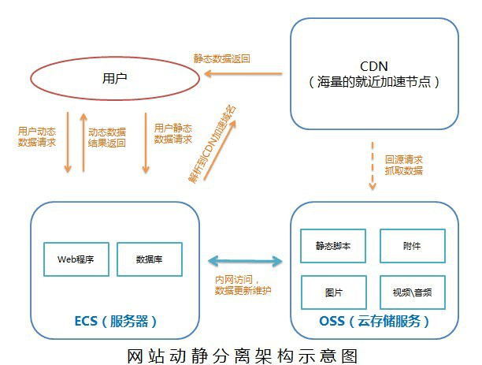


**数据表按更新频率分离：**

archive: 稿件表，存储稿件的名称、作者、分类、tag、状态等信息，表示稿件的基本信息。

> 在一个投稿流程中，一旦稿件创建**改动的频率比较低**。

archive_stat: 稿件统计表，表示稿件的播放、点赞、收藏、投币数量，比较高频的更新。

> 随着稿件获取流量，稿件被用户所消费，各类计数信息**更新比较频繁**。

MySQL BufferPool 是用于缓存 DataPage 的，DataPage 可以理解为缓存了表的行，那么如果频繁更新 DataPage 不断会置换，会导致命中率下降的问题，**所以我们在表设计中，仍然可以沿用类似的思路**，其主表基本更新，在上游 Cache 未命中，透穿到 MySQL，仍然有 BufferPool 的缓存。

读写分离：主从、Replicaset、CQRS。

> CQRS — Command Query Responsibility Segregation，故名思义是将 command 与 query 分离的一种模式


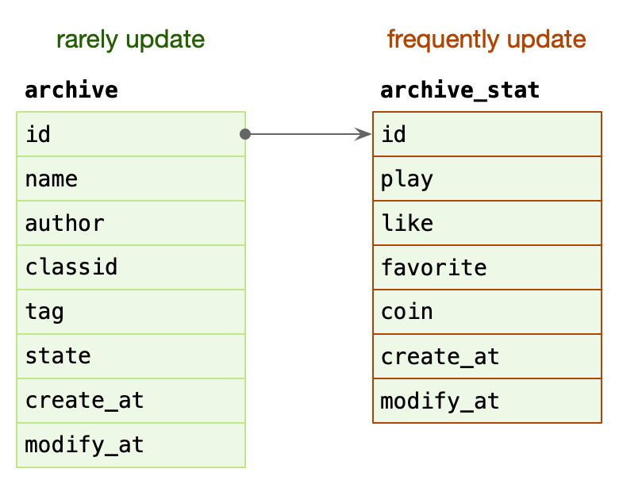


### 轻重隔离

**核心隔离:**

业务按照 Level 进行资源池划分(L0/L1/L2)，越重要越关键的服务分配更多的资源。

* 核心/非核心的故障域的差异隔离(机器资源、依赖资源)。
* 多集群，通过冗余资源来提升吞吐和容灾能力。

**快慢隔离：**

我们可以把服务的吞吐想象为一个池，当突然洪流进来时，池子需要一定时间才能排放完，这时候其他支流在池子里待的时间取决于前面的排放能力，耗时就会增高，对小请求产生影响。

**将不同的业务根据请求量或资源占用度进行分离， 避免把短时任务和耗时任务放在一起处理。**

日志传输体系的架构设计中，整个流都会投放到一个 kafka topic 中(早期设计目的: 更好的顺序IO)，流内会区分不同的 logid，logid 会有不同的 sink 端，它们之前会出现差速，比如 HDFS 抖动吞吐下降，ES 正常水位，全局数据就会整体反压。

* 按照各种纬度隔离：sink、部门、业务、logid、重要性(S/A/B/C)。

业务日志也属于某个 logid，日志等级就可以作为隔离通道。

**热点隔离：**

何为热点？热点即经常访问的数据。很多时候我们希望统计某个热点数据中访问频次最高的 Top K 数据，并对其访问进行缓存。比如：

* 小表广播: **从 remotecache 提升为 localcache**，app 定时更新，甚至可以让运营平台支持广播刷新 localcache。atomic.Value

  * 直接通过接口请求后保存到本地，每个进程都冗余一份数据

* 主动预热: 比如直播房间页高在线情况下bypass 监控主动防御。

  * 主动检测到高压力后将 remotecache 缓存到本地已降低压力，**否则出现问题时用户会下意识的去疯狂刷新导致请求猛增，最终服务被打掉**。

  * 比如直播的时候现场设备出问题了，导致直播间黑屏，观众肯定会以为是自己网络问题，于是开始疯狂刷新，本来就高在线压力很大了，这样刷新导致请求量再次猛增好几倍，后台服务直接被打掉。


### 物理隔离

**线程隔离：**

像下面这样共用线程池的情况下，如果有任何一个服务出现异常最终都会占满整个线程池，导致其他共用一个线程池的服务无法正常运行。

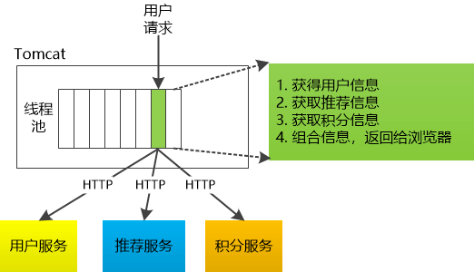

调整后每个服务单独使用自己的线程池，即可避免该问题。

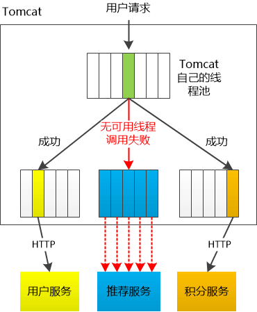

主要通过线程池进行隔离，也是实现服务隔离的基础。把业务进行分类并交给不同的线程池进行处理，当某个线程池处理一种业务请求发生问题时，不会讲故障扩散和影响到其他线程池，保证服务可用。

**对于 Go 来说，所有 IO 都是 Nonblocking，且托管给了 Runtime，只会阻塞Goroutine，不阻塞 M，我们只需要考虑 Goroutine 总量的控制，不需要线程模型语言的线程隔离。**

当信号量达到 maxConcurrentRequests 后，再请求会触发 fallback。

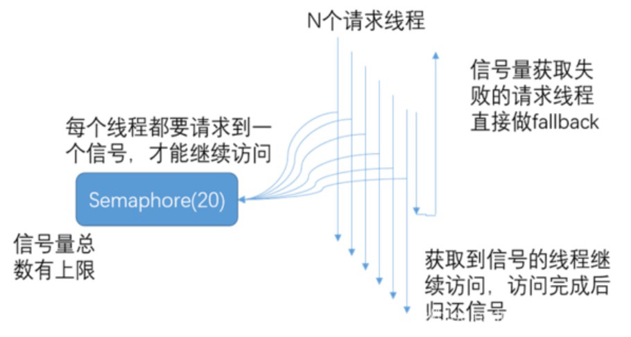


或者控制线程池大小,当线程池到达 maxSize 后，再请求会触发 fallback 接口进行熔断。

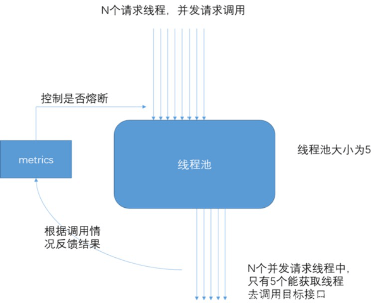


**进程隔离：**

容器化(docker)，容器编排引擎(k8s)。我们15年在 KVM 上部署服务；16年使用 Docker Swarm；17年迁移到 Kubernetes，到年底在线应用就全托管了，之后很快在线应用弹性公有云上线；20年离线 Yarn 和 在线 K8s 做了在离线混部(错峰使用)，之后计划弹性公有云配合自建 IDC 做到离线的混合云架构。


**集群隔离：**

回顾 gRPC，我们介绍过多集群方案，即逻辑上是一个应用，物理上部署多套应用，通过 cluster 区分。

> 多活建设完毕后，我们应用可以划分为：region.zone.cluster.appid


### Case Stduy

* 早期转码集群被超大视频攻击，导致转码大量延迟。
  * 拆分成多个集群，一个处理的大视频，一个中视频，一个小视频，这样大视频被攻击时，不影响其他两个。
* 入口Nginx(SLB)故障，影响全机房流量入口故障。
  * 同样可以进行隔离
* 缩略图服务，被大图实时缩略吃完所有 CPU，导致正常的小图缩略被丢弃，大量503。
  * 占资源的 gif 和其他png、jpg分离
* 数据库实例 cgroup 未隔离，导致大 SQL 引起的集体故障。
  * 增加 cgroup
* INFO 日志量过大，导致异常 ERROR 日志采集延迟。


## 超时控制

超时控制，我们的组件能够快速失效(fail fast)，因为我们不希望等到断开的实例直到超时。没有什么比挂起的请求和无响应的界面更令人失望。这不仅浪费资源，而且还会让用户体验变得更差。我们的服务是互相调用的，所以在这些延迟叠加前，应该特别注意防止那些超时的操作。

* 网路传递具有不确定性。
  * 连接超时
  * 写超时
  * 读超时
* 客户端和服务端不一致的超时策略导致资源浪费。
* “默认值”策略。
  * 代码里限定超时时间最大、最小值1，防止因为配置文件多写个0或者没写导致的异常情况
* 高延迟服务导致 client 浪费资源等待，使用超时传递: 进程间传递 + 跨进程传递。
  * 比如客户端设置了100ms超时，那服务端就不能硬执行200ms，然后再返回超时，因为此时客户端已经超时了，后续服务端执行的结果也没有意义了

超时控制是微服务可用性的第一道关，良好的超时策略，可以尽可能让服务不堆积请求，尽快清空高延迟的请求，释放 Goroutine。


### latency SLO 定义

实际业务开发中，我们依赖的微服务的超时策略并不清楚，或者随着业务迭代耗时超生了变化，意外的导致依赖者出现了超时。

* 服务提供者定义好 latency SLO，更新到 gRPC Proto 定义中，服务后续迭代，都应保证 SLO。

```protobuf
package google.example.library.v1;

service LibraryService {
    // Lagency SLO: 95th in 100ms, 99th in 150ms.
    rpc CreateBook(CreateBookRequest) returns (Book); 
    rpc GetBook(GetBookRequest) returns Book);
    rpc ListBooks(ListBooksRequest) returns (ListBooksResponse);
}
```


避免出现意外的默认超时策略，或者意外的配置超时策略。

* kit 基础库兜底默认超时，比如 100ms，进行配置防御保护，避免出现类似 60s 之类的超大超时策略。
* 配置中心公共模版，对于未配置的服务使用公共配置。


### 超时传递

超时传递指的是把当前服务的剩余 Quota 传递到下游服务中，继承超时策略，控制请求级别的全局超时控制。

> 当上游服务已经超时返回 504，但下游服务仍然在执行，会**导致浪费资源做无用功**。

**进程内超时控制**

 一个请求在每个阶段(网络请求)开始前，就要检查是否还有足够的剩余来处理请求，以及继承他的超时策略，使用 Go 标准库的 context.WithTimeout。

```go
func (c *asiiConn) Get(ctx context.Context, key string) (result *Item, err error) {
	c.conn.SetWriteDeadline(shrinkDeadline(ctx, c.writeTimeout))
	if _, err = fmt.Fprintf(c.rw, "gets %s\r\n", key); err != nil {

```


* A gRPC 请求 B，1s超时。
* B 使用了300ms 处理请求，再转发请求 C。
* C 配置了600ms 超时，但是实际只用了500ms。
* 到其他的下游，发现余量不足，取消传递。

在需要强制执行时，下游的服务可以覆盖上游的超时传递和配额。
在 gRPC 框架中，会依赖 gRPC Metadata Exchange，基于 HTTP2 的 Headers 传递 grpc-timeout 字段，自动传递到下游，构建带 timeout 的 context。


### 超时监控

* 双峰分布: 95%的请求耗时在100ms内，5%的请求可能永远不会完成(长超时)。
* 对于监控不要只看mean，可以看看耗时分布统计，比如 95th，99th。
* 设置合理的超时，拒绝超长请求，或者当Server 不可用要主动失败。
  

**超时决定着服务线程耗尽。**


### Case Stduy

* SLB 入口 Nginx 没配置超时导致连锁故障。
  * 配置超时
* 服务依赖的 DB 连接池漏配超时，导致请求阻塞，最终服务集体 OOM。
  * 增加超时默认值
* 下游服务发版耗时增加，而上游服务配置超时过短，导致上游请求失败。
  * 定义 SLO 同步更新


## 过载保护

### 限流


**令牌桶算法**

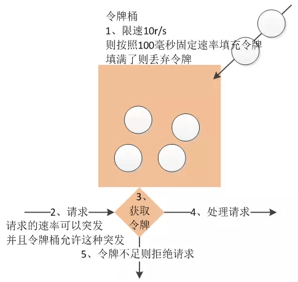

是一个存放固定容量令牌的桶，按照固定速率往桶里添加令牌。令牌桶算法的描述如下：

* 假设限制2r/s，则按照500毫秒的固定速率往桶中添加令牌。
* 桶中最多存放 b 个令牌，当桶满时，新添加的令牌被丢弃或拒绝。
* 当一个 n 个字节大小的数据包到达，将从桶中删除n 个令牌，接着数据包被发送到网络上。
* 如果桶中的令牌不足 n 个，则不会删除令牌，且该数据包将被限流（要么丢弃，要么缓冲区等待）。

> token-bucket rate limit algorithm: [x/time/rate](https://pkg.go.dev/golang.org/x/time/rate)

有一定的请求爆发，因为桶里可以存一些令牌。

**漏桶算法**

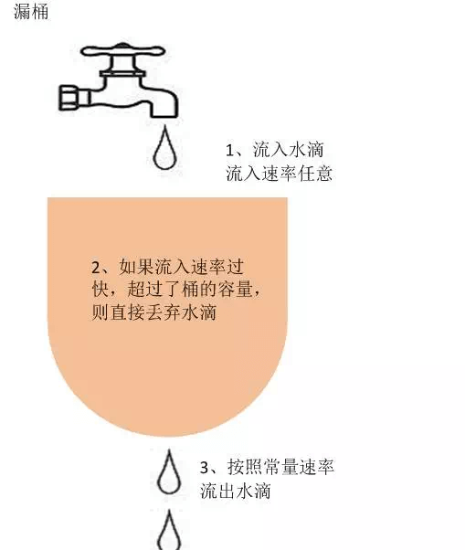

作为计量工具(The Leaky Bucket Algorithm as a Meter)时，可以用于流量整形(Traffic Shaping)和流量控制(TrafficPolicing)，漏桶算法的描述如下：

* 一个固定容量的漏桶，按照常量固定速率流出水滴。
* 如果桶是空的，则不需流出水滴。
* 可以以任意速率流入水滴到漏桶。
* 如果流入水滴超出了桶的容量，则流入的水滴溢出了（被丢弃），而漏桶容量是不变的。
  

> leaky-bucket rate limit algorithm: [/go.uber.org/ratelimit](https://pkg.go.dev/go.uber.org/ratelimit)

速率永远固定。


### 指标

漏斗桶/令牌桶确实能够保护系统不被拖垮, 但不管漏斗桶还是令牌桶, 其防护思路都是设定一个指标, 当超过该指标后就阻止或减少流量的继续进入，当系统负载降低到某一水平后则恢复流量的进入。但其通常都是被动的，**其实际效果取决于限流阈值设置是否合理，但往往设置合理不是一件容易的事情**。

* 集群增加机器或者减少机器限流阈值是否要重新设置?
* 设置限流阈值的依据是什么?
* 人力运维成本是否过高?
* 当调用方反馈429(Too Many Requests)时, 这个时候重新设置限流, 其实流量高峰已经过了重新评估限流是否有意义?

**极限压测**

正常压测都是逐渐增加压力，当错误率达到多少时就停。极限压测就是压到死，看下在极限流量下是什么样的表现，更符合真实的故障场景。

> 接口响应变慢时，用户会下意识的进行刷新，导致压力成倍增加。


这些其实都是采用漏斗桶/令牌桶的缺点, 总体来说就是**太被动**, 不能快速适应流量变化。
因此我们需要一种**自适应**的限流算法，即: 过载保护，根据系统当前的负载**自动**丢弃流量。


### 过载保护

计算系统临近过载时的峰值吞吐作为限流的阈值来进行流量控制，达到系统保护。

* 服务器临近过载时，主动抛弃一定量的负载，目标是自保。
* 在系统稳定的前提下，保持系统的吞吐量。

常见做法：利特尔法则 

* CPU、内存作为信号量进行节流。

* 队列管理: 队列长度、LIFO。

* 可控延迟算法: [CoDel](https://blog.csdn.net/dog250/article/details/72849893)。
  * [Go实现](https://github.com/joshbohde/codel)
* TCP协议中的BBR算法


**利特尔法则 **

具体公式为：L = λW

* L：系统中总的请求数
* W ：每个请求平均处理时间
* λ ：系统QPS

如：QPS=2000，每个请求平均处理0.1s，那么任意时间系统内的请求数=2000*0.1=200。

 

*如何计算接近峰值时的系统吞吐？*

* CPU: 使用一个独立的线程采样，每隔 250ms 触发一次。在计算均值时，使用了**简单滑动平均**去除峰值的影响。
  * 具体公式为：`前面的数据的均值*权重W+当前的数据*(1-权重W)`
  * 假设有n个数`1,2,3,4...n`，简单计算均值需要将n个数都相加在求均值，滑动平均实现为，假设权重为0.3和0.7，第一个数均值1，第二个数即`1*0.3+2*0.7=1.7`,第三个数为`1.7*0.3+3*0.7=2.61`,这样就只需要知道两个数就可以求均值了
* Inflight: 当前服务中正在进行的请求的数量。
* Pass&RT: 最近5s，pass 为每100ms采样窗口内成功请求的数量，rt 为单个采样窗口中平均响应时间。

**具体算法**

* 我们使用 CPU 的滑动均值(CPU > 80%)作为启发阈值，一旦触发进入到过载保护阶段，具体算法为：`(pass* rt) < inflight`，多出来的请求直接拒绝掉，不放行。

* 限流效果生效后，CPU 会在临界值(80%)附近抖动，如果不使用冷却时间，那么一个短时间的 CPU 下降就可能导致大量请求被放行，严重时会打满 CPU。
  * 所以需要增加冷却时间，在冷却时间内都算过载保护。
* 在冷却时间后，重新判断阈值(CPU > 80% )，是否持续进入过载保护。


## 限流

限流是指在一段时间内，定义某个客户或应用可以接收或处理多少个请求的技术。例如，通过限流，你可以过滤掉产生流量峰值的客户和微服务，或者可以确保你的应用程序在自动扩展(Auto Scaling)失效前都不会出现过载的情况。

* 令牌桶、漏桶算法 针对单个节点，无法**分布式限流**。
* QPS 限流
  * 不同的请求可能需要数量迥异的资源来处理。
  * 某种静态 QPS 限流不是特别准。

* 给每个用户设置限制
  * 全局过载发生时候，针对某些“异常”进行控制。
  * 一定程度的“超卖”配额。

* 按照优先级丢弃。
* 拒绝请求也需要成本。


### 分布式限流

分布式限流，是为了控制某个应用全局的流量，而非真对单个节点纬度。

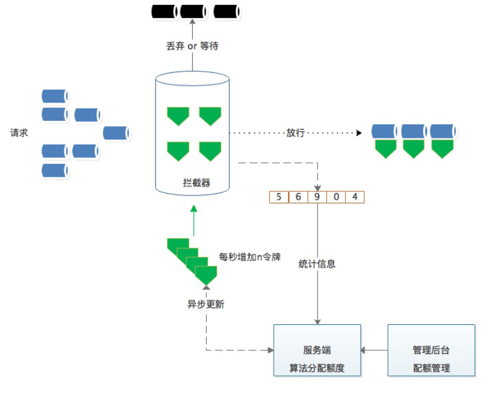

**第一版：**

每次处理请求前，先去 Redis 查询一下是否达到频率上限了。

**问题：**

* 单个大流量的接口，使用 redis 容易产生热点。
* pre-request 模式对性能有一定影响，高频的网络往返。

**第二版**
从获取单个 quota 升级成批量 quota。quota: 表示速率，获取后使用令牌桶算法来限制。

每次心跳后，异步批量获取 quota，可以大大减少请求 redis 的频次，获取完以后本地消费，基于令牌桶拦截。

**问题**

每次申请的配额需要手动设定静态值略欠灵活，比如每次要20，还是50。

如何基于单个节点按需申请，并且避免出现不公平的现象？

**第三版**

初次使用默认值，一旦有过去历史窗口的数据，可以**基于历史窗口数据进行 quota 请求**。


**思考：**
我们经常面临给一组用户划分稀有资源的问题，他们都享有等价的权利来获取资源，但是其中一些用户实际上只需要比其他用户少的资源。

#### Max-Min Fairness 算法

那么我们如何来分配资源呢？一种在实际中广泛使用的分享技术称作**最大最小公平分享”(Max-Min Fairness)**。
直观上，**公平分享分配给每个用户想要的可以满足的最小需求，然后将没有使用的资源均匀的分配给需要‘大资源’的用户**。

最大最小公平分配算法的形式化定义如下：

* 资源按照需求递增的顺序进行分配。
* 不存在用户得到的资源超过自己的需求。
* 未得到满足的用户等价的分享资源。

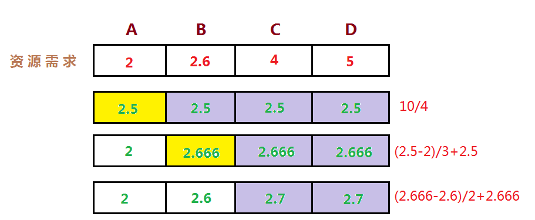


* 0）需要将每个人按照需要的资源**升序排列**。

* 1）假设一共有 10 个资源分给 4 个人，平均下来每人 2.5 个。
* 但是 A 只要 2 个，那么多出来的 0.5 个就可以均分给另外 3 个人。此时 A 获取资源 2，另外3人每人2.666个。
* 然后B只需要2.6个，那么再把多出来的0.66个分给剩下来的 2 个人。此时 A 2、B 2.6，CD都是2.7。
* 接下来 C 需要 4 个，但是一共分到了 2.7 个没有剩余的，所以不处理
* 最后 D 需要 5 个，也只分到了 2.7 也不需要处理。


### 对比


| 类型     | 优点                                                         | 缺点                                                         | 实现                                                         |
| -------- | ------------------------------------------------------------ | ------------------------------------------------------------ | ------------------------------------------------------------ |
| 单机限制 | 1.实现简单<br/>2.稳定可靠<br/>3.性能高                       | 1.流量不均匀会引发误限制<br/>2.机器数变化时配额要手动调整容易出错 | 各个语言都要对应实现<br/>如 Golang 的令牌桶golang/x/time/ratelimit |
| 动态流控 | 根据服务情况，动态限流 <br/>不用调整额度                     | 1.需要主动搜集请求的性能数据(cpu load<br/>成功率耗时)<br/>2.客户端主动善意限流.<br/>3.一般只限于接口调用支持的范围小应用<br/>场景狭窄 | BBR限流<br/>广义上各种连接池也属于这类                       |
| 全局限流 | 1.流量不均不会误触发限流<br/>2.机器数变动时候无需调整<br/>3.应用场景丰富接口DB等任何资<br/>源都可以使用 | 1.实现较复杂<br/>2.需要手动配置                              | 无                                                           |


### 重要性

每个接口配置阈值，运营工作繁重，最简单的我们配置服务级别 quota，更细粒度的，我们可以根据不同重要性设定 quota，我们引入了重要性(criticality):

* 最重要 CRITICAL_PLUS，为最终的要求预留的类型，拒绝这些请求会造成非常严重的用户可见的问题。
* 重要 CRITICAL，生产任务发出的默认请求类型。拒绝这些请求也会造成用户可见的问题。但是可能没那么严重。
* 可丢弃的 SHEDDABLE_PLUS 这些流量可以容忍某种程度的不可用性。这是批量任务发出的请求的默认值。这些请求通常可以过几分钟、几小时后重试。
* 可丢弃的 SHEDDABLE 这些流量可能会经常遇到部分不可用情况，偶尔会完全不可用。

gRPC 系统之间，需要**自动传递重要性信息**。

> 如果后端接受到请求 A，在处理过程中发出了请求 B 和 C 给其他后端，请求 B 和 C 会使用与 A 相同的重要性属性。

* 全局配额不足时，优先拒绝低优先级的。
* 全局配额，可以按照重要性分别设置。
* 过载保护时，低优先级的请求先被拒绝。


### 熔断

**断路器(Circuit Breakers)**: 为了限制操作的持续时间，我们可以使用超时，超时可以防止挂起操作并保证系统可以响应。因为我们处于高度动态的环境中，几乎不可能确定在每种情况下都能正常工作的准确的时间限制。断路器以现实世界的电子元件命名，因为它们的行为是都是相同的。断路器在分布式系统中非常有用，因为重复的故障可能会导致雪球效应，并使整个系统崩溃。

* 服务依赖的资源出现大量错误。
* 某个用户超过资源配额时，后端任务会快速拒绝请求，返回“配额不足”的错误，但是拒绝回复仍然会消耗一定资源。有可能后端忙着不停发送拒绝请求，导致过载。

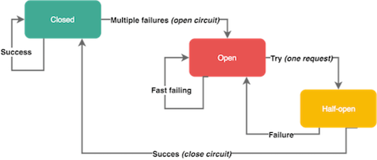

一般的熔断器都分为 3 个状态：

* 1）Open
* 2）Close
* 3）Half-open

QPS 大于 100 且失败率大于 30% 就进入 Open 状态。

> 限制 QPS 主要用于防止出现 请求了两次失败一次，就打开断路器的情况。

断路器打开一段时间后，会自动进入“半开”状态，此时断路器可允许一个请求访问依赖的服务，若请求成功，则断路器关闭，否则断路器转为“打开”状态；


### Google SRE 算法


Google SRE 中推荐的算法：

```sh
max(0, (requests - K*accepts) / (requests + 1))
```

* requests：请求数
* K：系数，激进程度，K 越大越激进。
* accepts：请求成功数

当 requests 无限大时，系统肯定无限报错，accepts 无限下，最终公式会**趋近 1**。即此时会拦截接近 100% 的请求；

反之 accepts 接近 requests 时 公式值会**等于 0** ，即不拦截任何请求。


Golang 实现：

```go
type sreBreaker struct {
	
}
func (b *sreBreaker) Allow() error {
    // success 为公式中的accepts, total 为公式中的 requests
	success, total := b.stat.Value() 
    // b.k 即公式中的 K
	k := b.k * float64(success) 
    // 当前总请求数小于阈值（如熔断器的中100qps）时直接放行
    // 或者总请求数小于成功数*激进系数时也直接放行，因为此时 requests - K*accepts 小于0
	if total < b.request || float64(total) < k {
		return nil
	}
    // 这就是SRE中的公式，dr 为需要拦截的请求率
	dr := math.Max(0, (float64(total)-k)/float64(total+1))
    // rr 为设置阈值
	rr := b.r.Float64()
    // 未到阈值时也直接放行
	if dr <= rr {
		return nil
	}
	return ecode.ServiceUnavailable
}
```


### 客户端流控

positive feedback: 用户总是积极重试，访问一个不可达的服务。

* 客户端需要限制请求频次，retry backoff 做一定的请求退让。
* 可以通过接口级别的error_details，挂载到每个 API 返回的响应里。
  * 通过接口动态返回，不建议写死在客户端


```go
func (bc BackoffConfig) backoff(retries int) time.Duration {
	if retries == 0 {
		return bc.baseDelay
	}
	backoff, max := float64(bc.baseDelay), float64(bc.MaxDelay)
	for backoff < max && retries > 0 {
		backoff *= bc.factor
		retries--
	}
	if backoff > max {
		backoff = max
	}
	// Randomize backoff delays so that if a cluster of requests start at
	// the same time, they won't operate in lockstep.
	backoff *= 1 + bc.jitter*(rand.Float64()*2-1)
	if backoff < 0 {
		return 0
	}
	return time.Duration(backoff)
}
```


#### 错峰

如王者荣耀这种玩家巨多的游戏，如果更新版本后大家都同时去下载，肯定会出现一个超高的 CDN 峰值，为了避免峰值，一般会分批给玩家推送更新请求，从而避免峰值。


### Gutter

基于熔断的 gutter kafka ，用于接管自动修复系统运行过程中的负载，这样只需要付出10%的资源就能解决部分系统可用性问题。

我们经常使用 failover 的思路，但是完整的 failover 需要翻倍的机器资源，平常不接受流量时，资源浪费。高负载情况下接管流量又不一定完整能接住。所以这里核心利用熔断的思路，**是把抛弃的流量转移到 gutter 集群，如果 gutter 也接受不住的流量，重新回抛到主集群**，最大力度来接受。

> 利用双熔断提升可用性，增加了整个链路的长度，让消息在系统中呆的时间变长，从而降低压力。


### Case Study

* 二层缓存穿透、大量回源导致的核心服务故障。
  * 熔断保证核心服务稳定运行
* 异常客户端引起的服务故障(query of death)
  * 请求放大。
    * 可以用限流来解决
  * 资源数放大。
    * 可以用限流来解决
* 用户重试导致的大面积故障。
  * 客户端流控


## 降级

通过降级回复来减少工作量，或者**丢弃不重要的请求**。而且需要了解哪些流量可以降级，并且有能力区分不同的请求。我们通常提供降低回复的质量来答复减少所需的计算量或者时间。

我们自动降级通常需要考虑几个点：

* 确定具体采用哪个指标作为流量评估和优雅降级的**决定性指标**(如，CPU、延迟、队列长度、线程数量、错误等)。
  * 一般关注 CPU 和错误
* 当服务进入降级模式时，需要执行什么动作？
  * 返回一些不需要大量计算的结果
  * 或者返回空
* 流量抛弃或者优雅降级应该在服务的**哪一层实现**？是否需要在整个服务的每一层都实现，还是可以选择某个高层面的关键节点来实现？
  * 通常在 BFF 层 或者网关层做。

同时我们要考虑以下几点：

* **优雅降级不应该被经常触发**
  * 通常经常触发是因为对容量规划的失误，或者是意外的负载。
* 演练，代码平时不会触发和使用，需要定期针对一小部分的流量进行演练，保证模式的正常。
  * 防止关键时候掉链子
* 应该足够简单。


**降级本质为: 提供有损服务。**

* UI 模块化，非核心模块降级。
  * BFF 层聚合 API，模块降级。

* 页面上一次缓存副本。
  * 客户端缓存上一次获取到的数据，防止在后续请求失败白屏
* 默认值、热门推荐等。
  * 比如后端请求 redis 获取缓存数据失败后直接从本地缓存中返回了一些数据
  * 所以服务端也可以像客户端一样缓存一下数据，便于降级时使用
* 流量拦截 + 定期数据缓存(过期副本策略)。

处理策略

* 页面降级、延迟服务、写/读降级、缓存降级
* 抛异常、返回约定协议、Mock 数据、Fallback 处理


### Case Study

* 客户端解析协议失败，app 奔溃。
  * 服务端降级时返回的内容一定要和客户端约定一下，不然客户端无法识别会导致各种奇怪的问题。
  * 千万不正常的时候返回ABC字段，降级时返回DEF字段。
  * **强烈建议使用 protobuf**，所有字段都是固定的，不容易出错
* 客户端部分协议不兼容，导致页面失败。
  * 同上，需要对好协议
* local cache 数据源缓存，发版失效 + 依赖接口故障，引起的白屏。
  * 重启后可以先加载 local cache 才接收外部流量
  * 或者将 local cache 的热数据在 remote cache存一份，local cache 为空时再去查询 remote cache 。
* 没有 playbook，导致的 MTTR 上升。
  * playbook：操作手册
  * MTTR：出现故障后的平均修复时间
  * 准备好 playbook，在出现故障时根据 playbook 一步一步执行即可，不然线上出问题了，慌得一批，手忙脚乱的，一个简单问题都搞半天。


## 重试

当请求返回错误(例: 配额不足、超时、内部错误等)，对于 backend 部分节点过载的情况下，倾向于立刻重试，但是需要留意重试带来的流量放大:

* 限制重试次数和基于重试分布的策略(重试比率: 10%)。
  * 一般不能超过 3 次。
  * 每次重试时在 metadata 中带上重试的次数，服务端可以进行统计，重试比率超过一定值时直接报错，不在处理重试请求。
  * 否则重试比率一直增加，会导致流量放大从而出现其他的问题。
* 随机化、指数型递增的重试周期: exponential ackoff + jitter。
* client 测记录重试次数直方图，传递到 server，进行分布判定，交由 server 判定拒绝。

**只应该在失败的这层进行重试**，当重试仍然失败，全局约定错误码“过载，无须重试”，**避免级联重试**。

比如请求链路为`BFE-->SLB-->API Gateway --> BFF --> Microservice --> DB`

Microservice 请求 DB 失败后，重试 3 次，3次都失败后返回全局错误码`过载，无须重试`到 BFF 层，BFF 此时就不能再重试了，否则就会造成级联重试，导致重试次数指数级上升。

Google SRE 重试算法。


### Case Study

* Nginx upstream retry 过大，导致服务雪崩。
  * 重试会放大流量，当负载不高时都无所谓
  * 当负载原本就很高时，无异于**雪上加霜**，对下流服务压力很大。
* 业务不幂等，导致的重试，数据重复。
  * 全局唯一 ID: 根据业务生成一个全局唯一 ID，在调用接口时会传入该 ID，接口提供方会从相应的存储系统比如 redis 中去检索这个全局 ID 是否存在，如果存在则说明该操作已经执行过了，将拒绝本次服务请求；否则将相应该服务请求并将全局 ID 存入存储系统中,之后包含相同业务 ID 参数的请求将被拒绝。
  * 去重表: 这种方法适用于在业务中有唯一标识的插入场景。比如在支付场景中，一个订单只会支付一次，可以建立一张去重表,将订单 ID 作为唯一索引。把支付并且写入支付单据到去重表放入一个事务中了，这样当出现重复支付时，数据库就会抛出唯一约束异常,操作就会回滚。这样保证了订单只会被支付一次。
  * 多版本并发控制: 适合对更新请求作幂等性控制,比如要更新商品的名字，这是就可以在更新的接口中增加一个版本号来做幂等性控制。


多层级重试传递，放大流量引起雪崩。


## 负载均衡

数据中心内部的负载均衡
在理想情况下，某个服务的负载会完全均匀地分发给所有的后端任务。在任何时刻，最忙和最不忙的节点永远消耗同样数量的CPU。

目标：

* 均衡的流量分发。
* 可靠的识别异常节点。
* scale-out，增加同质节点扩容。
* 减少错误，提高可用性。


我们发现在 backend 之间的 load 差异比较大：

* 每个请求的处理成本不同。
* 物理机环境的差异:
  * 服务器很难强同质性。
  * 存在共享资源争用（内存缓存、带宽、IO等）。

* 性能因素:
  * FullGC，GC 的时候对性能影响比较大。
  * JVM JIT，服务刚启动需要预热。

参考JSQ（最闲轮训）负载均衡算法带来的问题，缺乏的是服务端全局视图，因此我们目标需要综合考虑：**负载+可用性**。

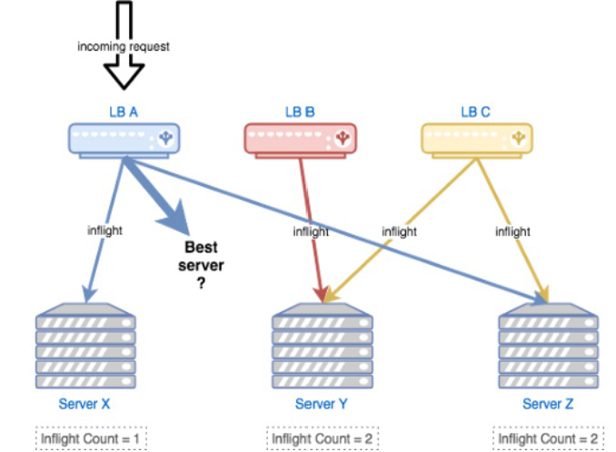

每个LB都感知不到还有其他LB的存在，对LB A 来说，此时Server X 和 Z 都有一个请求在进行，那么这个请求就会发送到‘最闲的’ Server Y,然后实际情况并不是这样的。


参考了[《The power of two choices in randomized load balancing》](https://ieeexplore.ieee.org/document/963420)的思路，我们使用 **`the choice-of-2`** 算法，**随机选取的两个节点进行打分，选择更优的节点**:

> 在 gRPC loadbalance 层实现，自定义 loadbalance

* 选择 backend：CPU，client：health(success)、inflight、latency 作为指标，使用一个简单的线性方程进行打分。
  * CPU 占用率，moving average
  * success：成功率 moving average
  * inflight：进行中的请求数，请求前++，请求后--
  * latency：延迟，moving average
* 对新启动的节点使用常量惩罚值(penalty)，以及使用探针方式最小化放量，进行预热。
* 打分比较低的节点，避免进入“永久黑名单”而无法恢复，使用`统计衰减`的方式，让节点指标逐渐恢复到初始状态(即默认值)。

指标计算结合 moving average，使用时间衰减，计算**vt = v(t-1) * β + at * (1-β)** ，β为若干次幂的倒数即: Math.Exp((-span) / 600ms)

> 牛顿冷却定律


## 最佳实践

变更管理:

* 70％的问题是由变更引起的，恢复可用代码并不总是坏事。
* 先测试，再灰度，最后全量更新。

避免过载:

* 过载保护、流量调度等。

依赖管理:

* 任何依赖都可能故障，做 chaos monkey testing，注入故障测试。

优雅降级:

* 有损服务，避免核心链路依赖故障。

重试退避:

* 退让算法，冻结时间，API retry detail 控制策略。

超时控制:

* 进程内 + 服务间 超时控制。

极限压测 + 故障演练。

扩容 + 重启 + 消除有害流量。


## References

```sh'
http://www.360doc.com/content/16/1124/21/31263000_609259745.shtml
http://www.infoq.com/cn/articles/basis-frameworkto-implement-micro-service/
http://www.infoq.com/cn/news/2017/04/linkerd-celebrates-one-year
https://medium.com/netflix-techblog/netflix-edge-load-balancing-695308b5548c
https://mp.weixin.qq.com/s?__biz=MzAwNjQwNzU2NQ==&mid=402841629&idx=1&sn=f598fec9b370b8a6f2062233b31122e0&mpshare=1&scene=23&srcid=0404qP0fH8zRiIiFzQBiuzuU#rd
https://mp.weixin.qq.com/s?__biz=MzIzMzk2NDQyMw==&mid=2247486641&idx=1&sn=1660fb41b0c5b8d8d6eacdfc1b26b6a6&source=41#wechat_redirect
https://blog.acolyer.org/2018/11/16/overload-control-for-scaling-wechat-microservices/
https://www.cs.columbia.edu/~ruigu/papers/socc18-final100.pdf
https://github.com/alibaba/Sentinel/wiki/系统负载保护
https://blog.csdn.net/okiwilldoit/article/details/81738782
http://alex-ii.github.io/notes/2019/02/13/predictive_load_balancing.html
https://blog.csdn.net/m0_38106113/article/details/81542863
```

