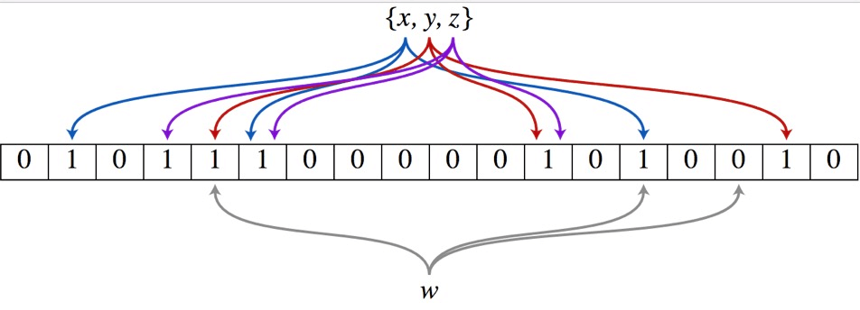

# 案例一 播放历史

## 功能模块

为了大部分用户的基本功能体验，满足用户需求，例如播放历史查看、播放进度同步等。离线型用户，app 本地保留历史记录数据。
同样的，也要考虑平台化，视频、文章、漫画等业务扩展接入。

* 变更功能：添加记录、删除记录、清空历史。
* 读取功能：按照 timeline 返回 top N，点查获取进度信息。
* 其他功能：暂停/恢复记录，首次观察增加经验等。

历史记录类型的业务，是一个极高 tps 写入，高 qps 读取的业务服务。分析清楚系统的 hot path，投入优化，而不是哪哪都去优化。


## 架构设计

### 概览


**BFF: app-interface、history**
    历史 BFF 层接受来自外部用户的读请求，依赖其他例如稿件、漫画服务来组装完整的面向历史业务（页面）需要的数据的组合。同时接受来自内部其他业务线的写请求，通常都是业务方自己进行业务 ID 的判定，然后投递到历史服务的 BFF 写接口中。最终 BFF 是打包在 app-interface 大杂烩 BFF 中，考虑到隔离性，读写流量很大，独立成 history BFF 服务。

**Service: history-service**

​    服务层，去平台业务的逻辑，专注在历史数据的持久化上(因为对于播放类业务，BFF 专注平台业务数据组织，service 负责数据的读、写、删、清理等操作。播放进度是非常高频同步的，需要考虑性能优化)。
使用 write-back 的思路，把状态数据先入分布式缓存，再回写数据库。    

**使用 write-back 的思路，把状态数据先入分布式缓存，再回写数据库。**

> CPU 也是先写 cacheline 再刷回 memory

**Job: history-job**

​    job 消费上游 kafka 的数据，利用消息队列的堆积能力，对于存储层的差速(消费能力跟不上生产速度时)，可以进行一定的数据反压。配合上游 service 批量打包过来的数据持久化。

> 队列的核心功能就是解决缓存和存储的差速。

**Upstream: some-app，some-api**

​    整个历史服务还会被一些外部 gRPC 服务所依赖，所以 history 还充当了内网的 gRPC Provider，这些上游服务，使用历史服务的写接口，把自己业务的数据进行持久化。

历史服务最重要的设计，就是批量打包(pipeline)聚合数据。将高频、密集的写请求先入缓存(write-back)，批量消费减少对存储的直接压力，类似的设计随处可见。


**历史服务最重要的设计，就是`批量打包(pipeline)聚合数据`。将高频、密集的写请求先入缓存(write-back)，批量消费减少对存储的直接压力，类似的设计随处可见。**

注意：

* 1）缓存挂了会丢数据，Redis 主从同步有延时
* 2）聚合数据的时候 Service 重启也会丢数据
* 3）kafka 挂了会丢消息，就算设置为 需要leader 副本和一个 replica 副本都写入该消息也又几率丢。
* 4）客户端也有本地缓存，服务端消息丢了，客户端可能会再次上报

系统读写压力实在太大，只能这么处理了，可用性和性能之间的取舍。

>  就算真丢数据了，对于播放历史来说也是可接受的。复杂系统简单做。


### history-service


history-service，专注在历史数据处理。

**写的核心逻辑: **

用户观看的稿件、漫画等，带有进度信息的数据，同一个 id 最后一次的数据即可，即 **last-write win**，高频的用户端同步逻辑，**只需要最后一次数据持久化即可**。

> 进度更新时只更新 Redis，不断覆盖，最后 kafka 直接从 Reids 中读出最新的数据即可。

我们可以在 in-process 内存中，定时定量来聚合不同用户的“同一个对象的最后一次进度”，使用 kafka 消息队列来消除写入峰值。但同时我们需要保证用户数据可以**实时**被观察到，不能出现上报进度后，需要一阵子才能体现进度变化。所以我们即**在内存中打包数据，同时实时写入到 redis 中**，这样即保证了实时，又避免海量写入冲击存储。
kafka 是为高吞吐设计，超高频的写入并不是最优，所以内存聚合和分片算法比较重要，按照 **uid** 来sharding 数据，写放大仍然很大，这里我们使用 **region sharding**，打包一组数据当作一个 kafka message(比如 uid % 100数据打包)。

> 按照 uid 来 sharding，保证同一个用户的消息都写入同一个 partition。把多个 uid 一起发送以减少消息数。


**写逻辑的数据流向**: 实时写 redis -> 内存维护用户数据 -> 定时/定量写入到 kafka。

**读的核心逻辑: **

历史数据，实时写入 redis 后，不会无限制的存储，会按量截断，所以分布式缓存中数据不是完整数据。

> redis 中只存储了最近的几百条历史记录，再往前的就需要去持久化DB中查询了。

历史数据从 redis sortedset 中读取后，如果发现尾部数据不足，会触发 **cache-aside** 模式，从存储中回捞数据，但是不会重新回填缓存，因为拉取过去更久远的数据，属于用户纬度的**低频度行为**。历史数据通常是按照 timeline 来组织，游标的 key 可以使用时间戳进行翻页或者下拉。


### history-job

history-job，获取打包好的用户数据，进行批量持久化。


上游 history-service 按照 uid region sharding 聚合好的数据，在 job 中消费取出，为了节约传输过程，以及 history-service 的 in-process cache 的内存使用，我们只维护了用户的 uid 以及 id 列表，最小化存储和传输。因为数据是不完整的，我们额外需要从 redis 中按照 id 对应的数据内容，再持久化。从原来的 N 条记录变为一个用户一条记录。

> 即没有把所有数据都通过 Kafka 发过来，只发了 uid 和 id 列表这些信息，最后在去 Redis 中读取完整信息并写入存储。

对于存储的选型，我们认为 HBase 非常合适高密度写入。后续我们会单独讨论我们经历过的几次存储迭代和选型。

### history


history 作为 BFF，对用户端提供统一的用户记录记录入口接口，同时也对内提供 gRPC 写入历史接口。如果业务场景中不存在统一的用户入口访问历史记录，可以去掉 BFF 层，直接使用 history-service 提供读接口，这样需要每个业务方自己实现自己的数据组装。

> BFF 主要用于组装数据，比如历史记录里就存了一个视频 id，那么 BFF 则需要调用 视频服务更加id查询对应的视频信息。

我们也有类似用户**首次**播放、观看等加经验或者奖励积分类似的操作，所以我们这里依赖 redis，进行判定用户当天是否是首次访问，我们比较容易想到使用**bitmap** 或者 **bloom filter** 来进行判断，然后往下游 kafka 投递消息，而不直接依赖业务的某个服务。

> 通过 redis bitmap或者bloom filter 来判定是否首次访问，比较简单，不需要额外依赖其他服务。

因为我们有关闭历史记录的功能，这样每次写入操作都需要前置读取一次，是否打开了开关，同样的每次首次发送奖励也是一样，你有更好的办法吗？


## 存储设计

### 数据库设计


我们最早的主力存储选型是: HBase。

数据写入: PUT mid, values，只需要写入到 column_family 的 info 列簇，rowkey 使用用户 id md5 以后的头两位 + 用户，避免 rowkey 热点密集到一个 region 中，导致写/读热点。 对于 column_family: info，存储一个列 obj_id + obj_type，例如 稿件业务:1、稿件ID: 100，100_1 作为列名，对于 value 使用 protobuf 序列化一个结构体接入。所以只需要单次更新 kv store。另外我们使用 HBase TTL 的能力，只需要保存90天的用户数据即可。(删除同理)

数据读取: 列表获取为 GET mid，直接获取1000条，在内存中排序和翻页。点查 GET mid columns，在茫茫多视频查看当前视频的阅读进度，cache miss 会非常严重，虽然支持点查，但是对于上层 cache miss 后，不再回源请求 HBase。

### 缓存设计

**数据写入**: 每次产生的历史数据，需要**立马更新 redis**，使用 sorted set 基于时间排序的列表，member 为业务 ID。同时存储一份数据到 redis string 中，使用 protobuf 序列化完整的数据内容。为了避免 redis 中单个用户数据无限增长，需要超过一定量后对数据进行截断。

**数据读取**: 分为两个场景，一个是历史页面，这时候使用 sorted set，排序查找即可，拿到列表后，mget 批量获取 history_content 内容。
另外一个是点查进度，比如我们点击进入一个视频详情页，这时候直接查找 history_content 进行点查，不再回源 HBase，因为命中率太低。

**首次触发**某行为，增加经验的，我们在缓存设计中，经常使用 **bitmap(roaring bitmap)、bloom filter** 缓存加速访问，但是在使用缓存时，需要注意规避热点问题，某个key sharding 命中 node 是固定的，因此我们可以利用构建多组 bitmap 或 bloom filter，来进行打散。



> prefix_key = hash(mid) % 1000

根据 prefix_key 找到对应的 cache 再进行操作，这样 1000 个 key 尽可能均匀的分布到更小集合的 node，而不会产生数据热点。

但是仍然每次触发行为，都为前置判定，有更好的优化方案吗？


## 可用性设计

### Write-Back

在 history-service 中实时写入 redis 数据，因此只需要重点优化缓存架构中，扛住峰值的流量写入。之后在服务内存中，使用 map[int]map[int]struct{} 聚合数据，之后利用 chan 在内部发送每个小消息，再聚合成一个大 map，在 sendproc 中，使用 timer 和 定量判定逻辑，发送到下游 kafka 中。

在 history-job 中，获取消息后，重新去 redis 中回捞数据即: history-content，然后构建完整的数据批量写入到 HBase 中。
这里存在两个风险: 

* 1）history-service 重启过程中，预聚合的消息丢失；
* 2）history-job 读取 redis 构建数据，但 redis 丢失；

我们在这里进行了 trade-off，高收敛比的设计，意味着存在数据丢失的风险，对于历史场景，非 L0 的业务服务/数据，我们认为极端情况下可接受。

### 聚合

经过 BFF history 的流量 per-request 都会发送给 history-service，我们最容易想到的优化就是聚合上移来减少发送给下游的 rpc。但是按照 mid region sharding 的思路非常具有业务的耦合性，所以不应该把逻辑上移，而只是数据上移，所以可以考虑简单 batch put 请求，**做一个无逻辑的数据聚合再发送给 history-service**，这样可以大大的减少内网的流量，节约资源。

> 聚合上移，只是数据上移，逻辑还是放在 Service 

我们发现经过 API Gateway 的流量都会触发高频的 per-rpc auth，给内网的 identify-service 带来了不少压力。我们认为大部分历史行为通过心跳的方式同步进度，为何不连接一个长连接，长连接服务再握手后先进行用户级的身份验证，之后维持身份信息，而不是每次发送 request 都进行验证，这样可以大大减少内网的 identify-service 的流量。

我们内网使用 boardcast(goim) 服务维护长连接，长连接一次验证，不断使用。


### 广播

用户首次触发的行为，需要发送消息给下游系统进行触发其他奖励等。如何减少这类一天只用一次的标记位缓存请求？

使用 in-process localcache，只有高频的用户访问，带来的收益就越大，我们很容易想到使用 LRU 维护这个集合，但用户分布很广，很难覆盖，命中率很低。

越源头解决架构问题，通常越简单，效率越高。

我们在写操作(高频请求)中，把当前的 flag 返回到 API 协议中，作为一个日期值，客户端保存到本地，下次请求的时候带上，如果发现该值在，获取以后直接使用不再请求缓存，例如: 2021-1-1，发现当前时间还是2021-1-1，直接不再请求 redis，如果发现当前时间是2021-1-2，需要触发一次 redis 访问，返回新的 flag 到客户端，这样把状态广播同步到任何其他设备，可以大大减少判定缓存。

> 实现成本在于，你认为的代价高低。


## References

```sh
https://en.wikipedia.org/wiki/Cache#Writing_Policies
https://blog.csdn.net/jiaomeng/article/details/1495500
https://blog.csdn.net/yizishou/article/details/78342499
https://blog.csdn.net/caoshangpa/article/details/78783749
```

