# 08-分布式缓存


## 缓存选型

### memcache

memcache 提供**简单的 kv cache 存储**，value 大小不超过1mb。

> 我使用 memcache 作为大文本或者简单的 kv结构使用。

memcache 使用了 **slab **方式做内存管理，存在一定的浪费。

> Go 里面也是类似做内存管理的，tcmalloc。

如果大量接近的 item，建议调整 memcache 参数来优化每一个 slab 增长的 ratio、可以通过设置 slab_automove & slab_reassign 开启memcache 的动态/手动 move slab，防止某些 slab 热点导致内存足够的情况下引发 LRU。

大部分情况下，简单 KV 推荐使用 Memcache，吞吐和相应都足够好。


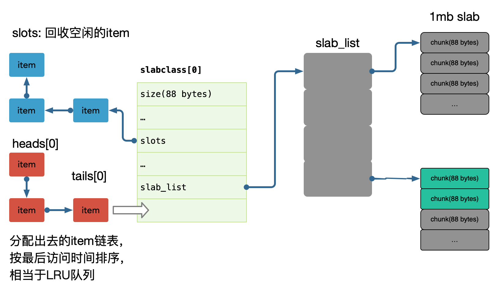


每个 slab 包含若干大小为1M的内存页，这些内存又被分割成多个 chunk，每个 chunk存储一个 item；

> ，每个 chunk存储一个 item，如果 item 小于 chunk 则会浪费部分内存。

在 memcache 启动初始化时，每个 slab 都预分配一个 1M 的内存页，由slabs_preallocate 完成(也可将相应代码注释掉关闭预分配功能)。

chunk 的增长因子由 -f 指定，默认1.25，起始大小为48字节。

内存池有很多种设计，可以参考下: nginx ngx_pool_t，tcmalloc 的设计等等。


### redis

redis 有**丰富的数据类型**，支持**增量方式的修改**部分数据，比如排行榜，集合，数组等。

比较常用的方式是**使用 redis 作为数据索引**，比如评论的列表 ID，播放历史的列表 ID 集合，我们的关系链列表 ID。

redis 因为没有使用内存池，所以是存在一定的内存碎片的，一般会使用 jemalloc 来优化内存分配，需要编译时候使用 jemalloc 库代替 glib 的 malloc 使用。


### redis vs memcache

| 特性       | memcache | redis |
| ---------- | -------- | ----- |
| QPS        | 高       | 高    |
| Throughput | 高       | 低    |
| DataType   | KV       | Index |

Redis 和 Memcache 最大的区别其实是 redis 单线程(新版本多线程)，memcache 多线程，所以 QPS 可能两者差异不大，但是吞吐会有很大的差别，比如大数据 value 返回的时候，redis qps 会抖动下降的的很厉害，因为单线程工作，其他查询进不来(新版本有不少的改善)。

所以**建议纯 kv 都走 memcache**，比如我们的关系链服务中用了 hashs 存储双向关系，但是我们也会使用 memcache 档一层来避免hgetall 导致的吞吐下降问题。

我们系统中多次使用 memcache + redis 双缓存设计。

> 随着 Redis Cluster 的逐渐成熟，和 Redis 的优化 memcache 可能会逐渐退出历史舞台。


### Proxy

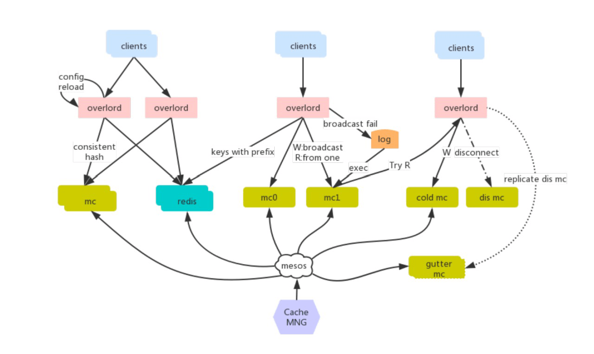

早期使用 twemproxy 作为缓存代理，但是在使用上有如下一些痛点：

* 单进程单线程模型和 redis 类似，在处理一些大 key 的时候可能出现 io 瓶颈；
* 二次开发成本难度高，难以于公司运维平台进行深度集成；
* 不支持自动伸缩，不支持 autorebalance 增删节点需要重启才能生效；
* 运维不友好，没有控制面板；

业界开源的的其他代理工具：

* codis: 只支持 redis 协议，且需要使用 patch版本的 redis；
* mcrouter: 只支持 memcache 协议，C 开发，与运维集成开发难度高；


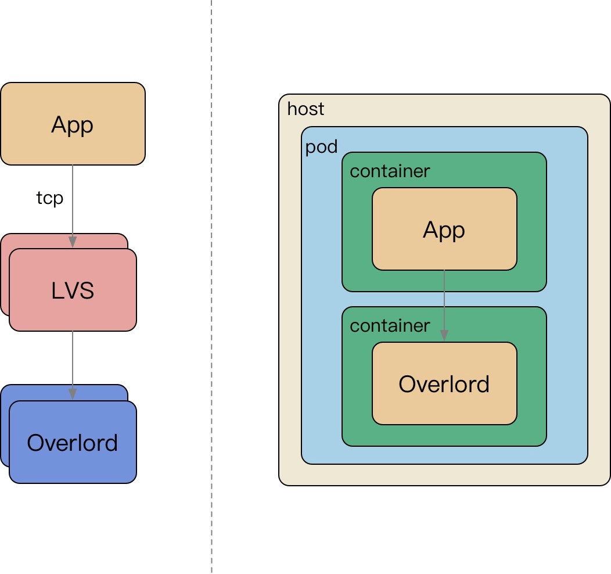

从集中式访问缓存到 Sidecar 访问缓存：

* 微服务强调去中心化；
* LVS 运维困难，容易流量热点，随下游扩容而扩容，连接不均衡等问题；
* Sidecar 伴生容器随 App 容器启动而启动，配置简化；


**强烈建议使用 Redis Cluster**


### Hash

数据分片的 hash 方式也是这个思想，即按照数据的某一特征（key）来计算哈希值，并将哈希值与系统中的节点建立映射关系,从而将哈希值不同的数据分布到不同的节点上。

按照 hash 方式做数据分片，映射关系非常简单；需要管理的元数据也非常之少，只需要记录节点的数目以及 hash 方式就行了。

当加入或者删除一个节点的时候，大量的数据需要移动。比如在这里增加一个节点 N3，因此 hash 方式变为了 mod 4。

均衡问题：**原始数据的特征值分布不均匀，导致大量的数据集中到一个物理节点上**；第二，对于可修改的记录数据，单条记录的数据变大。

高级玩法是抽象 slot，基于 Hash 的 Slot Sharding，例如 Redis-Cluster。


### 一致性 Hash

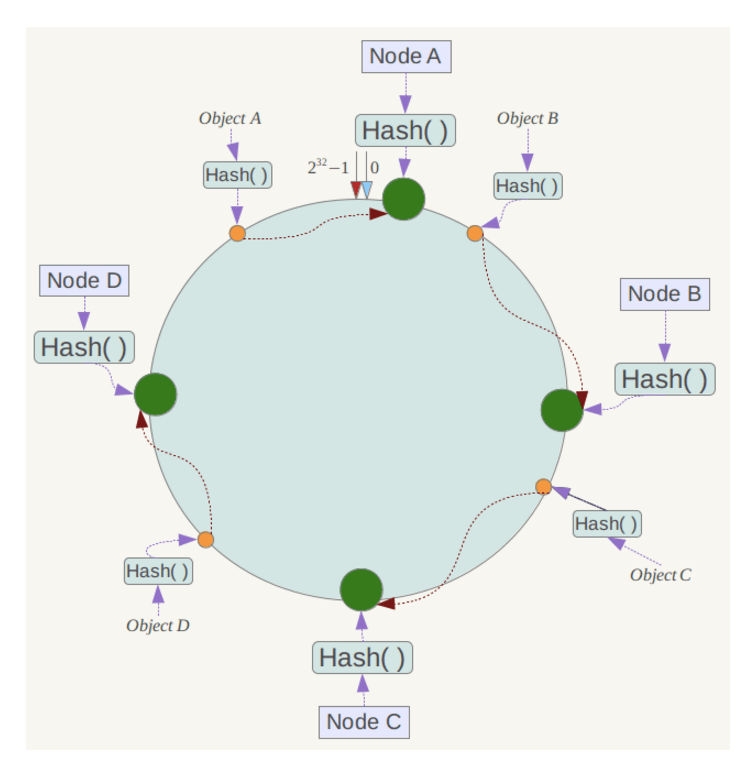

一致性 hash 是将数据按照特征值映射到一个首尾相接的 hash 环上，同时也将节点（按照 IP 地址或者机器名 hash）映射到这个环上。

对于数据，从数据在环上的位置开始，顺时针找到的第一个节点即为数据的存储节点。

余数分布式算法由于保存键的服务器会发生巨大变化而影响缓存的命中率，但Consistent Hashing 中，只有在园（continuum）上增加服务器的地点逆时针方向的第一台服务器上的键会受到影响。

#### 虚拟节点


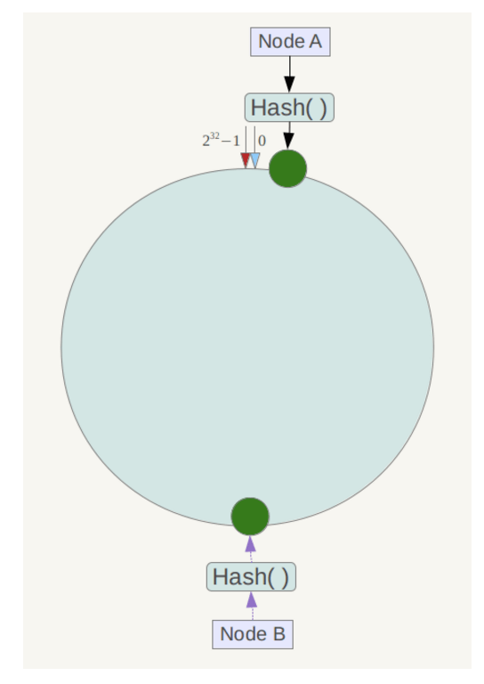

一致性哈希算法在服务节点太少时，容易因为**节点分部不均匀**而造成**数据倾斜**问题。

此时必然造成大量数据集中到 Node A 上，而只有极少量会定位到 Node B 上。为了解决这种数据倾斜问题，一致性哈希算法引入了虚拟节点机制，即对每一个服务节点计算多个哈希，每个计算结果位置都放置一个此服务节点，称为**虚拟节点**。

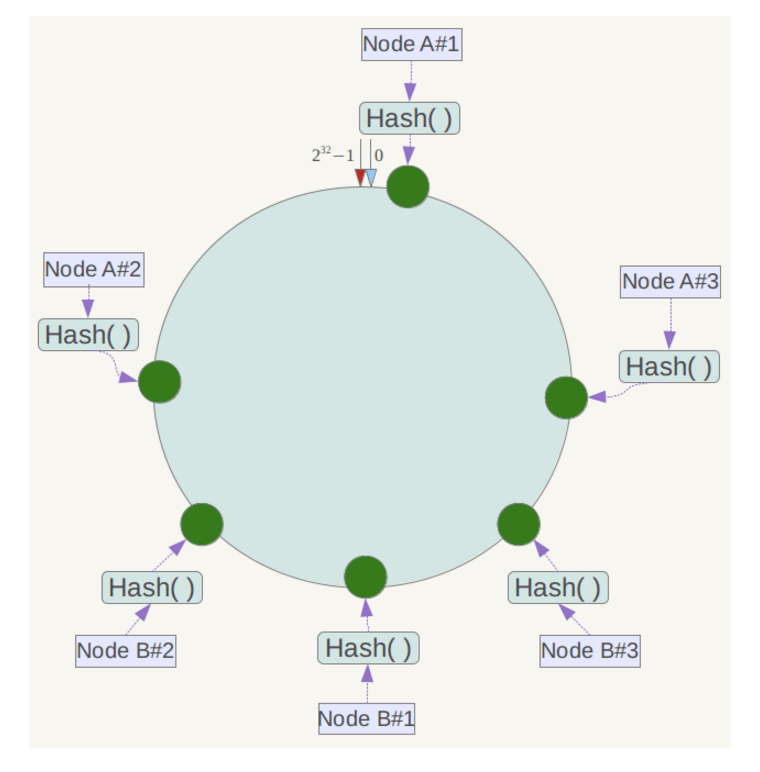

具体做法可以在服务器 ip 或主机名的后面增加编号来实现。

例如上面的情况，可以为每台服务器计算三个虚拟节点，于是可以分别计算 
“Node A#1”、“Node A#2”、“Node A#3”、“Node B#1”、“Node B#2”、“Node B#3”的哈希值，于是形成六个虚拟节点。

同时数据定位算法不变，只是多了一步虚拟节点到实际节点的映射，例如定位到
“Node A#1”、“Node A#2”、“Node A#3”三个虚拟节点的数据均定位到 Node A 上。这样就解决了服务节点少时数据倾斜的问题。

> 如果还是有倾斜问题，可能是虚拟节点不够多，或者使用的 Hash 算法效果不好，建议使用 murmurhash3。

#### 微信红包的写合并优化

参考微信红包的写合并优化：

https://www.cnblogs.com/chinanetwind/articles/9460820.html

在网关层，使用一致性 hash，对红包 id 进行分片，命中到某一个逻辑服务器处理，在进程内做写操作的合并，减少存储层的单行锁争用。

我认为更好的做法是 有界负载一致性 hash。

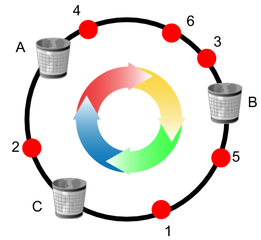

有界负载一致性 hash 即在一致性 Hash基础上的优化。

记录在一个滑动窗口内请求到每个节点的请求数，当超过某个阈值时，后续请求不在请求该节点，而是顺时针往后`飘`,比如上图中如果节点B负载过高，则把多余请求飘到C，如果A也超了就继续飘给A。


在做到负载均衡的同时也尽可能做到了请求收敛，让大部分同源请求收敛到一个节点。

#### 小结

* 平衡性(Balance)：尽可能分布到所有的缓冲中去
* 单调性(Monotonicity)：单调性是指如果已经有一些内容通过哈希分派到了相应的缓冲中，又有新的缓冲区加入到系统中，那么哈希的结果应能够保证原有已分配的内容可以被映射到新的缓冲区中去，而不会被映射到旧的缓冲集合中的其他缓冲区。
* 分散性(Spread)：相同内容被存储到不同缓冲中去，降低了系统存储的效率，需要尽量降低分散性。
* 负载(Load)：哈希算法应能够尽量降低缓冲的负荷。
* 平滑性(Smoothness)：缓存服务器的数目平滑改变和缓存对象的平滑改变是一致的。


### Slot

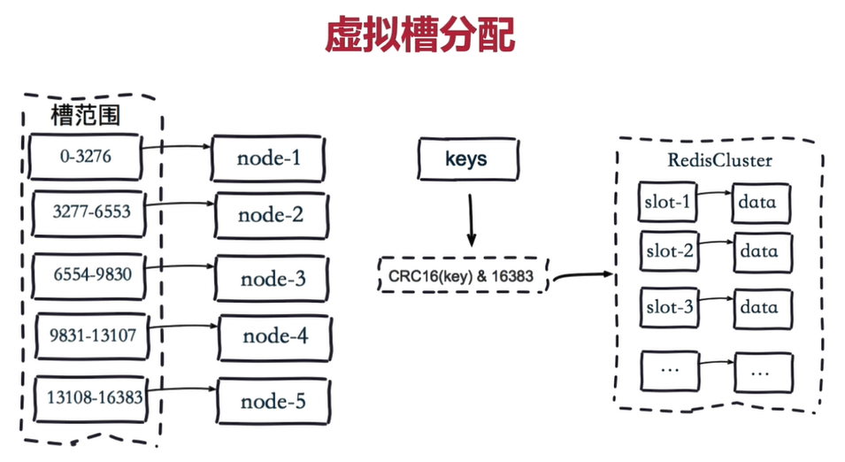


redis-cluster 把16384 槽按照节点数量进行平均分配，由节点进行管理。

对每个 key 按照 CRC16 规则进行 hash 运算，把 hash 结果对16383进行取余，把余数发送给 Redis 节点。

需要注意的是：Redis Cluster 的节点之间会共享消息，每个节点都会知道是哪个节点负责哪个范围内的数据槽

> 先根据 key 找到 slot，再根据 slot 和 节点对应关系，找到具体节点

元数据不同

一致性Hash：节点数量+HashFunc

Slot：Slot 对应的节点 + hashFunc


## 缓存模式

### 数据一致性

Storage 和 Cache 同步更新容易出现数据不一致。

模拟 MySQL Slave 做数据复制，再把消息投递到 Kafka，保证至少一次消费：

* 1）同步操作DB；

  * 操作DB失败，则整个请求失败，走重试逻辑或者提示用户。

* 2）同步操作Cache；

  * 操作Cache失败一般不会让整个请求重试，因为前面DB都写进去了

* 3）利用Job消费消息，重新补偿一次缓存操作。

  * 补偿一次Cache写入，减少数据不一致的情况，但是无法保证100%

  

保证时效性和一致性。

Cache Aside 模型中，读缓存 Miss 的回填操作，和修改数据同步更新缓存，包括消息队列的异步补偿缓存，都无法满足 “Happens Before”，会存在相互覆盖的情况。

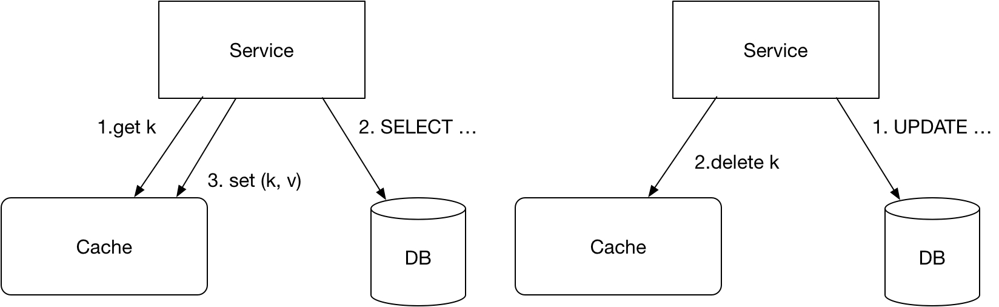


读/写同时操作：

* 1）读操作，读缓存，缓存 MISS
* 2）读操作，读 DB，读取到数据
* 3）写操作，更新 DB 数据
* 4）写操作 SET/DELETE Cache（可 Job 异步操作）
* 5）读操作，SET操作数据回写缓存（可 Job 异步操作）

这种交互下，由于4和5操作步骤都是设置缓存，导致写入的值互相覆盖；并且操作的顺序性不确定，从而导致 cache 存在脏缓存的情况。

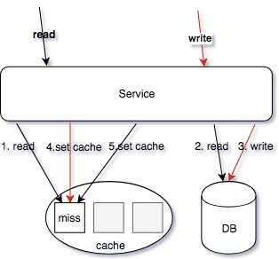

读/写同时操作：

* 1）读操作，读缓存，缓存 MISS
* 2）读操作，读 DB，读取到数据
* 3）写操作，更新 DB 数据
* 4）写操作 **SET Cache**（可异步 job 操作，Redis 可以使用 **SETEX** 操作）
* 5）读操作，**ADD 操作**数据回写缓存（可 Job异步操作，Redis 可以使用 **SETNX** 操作）

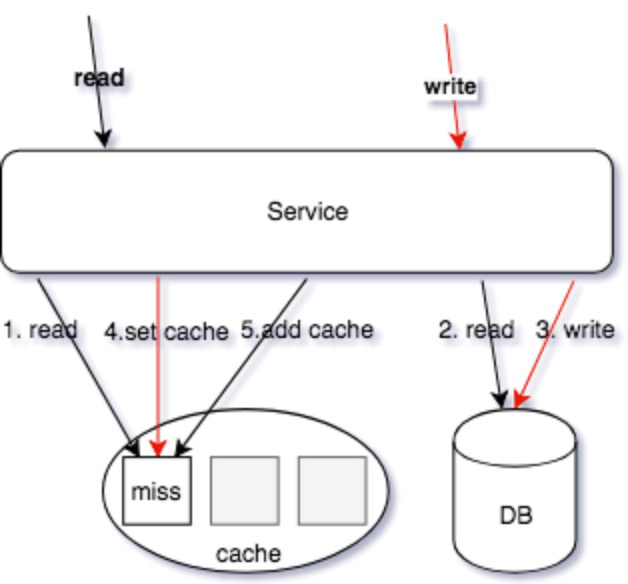

**写操作使用 SET 操作命令，覆盖写缓存；读操作，使用 ADD 操作回写 MISS 数据，从而保证写操作的最新数据不会被读操作的回写数据覆盖。**


### 多级缓存

微服务拆分细粒度原子业务下的整合服务（聚合服务），用于提供粗粒度的接口，以及二级缓存加速，减少扇出的 rpc 网络请求，减少延迟。

最重要是保证多级缓存的一致性：

* 清理的优先级是有要求的，先优先清理下游再上游；
  * 如果上游清理了，下游没清理，下次请求来时又会把下游的缓存捞到上游去缓存起来。
* 下游的缓存expire要大于上游，避免穿透回源；
  * 一般时下游过期时间为上游的两倍

天下大势分久必合，适当的微服务合并也是不错的做法，再使用 DDD 思路以及我们介绍的目录结构组织方式，区分不同的 Usecase。


### 热点缓存

对于热点缓存 Key，按照如下思路解决：

* 小表广播，从 RemoteCache 提升为LocalCache，App 定时更新，甚至可以让运营平台支持广播刷新 LocalCache；
* 主动监控防御预热，比如直播房间页高在线情况下直接外挂服务主动防御；
* 基础库框架支持热点发现，自动短时的 short-live cache；
* 多 Cluster 支持；
* 多 Key 设计: 使用多副本，减小节点热点的问题


使用多副本 ms_1,ms_2,ms_3 每个节点保存一份数据，使得请求分散到多个节点，避免单点热点问题。

建立多个 Cluster ，和微服务、存储等一起组成一个 Region。
这样相当于是用**空间换时间**：

* 同一个 key 在每一个 frontend cluster 都可能有一个 copy，**这样会带来 consistency 的问题，但是这样能够降低 latency 和提高 availability**。利用 MySQL Binlog 消息 anycast 到不同集群的某个节点清理或者更新缓存；

当业务频繁更新时候，cache频繁过期，会导致命中率低: stale sets

* 如果应用程序层可以忍受稍微过期一点的数据，针对这点可以进一步降低系统负载。当一个key 被删除的时候（delete 请求或者 cache 爆棚清空间了），它被放到一个临时的数据结构里，会再续上比较短的一段时间。当有请求进来的时候会返回这个数据并标记为“Stale”。对于大部分应用场景而言，Stale Value 是可以忍受的。(需要改 memcache、redis 源码，或者基础库支持）；


### 穿透缓存

* singlefly

对关键字进行一致性 hash，使其某一个维度的 key 一定命中某个节点，然后在节点内使用互斥锁，保证归并回源，但是对于批量查询无解；

* 分布式锁

设置一个 lock key，有且只有一个人成功，并且返回，交由这个人来执行回源操作，其他候选者轮训 cache 这个 lock key，如果不存在去读数据缓存，hit 就返回，miss 继续抢锁；

> 不建议使用这个逻辑，比较复杂

* 队列

如果 cache miss，交由队列聚合一个key，来 load 数据回写缓存，对于 miss 当前请求可以使用 singlefly 保证回源，如评论架构实现。适合回源加载数据重的任务，比如评论 miss 只返回第一页，但是需要构建完成评论数据索引。

* lease

通过加入 lease 机制，可以很好避免这两个问题，lease 是 64-bit 的 token，与客户端请求的 key 绑定，对于过时设置，在写入时验证 lease，可以解决这个问题；对于 thundering herd，每个key 10s 分配一次，当 client 在没有获取到 lease 时，可以稍微等一下再访问 cache，这时往往cache 中已有数据。（基础库支持 & 修改 cache 源码）；


## 缓存技巧

### Incast Congestion

如果在网路中的包太多，就会发生 Incast Congestion 的问题（可以理解为，network 有很多switch，router 啥的，一旦一次性发一堆包，这些包同时到达 switch，这些 switch 就会忙不过来）。

应对这个问题就是不要让大量包在同一时间发送出去，在客户端限制每次发出去的包的数量（具体实现就是客户端弄个队列）。

每次发送的包的数量称为“Window size”。这个值太小的话，发送太慢，自然延迟会变高；这个值太大，发送的包太多把 network switch 搞崩溃了，就可能发生比如丢包之类的情况，可能被当作 cache miss，这样延迟也会变高。所以这个值需要调，一般会在 proxy 层面实现。


### memcache 小技巧

* flag 使用：标识 compress、encoding、large value 等；

* memcache 支持 gets，尽量读取，尽可能的 pipeline，减少网络往返；

* 使用二进制协议，支持 pipeline delete，UDP 读取、TCP 更新；


### redis 小技巧

* 易读性的前提下，key 设置尽可能小，减少资源的占用，redis value可以用int就不要用
  string,对于小于N的value, redis 内部有shared_ _object 缓存。
  * 内部有一个共享int池

* 拆分key。主要是用在redis使用hashes情况下。同一个hashes key会落到同一个redis
  节点，hashes过大的情况下会导致内存及请求分布的不均匀。考虑对hash进行拆分为小的
  hash,使得节点内存均匀及避免单节点请求热点。

  * 把一个大Key根据某种规则拆分为多个，比如key1、key2...keyN，查询时根据key名字找到对应的拆分后的key

* 空缓存设置。对于部分数据，可能数据库始终为空，这时应该设置空缓存，避免每次请求都
  缓存miss直接打到DB。

  * 查询DB发现DB中也没有时，要往缓存回写一个空值，防止下次还请求到DB

* 空缓存保护策略。

* 读失败后的写缓存策略(降级后一般读失败不触发回写缓存)。

  * 我们认为读失败了，写回填操作大概率也会失败，干脆不回写。

* 序列化使用protobuf.尽 可能减少size.

* 工具化胶水代码

  * Go 里面直接用 generate 一键生成

  

* 增量更新一致性：EXPIRE、ZADD/HSET 等，保证索引结构体务必存在的情况下去操作新增数据；
  * 先确定数据是存在的，再去更新，否则可能出现一致性问题，比如读操作发现缓存不存在需要从DB中捞出来回写到缓存，此时并发来一个更新比如数据不一致
* BITSET: 存储每日登陆用户，单个标记位置（boolean），为了避免单个 BITSET 过大或者热点，需要使用 
* region sharding，比如按照mid求余 %和/ 10000，商为 KEY、余数作为offset；
* List:抽奖的奖池、顶弹幕，用于类似 Stack PUSH/POP操作；
* Sortedset: 翻页、排序、有序的集合，杜绝 zrange 或者 zrevrange 返回的集合过大；
* Hashs: 过小的时候会使用压缩列表、过大的情况容易导致 rehash 内存浪费，也杜绝返回hgetall，对于小结构体，建议直接使用 memcache KV；
* String: SET 的 EX/NX 等 KV 扩展指令，SETNX 可以用于分布式锁、SETEX 聚合了SET + EXPIRE；
* Sets: 类似 Hashs，无 Value，去重等；
* 尽可能的 PIPELINE 指令，但是避免集合过大；
* 避免超大 Value；


## References

```sh
https://blog.csdn.net/chen_kkw/article/details/82724330
https://zhuanlan.zhihu.com/p/328728595
https://www.cnblogs.com/chinanetwind/articles/9460820.html
https://medium.com/vimeo-engineering-blog/improving-load-balancing-with-a-new-consistent-hashing-algorithm-9f1bd75709ed
https://www.jianshu.com/p/5fa447c60327
https://writings.sh/post/consistent-hashing-algorithms-part-1-the-problem-and-the-concept
https://www.cnblogs.com/williamjie/p/11132211.html
```


