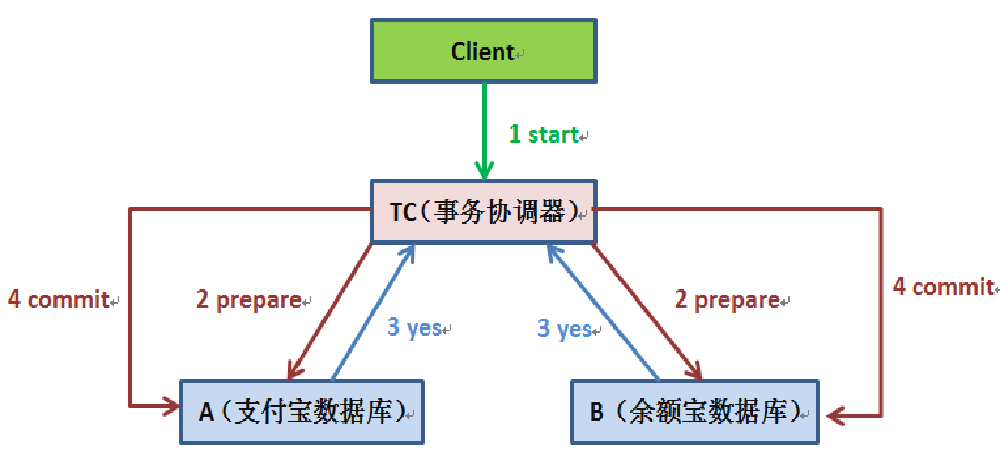
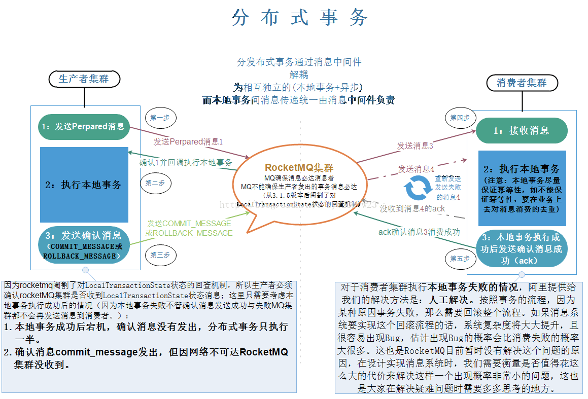
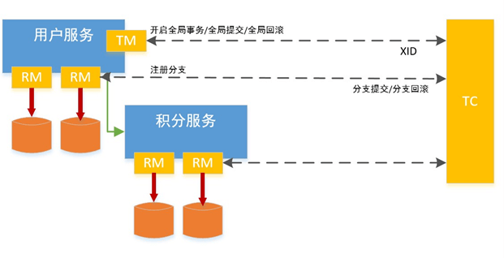
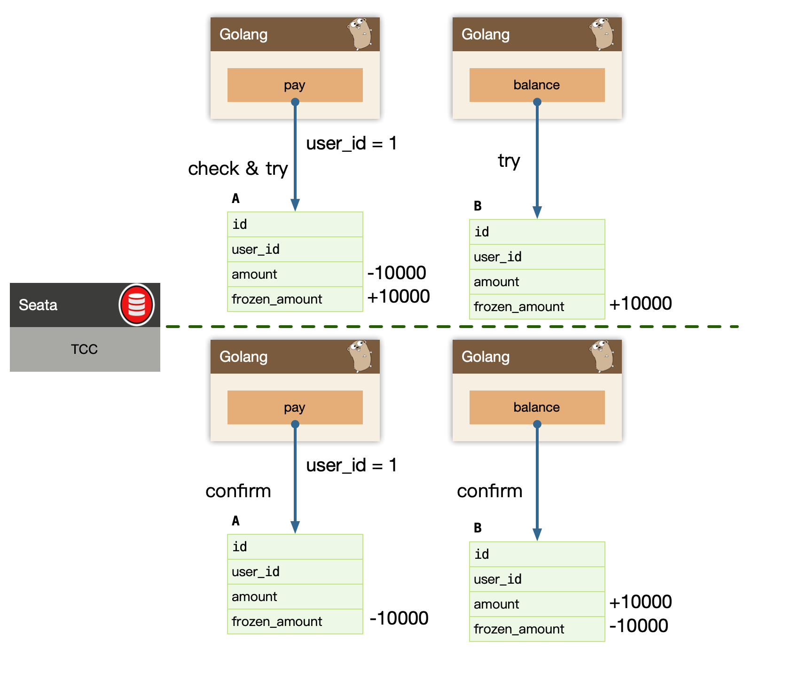

# 分布式事务

## 1. 概述

讲到事务，又得搬出经典的转账问题了：

支付宝账户表：A (id, user_id, amount)
余额宝账户表：B (id, user_id, amount)

用户的 user_id = 1，从支付宝转帐1万快到余额宝分为两个步骤：

* 支付宝表扣除1万：
  UPDATE A SET amount = amount - 10000 WHERE user_id = 1;
* 余额宝表增加1万：
  	UPDATE B SET amount = amount + 10000 WHERE user_id = 1;

如何保证数据一致性呢？
单个数据库，我们保证 ACID 使用 数据库事务。


随着我们系统变大，我们进行了微服务架构的改造，因为每个微服务独占了一个数据库实例，从 user_id = 1 发起的转帐动作，跨越了两个微服务：pay 和 balance 服务。

我们需要保证，跨多个服务的步骤数据一致性：

* 1）微服务 pay 的支付宝表扣除1万；
* 2）微服务 balance 的余额宝表增加1万；

每个系统都对应一个独立的数据源，且可能位于不同机房，同时调用多个系统的服务很难保证同时成功，这就是**跨服务分布式事务问题**。

常见解决方案：

* 1）事务消息
* 2）2PC
* 3）TCC


## 2. 事务消息

**我们系统应该能保证每个服务自身的 ACID，基于这个假设，我们可以用事务消息解决分布式事务问题。**

> 如果每个系统都不能保证ACID那也不存在分布式事务的说法。


在北京很有名的姚记炒肝点了炒肝并付了钱后，他们并不会直接把你点的炒肝给你，往往是给你一张小票，然后让你拿着小票到出货区排队去取。

*为什么他们要将付钱和取货两个动作分开呢？*

原因很多，其中一个很重要的原因是为了使他们接待能力增强（并发量更高）。

只要这张小票在，你最终是能拿到炒肝的。同理转账服务也是如此。

当支付宝账户扣除1万后，我们只要生成一个凭证（消息）即可，这个凭证（消息）上写着“让余额宝账户增加 1万”，只要这个凭证（消息）能可靠保存，我们最终是可以拿着这个凭证（消息）让余额宝账户增加1万的，即我们能依靠这个凭证（消息）完成最终一致性。


*如何可靠的保存消息凭证？*

要解决消息可靠存储，我们实际上需要解决的问题是，本地的 mysql 存储和 message 存储的一致性问题。

* Transactional outbox
* Polling publisher
* Transaction log tailing
* 2PC Message Queue


**事务消息一旦被可靠的持久化，我们整个分布式事务，变为了最终一致性，消息的消费才能保障最终业务数据的完整性，所以我们要尽最大努力，把消息送达到下游的业务消费方，称为：Best Effort。只有消息被消费，整个交易才能算是完整完结。**


### Best Effort

即尽最大努力交付，主要用于在这样一种场景：不同的服务平台之间的事务性保证。

比如我们在电商购物，使用支付宝支付；又比如玩网游的时候，通过 App Store 充值。

拿购物为例，电商平台与支付平台是相互独立的，隶属于不同的公司，即使是同一个公司也很可能是独立的部门。

> “ 做过支付宝交易接口的同学都知道，我们一般会在支付宝的回调页面和接口里，解密参数，然后调用系统中更新交易状态相关的服务，将订单更新为付款成功。
> 同时，只有当我们回调页面中输出了success 字样或者标识业务处理成功相应状态码时，支付宝才会停止回调请求。否则，支付宝会每间隔一段时间后，再向客户方发起回调请求，直到输出成功标识为止。”


### Transactional outbox

Transactional outbox 本地消息事务，**支付宝在完成扣款的同时，同时记录消息数据**，这个消息数据与业务数据保存在同一数据库实例里（消息记录表表名为 msg）。

```mysql
BEGIN TRANSACTION
    UPDATE A SET amount = amount - 10000 WHERE user_id = 1;
    INSERT INTO msg(user_id, amount, status) VALUES(1, 10000, 1);
END TRANSACTION
COMMIT;
```

**上述事务能保证只要支付宝账户里被扣了钱，消息一定能保存下来**。当上述事务提交成功后，我们想办法将此消息通知余额宝，余额宝处理成功后发送回复成功消息，支付宝收到回复后删除该条消息数据。

如何通知余额宝呢，这里用两种方法

* 1）Polling publisher
* 2）Transaction log tailing


#### Polling publisher

Polling publisher，我们**定时的轮训 msg 表，把 status = 1 的消息统统拿出来消费，**可以按照自增 id 排序，保证顺序消费。在这里我们独立了一个  pay_task 服务，把拖出来的消息 publish 给我们消息队列，balance 服务自己来消费队列，或者直接 rpc 发送给 balance 服务。

实际我们第一个版本的 archive-service 在使用 CQRS 时，就用的这个模型，Pull 的模型，从延迟来说不够好，Pull 太猛对 Database 有一定压力，Pull 频次低了，延迟比较高。

> Pull 频率不好控制


#### Transaction log tailing

Transaction log tailing，**上述保存消息的方式使得消息数据和业务数据紧耦合在一起**，，从架构上看不够优雅而且容易诱发其他问题。

有一些业务场景，可以直接使用主表被 canal 订阅使用，有一些业务场景自带这类 message 表，比如订单或者交易流水，可以直接使用这类流水表作为 message 表使用。

> 不一定需要写 message 这张表，直接订阅主表即可得出对应的事务逻辑，比如支付宝余额-1000，在当前业务场景下对应的就是余额宝余额+10000


使用 canal 订阅以后，是实时流式消费数据，在消费者 balance 或者 balance-job 必须努力送达到。

**我们发现，所有努力送达的模型，必须是先预扣（预占资源）的做法。**

> 先把支付宝余额扣了，再给余额宝加，不然余额宝加了，用户把支付宝里的钱用了就很尴尬。


### 幂等

还有一个很严重的问题就是消息重复投递，如果相同的消息被重复投递两次，那么我们余额宝账户将会增加2万而不是1万了。

*为什么相同的消息会被重复投递？*

比如余额宝处理完消息 msg 后，发送了处理成功的消息给支付宝，正常情况下支付宝应该要删除消息msg，但如果支付宝这时候悲剧的挂了，重启后一看消息 msg 还在，就会继续发送消息 msg。

* 全局唯一 ID+ 去重表

在余额宝这边增加消息应用状态表 msg_apply，通俗来说就是个账本，用于记录消息的消费情况，每次来一个消息，在真正执行之前，先去消息应用状态表中查询一遍，如果找到说明是重复消息，丢弃即可，如果没找到才执行，同时插入到消息应用状态表（同一事务）。

* 版本号


## 3. 2PC

事务消息虽然可以实现分布式事务，但是过程比较复杂，2PC(Two Phase Commitment Protocol)则是简化后的结果。

### 传统 2PC



两阶段提交协议(Two Phase Commitment Protocol)中，涉及到两种角色

* 一个事务协调者（coordinator）：负责协调多个参与者进行事务投票及提交(回滚)
* 多个事务参与者（participants）：即本地事务执行者

总共处理步骤有两个

* 1）投票阶段（voting phase）：协调者将通知事务参与者准备提交或取消事务，然后进入表决过程。参与者将告知协调者自己的决策：同意（事务参与者本地事务执行成功，但未提交）或取消（本地事务执行故障）
* 2）提交阶段（commit phase）：收到参与者的通知后，协调者再向参与者发出通知，根据反馈情况决定各参与者是否要提交还是回滚；


### 2PC Message Queue

2PC 也可以直接通过 MQ 完成，具体逻辑如下：




### Seata 2PC



Seata 实现 2PC 与传统 2PC 的差别

* 架构层次方面：传统 2PC 方案的 RM(Resource Manager) 实际上是在数据库层，RM 本质上就是数据库自身，通过 XA 协议实现，而 Seata 的 RM 是以 jar 包的形式作为中间件层部署在应用程序这一侧的。
* 两阶段提交方面：传统 2PC 无论第二阶段的决议是 commit 还是 rollback ，事务性资源的锁都要保持到 Phase2 完成才释放。而 Seata 的做法是在 Phase1 就将本地事务提交，这样就可以省去 Phase2 持锁的时间，整体提高效率。

大致理解如下：

* 1）首先 Seata 的 RM 是以 jar 包的形式作为中间件层部署在应用程序这一侧的。
* 2）然后在第一阶段就直接持久化掉。
* 3）如果在后续第二阶段失败了，则由对应的 RM 进行回滚。

和事务消息有点类似，但是回滚逻辑由 RM 处理，相当于可以省掉很大一部分代码。


## 4. TCC

TCC 是 Try、Confirm、Cancel 三个词语的缩写，TCC 要求每个分支事务实现三个操作：预处理 Try、确认 Confirm、撤销 Cancel。

Try 操作做业务检查及资源预留，Confirm 做业务确认操作，Cancel 实现一个与 Try 相反的操作即回滚操作。



具体逻辑如下：

* 1）Try
  * 支付宝余额-10000，冻结余额+10000
  * 余额宝冻结余额+10000
* 2）如果第一步 Try 都成功则执行 Confirm 
  * 支付宝冻结余额-10000
  * 余额宝冻结余额-10000，余额+10000
* 3）如果任何一个分支事务的 Try 操作执行失败，则执行 Cancel   就是和 Try 相反的逻辑
  * 支付宝如果有冻结余额就转到余额
  * 余额宝如果有冻结余额则移除

不过这里需要保证一个用户同时只能有一个事务再执行，不然Cancel逻辑不好处理，或者生成一个事务ID，把 Try 里的每一步都记录下来， Cancel 的时候就根据ID查询到对应的记录执行反向操作也行。


TM 首先发起所有的分支事务的 Try 操作，任何一个分支事务的 Try 操作执行失败，TM 将会发起所有分支事务的 Cancel 操作，若 Try 操作全部成功，TM 将会发起所有分支事务的 Confirm 操作，其中 Confirm/Cancel 操作若执行失败，TM 会进行重试。

需要注意：

* 空回滚
* 防悬挂

> 对业务侵入比较大，实现也比较复杂，不推荐使用。


## 微服务分布式事务

微服务这边有两种常见的分布式事务方案，但是都比较麻烦。

### Event sourcing


### Saga


## 6. 小结

如果 不是必须使用同步事务的场景都推荐使用**事务消息**，因为逻辑简单。

如果实在是需要同步推荐使用 Seata 2PC。


## References

```sh
https://blog.csdn.net/hosaos/article/details/89136666
https://zhuanlan.zhihu.com/p/183753774
https://www.cnblogs.com/dyzcs/p/13780668.html
https://blog.csdn.net/bjweimengshu/article/details/79607522
https://microservices.io/patterns/data/event-sourcing.html
https://microservices.io/patterns/data/saga.html
https://microservices.io/patterns/data/polling-publisher.html
https://microservices.io/patterns/data/polling-publisher.html
https://microservices.io/patterns/data/transaction-log-tailing.html
```

