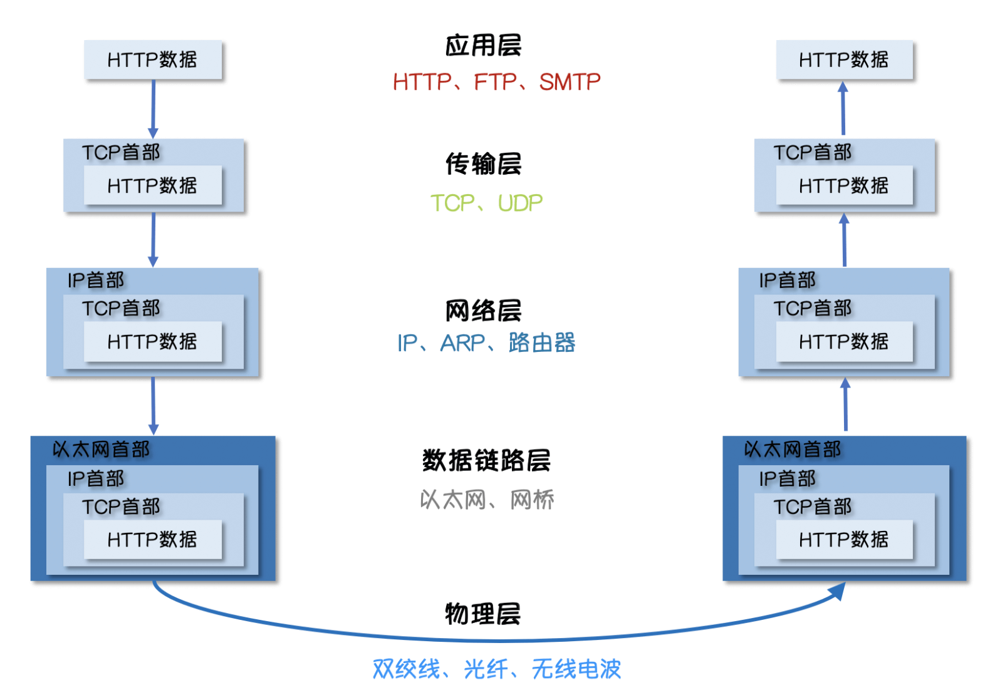
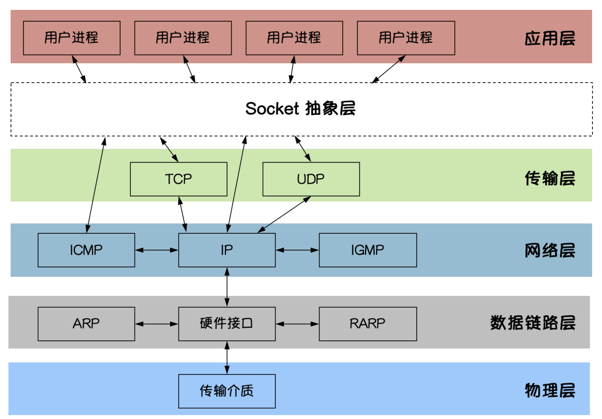
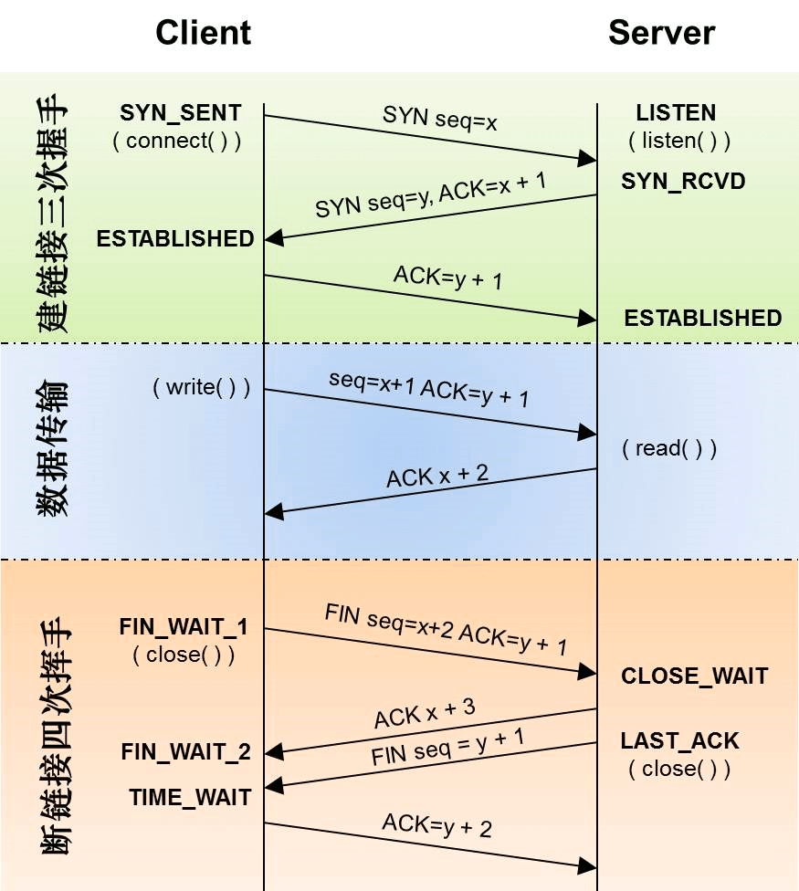
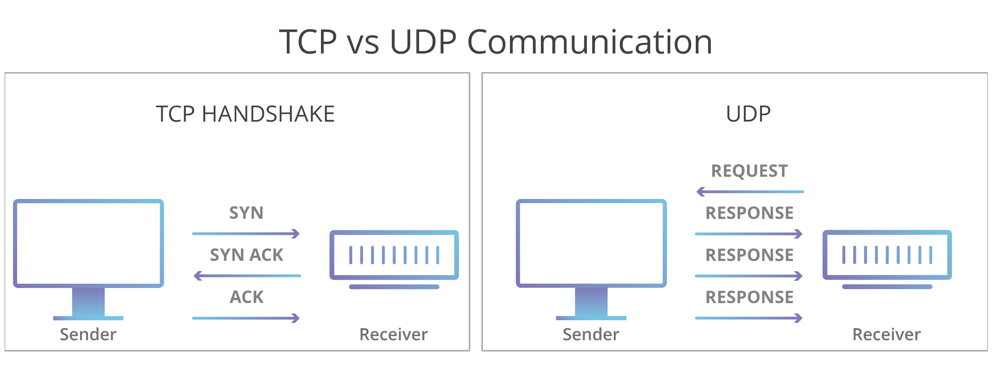
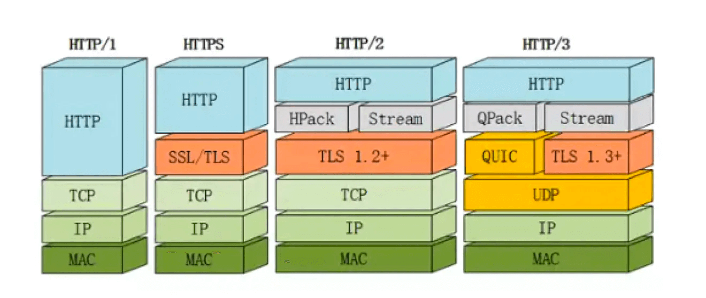
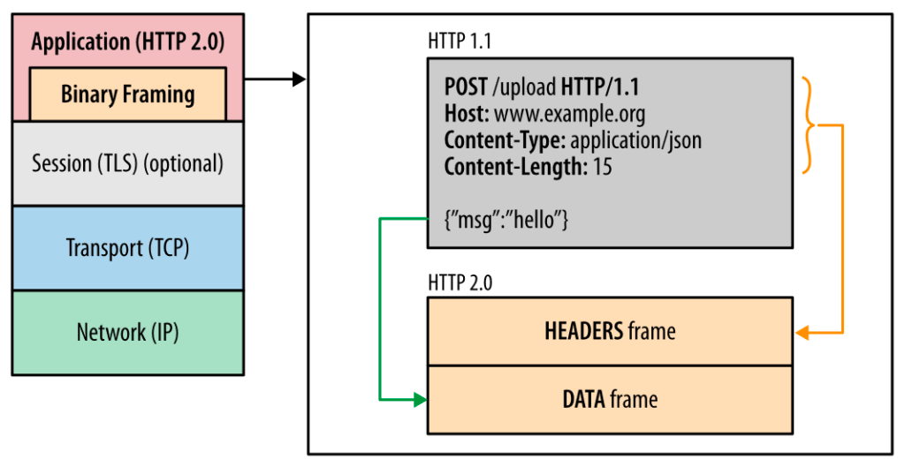
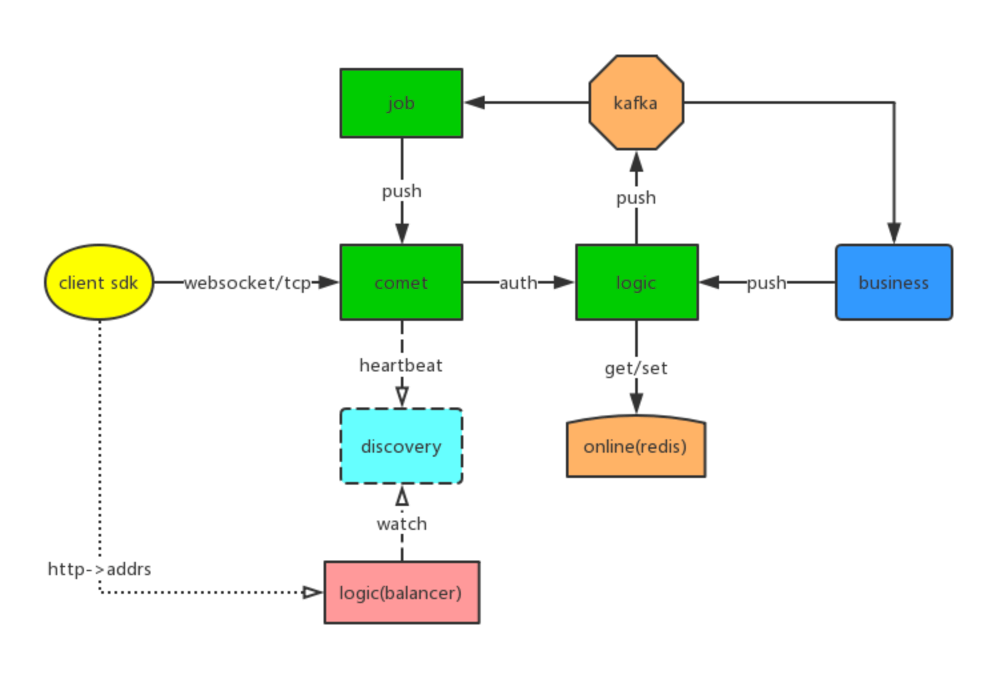
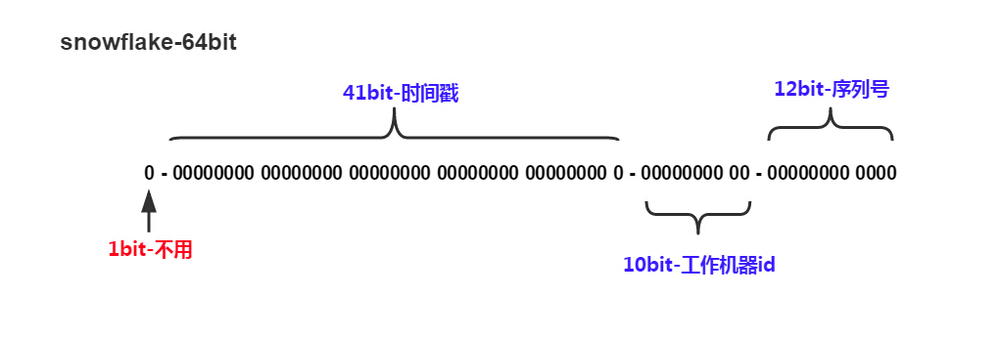
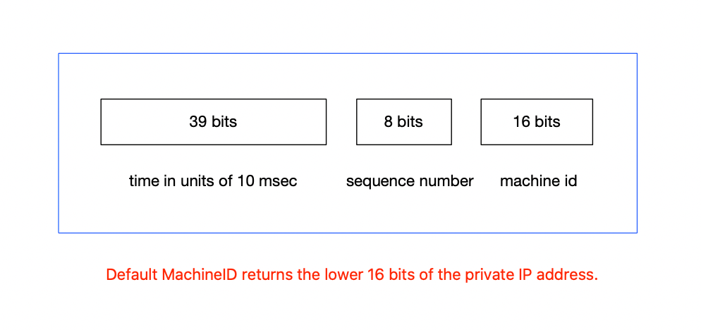

# 网络编程


## 网络通信协议




互联网的核心是一系列协议，总称为”互联网协议”（Internet Protocol Suite），正是这一些协议规定了电脑如何连接和组网。
主要协议分为：

Socket

* 接口抽象层

TCP / UDP

* 面向连接(可靠) / 无连接(不可靠)

HTTP1.1 / HTTP2 / QUIC（HTTP3）

* 超文本传输协议

### Socket 抽象层



应用程序通常通过“套接字”向网络发出请求或者应答网络请求。

一种通用的面向流的网络接口

主要操作：

* 建立、接受连接
* 读写、关闭、超时
* 获取地址、端口

### TCP 可靠连接，面向连接的协议




TCP/IP（Transmission Control Protocol/Internet Protocol）即传输控制协议/网间协议，是一种面向连接（连接导向）的、可靠的、基于字节流的传输层（Transport layer）通信协议，因为是面向连接的协议。

服务端流程：

* 监听端口

* 接收客户端请求建立连接
* 创建 goroutine 处理连接

客户端流程：

* 建立与服务端的连接
* 进行数据收发
* 关闭连接


### UDP 不可靠连接，允许广播或多播




UDP 协议（User Datagram Protocol）中文名称是用户数据报协议，是 OSI（Open System Interconnection，开放式系统互联）参考模型中一种无连接的传输层协议。

一个简单的传输层协议：

* 不需要建立连接
* 不可靠的、没有时序的通信
* 数据报是有最大长度限制（65535-20=65515）
* 支持多播和广播
* 低延迟，实时性比较好
* 应用于用于视频直播、游戏同步


### HTTP 超文本传输协议-演进



HTTP 发展史：

* 1991 年发布初代 HTTP/0.9 版
* 1996 年发布 HTTP/1.0 版
* 1997 年是 HTTP/1.1 版，是到今天为止传输最广泛的版本
* 2015 年发布了 HTTP/2.0 版，优化了 HTTP/1.1 的性能和安全性
* 2018 年发布的 HTTP/3.0 版，使用 UDP 取代 TCP 协议

HTTP2：



* 二进制分帧，按帧方式传输
* 多路复用，代替原来的序列和阻塞机制
* 头部压缩，通过 HPACK 压缩格式
* 服务器推送，服务端可以主动推送资源

HTTP3：

* 连接建立延时低，一次往返可建立HTTPS连接
* 改进的拥塞控制，高效的重传确认机制
* 切换网络保持连接，从4G切换到WIFI不用重建连接


## Go 实现网络编程

### 基础概念

基础概念：

* Socket：数据传输

* Encoding：内容编码

* Session：连接会话状态

* C/S模式：通过客户端实现双端通信

* B/S模式：通过浏览器即可完成数据的传输

简单例子

* 通过TCP/UDP实现网络通信

网络轮询器

* 多路复用模型

* 多路复用模块

* 文件描述符

* Goroutine 唤醒


### I/O模型

Linux下主要的IO模型分为:

* Blocking IO - 阻塞I O

* Nonblocking IO - 非阻塞IO

* IO multiplexing - IO 多路复用

* Signal-driven IO - 信号驱动式IO（异步阻塞）

* Asynchronous IO - 异步IO


同步：调用端会一直等待服务端响应，直到返回结果

异步：调用端发起调用之后不会立刻返回，不会等待服务端响应

阻塞：服务端返回结果之前，客户端线程会被挂起，此时线程不可被 CPU 调度，线程暂停运行

非阻塞：在服务端返回前，函数不会阻塞调用端线程，而会立刻返回


### I/O多路复用

Go 语言在采用  I/O 多路复用 模型处理 I/O 操作，但是他没有选择最常见的系统调用 select。虽然 select 也可以提供 I/O 多路复用的能力，但是使用它有比较多的限制：

* 监听能力有限 — 最多只能监听 1024 个文件描述符；
* 内存拷贝开销大 — 需要维护一个较大的数据结构存储文件描述符，该结构需要拷贝到内核中；
* 时间复杂度 𝑂(𝑛) — 返回准备就绪的事件个数后，需要遍历所有的文件描述符；

I/O多路复用：进程阻塞于 select，等待多个 IO 中的任一个变为可读，select调 用返回，通知相应 IO 可以读。 它可以支持单线程响应多个请求这种模式。


为了提高 I/O 多路复用的性能

不同的操作系统也都实现了自己的 I/O 多路复用函数，例如：epoll、kqueue 和 evport 等

Go 语言为了提高在不同操作系统上的 I/O 操作性能，使用平台特定的函数实现了多个版本的网络轮询模块：

* src/runtime/netpoll_epoll.go

* src/runtime/netpoll_kqueue.go

* src/runtime/netpoll_solaris.go

* src/runtime/netpoll_windows.go

* src/runtime/netpoll_aix.go

* src/runtime/netpoll_fake.go


## Goim 长连接网关

### Goim 长连接 TCP 编程 - 概览

**Comet**
长连接管理层，主要是监控外网 TCP/Websocket端口，并且通过设备 ID 进行绑定 Channel实 现，以及实现了 Room 合适直播等大房间消息广播。
**Logic**
逻辑层，监控连接 Connect、Disconnect 事件，可自定义鉴权，进行记录 Session 信息（设备 ID、ServerID、用户 ID），业务可通过设备 ID、用户 ID、RoomID、全局广播进行消息推送。
**Job**
通过消息队列的进行推送消峰处理，并把消息推送到对应 Comet 节点。

各个模块之间通过 gRPC 进行通信。




### 协议设计

主要以包/帧方式：

* Package Length，包长度

* Header Length，头长度

* Protocol Version，协议版本

* Operation，操作码

* Sequence 请求序号 ID

* Body，包内容

Operation:

* Auth

* Heartbeat

* Message

Sequence

* 按请求、响应对应递增 ID

| 字段             | 长度               |
| ---------------- | ------------------ |
| Package L ength  | 4 bytes            |
| Header Length    | 2 bytes            |
| Protocol Version | 2 bytes            |
| Operation        | 4 bytes            |
| Sequence ld      | 4 bytes            |
| Body             | PackLen- HeaderLen |


注意：缺少 checksum，如果可以的话建议加上。

> 注意内存对齐


### 边缘节点

Comet 长连接连续节点，通常部署在距离用户比较近，通过 TCP 或者 Websocket 建立连接，并且通过应用层 Heartbeat 进行保活检测，保证连接可用性。
节点之间通过云 VPC 专线通信，按地区部署分布。

大陆：

* 华北（北京）
* 华中（上海、杭州）
* 华南（广州、深圳）
* 华西（四川）

非大陆：

* 香港、日本、美国、欧洲


### 负载均衡

长连接负载均衡比较特殊，需要按一定的负载算法进行分配节点，可以通过 HTTPDNS 方式，请求获致到对应的节点 IP 列表，例如，返回固定数量 IP，按一定的权重或者最少连接数进行排序，客户端通过 IP 逐个重试连接；

* Comet 注册 IP 地址，以及节点权重，定时 Renew当前节点连接数量；
* Balancer 按地区经纬度计算，按最近地区（经纬度）提供 Comet 节点 IP 列表，以及权重计算排序；
* BFF 返回对应的长连接节点 IP，客户端可以通过 IP直接连；
* 客户端 按返回IP列表顺序，逐个连接尝试建立长连接


### 心跳保活机制

长连接断开的原因：

* 长连接所在进程被杀死

* NAT 超时

* 网络状态发生变化，如移动网络 & Wifi 切换、断开、重连

* 其他不可抗因素（网络状态差、DHCP 的租期等等 ）

高效维持长连接方案

* 进程保活（防止进程被杀死）

* 心跳保活（阻止 NAT 超时）

* 断线重连（断网以后重新连接网络）

自适应心跳时间

* 心跳可选区间，[min=60s，max=300s]

* 心跳增加步长，step=30s

* 心跳周期探测，success=current + step、fail=current - step


### 推拉结合

在长连接中，如果想把消息通知所有人，主要有两种模式：一种是自己拿广播通知所有人，这叫“推”模式；一种是有人主动来找你要，这叫“拉”模式。；
在业务系统中，通常会有三种可能的做法：

* 推模式，有新消息时服务器主动推给客户端；

* 拉模式，由前端主动发起拉取消息的请求；

* 推拉结合模式，有新消息实时通知，客户端再进行新的消息摘取；


### 读写扩散

一般消息系统中，通常会比较关注消息存储；

主要进行考虑“读”、“写”扩散，也就是性能问题；

在不同场景，可能选择不同的方式：

读扩散，在IM系统里的读扩散通常是每两个相关联的人就有一个信箱，或者每个群一个信箱。

* 优点：写操作（发消息）很轻量，只用写自己信箱
* 缺点：读操作（读消息）很重，需要读所有人信箱

发消息直接写到群信息，读的时候把和自己相关联的信箱全读一次，才能拿到所有消息。

写扩散，每个人都只从自己的信箱里读取消息，但写（发消息）的时候需要所有人写一份

* 优点：读操作很轻量
* 缺点：写操作很重，尤其是对于群聊来说

即群里有人发消息后，需要为所有群员收件箱写入一条消息，读消息的时候只需要从自己的收件箱拉取即可，但是写压力比较大，需要限制群人数。


**小结**

如果是读扩散需要限制用户的群组上限。

写扩散则要控制群组用户上限。

## ID 分布式生成器

唯一 ID，需要保证全局唯一，绝对不会出现重复的 ID，且 ID 整体趋势递增。
通常情况下，ID 的设计主要有以下几大类：

* UUID
* 基于 Snowflake 的 ID 生成方式
* 基于申请 DB 步长的生成方式
* 基于 Redis 或者 DB 的自增 ID生成方式
* 特殊的规则生成唯一 ID

### Snowflake

Snowflake，is a network service for generating unique ID numbers at high scale with some simple guarantees.
id is composed of:

* time - 41 bits (millisecond precision w/ a custom epoch gives us 69 years)

* configured machine id - 10 bits - gives us up to 1024 machines

* sequence number - 12 bits - rolls over every 4096 per machine (with protection to avoid rollover in the same ms)




###  Sonyflake

Sonyflake，is a distributed unique ID generator inspired by Twitter's Snowflake.
id is composed of:

* 39 bits for time in units of 10 msec

* 8 bits for a sequence number

* 16 bits for a machine id

As a result, Sonyflake has the following advantages and disadvantages:

* The lifetime (174 years) is longer than that of Snowflake (69 years)

* It can work in more distributed machines (2^16) than Snowflake (2^10)

* It can generate 2^8 IDs per 10 msec at most in a single machine/thread (slower than Snowflake)



### 唯一ID设计

基于步长递增的分布式 ID 生成器，可以生成基于递增，并且比较小的唯一 ID；
服务主要分为:

* 通过 gRPC 通信，提供 ID 生成接口，并且携带业务标记，为不同业务分配 ID；

* 部署多个 id-server 服务，通过数据库进行申请 ID步长，并且持久化最大的 ID。
  * 例如，每次批量取1000到内存中，可减少对 DB 的压力；

* 数据库记录分配的业务 MAX_ID 和对应 Step ，供Sequence 请求获取；


使用 snowflake 或者 基于步长递增都是可以的。


## IM 私信系统


## References

```sh
https://draveness.me/golang/docs/part3-runtime/ch06-concurrency/golang-netpoller/
https://www.liwenzhou.com/posts/Go/15_socket/
https://hit-alibaba.github.io/interview/basic/network/HTTP.html
https://cloud.tencent.com/developer/article/1030660
https://juejin.cn/post/6844903827536117774
https://xie.infoq.cn/article/19e95a78e2f5389588debfb1c
https://tech.meituan.com/2019/03/07/open-source-project-leaf.html
https://mp.weixin.qq.com/s/8WmASie_DjDDMQRdQi1FDg
https://www.imooc.com/article/265871
```

