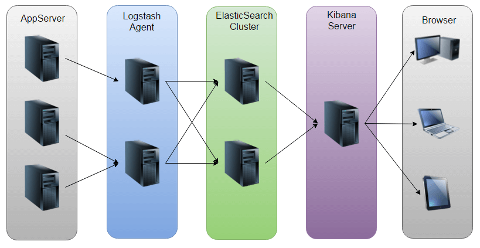
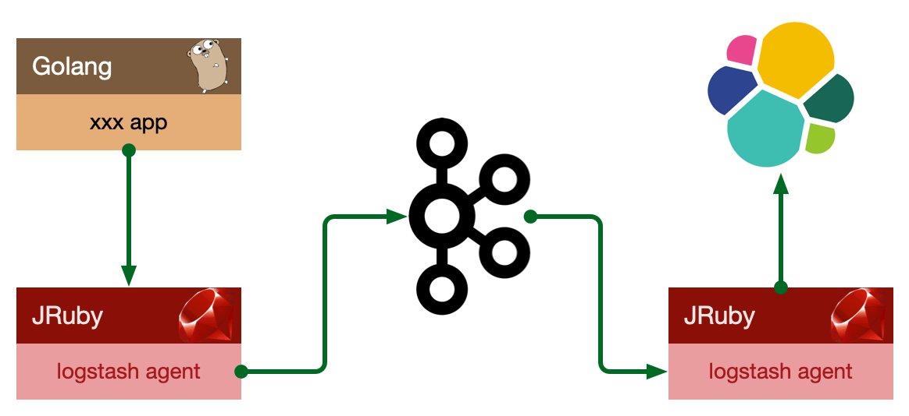
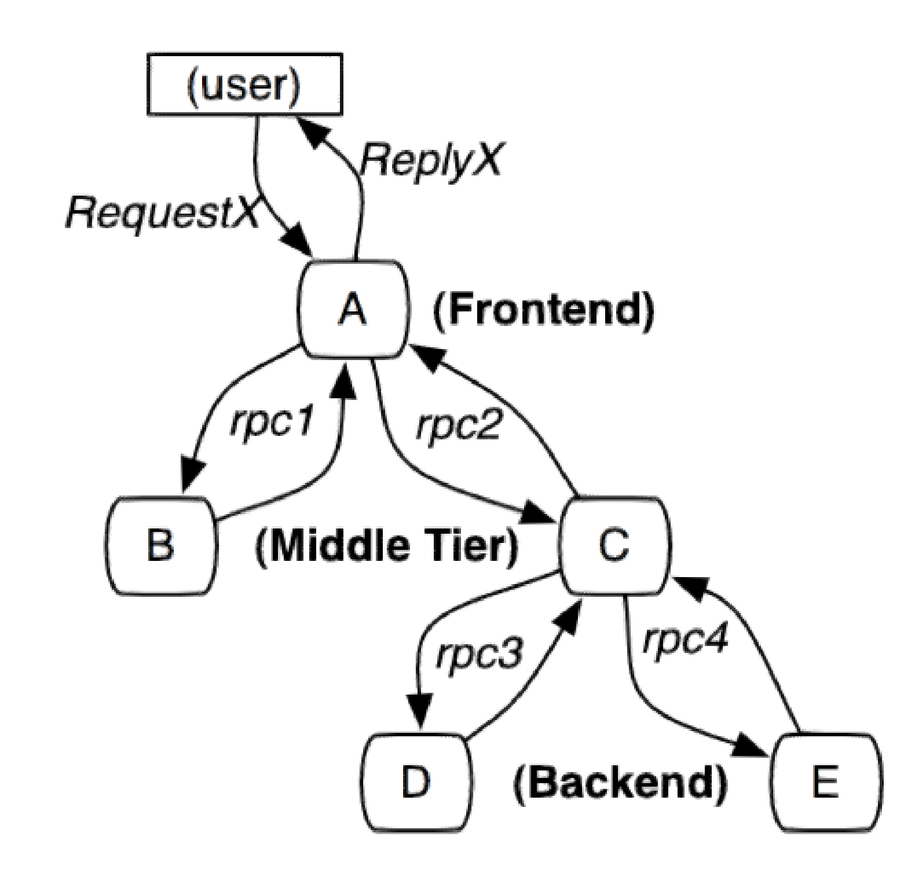
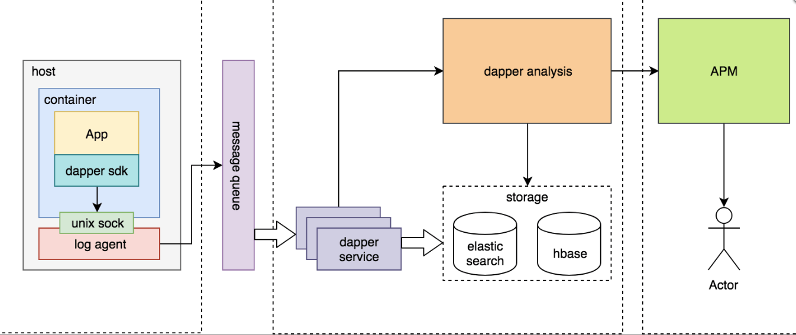
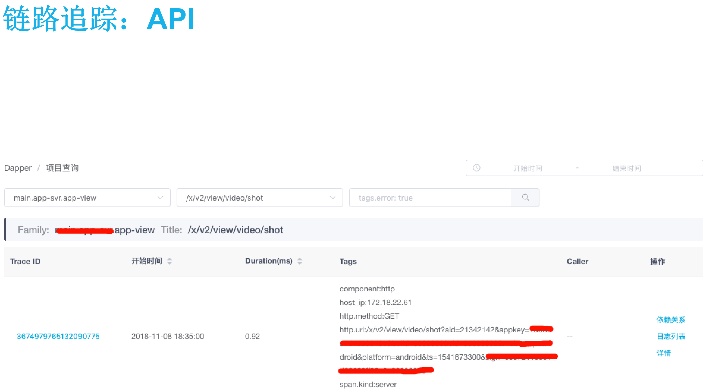
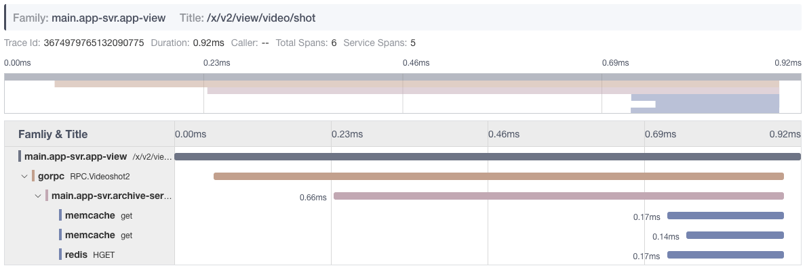
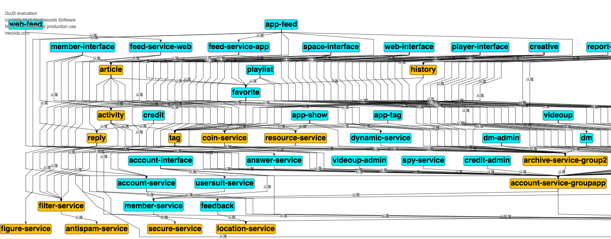
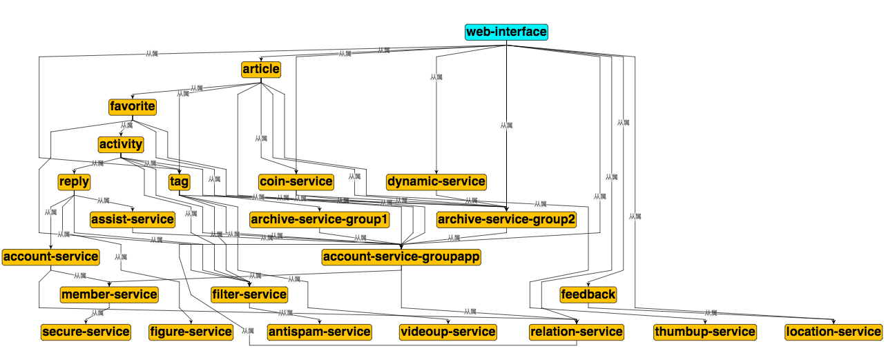
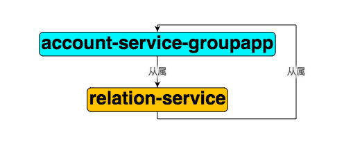

# 日志&指标&链路追踪

微服务可观测性。

* MTBF：即平均无故障工作时间，英文全称是“Mean Time Between Failure”。是衡量一个产品（尤其是电器产品）的可靠性指标
*  MTTR：一般指平均修复时间。平均修复时间（Mean time to repair），是描述产品由故障状态转为工作状态时修理时间的平均值。

服务巡检， morning checklist


## 日志

### 日志级别

https://github.com/golang/glog，是 google 提供的一个不维护的日志库，glog 有其他语言的一些版本，对我当时使用 log 库有很大的影响。它包含如下日志级别：

* Info
* Warning
* Error
* Fatal(会中断程序执行)

```go
// 这种写法性能就比较高，每次先执行分支判断，如果不满足就不会执行下面的函数
if glog.V(2) {
	glog.Info("Starting transaction...")
}
// 这种写法性能比较低，会多很多函数调用
glog.V(2).Infoln("Processed", nItems, "elements")
```


还有类似 log4go，loggo，zap 等其他第三方日志库，他们还提供了

设置日志级别的可见行，一般提供日志级别：

* Trace
* Debug
* Info
* Warning
* Error
* Critical

因为打印日志其实是比较消耗性能的，而且这么多日志级别增加了使用难度，很难区分什么时候该用什么级别，所以 glog 只有 4 种日志级别。


**Warning**

没人看警告，因为从定义上讲，没有什么出错。也许将来会出问题，但这听起来像是别人的问题。我们尽可能的消除警告级别，它要么是一条信息性消息，要么是一个错误。我们参考 Go 语言设计额哲学，所有警告都是错误，其他语言的 warning 都可以忽略，除非 IDE 或者在 CICD 流程中强制他们为 error，然后逼着程序员们尽可能去消除。同样的，如果想要最终消除 warning 可以记录为 error，让代码作者重视起来。

**Fatal**

 记录消息后，直接调用 os.Exit(1)，这意味着：

*  在其他 goroutine defer 语句不会被执行；
* 各种 buffers 不会被 flush，包括日志的；
* 临时文件或者目录不会被移除；

不要使用 fatal 记录日志，而是向调用者返回错误。如果错误一直持续到 main.main。main.main 那就是在退出之前做处理任何清理操作的正确位置。

**Error**

也有很多人，在错误发生的地方要立马记录日志，尤其要使用 error 级别记录。

* 处理 error；
* 把 error 抛给调用者，在顶部打印日志；

如果您选择通过日志记录来处理错误，那么根据定义，它不再是一个错误，因为您已经处理了它。记录错误的行为会处理错误，因此不再适合将其记录为错误。


```go
if err := planA(); err != nil {
    // 这里产生了降级行为，本质属于有损服务，我更倾向在这里使用 Warning。
    log. Infof("could't open the foo file, cont inuing)
    planB()
}
```


**Debug**

相信只有两件事你应该记录：

* 开发人员在开发或调试软件时关心的事情。
* 用户在使用软件时关心的事情。

显然，它们分别是调试和信息级别。

log.Info 只需将该行写入日志输出。**不应该有关闭它的选项，因为用户只应该被告知对他们有用的事情**。如果发生了一个无法处理的错误，它就会抛出到 main.main。main.main 程序终止的地方。在最后的日志消息前面插入 fatal 前缀，或者直接写入 os.Stderr。

log.Debug，是完全不同的事情。它由开发人员或支持工程师控制。在开发过程中，调试语句应该是丰富的，而不必求助于 trace 或 debug2（您知道自己是谁）级别。日志包应该支持细粒度控制，以启用或禁用调试，并且只在包或更精细的范围内启用或禁用调试语句。

我们如何设计和思考的：https://github.com/go-kratos/kratos/tree/main/log


**建议只使用 Debug、Info、Error 3 种日志级别。**


### Logger

在 package 使用的时候

```go
package foo
import “mylogger”
var log = mylogger.GetLogger(“github.com/project/foo”)
```

foo 耦合了 mylogger

所有使用 foo 的其他库，被透明依赖了 mylogger

当我们使用 kit 时候

```go
package foo
import "github.com/pkg/log"
type T struct {
        logger log.Logger
}
```

**解耦，延迟需要打日志的类型与日志的实际类型之间的绑定。**

如果想要连第三方 kit 库都不依赖，可以自定义一个 interface 让应用和 kit 库也完全解耦。

```go
package foo

type logger interface {
	Printf(string，... interface{})
}
type T struct {
	logger
// other fields
}

```


### 日志选型

一个完整的集中式日志系统，需要包含以下几个主要特点：

* 收集－能够采集多种来源的日志数据；
* 传输－能够稳定的把日志数据传输到中央系统；
* 存储－如何存储日志数据；
* 分析－可以支持 UI 分析；
* 警告－能够提供错误报告，监控机制；

开源界鼎鼎大名 ELK stack，分别表示：Elasticsearch , Logstash, Kibana , 它们都是开源软件。新增了一个 FileBeat，它是一个轻量级的日志收集处理工具(Agent)，Filebeat 占用资源少，适合于在各个服务器上搜集日志后传输给 Logstash，官方也推荐此工具。


**架构一**

此架构由 Logstash 分布于各个节点上搜集相关日志、数据，并经过分析、过滤后发送给远端服务器上的 Elasticsearch 进行存储。
Elasticsearch 将数据以分片的形式压缩存储并提供多种 API 供用户查询，操作。用户亦可以更直观的通过配置 Kibana Web方便的对日志查询，并根据数据生成报表。
因为 logstash 属于 server 角色，必然出现流量集中式的热点问题，因此我们不建议使用这种部署方式，同时因为 还需要做大量 match 操作（格式化日志），消耗的 CPU 也很多，不利于 scale out。




此种架构引入了消息队列机制，位于各个节点上的 Logstash Agent 先将数据/日志传递给 Kafka，并将队列中消息或数据间接传递给 Logstash，Logstash 过滤、分析后将数据传递给Elasticsearch 存储。最后由 Kibana 将日志和数据呈现给用户。因为引入了 Kafka，所以即使远端 Logstash server 因故障停止运行，数据将会先被存储下来，从而避免数据丢失。




更进一步的：
将收集端 logstash 替换为 beats，更灵活，消耗资源更少，扩展性更强。

到此已经是一个非常完善的日志系统了，如果日志量不是超级大，完全够用。


### 日志系统

日志量超级大，直到上述架构无法满足时，可以自研日志系统。


#### 设计目标

* 接入方式收敛；
* 日志格式规范；
* 日志解析对日志系统透明；
* 系统高吞吐、低延迟；
* 系统高可用、容量可扩展、高可运维性；


#### 格式规范

* JSON作为日志的输出格式：
* time: 日志产生时间，ISO8601格式；
* level: 日志等级，ERROR、WARN、 INFO、DEBUG；
* app_id: 应用id，用于标示日志来源；
* instance_id: 实例 id，用于区分同一应用不同实例，即 hostname；

以上几个为统一字段，必须包含，剩下的具体日志内容字段则各个应用可以自定义。


#### 设计与实现

日志从产生到可检索，经历几个阶段：

* 生产 & 采集
* 传输 & 切分
* 存储 & 检索


#### 采集

logstash：

* 监听tcp/udp
* 适用于通过网络上报日志的方式
  

filebeat：

* 直接采集本地生成的日志文件 
* 适用于日志无法定制化输出的应用


logagent：

* 物理机部署，监听unixsocket
* 日志系统提供各种语言SDK
* 直接读取本地日志文件


建议使用 filebeat,从日志文件采集比较简单，各个语言只要将日志打印到文件即可，不需要单独的 SDK。


#### 传输

基于Flume + Kafka 统一传输平台。

增加 Flume 主要是为了基于LogID 做日志分流，将不同类型的日志分流到不同的 Kafka 集群：

* 一般级别
* 低级别
* 高级别（ERROR）


> 如果日志量不算大的话直接写 Kafka 即可。


#### 切分

从kafka消费日志，解析日志，写入elasticsearch

* bili-index: 自研，golang开发，逻辑简单，性能 高, 可定制化方便。
  * 日志规范产生的日志(log agent收集)

* logstash: es官方组件，基于jruby开发，功能强大， 资源消耗高，性能低。
  * 处理未按照日志规范产生的日志(filebeat、logstash 收集)，需配置各种日志解析规则。


#### 存储和检索

elasticsearch多集群架构：

* 日志分级、高可用
  

单数据集群内:

master node + data node(hot/stale) + client node

* 每日固定时间进行热->冷迁移
* Index 提前一天创建，基于 template 进行mapping 管理
* 检索基于 kibana


#### 文件

使用自定义协议，对 SDK 质量、版本升级都有比较高的要求，因此我们长期会使用“本地文件”的方案实现：

* 采集本地日志文件：位置不限，容器内 or 物理机
* 配置自描述：不做中心化配置，配置由 app/paas 自身提供，agent 读取配置并生效
* 日志不重不丢：多级队列，能够稳定地处理日志收集过程中各种异常
* 可监控：实时监控运行状态
* 完善的自我保护机制：限制自身对于宿主机资源的消耗，限制发送速度

 

#### 容器日志采集

容器内应用日志采集：基于 overlay2，直接从物理机上查找对应日志文件


## 链路追踪


### 设计目标

* 无处不在的部署
* 持续的监控
* 低消耗
* 应用级的透明
* 延展性
* 低延迟


### Dapper



参考 Google Dapper 论文实现，为每个请求都生成一个全局唯一的 traceid，端到端透传到上下游所有节点，每一层生成一个 spanid，通过traceid 将不同系统孤立的调用日志和异常信息串联一起，通过 spanid 和 level 表达节点的父子关系。
核心概念：

* Tree
* Span
* Annotation


### 调用链


在跟踪树结构中，树节点是整个架构的基本单元，而每一个节点又是对 span 的引用。虽然 span 在日志文件中只是简单的代表 span 的开始和结束时间，他们在整个树形结构中却是相对独立的。
核心概念：

* TraceID
  * 整个完整请求中的唯一ID，代表整个完整请求
* SpanID
  * 每个单元的ID
* ParentID
  * 触发本次调用的 SpanID
* Family & Title
  * 服务名和方法名


### 追踪信息


Span 里包含如下信息：

追踪信息包含时间戳、事件、方法名（Family+Title）、注释（TAG/Comment）。

客户端和服务器上的时间戳来自不同的主机，我们必须考虑到时间偏差，RPC 客户端发送一个请求之后，服务器端才能接收到，对于响应也是一样的（服务器先响应，然后客户端才能接收到这个响应）。这样一来，服务器端的 RPC 就有一个时间戳的一个上限和下限。

> 即：服务端收到请求的时间 - 客户端发起请求的时间 = 网络传输时间


### 植入点

Dapper 可以以对应用开发者近乎零浸入的成本对分布式控制路径进行跟踪，几乎完全依赖于基于少量通用组件库的改造。如下：

当一个线程在处理跟踪控制路径的过程中，Dapper 把这次跟踪的上下文的在 ThreadLocal中进行存储，在 Go 语言中，约定每个方法首参数为 context（上下文）

覆盖通用的中间件&通讯框架、不限于：redis、memcache、rpc、http、database、queue。


### 架构图




### 跟踪消耗

**处理跟踪消耗：**

* 正在被监控的系统在生成追踪和收集追踪数据的消耗导致系统性能下降，
* 需要使用一部分资源来存储和分析跟踪数据，是Dapper性能影响中最关键的部分：
  * 因为收集和分析可以更容易在紧急情况下被关闭，ID生成耗时、创建Span等；
  * 修改agent nice值，以防在一台高负载的服务器上发生cpu竞争；

**采样：**

如果一个显着的操作在系统中出现一次，他就会出现上千次，基于这个事情我们不全量收集数据。

有意思的论文：Uncertainty in Aggregate Estimates from Sampled Distributed Traces 

> 全采样对性能影响较大，一般推荐部分采样，只需要在 root 节点判断本次请求是否采样即可，后续请求检测到带了 traceid 则一定要进行采样，避免出现 traceid 对应的 span 不完整的情况。


**固定采样，1/1024：**

​    这个简单的方案是对我们的高吞吐量的线上服务来说是非常有用，因为那些感兴趣的事件(在大吞吐量的情况下)仍然很有可能经常出现，并且通常足以被捕捉到。然而，在较低的采样率和较低的传输负载下可能会导致错过重要事件，而想用较高的采样率就需要能接受的性能损耗。对于这样的系统的解决方案就是覆盖默认的采样率，这需要手动干预的，这种情况是我们试图避免在 Dapper 中出现的。

**应对积极采样：**

​    我们理解为单位时间期望采集样本的条目，在高 QPS 下，采样率自然下降，在低 QPS 下，采样率自然增加；比如1s内某个接口采集1条。

> 比如固定要1秒采集10条，1W QPS 的系统采样率就1/1000,1000QPS 的系统采样率就是 1/100


**二级采样：**
    容器节点数量多，即使使用积极采样仍然会导致采样样本非常多，所以需要控制写入中央仓库的数据的总规模，利用所有 span 都来自一个特定的跟踪并分享同一个 traceid 这个事实，虽然这些 span 有可能横跨了数千个主机。
对于在收集系统中的每一个 span，我们用hash算法把 traceid 转成一个标量Z ，这里0<=Z<=1，我们选择了运行期采样率，这样就可以优雅的去掉我们无法写入到仓库中的多余数据，我们还可以通过调节收集系统中的二级采样率系数来调整这个运行期采样率，最终我们通过后端存储压力把策略下发给 agent采集系统，实现精准的二级采样。

> 通过 Hash算法选择性丢弃指定traceID 的数据，而不是随机丢弃。随机丢弃可能会出现同一个 traceID 中有的span 有，有的 span 被丢弃了的情况。


**下游采样：**

​    越被依赖多的服务，网关层使用积极采样以后，对于 downstream 的服务采样率仍然很高。


### API

搜索：

按照 Family（服务名）、Title（接口）、时间、调用者等维度进行搜索



详情：

根据单个 traceid，查看整体链路信息，包含 span、level 统计，span 详情，依赖的服务、组件信息等；



全局依赖图：

由于服务之间的依赖是动态改变的，所以不可能仅从配置信息上推断出所有这些服务之间的依赖关系，能够推算出任务各自之间的依赖，以及任务和其他软件组件之间的依赖。




依赖搜索：

搜索单个服务的依赖情况，方便我们做“异地多活”时候来全局考虑资源的部署情况，以及区分服务是否属于多活范畴，也可以方便我们经常性的梳理依赖服务和层级来优化我们的整体架构可用性。



推断环依赖：
一个复杂的业务架构，很难避免全部是层级关系的调用，但是我们要尽可能保证一点：调用栈永远向下，即：不产生环依赖。




### 经验&优化

性能优化：

* 1、不必要的串行调用；
* 2、缓存读放大；
* 3、数据库写放大；
* 4、服务接口聚合调用；


异常日志系统集成：

如果这些异常发生在 Dapper 跟踪采样的上下文中，那么相应的 traceid 和 spanid 也会作为元数据记录在异常日志中。异常监测服务的前端会提供一个链接，从特定的异常信息的报告直接导向到他们各自的分布式跟踪；

用户日志集成：

**在请求的头中返回 traceid，当用户遇到故障或者上报客服我们可以根据 traceid 作为整个请求链路的关键字**，再根据接口级的服务依赖接口所涉及的服务并行搜索 ES Index，聚合排序数据，就比较直观的诊断问题了；

容量预估：

根据入口网关服务，推断整体下游服务的调用扇出来精确预估流量再各个系统的占比；

网络热点&易故障点：

我们内部 RPC 框架还不够统一，以及基础库的组件部分还没解决拿到应用层协议大小，如果我们收集起来，可以很简单的实现流量热点、机房热点、异常流量等情况。同理容易失败的 span，很容易统计出来，方便我们辨识服务的易故障点；

opentraceing：

标准化的推广，上面几个特性，都依赖 span TAG 来进行计算，因此我们会逐步完成标准化协议，也更方便我们开源，而不是一个内部“特殊系统”；


## 监控&指标

Monitoring：

* 延迟、流量、错误、饱和度
* 长尾问题
* 依赖资源 (Client/Server 's view)

opentracing (Google Dapper)

Logging：

* traceid关联

Prometheus + Granfana


### 日志级别

涉及到 net、cache、db、rpc 等资源类型的基础库，首先监控维度4个黄金指标：

* 延迟（耗时，需要区分正常还是异常）
* 流量（需要覆盖来源，即：caller）
* 错误（覆盖错误码或者 HTTP Status Code）
* 饱和度（服务容量有多“满”）


系统层面：

* CPU，Memory，IO，Network，TCP/IP状态等，FD（等其他）
* Kernel：Context Switch
* Runtime：各类 GC、Mem 内部状态等


### 监控

* 线上打开 Profiling 的端口；
* 使用服务发现找到节点信息，以及提供快捷的方式快速可以 WEB 化查看进程的 Profiling 信息（火焰图等）；
* watchdog，使用内存、CPU等信号量触发自动采集；


## References

```sh
https://dave.cheney.net/2015/11/05/lets-talk-about-logging
https://www.ardanlabs.com/blog/2013/11/using-log-package-in-go.html
https://www.ardanlabs.com/blog/2017/05/design-philosophy-on-logging.html
https://dave.cheney.net/2017/01/23/the-package-level-logger-anti-pattern
https://help.aliyun.com/document_detail/28979.html?spm=a2c4g.11186623.2.10.3b0a729amtsBZe
https://developer.aliyun.com/article/703229
https://developer.aliyun.com/article/204554
https://developer.aliyun.com/article/251629
https://www.elastic.co/cn/what-is/elk-stack
https://my.oschina.net/itblog/blog/547250
https://www.cnblogs.com/aresxin/p/8035137.html

https://www.elastic.co/cn/products/beats/filebeat
https://www.elastic.co/guide/en/beats/filebeat/5.6/index.html
https://www.elastic.co/cn/products/logstash
https://www.elastic.co/guide/en/logstash/5.6/index.html
https://www.elastic.co/cn/products/kibana
https://www.elastic.co/guide/en/kibana/5.5/index.html
https://www.elastic.co/guide/en/elasticsearch/reference/5.6/index.html
https://elasticsearch.cn/
https://blog.aliasmee.com/post/graylog-log-system-architecture/

```

