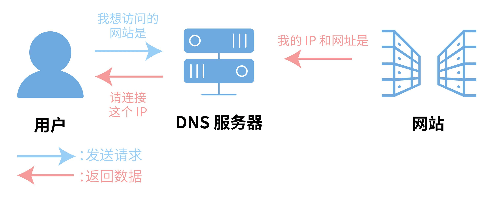
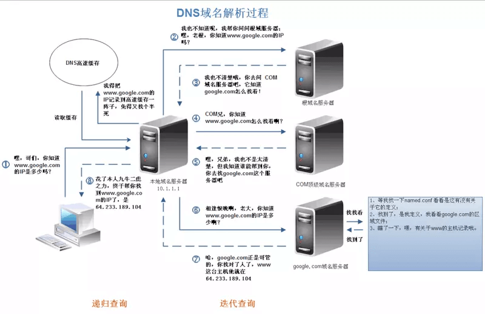
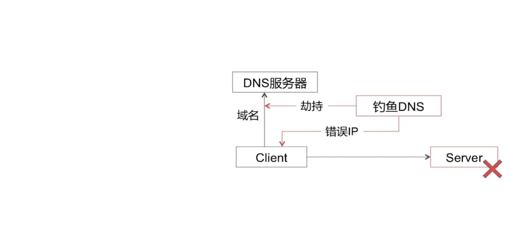
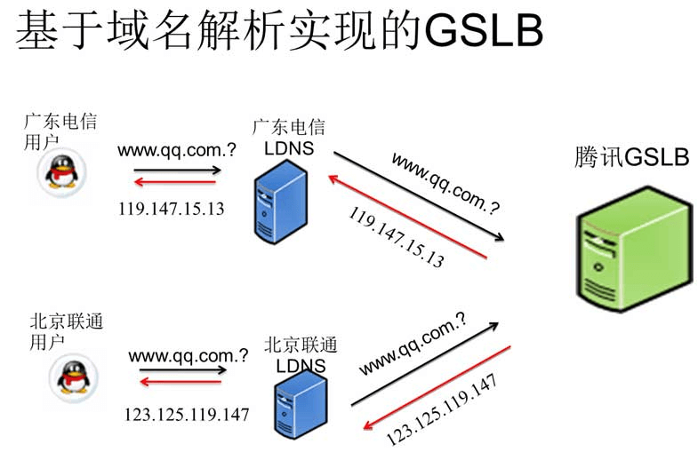
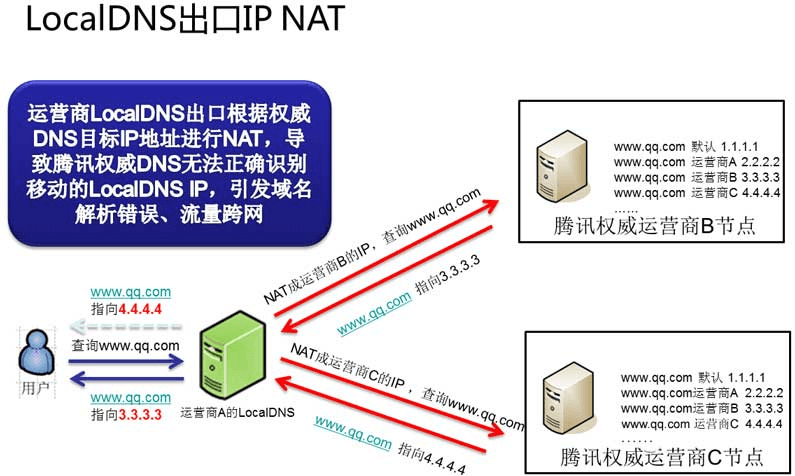
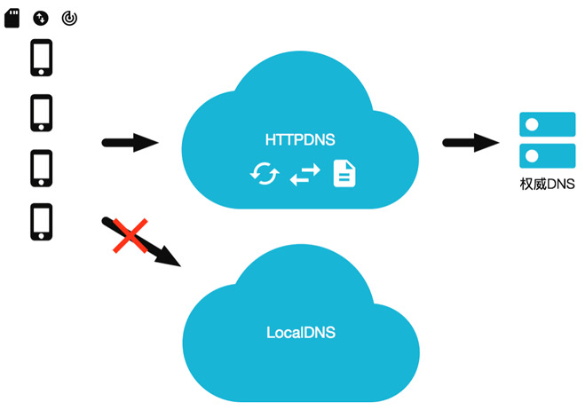
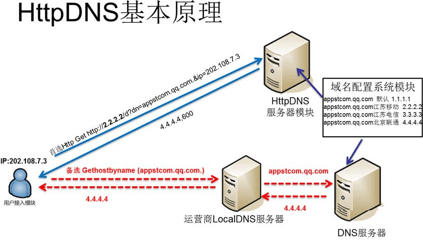
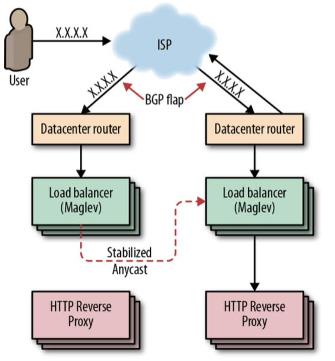

# DNS & CDN & 多活架构

## DNS 介绍

DNS（Domain Name System，域名系统），DNS 服务用于在网络请求时，将域名转为 IP 地址。能够使用户更方便的访问互联网，而不用去记住能够被机器直接读取的 IP 数串。

传统的基于 UDP 协议的公共 DNS 服务极易发生 DNS 劫持，从而造成安全问题。

也可能出现域名缓存问题，已经更新DNS解析了，但是还有部分用户会访问到旧的IP就很尴尬。

> 自建DNS服务器，PowerDNS、Bind

为了提升接口响应速度，第一跳就是 DNS，用户根据 域名发起请求，首先走的就是 DNS。

### 解析流程

**递归查询**

如果主机所询问的本地域名服务器不知道被查询域名的 IP 地址，那么本地域名服务器就以 DNS 客户的身份，向其他根域名服务器继续发出查询请求报文，而不是让该主机自己进行下一步的查询。

**迭代查询**

当根域名服务器收到本地域名服务器发出的迭代查询请求报文时，要么给出所要查询的 IP 地址，要么告诉本地域名服务器：你下一步应当向哪一个域名服务器进行查询。然后让本地域名服务器进行后续的查询，而不是替本地域名服务器进行后续的查询。

**由此可见，客户端到 Local DNS 服务器，Local DNS 与上级 DNS 服务器之间属于递归查询；DNS 服务器与根 DNS 服务器之前属于迭代查询。**

## DNS 问题

#### Local DNS 劫持

Local DNS 把域名劫持到其他域名，实现其不可告人的目的。

通过 DNS 劫持也能便于测试，常见测试时的做法如下：

* 1）手动修改 hosts 指向测试服务器，不容易维护
* 2）自建 dns-server，由管理员统一做 dns 劫持来进行测试，便于管理

#### 域名缓存

域名缓存就是**LocalDNS 缓存了业务的域名的解析结果**，不向权威 DNS 发起递归。

* 保证用户访问流量在本网内消化：国内的各互联网接入运营商的带宽资源、网间结算费用、IDC机房分布、网内 ICP 资源分布等存在较大差异。为了保证网内用户的访问质量，同时减少跨网结算，运营商在网内搭建了内容缓存服务器，通过把域名强行指向内容缓存服务器的 IP 地址，就实现了把本地本网流量完全留在了本地的目的。
* 推送广告：有部分 LocalDNS 会把部分域名解析结果的所指向的内容缓存，并替换成第三方广告联盟的广告。

> 服务下线后，由于存在DNS缓存，会导致部分用户还是会访问到旧的服务。

#### 解析转发

除了域名缓存以外，运营商的 LocalDNS 还存在解析转发的现象。

解析转发是指**运营商自身不进行域名递归解析，而是把域名解析请求转发到其它运营商的递归 DNS 上的行为**。

> 自己不干活，直接转发给友商。

解析转发主要会影响 基于 DNS 的 GSLB。

为了高可用和更快的响应时间，大厂一般会做**基于 DNS 的 GSLB(Global Server Load Balancing**)，即根据用户的请求 IP 来返回对应的服务器 IP。

> 比如用户在北京那就返回北京的Server,在上海则返回上海的 Server，让用户能就近访问。

而部分小运营商为了节省资源，就直接将解析请求转发到了其它运营的递归 LocalDNS 上去了。

这样的直接后果就是权威 DNS 收到的域名解析请求的来源 IP 就成了其它运营商的 IP，最终导致用户流量被导向了错误的 IDC，用户访问变慢。

#### LocalDNS出口IP NAT

LocalDNS 递归出口 NAT 指的是运营商的 LocalDNS 按照标准的 DNS 协议进行递归，但是因为在网络上存在多出口且配置了目标路由 NAT，结果导致 LocalDNS 最终进行递归解析的时候的出口 IP 就有概率不为本网的 IP 地址。

这样的直接后果就是 DNS 收到的域名解析**请求的来源 IP 成了其它运营商的 IP，最终导致用户流量被导向了错误的 IDC，用户访问变慢。**

## 高可用的 DNS 设计

### 解决方案

**1）实时监控 + 商务推动**：

> 出问题后叫用户去运营商投诉，这样运营商很快就会解决问题。

这种方案就是周期比较长，毕竟通过行政手段来推动运营商来解决这个问题是比较耗时的。

另外我们通过大数据分析，得出的结论是 Top3 的问题用户均为移动互联网用户。对于这部分用户，我们有什么技术手段可以解决以上的问题呢？

**2）绕过自动分配 DNS，使用 114DNS 或 Google public DNS**

* 如何在用户侧构造域名请求：对于 PC 端的客户端来说，构造一个标准的 DNS 请求包并不算什么难事。但在移动端要向一个指定的 LocalDNS 上发送标准的 DNS 请求包，而且要兼容各种 iOS 和 Android 的版本的话，技术上是可行的，只是兼容的成本会很高。
* 推动用户修改配置极高：如果要推动用户手动修改 PC 的 DNS 配置的话，在 PC 端和手机客户端的 WiFi 下面还算勉强可行。但是要用户修改在移动互联网环境下的 DNS 配置，其难度不言而喻。

**3）完全抛弃域名，自建 HTTPDNS 进行流量调度**

如果要采用这种这种方案的话，首先你就得要拿到一份准确的 IP 地址库来判断用户的归属，然后再制定个协议搭个服务来做调度，然后再对接入层做调度改造。

HTTPDNS 一般使用域名访问，这样才能完全避开 DNS，否则用域名来访问 HTTPDNS 那又回到了 DNS 上了。

> 这种方案和方案二一样，不是不能做，只是成本会比较高，尤其对于大体量业务规模如此庞大的公司而言。

当前主流的解决方案：HTTPDNS出现了！

### HTTPDNS

HTTPDNS 利用 HTTP 协议与 DNS 服务器交互，代替了传统的基于 UDP 协议的 DNS 交互，绕开了运营商的 Local DNS，有效防止了域名劫持，提高域名解析效率。

另外，由于 DNS 服务器端获取的是真实客户端 IP 而非 Local DNS 的 IP，能够精确定位客户端地理位置、运营商信息，从而有效改进调度精确性。

> 和 UDP DNS 流程一致，只是换成了 7 层 HTTP 协议。

由于 HTTP DNS 是通过 ip 直接请求 http获取服务器 A 记录地址，不存在向本地运营商询问 domain 解析过程，所以从根本避免了劫持问题。 

**平均访问延迟下降**：

* 由于是 ip 直接访问省掉了一次 DNS 解析过程。

**用户连接失败率下降**：

* 通过算法降低以往失败率过高的服务器排序
* 通过时间近期访问过的数据提高服务器排序
* 通过历史访问成功记录提高服务器排序

**根治域名解析异常**：由于绕过了运营商的LocalDNS，用户解析域名的请求通过 HTTP 协议直接透传到了 HTTPDNS 服务器 IP 上，用户在客户端的域名解析请求将不会遭受到域名解析异常的困扰。

* **调度精准**：HTTPDNS 能直接获取到用户 IP，通过结合 IP 地址库以及测速系统，可以保证将用户引导的访问最快的 IDC 节点上；

* **实现成本低廉**：接入 HTTPDNS 的业务仅需要对客户端接入层做少量改造，无需用户手机进行 root 或越狱；而且由于 HTTP 协议请求构造非常简单，兼容各版本的移动操作系统更不成问题；另外 HTTPDNS 的后端配置完全复用现有权威 DNS 配置，管理成本也非常低。

### Anycast

如果只有一个 VIP，即可以增加 DNS 记录的TTL，减少解析的延迟。

Anycast 技术可以使用一个 IP，将数据路由到最近的一组服务器，通过 BGP 宣告这个 IP，但是这存在两个问题：

* 如果某个节点承载过多的用户会过载
* BGP 路由计算可能会导致连接重置

因此需要一个 “稳定 Anycast” 技术来实现。

## 高可用 DNS 的最佳实践

体量小直接用 第三方 DNSPod 就足够了。

体量大，要求高 可以配合移动端使用 HTTPDNS，Web 端就只能用只能使用 UDP DNS了。
