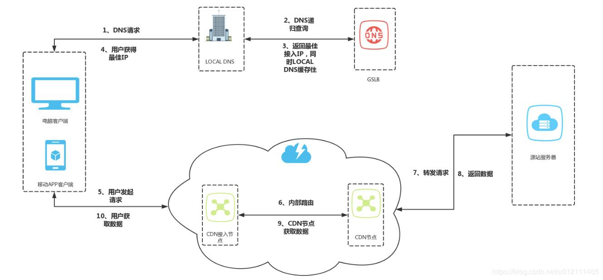

# DNS & CDN & 多活架构

一般都会使用 CDN 做静态资源加速，有几个优化点：

* 1）建议和主站使用不同的域名，省去无意义的 cookie 传输
  * 而主站域名下一般会有多个cookie，浏览器请求静态资源时 也会带上 cookie，造成了无效传输，所以建议使用单独的域名存放静态资源。
* 2）针对同域名浏览器有并发限制，使用多个二级域名加速传输。
  * 浏览器有同域名并发限制，为了突破限制，加速传输，可以使用多个二级域名来存放静态资源。
  * 比如 img1.xxx.com,img2.xxx.com...
  * 建议最多在 4 个二级域名左右
* 3）移动端域名收敛。
  * 因为移动端网络解析DNS开销相对PC来说比较大，所以移动端需要额外处理，尽量将静态资源放在一个域名下。
  * API 接口也尽量使用一个域名，通过 Nginx 在 7 层进行转发

## CDN 系统架构

静态资源和API都是这个架构，只不过静态资源在 Edge 部分会有缓存，不需要每次都回源。

### 优点

缓存代理

* 通过智能 DNS 的筛选，用户的请求被透明地指向离他最近的省内骨干节点，最大限度的缩短用户信息的传输距离。

路由加速

* 利用接入节点和中继节点或者多线节点互联互通。

安全保护

* 无论面对是渗透还是 DDoS攻击，攻击的目标大都会被指向到了 CDN，进而保护了用户源站。

节省成本

* CDN 节点机房只需要在当地运营商的单线机房，或者带宽相对便宜的城市，采购成本低。

内容路由

* DNS系统：根据用户IP找到最佳服务节点
* 应用层重定向：先访问应用接口，然后返回 302 跳转到真正的 CDN 域名获取到资源
  * 可以在这个 302 之前实现一些自定义逻辑
  * 视频网站一般采用 应用层重定向 来实现。
* 传输层重定向：在各个CDN节点间跳转以减少回源请求数。
  * 比如用户请求A节点，cache miss 后回源一次并将内容缓存到节点A，然后又有用户请求B节点，此时B节点还是没有内容，按理说又会触发一次回源，但是一般云产商都会进行优化。在A、B、C等边缘节点上还有一层二级节点，边缘节点cache miss 后先去二级节点找，还miss 才回源，甚至各个二级节点间还是主动同步数据以降低回源次数。

内容分发

* PUSH：主动分发，内容管理系统发起，将内容从源分发到 CDN 的 Cache 节点。

* PULL：被动分发技术，用户请求驱动，用户请求内容中 miss，从源中或者其他 CDN 节点中实时获取内容。

内容存储

* 随机读、顺序写、小文件的分布式存储。

内容管理

* 提高内容服务的效率，提高CDN的缓存利用率。

## CDN 数据一致性

PUSH

* 不存在数据一致性问题。

PULL

* 缓存更新不及时，数据一致性问题，可设置缓存的失效时间，可以达到最终一致性。**如果用户对一致性要求比较高也可以使用 ?version=xx 的技术**，也可以每次上传图片返回的url是不同的方式来代替版本号。
  * 通过增加参数来达到获取最新资源的目的

* CDN 存储的资源复本指定过期时间，因而缓存图像文件可在一个小时，一个月有效的。任何资源缓存在 CDN 上，是潜在历史版本，因为在源数据与副本之间总是有一个更新与传输的延迟。

> 最常见的就是前端更新版本后，由于没有改文件名，导致用到的全是缓存文件，需要强制刷新才能拿到最新的文件。

### 参数设置

Expires

* 即在 HTTP 头中指明具体失效的时间(HTTP/1.0)

Cache Control

* max-age 在 HTTP 头中按秒指定失效的时间，优先级高于Expires(HTTP/1.1)

Last-Modified / If-Modified-Since

* 文件最后一次修改的时间（精度是秒，HTTP/1.0），需要 Cache-Control 过期。

Etag

* 当前资源在服务器的唯一标识（生成规则由服务器决定）优先级高于Last-Modified

## 静/动态 CDN 加速

### 静态 CDN 加速

地理位置分散的用户最小化接收静态内容所需的跳数，直接从附近边缘的缓存中获取内容。 结果是显着降低了延迟和数据包丢失，加快了页面加载速度，并大大降低了原始基础架构的负载。

* 静态域名非主域名
* 静态多域名和收敛
* 静态资源版本化管理

### 动态 CDN 加速

TCP 优化

* 设计算法来处理网络拥堵和包丢失，加快这些情况下的数据从cdn的恢复以及一些常见的 TCP 瓶颈。

Route optimization

* 就是优化从源到用户端的请求的线路，以及可靠性，就是不断的测量计算得到更快更可靠的路线。

Connection management

* 就是边缘和源之间，包括 CDN 之前的线路，采用长连接，而不是每一个请求一个连接

On-the-fly compression

* 就是数据在刚刚离开源的时候就进行压缩，可以缩短在整个网络之中的流通时间。

SSL offload

* 加速或者说减少一些安全监测，减少原服务器执行这种计算密集型的压力。

## CDN 最佳实践

**CDN 防盗链**

增加 URL 时效，例如`img.xxx.com/xxx/img?sing=xxx&token=xxx`，失效后该 URL 就不能访问了。

用户请求 API ，由 API 返回带有签名和时效的 URL，用户通过该 URL 去访问 CDN。

回源问题,每次失效后生成的新URL都是不一样的，是不是每次都会触发回源？

不是的，CDN 节点可以增加一些判断逻辑，不需要每次都回源。

