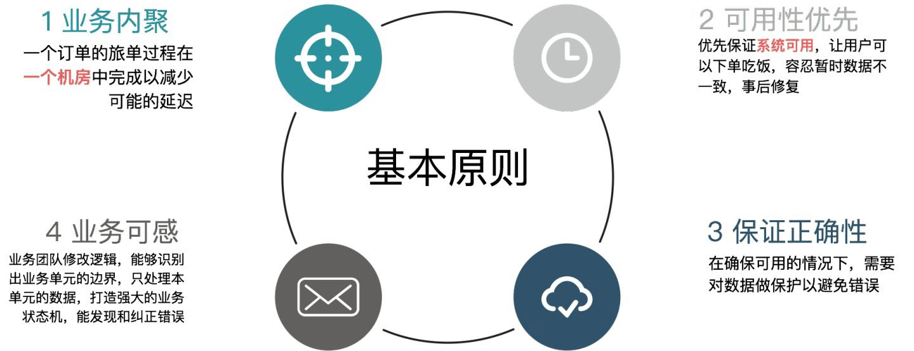
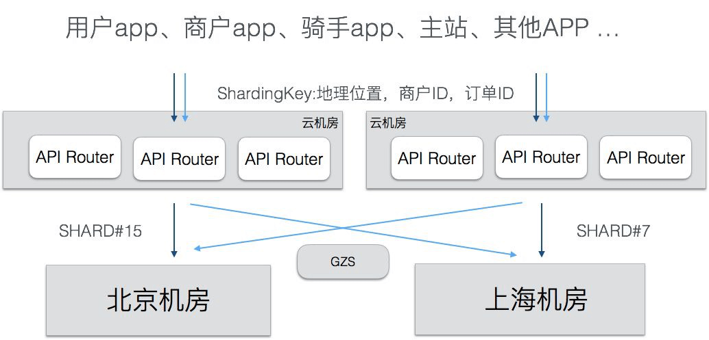
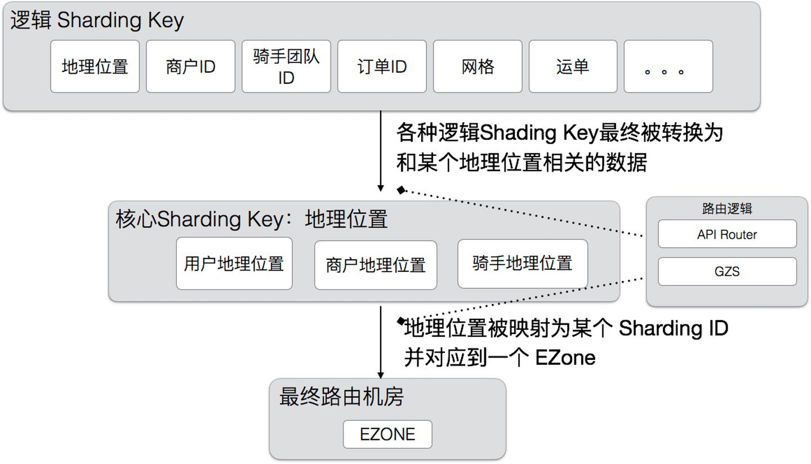
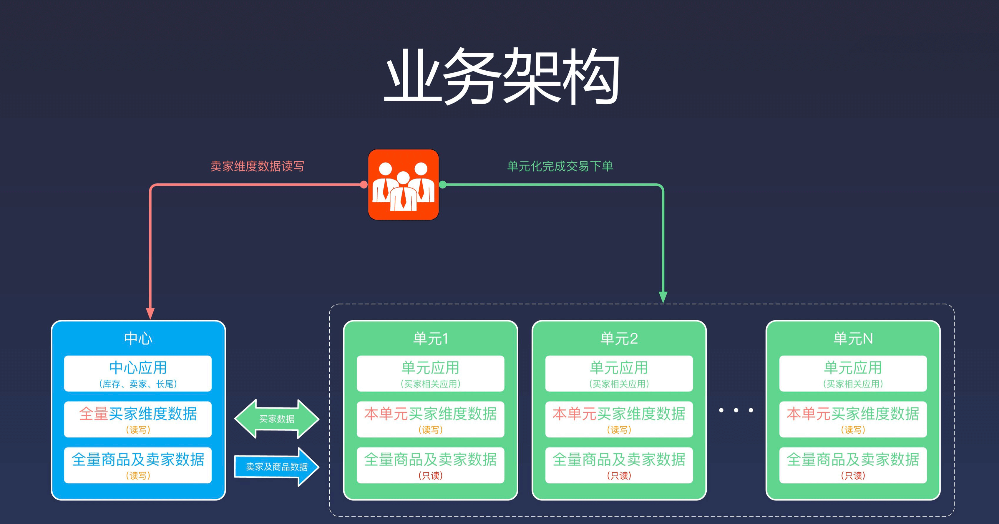
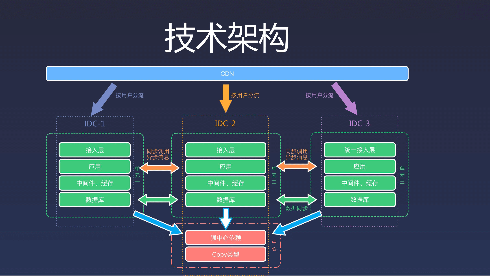
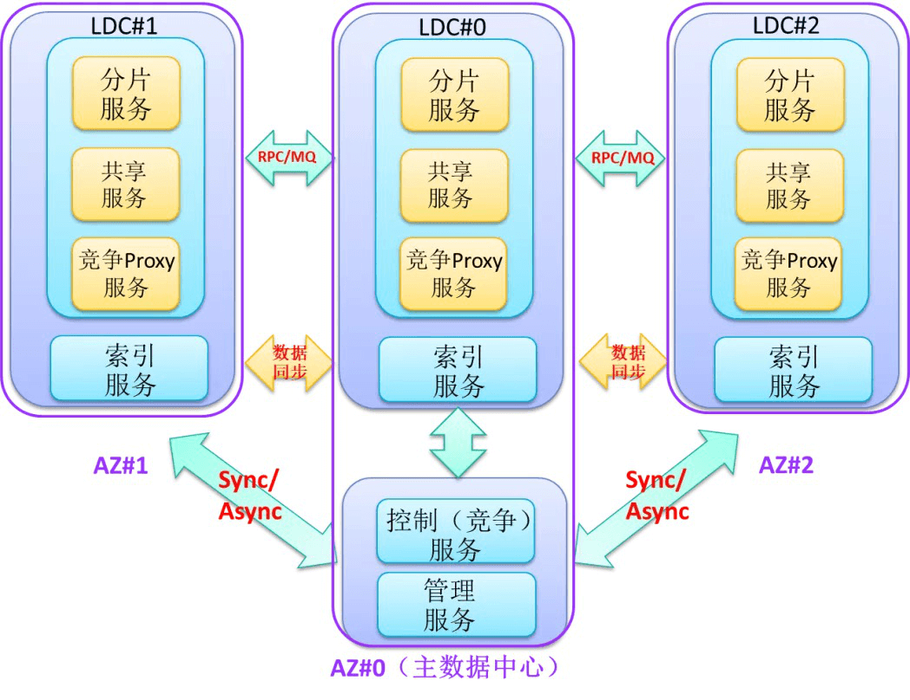
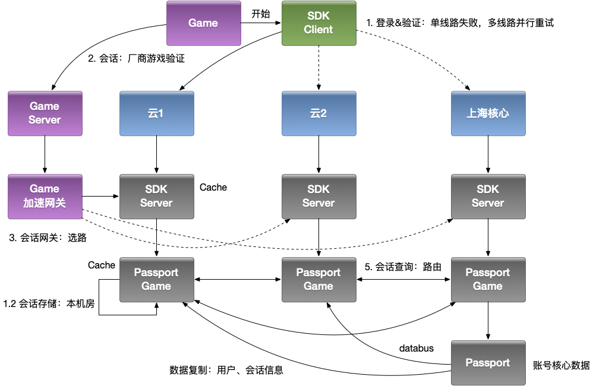
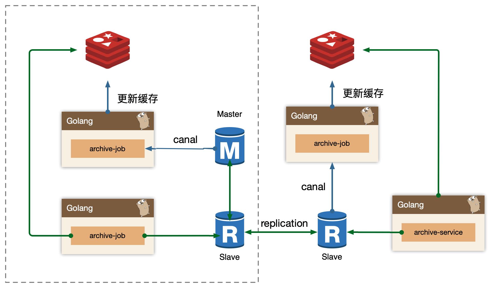

# 多活架构

多活无论是研发还是资源的投入非常大！！


## 多活系统

### 业务分级

按照一定的标准将业务进行分级，挑选出核心的业务，只为核心业务核心场景设计异地多活，降低方案整体复杂度和实现成本。

例如：

* 1、访问量；
* 2、核心场景；
* 3、收入；

业务分级，先对关键业务做多活，避免进入所有业务都要全部多活，分阶段分场景推进。


### 数据分类

挑选出核心业务后，需要对核心业务相关的数据进一步分析，目的在于识别所有的数据及数据特征，这些数据特征会影响后面的方案设计。

常见的数据特征分析维度有：

* 1、数据量；
* 2、唯一性；
* 3、实时性；
* 4、可丢失性；
* 5、可恢复性；


### 数据同步

确定数据的特点后，我们可以根据不同的数据设计不同的同步方案。

常见的数据同步方案有：

* 1、存储系统同步；
* 2、消息队列同步；
* 3、重复生成；


### 异常处理

无论数据同步方案如何设计，一旦出现极端异常的情况，总是会有部分数据出现异常的。例如，同步延迟、数据丢失、数据不一致等。异常处理就是假设在出现这些问题时，系统将采取什么措施来应对。

常见的异常处理措施：

* 1、多通道同步；
* 2、同步和异步访问；
* 3、日志记录；
* 4、补偿；


**多活不是整个体系业务的多活，而是分成不同维度，不同重要性的多活**。比如我们(Bilibili)业务观看体验为主（淘宝以交易单元，买家为维度），那么第一大前提就是浏览、观看上的多活。我们将资源分为三类：

* Global 资源：多个 Zone（机房）共享访问的资源，每个 Zone 访问本 Zone 的资源，但是 Global 层面来说是单写 Core Zone（核心机房），即：单写+多读、利用数据复制（写Zone 单向）实现最终一致性方案实现；
* Multi Zone 资源：多个 Zone 分片部署，每个 Zone 拥有部分的 Shard 数据，比如我们按照用户维度拆分，用户 A 可能在 ZoneA，用户 B 可能在 ZoneB，即：多写+多读、利用数据复制（写 Zone 双向复制）方案实现；
* Single Zone 资源：单机房部署业务；


> 多活首先就是要确定业务系统中哪些是 Global 资源（只能单写），哪些是 Multi Zone 资源（可以多写）。


核心主要围绕：PC/APP 首页可观看、视频详情页可打开、账号可登陆、鉴权来开展，我们认为最合适我们观看类业务最合适的场景就是采用 Global 资源策略，对于社区类（评论、弹幕）可能会采用 Multi Zone 的策略。


## 饿了么多活

业务过程中包含3个最重要的角色，分别是用户、商家和骑手，一个订单包含3个步骤：

* 1）用户打开我们的APP，系统会推荐出用户位置附近的各种美食，推荐顺序中结合了用户习惯，推荐排序，商户的推广等。用户找到中意的食物 ，下单并支付，订单会流转到商家。

* 2）商家接单并开始制作食物，制作完成后，系统调度骑手赶到店面，取走食物。

* 3）骑手按照配送地址，把食物送到客户手中。

### 业务内聚

**业务内聚：单个订单的旅单过程，要在一个机房中完成，不允许跨机房调用。**

这个原则是为了保证实时性，旅单过程中不依赖另外一个机房的服务，才能保证没有延迟。我们称每个机房为一个 ezone，一个 ezone 包含了饿了么需要的各种服务。一笔业务能够内聚在一个 ezone 中，那么一个定单涉及的用户，商家，骑手，都会在相同的机房，这样订单在各个角色之间流转速度最快，不会因为各种异常情况导致延时。恰好我们的业务是地域化的，通过合理的地域划分，也能够实现业务内聚。




* **可用性优先**：当发生故障切换机房时，优先保证系统可用，首先让用户可以下单吃饭，容忍有限时间段内的数据不一致，在事后修复。每个 ezone 都会有全量的业务数据，当一个 ezone 失效后，其他的 ezone 可以接管用户。用户在一个ezone的下单数据，会实时的复制到其他ezone。

* **保证数据正确**：在确保可用的情况下，需要对数据做保护以避免错误，在切换和故障时，如果发现某些订单的状态在两个机房不一致，会锁定该笔订单，阻止对它进行更改，保证数据的正确。

* **业务可感**：因为基础设施还没有强大到可以抹去跨机房的差异，需要让业务感知多活逻辑，业务代码要做一些改造，包括：需要业务代码能够识别出业务数据的归属，只处理本 ezone 的数据，过滤掉无关的数据。完善业务状态机，能够在数据出现不一致的时候，通过状态机发现和纠正。


为了实现业务内聚，我们首先要选择一个划分方法（Sharding Key），对服务进行分区，让用户，商户，骑手能够正确的内聚到同一个 ezone 中。分区方案是整个多活的基础，它决定了之后的所有逻辑。

根据饿了么的业务特点，我们自然的选择地理位置（地理围栏，地理围栏主体按照省界划分，再加上局部微调）作为划分业务的单元，把地理位置上接近的用户，商户，骑手划分到同一个ezone，这样一个订单的履单流程就会在一个机房完成，能够保证最小的延时，在某个机房出现问题的时候，也可以按照地理位置把用户，商户，骑手打包迁移到别的机房即可。


### API Router

**基于地理位置划分规则，开发了统一的流量路由层（API Router），这一层负责对客户端过来的 API 调用进行路由，把流量导向到正确的 ezone**。API Router 部署在多个公有云机房中，用户就近接入到公有云的 API Router，还可以提升接入质量。

最基础的分流标签是地理位置，有了地理位置，AR 就能计算出正确的 shard 归属。但业务是很复杂的，并不是所有的调用都能直接关联到某个地理位置上，我们使用了一种分层的路由方案，核心的路由逻辑是地理位置，但是也支持其他的一些 High Level Sharding Key，这些 Sharding Key 由 APIRouter 转换为核心的 Sharding Key，具体如下图。这样既减少了业务的改造工作量，也可以扩展出更多的分区方法。除了入口处的路由，我们还开发了 SOA Proxy，用于路由SOA调用的，和API Router基于相同的路由规则。






## 阿里多活


### 基本规则

* 按买家维度进行数据切片
* 只取与买家链路相关的业务(单元)做多活
* 单元内最大限度的封闭
* 无法接受数据最终一致性的跨单元点写


### 业务架构



买家数据可以在单元节点读写也可以在中心节点读写，双向读写。

商品和卖家数据为了保证一致性，只能在中心节点读写，然后同步到单元节点。


### 技术架构



数据会同步到中心节点，和其他的单元节点，这样便于在流量切换后不会影响到用户正常使用。


问题：库存如何处理？

如果库存也在多机房之前同步，肯定会出现问题，所以只能 Single Node。

最低级的做法：将库存分配到各个单元节点，比如库存一共 100，有 10 个单元节点，那就每个单元节点分配 10 个库存，这样就不会出现超卖的问题。

这个问题在后续苏宁多活中给出答案。


## 苏宁多活




可以看到引入了一个 竞争服务，这个就可以用来解决库存问题。通过竞争服务到主节点去抢库存，抢到后保存在单元节点，等单元节点消耗完了再次调用竞争服务即可。

由原先的预分配变成了动态分配，更加灵活。


## Bilibili 多活

### 账号多活




### 稿件多活




## References


```sh
https://zhuanlan.zhihu.com/p/32009822
https://zhuanlan.zhihu.com/p/32587960
https://zhuanlan.zhihu.com/p/33430869
https://zhuanlan.zhihu.com/p/34958596

https://mp.weixin.qq.com/s/ooPLV039BAGBsiDZagWNHw
https://mp.weixin.qq.com/s/VPkQhJLl_ULwklP1sqF79g
https://mp.weixin.qq.com/s/ty5GltO9M648OXSWgLe_Sg
https://mp.weixin.qq.com/s/GdfYsuUajWP-OWo6lbmjVQ
https://developer.aliyun.com/article/57715
https://mp.weixin.qq.com/s/RQiurTi_pLkmIg_PSpZtvA
https://mp.weixin.qq.com/s/LCn71j3hgm5Ij5tHYe8uoA
http://afghl.github.io/2018/02/11/distributed-system-multi-datacenter-1.html
https://zhuanlan.zhihu.com/p/42150666
https://zhuanlan.zhihu.com/p/20827183
https://myslide.cn/slides/733


https://blog.csdn.net/u012422829/article/details/83718296
https://blog.csdn.net/u012422829/article/details/83932829
https://www.cnblogs.com/king0101/p/11908305.html
https://mp.weixin.qq.com/s/WK8N4xFxCoUvSpXOwCVIXw
https://mp.weixin.qq.com/s/jd9Os1OAyCXZ8rXw8ZIQmg
https://cloud.tencent.com/developer/article/1441455
https://mp.weixin.qq.com/s/RQiurTi_pLkmIg_PSpZtvA
https://help.aliyun.com/document_detail/72721.html
https://mp.weixin.qq.com/s/h_KWwzPzszrdGq5kcCudRA
https://www.cnblogs.com/davidwang456/articles/8192860.html
```

