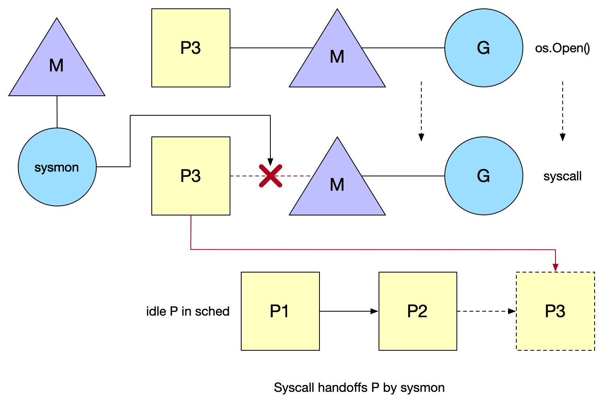

# Go Runtime

从原理层面去理解底层设计，不要陷入细节。


## Goroutine 原理

### Goroutine

#### 什么是 Goroutine

> “Goroutine 是一个与其他 goroutines 并行运行在同一地址空间的 Go 函数或方法。一个运行的程序由一个或更多个 goroutine 组成。它与线程、协程、进程等不同。它是一个 goroutine”
> 																			—— Rob Pike


Goroutines 在同一个用户地址空间里并行独立执行 functions，channels 则用于 goroutines 间的通信和同步访问控制。


#### goroutine 和 thread 的区别？


**内存占用**
创建一个 goroutine 的栈内存消耗为**2 KB**(Linux AMD64 Go v1.4后)，运行过程中，如果栈空间不够用，会自动进行扩容。

> 创建一个 thread 为了尽量避免极端情况下操作系统线程栈的溢出，默认会为其分配一个较大的栈内存( **1 - 8 MB 栈内存**，POSIX Thread)，而且还需要一个被称为 “**guard page**” 的区域**用于和其他 thread 的栈空间进行隔离**。而栈内存空间一旦创建和初始化完成之后其大小就不能再有变化，这决定了在某些特殊场景下系统线程栈还是有溢出的风险。

**创建/销毁**

线程创建和销毀都会有巨大的消耗，是内核级的交互(trap)。而进入内核所消耗的性能代价比较高，开销较大。

goroutine 是用户态线程，是由 go runtime 管理，创建和销毁的消耗非常小。

**调度切换**

抛开陷入内核，线程切换会消耗 1000-1500 纳秒(上下文保存成本高，较多寄存器，公平性，复杂时间计算统计)。

> 一个纳秒平均可以执行 12-18 条指令，所以由于线程切换，执行指令的条数会减少 12000-18000。

goroutine 的切换约为 200 ns(用户态、3个寄存器)，相当于 2400-3600 条指令。因此，goroutines 切换成本比 threads 要小得多。

**复杂性**

线程的创建和退出复杂，多个thread间通讯复杂(share memory)。
不能大量创建线程(参考早期的 httpd)，成本高，使用网络多路复用，存在大量callback(参考twemproxy、nginx 的代码)。对于应用服务线程门槛高，例如需要做第三方库隔离，需要考虑引入线程池等。


#### M:N 模型


Go 创建 M 个线程(CPU执行调度的单元，内核的task_struct)，之后创建的 N 个 goroutine 都会依附在这 M 个线程上执行，即 M:N 模型。

同一个时刻，一个线程只能跑一个 goroutine。当 goroutine 发生阻塞(chan阻塞、mutext、syscall 等等)时，Go 会把当前的 goroutine 调度走，让其他 goroutine 来继续执行，而不是让线程阻塞休眠，尽可能多的分发任务出去，让 CPU 忙。


### GMP 调度模型

#### GMP 概念

**G**

goroutine 的缩写，每次 go func() 都代表一个 G，无限制。

使用 `struct runtime.g`包含了当前 goroutine 的状态、堆栈、上下文。

**M**

工作线程(OS thread)也被称为 Machine，使用 `struct runtime.m`，所有 M 是有线程栈的。
如果不对该线程栈提供内存的话，系统会给该线程栈提供内存(不同操作系统提供的线程栈大小不同)。

**当指定了线程栈，则将 M.stack 指向 G.stack，M 的 PC 寄存器指向 G 提供的函数，然后去执行**。

> 这里有两个栈，一个 goroutine 的栈，一个线程的栈。goroutine 的栈执行的就是我们自己写的逻辑，线程的栈执行的就是 G0，主要就是寻找下一个执行的 goroutine。


**P？**


#### GM 调度器


Go 1.2 前的调度器实现，限制了 Go 并发程序的伸缩性，尤其是对那些有高吞吐或并行计算需求的服务程序。

在这个调度器中，每个 goroutine 对应于runtime 中的一个抽象结构：G，而 OS thread 作为“物理 CPU”的存在而被抽象为一个结构：M(machine)。


**GM 调度模型的问题**

* 单一全局互斥锁(Sched.Lock)和集中状态存储
  * 只有一个全局队列，新创建的 goroutine 会被放入该队列，M 则从队列中取 goroutine 来执行，为了并发安全，所以每次都要加锁，导致吞吐上不来。
  * 导致所有 goroutine 相关操作，比如：创建、重新调度等都要上锁。

* Goroutine 传递问题
  * M 经常在 M 之间传递”可运行”的 goroutine，这导致调度延迟增大以及额外的性能损耗。
  * 比如 M1 正在执行 G1，然后 G1 又创建了 G2，那么正常情况下 G2 肯定是在 M1 上执行更好，但是有可能被其他 M 抢到
  * Every M must be able to execute any runnable G, in particular the M that just created the G.
* Per-M 持有内存缓存 (M.mcache)
  * 类似 **TCMalloc** 的结构，每个M持有 mcache 和 stack alloc，然而只有在 M 运行 Go代码时才需要使用 cache(每个 mcache 可以高达2mb)，当 M 在处于 syscall 时并不需要。运行 Go 代码和阻塞在 syscall 的 M 的比例高达1:100，造成了很大的浪费。同时内存亲和性也较差(proc a new proc b)。

* 严重的线程阻塞/解锁
  * 在系统调用的情况下，工作线程经常被阻塞和取消阻塞，这增加了很多开销。 
  * M 上运行的 G 阻塞后，M 会去 全局队列中获取另外的 G 来执行，如果此时全局队列中没有 G 了，M 会立刻进入休眠状态，然后等新增一个 G 放到全局队列之后又会把这个 M 唤醒。

相关阅读

```sh
https://docs.google.com/document/d/1TTj4T2JO42uD5ID9e89oa0sLKhJYD0Y_kqxDv3I3XMw/edit#heading=h.mmq8lm48qfcw
```


### GMP 概念

GM 基础上增加了一个 P。


**P**

**“Processor”是一个抽象的概念，并不是真正的物理 CPU。**

它代表了 M 所需的上下文环境，也是处理用户级代码逻辑的处理器。它负责衔接 M 和 G 的调度上下文，将等待执行的 G 与 M 对接。当 P 有任务时需要创建或者唤醒一个 M 来执行它队列里的任务。所以 P/M 需要进行绑定，构成一个执行单元。

P 决定了并行任务的数量，可通过 runtime.GOMAXPROCS 来设定。在 Go1.5 之后GOMAXPROCS 被默认设置可用的核数，而之前则默认为1。

> 小坑：在 Docker 里取到的是宿主机的核数，导致会创建多个 P 出来。
>
> 可以用这个 Uber 提供了 [相关的库](https://github.com/uber-go/automaxprocs)来解决该问题。
>
> Automatically set GOMAXPROCS to match Linux container CPU quota.


引入了 local queue，因为 Processor 的存在，runtime 并不需要做一个集中式的 Goroutine 调度，每一个 Machine 都会在 P's local queue、global queue 或者**其他 P 队列中找 goroutine 执行**，减少全局锁对性能的影响。

> 这也是 GMP Work-stealing 调度算法的核心。


**比较**

* 全局锁优化了
* mcache 由之前的跟着 M 走改为现在的跟着 P 走
  * mcache, timer, g, g0, etc... 都跟着 P 走


**大致调度逻辑**

> 可以把 P 直接理解为 “队列”。

G 是 goroutine，M 是线程，P 就是队列。新建的 goroutine 就往 P 的队列(或者全局队列)里放，M 和 P 绑定之后就从 P 的队列里捞 G 出来执行(如果当前P的队列没有G，会从全局队列捞，也没有则会窃取其他P的)。如果因为 G 等待锁或者IO 等行为导致 M 阻塞了，那么 P 会解除和这个 M 的绑定，去寻找其他 M 或者新建一个 M。

> M 执行 G 其实就是将 M.stack 指向 G.stack，M 的 PC 寄存器指向 G 提供的函数，然后去执行。


### Work-stealing 调度算法

#### goroutine 创建

特殊的 goroutine g0 用于为 G 创建 goroutine，即G中有创建新 goroutine的逻辑是由 g0 来执行的

```sh
https://zhuanlan.zhihu.com/p/213745994
```

**P 的初始化**

首先会创建逻辑 CPU 核数个 P ，存储在 sched 的 空闲链表(pidle)。


最开始只有 P0 在干活，另外的 P 都在空闲链表里歇着。

#### OS thread 创建


准备运行的新 goroutine 将**唤醒 **P 以更好地分发工作。这个 P 将创建一个与之关联的 M 绑定到一个OS thread。

> 从空闲链表中取一个 P 出来

go func() 中 触发 Wakeup 唤醒机制：

有空闲的 Processor 而没有在 **spinning(自旋) **状态的 Machine 时候, 需要去唤醒一个空闲(睡眠)的 M 或者新建一个。

> M 把任务执行完成后就会进入 spinning 状态,类似于一个 for 循环，不断的找 G 来执行，如果一段时间后都找不到才会进行睡眠状态。


#### M0 main


程序启动后，Go 已经将主线程和 M 绑定(rt0_go)。

当 goroutine 创建完后，它是放在当前 P 的 local queue 还是 global queue ？

`runtime.runqput` 这个函数会尝试把 newg 放到本地队列上，如果本地队列满了，它会将本地队列的前半部分和 newg 迁移到全局队列中。剩下的事情就等待 M 自己去拿任务了。

Tips: [ 特殊的g0](https://medium.com/a-journey-with-go/go-g0-special-goroutine-8c778c6704d8)


#### Work-stealing


M 绑定的 P 没有可执行的 goroutine 时，它会去按照优先级去抢占任务：

> P 的 G 执行完之后就会切换到 g0，g0 就一直在执行 下面这个调度逻辑

```go
runtime.schedule() {
    // only 1/61 of the time, check the global runnable queue for a G.
    // if not found, check the local queue.
    // if not found ,
    //  	try to steal from other Ps.
    //		if not, check the global runnable queue.
    //		if not found, poll network.
}
```

* 有 1/61 几率去全局队列看有没有 G。
* 如果没有就检查本地队列，
* 如果本地队列也没有
  * 尝试从其他 P 偷
  * 如果还是没有再检查一次全局队列
  * 最后看一下有没有从阻塞状态缓过来的 G


找到任何一个任务，切换调用栈执行任务。再循环不断的获取任务，直到进入休眠。

> 核心思路就是避饥饿。


**为了保证公平性，从随机位置上的 P 开始，而且遍历的顺序也随机化了(选择一个小于 GOMAXPROCS，且和它互为质数的步长)，保证遍历的顺序也随机化了。**

比如当前有P0，P1，到P9 10 个 P。

从随机位置上的 P 开始指的是：每次都先随机选一个 P 开始遍历，比如这次选到了 P2。

遍历的顺序也随机化指得是：比如上面选到的 P2，等 P 2遍历完了不会固定去遍历 P3，而是有一个(选择一个小于 GOMAXPROCS，且和它互为质数)步长,比如这里需要一个小于 10 且和 10 互为质数的步长，比如 3 ，这样 P2 之后就是 P5，然后 P8、P0、P3、P6、P9 这样每次遍历得到的顺序都不一样。

> 因为随机得比较均匀，所以这个算法在负载均衡里也广泛使用。


### Spining thread

线程自旋是相对于线程阻塞而言的，表象就是循环执行一个指定逻辑(就是上面提到的调度逻辑，目的是不停地寻找 G)。这样做的问题显而易见，如果 G 迟迟不来，CPU 会白白浪费在这无意义的计算上。但好处也很明显，**降低了 M 的上下文切换成本，提高了性能**。

* M 带 P 的找 G 运行
* M 不带 P 的找 P 挂载
* G 创建又没 spining M 唤醒一个 M


Go 的设计者倾向于高性能的并发表现，选择了后者。当然前面也提到过，为了避免过多浪费 CPU 资源，**自旋的线程数不会超过 `GOMAXPROCS (Busy P)`**。

> 这是因为一个 P 在同一个时刻只能绑定一个 M，P 的数量不会超过 GOMAXPROCS，自然被绑定的 M 的数量也不会超过。

对于未被绑定的“游离态”的 M，会进入休眠阻塞态。


### Syscall

Go 有自己封装的 syscall，也就是进入和退出 syscall 的时候执行`entersyscall/exitsyscall`， 也只有被封装了系统调用才有可能触发重新调度，它将改变 P 的状态为 syscall。

系统监视器 (system monitor)，称为 `sysmon`，会定时扫描。在执行系统调用时, 如果某个 P 的 G 执行超过一个 sysmon tick（一个时间阈值），脱离 M。

> 防止因为系统调用而影响到 P 队列里的其他 G 的执行。





P1 和 M 脱离后 目前在 idle list 中等待被绑定。而 syscall 结束后 M 按照如下规则执行直到满足其中一个条件：

* 尝试获取同一个 P(P1)，恢复执行 G
* 尝试获取 idle list 中的空闲 P
* 把 G 放回 global queue，M 放回到 idle list


### sysmon

协作式抢占，当 P 在 M 上执行时间超过10ms，sysmon 调用 `preemptone` 将 G 标记为 `stackPreempt` 。因此需要在某个地方触发检测逻辑，Go 当前是在检查栈是否溢出的地方判定(`morestack()`)，M 会保存当前 G 的上下文，重新进入调度逻辑。


Tips：
死循环：[issues/11462](https://github.com/golang/go/issues/11462)
信号抢占：[go1.14基于信号的抢占式调度实现原理](ttp://xiaorui.cc/archives/6535)


异步抢占，注册 sigurg 信号，通过sysmon 检测，对 M 对应的线程发送信号，触发注册的 handler，它往当前 G 的 `PC寄存器` 中插入一条指令(调用某个方法)，在处理完 handler，G 恢复后，自己把自己推到了 global queue 中。

Tips: 发生程序 hang 死情况时，通常使用什么工具诊断？

* go tool pprof

* perf top


### Network poller

所有的 I/O 都是阻塞的。G 发起网络 I/O 操作也不会导致 M 被阻塞(仅阻塞G)，从而不会导致大量 M 被创建出来。将异步 I/O 转换为阻塞 I/O 的部分称为netpoller。

打开或接受连接都被设置为`非阻塞模式`。如果你试图对其进行 I/O 操作，并且文

件描述符数据还没有准备好，它将返回一个错误代码，然后调用 netpoller。


G 因为网络 I/O 而阻塞后会被放到 network poller 里面。


network poller 触发点：

* sysmon
* schedule()
* start the world

从 ready 的网络事件中恢复 G。

> 上面的事件触发后就会从 network poller 里面捞一些恢复过来的 G 执行。


`gopark`，G 置为 waiting 状态，等待显示goready唤醒，在poller中用得较多，还有锁、chan等。


### OS thread

当使用了 Syscall，Go 无法限制 Blocked OS threads 的数量：

The GOMAXPROCS variable limits the number of operating system threads that can execute user-level Go code simultaneously. There is no limit to the number of threads that can be blocked in system calls on behalf of Go code; those do not count against the GOMAXPROCS limit. This package’s GOMAXPROCS function queries and changes the limit.

Tips: 使用 syscall 写程序要认真考虑 pthread exhaust 问题。

因为 GOMAXPROCS 限制的是 P 的数量，而不是 M。


### Scheduler Affinity

亲缘性调度的一些限制：

* Work-stealing 
  * 当 P 的 local queue 任务不够，同时 global queue、network poller 也会空，这时从其他 P 窃取 任务运行，然后任务就运行到了其他线程。

* 系统调用
  * 当 syscall 产生，Go 把当前线程置为 blocking mode，让一个新的线程接管了这个 P (过一个 sysmon tick 才会交给其他 M，大多数syscall都是很快的)。

G 跑到其他线程上去运行，会导致内存亲缘性问题被放大。


上图中，P0 队列中有 4 个 G 等待执行，假设现在准备执行 G5，但是之前被 channel 阻塞的 G9 突然被唤醒了，因为现在正在执行 G5，所以只能等待。最终可能要靠别人把 G9 窃取过去才能执行到。

> 正常情况下肯定希望越快唤醒越好。


针对 communicate-and-wait 模式，进行了亲缘性调度的优化。

>  communicate-and-wait 模式：即通过 channel 通信的这种模式。

当前 local queue，使用了 FIFO 实现，unlock 的 G 无法尽快执行，如果队列中前面存在占用线程的其他 G。

**Go 1.5 在 P 中引入了 runnext 特殊的一个字段，可以高优先级执行 unblock G。**

> 相当于是插队，优先看 runnext 有没有等待执行的，再去看 本地队列。


```go
// runtime/runtime2.go
type p struct {
// runnext, if non-nil, is a runnable G that was ready'd by
	// the current G and should be run next instead of what's in
	// runq if there's time remaining in the running G's time
	// slice. It will inherit the time left in the current time
	// slice. If a set of goroutines is locked in a
	// communicate-and-wait pattern, this schedules that set as a
	// unit and eliminates the (potentially large) scheduling
	// latency that otherwise arises from adding the ready'd
	// goroutines to the end of the run queue.

runnext guintptr
    
}
```

执行时优先执行 runnext

```go
// proc.go 5033 行

// Get g from local runnable queue.
// If inheritTime is true, gp should inherit the remaining time in the
// current time slice. Otherwise, it should start a new time slice.
// Executed only by the owner P.
func runqget(_p_ *p) (gp *g, inheritTime bool) {
	// If there's a runnext, it's the next G to run.
	for {
		next := _p_.runnext
		if next == 0 {
			break
		}
		if _p_.runnext.cas(next, 0) {
			return next.ptr(), true
		}
	}

	for {
		h := atomic.LoadAcq(&_p_.runqhead) // load-acquire, synchronize with other consumers
		t := _p_.runqtail
		if t == h {
			return nil, false
		}
		gp := _p_.runq[h%uint32(len(_p_.runq))].ptr()
		if atomic.CasRel(&_p_.runqhead, h, h+1) { // cas-release, commits consume
			return gp, false
		}
	}
}
```


添加时也是优先添加到 runnext

```go
// proc.go 4955 行
// runqput tries to put g on the local runnable queue.
// If next is false, runqput adds g to the tail of the runnable queue.
// If next is true, runqput puts g in the _p_.runnext slot.
// If the run queue is full, runnext puts g on the global queue.
// Executed only by the owner P.
func runqput(_p_ *p, gp *g, next bool) {
	if randomizeScheduler && next && fastrand()%2 == 0 {
		next = false
	}

	if next {
	retryNext:
		oldnext := _p_.runnext
		if !_p_.runnext.cas(oldnext, guintptr(unsafe.Pointer(gp))) {
			goto retryNext
		}
		if oldnext == 0 {
			return
		}
		// Kick the old runnext out to the regular run queue.
		gp = oldnext.ptr()
	}

retry:
	h := atomic.LoadAcq(&_p_.runqhead) // load-acquire, synchronize with consumers
	t := _p_.runqtail
	if t-h < uint32(len(_p_.runq)) {
		_p_.runq[t%uint32(len(_p_.runq))].set(gp)
		atomic.StoreRel(&_p_.runqtail, t+1) // store-release, makes the item available for consumption
		return
	}
	if runqputslow(_p_, gp, h, t) {
		return
	}
	// the queue is not full, now the put above must succeed
	goto retry
}

```


解决了 channel 通信唤醒的问题，但是核心 goroutine 有时无法被唤醒的问题依旧存在。
