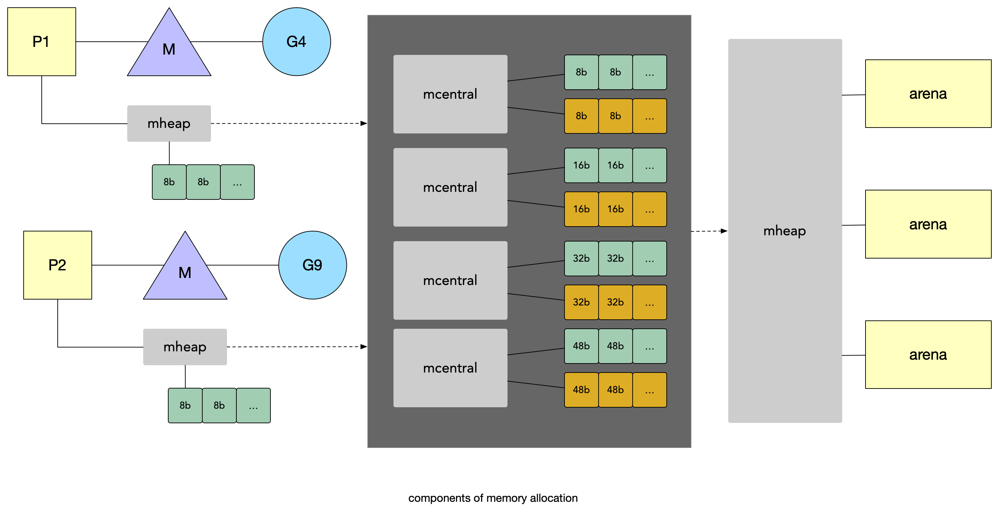

# 内存 & 堆栈逃逸

## 堆栈 & 逃逸分析

### 堆和栈的定义

Go 有两个地方可以分配内存：一个全局堆空间用来动态分配内存，另一个是每个 goroutine 都有的自身栈空间。

**栈**

栈区的内存一般由编译器自动进行分配和释放，其中存储着函数的入参以及局部变量，这些参数会随着函数的创建而创建，函数的返回而销毁。(通过 CPU push & release)。
A function has direct access to the memory inside its frame, through the frame pointer, but access to memory outside its frame requires indirect access.


**堆**


 堆区的内存一般由编译器和工程师自己共同进行管理分配，交给 Runtime GC 来释放。堆上分配必须找到一块足够大的内存来存放新的变量数据。后续释放时，垃圾回收器扫描堆空间寻找不再被使用的对象。

​    Anytime a value is shared outside the scope of a function’s stack frame, it will be placed (or allocated) on the heap.


**栈分配廉价，堆分配昂贵。**stack allocation is cheap and heap allocation is expensive.


### 变量是在堆还是栈上？

写过其他语言，比如 C 的同学都知道，有明确的栈和堆的相关概念。而 Go 声明语法并没有提到栈和堆，而是交给 Go 编译器决定在哪分配内存，保证程序的正确性，在 [Go FAQ](https://golang.org/doc/faq#stack_or_heap) 里面提到这么一段解释：

> 从正确的角度来看，你不需要知道。Go 中的每个变量只要有引用就会一直存在。变量的存储位置(堆还是栈)和语言的语义无关。

  存储位置对于写出高性能的程序确实有影响。

* 如果可能，Go 编译器将为该函数的堆栈侦(stack frame)中的函数分配本地变量。
* 但是如果编译器在函数返回后无法证明变量未被引用，则编译器必须在会被垃圾回收的堆上分配变量以避免悬空指针错误。
* 此外，如果局部变量非常大，将它存储在堆而不是栈上可能更有意义。

在当前编译器中，如果变量存在取址，则该变量是堆上分配的候选变量。但是基础的**逃逸分析**可以将那些生存不超过函数返回值的变量识别出来，并且因此可以分配在栈上。


### 逃逸分析

“通过检查变量的作用域是否超出了它所在的栈来决定是否将它分配在堆上”的技术称为**逃逸分析**。其中“变量的作用域超出了它所在的栈”这种行为即被称为逃逸。

逃逸分析在大多数语言里属于静态分析：在编译期由静态代码分析来决定一个值是否能被分配在栈帧上，还是需要“逃逸”到堆上。

* 减少 GC 压力，栈上的变量，随着函数退出后系统直接回收，不需要标记后再清除
* 减少内存碎片的产生
* 减轻分配堆内存的开销，提高程序的运行速度


```go
func main() {
	num := escape()
	fmt.Println(num)
}

// go:noinline 
func escape() *int64 {
	tmp := rand.Int63()
	return &tmp
}
```

编译时通过`-gcflags -m` 参数检测内存逃逸情况，其中注释`// go:noinline ` 用于禁止内联优化。

```sh
go build -gcflags -m main.go

.\escape.go:15:6: can inline getRandom
.\escape.go:16:19: inlining call to rand.Int63
.\escape.go:16:19: inlining call to rand.(*Rand).Int63
.\escape.go:10:18: inlining call to getRandom
.\escape.go:10:18: inlining call to rand.Int63
.\escape.go:10:18: inlining call to rand.(*Rand).Int63
.\escape.go:11:13: inlining call to fmt.Println
.\escape.go:10:18: moved to heap: tmp
.\escape.go:11:13: []interface {} literal does not escape
.\escape.go:16:2: moved to heap: tmp
<autogenerated>:1: .this does not escape
<autogenerated>:1: .this does not escape
```


### 超过栈帧(stack frame)

当一个函数被调用时，会在两个相关的帧边界间进行上下文切换。从调用函数切换到被调用函数，如果函数调用时需要传递参数，那么这些参数值也要传递到被调用函数的帧边界中。Go 语言中帧边界间的数据传递是按值传递的。任何在函数中的变量在函数返回时，都将不能访问。Go 查找所有变量超过当前函数栈侦的，把它们分配到堆上，避免 `outlive `变量。

> 比如逃逸分析中的 getRandom 函数返回后 tmp 变量就无法访问了，所以被逃逸到堆上了。

具体调用过程如下：


* 1）调用 main 函数，开辟一块栈
* 2）main 函数调用 getRandom 又创建了 getRandom 的栈，其中包含一个局部变量 tmp
* 3）getRandom 返回了一个 *int 的变量 num，num 指向 getRandom 栈中的局部变量 tmp
* 4）getRandom 指向完返回后，相应的栈被回收了，所以局部变量 tmp 无法被访问了，导致 main 中的 num 也用不了了。

如果按照上面的流程走肯定是不行的，所以 Go 编译器检测到 tmp 变量会发生逃逸，所以将其分配在了 堆 上，如下图所示：


在堆上创建了一个 tmp，然后栈中的局部变量 tmp 指向堆中的 tmp，最后返回后，main 中的 num 也是指向堆中的 tmp，所以 getRandom 栈被回收也不会影响到正常正常执行。


### 逃逸案例

还存在大量其他的 case 会出现逃逸，比较典型的就是 **多级间接赋值容易导致逃逸**，这里的多级间接指的是，对某个引用类对象中的引用类成员进行赋值。Go 语言中的引用类数据类型有 func, interface, slice, map, chan, *Type ：

* 一个值被分享到函数栈帧范围之外
* 在 for 循环外申明，在 for 循环内分配，同理闭包
* 发送指针或者带有指针的值到 channel 中
  * 都不在一个 goroutine 了 肯定逃逸
* 在一个切片上存储指针或带指针的值
* slice 的背后数组被重新分配了
* 在 interface 类型上调用方法
  * interface 上的方法一定会被分配在堆上 idata 指针 

> 不建议记这些 case，一般使用 go build -gcflags -m 测试即可


## 连续栈

### 分段栈(Segmented stacks)

Go 应用程序运行时，每个 goroutine 都维护着一个自己的栈区，这个栈区只能自己使用不能被其他 goroutine 使用。**栈区的初始大小是2KB**（比 x86_64 架构下线程的默认栈2M要小很多)，在 goroutine 运行的时候栈区会按照需要增长和收缩，占用的内存最大限制的默认值在64位系统上是1GB。

* v1.0 ~ v1.1 — 最小栈内存空间为 4KB
* v1.2 — 将最小栈内存提升到了 8KB
  * 提升内存大小以降低热分裂问题
* v1.3 — 使用连续栈替换之前版本的分段栈
* v1.4 — 将最小栈内存降低到了 2KB
  * 使用分段栈之后解决了 热分裂问题，所以可以降低栈内存了


### Hot split 问题

当前的分段栈的实现方式存在 `hot split` 问题，如果栈快满了，那么下一次的函数调用会强制触发栈扩容。当函数返回时，新分配的 `stack chunk` 会被清理掉。如果这个函数调用产生的范围是在一个循环中，会导致严重的性能问题，频繁的 alloc/free。

> 当前版本栈扩容是分配一块新的内存并链接到老的栈上。如果新扩出来的内存没有被使用就会立马回收。如果在循环中触发该机制就会导致不断分配、释放、分配、释放导致严重性能问题。


Go 不得不在1.2版本把栈默认大小改为8KB，降低触发热分裂的问题，但是每个 goroutine 内存开销就比较大了。直到实现了连续栈(contiguous stack)，栈大小才改为2KB。

> 提升到 8K 后触发热分裂问题几率变小了。


### 连续栈(Contiguous stacks)


采用复制栈的实现方式，在热分裂场景中不会频发释放内存，即不像分配一个新的内存块并链接到老的栈内存块，而是会**分配一个两倍大的内存块并把老的内存块内容复制到新的内存块里**，当栈缩减回之前大小时，我们不需要做任何事情。


* runtime.newstack 分配更大的栈内存空间
* runtime.copystack 将旧栈中的内容复制到新栈中
* 将指向旧栈对应变量的指针重新指向新栈
* runtime.stackfree 销毁并回收旧栈的内存空间

> 如果栈区的空间使用率不超过1/4，那么在垃圾回收的时候使用 runtime.shrinkstack 进行栈缩容，同样使用 copystack。

4K 不够用了，那分配一个新的 8K 的栈，然后把老的内容复制到新栈，需要再 栈区的空间使用率不超过1/4 的时候才会触发缩容，解决了 热分裂问题。


### 栈扩容

Go `运行时`判断栈空间是否足够，所以在 call function 中会插入 `runtime.morestack`，但每个函数调用都判定的话，成本比较高。在编译期间通过计算 sp、func stack framesize 确定需要哪个函数调用中插入 `runtime.morestack`。

> 编译期判断哪些 func 可能需要扩容，就插入 扩容代码。


函数 framesize 的判定：

* 1）当函数是叶子节点，且栈帧小于等于112，不插入指令
  * 叶子节点：即该函数没有调用其他函数，整个调用链到此就结束了，可以计算出完整的栈大小

* 2）当叶子函数栈帧大小为 120-128 或者非叶子函数栈帧大小为 0~128, SP < stackguard0

* 3）当函数栈帧大小为128 - 4096
  SP - framesize < stackguard0 - StackSmall

* 4）大于StackBig
  SP-stackguard+ StackGuard <= framesize + (StackGuard-
  StackSmall) 

> 2、3、4的计算主要是为了确保SP - framesize<= stackguard - StackSmall根据栈帧大小，通过不同的方式进行计算。因为 StackSmall= 128 bytes,所以 2 的存在是为了节省掉 3 中的减法操作。


## 内存结构


### 内存管理

TCMalloc 是 Thread Cache Malloc 的简称，是Go 内存管理的起源，Go的内存管理是借鉴了TCMalloc ：

* 内存碎片

随着内存不断的申请和释放，内存上会存在大量的碎片，降低内存的使用率。为了解决内存碎片，可以将2个连续的未使用的内存块合并，减少碎片。
* 大锁

同一进程下的所有线程共享相同的内存空间，它们申请内存时需要加锁，如果不加锁就存在同一块内存被2个线程同时访问的问题。


* 1）先申请了 P1、P2、P3 一共 15 字节
* 2）然后把 P2 的 5 字节释放了，此时一共还有 5+2=7个字节的空间
* 3）最后申请一个 6 字节的空间，由于5 和 2 不是连续的，所以用不了


这就是内存碎片。


### 小于 32kb 内存分配

当程序里发生了 32kb 以下的小块内存申请时，Go 会从一个叫做的 mcache 的本地缓存给程序分配内存。这样的一个内存块里叫做 mspan，它是要给程序分配内存时的分配单元。

在 Go 的调度器模型里，每个线程  M 会绑定给一个处理器 P，在单一粒度的时间里只能做多处理运行一个 goroutine，每个 P 都会绑定一个上面说的本地缓存 mcache。当需要进行内存分配时，当前运行的 goroutine 会从 mcache 中查找可用的 mspan。从本地 mcache 里分配内存时不需要加锁，这种分配策略效率更高。


> 再之前的 GM 模型里，mcache 是跟着 M 走的，导致有多少个 M
>
>  就要申请多少个 mcahce，造成了资源的浪费，所以后续GMP 模型里改成了跟着 P 走。


我们需要先知道几个重要的概念：

* page: 内存页，一块 8K 大小的内存空间。Go 与操作系统之间的内存申请和释放，都是以 page 为单位的。
* span: 内存块，一个或多个连续的 page 组成一个 span。
* sizeclass: 空间规格，每个 span 都带有一个 sizeclass，标记着该 span 中的 page 应该如何使用。
* object: 对象，用来存储一个变量数据内存空间，一个 span 在初始化时，会被切割成一堆等大的 object。假设 object 的大小是 16B，span 大小是 8K，那么就会把 span 中的 page 就会被初始化 8K / 16B = 512 个 object。


申请内存时都分给他们一个 mspan 这样的单元会不会产生浪费。其实 mcache持有的这一系列的 mspan 并不都是统一大小的， 而是按照大小，从8kb到32kb分了大概 67*2 类的 mspan。

> 每个内存页分为多级固定大小的“空闲列表”，这有助于减少碎片。类似的思路在Linux Kernel、Memcache 都可以见到Slab-Allactor。


如果分配内存时 mcachce 里没有空闲的对口 sizeclass 的 mspan 了，Go 里还为每种类别的 mspan 维护着一个 `mcentral`。

**mcentral 的作用是为所有 mcache 提供切分好的 mspan 资源**。每个 central 会持有一种特定大小的全局 mspan 列表，包括已分配出去的和未分配出去的。 每个 mcentral 对应一种 mspan，**当工作线程的 mcache 中没有合适(也就是特定大小的)的mspan 时就会从 mcentral 去获取**。

**mcentral 被所有的工作线程共同享有，存在多个 goroutine 竞争的情况，因此从 mcentral 获取资源时需要加锁**。mcentral 里维护着两个双向链表，nonempty 表示链表里还有空闲的 mspan 待分配。empty表示这条链表里的 mspan 都被分配了object 或缓存 mcache中。

> 类似于 CPU Cache，L1、L2 是私有的访问快但是容量小，L3 是共享的容量大但是访问慢。
>
> mcache 就相当于 L1、L2，mcentral 就相当于 L3。


程序申请内存的时候，mcache 里已经没有合适的空闲 mspan了，那么工作线程就会像下图这样去 mcentral 里去申请。mcache 从 mcentral 获取和归还 mspan 的流程如下：

*  获取 加锁；从 nonempty 链表找到一个可用的mspan；并将其从 nonempty 链表删除；将取出的 mspan 加入到 empty 链表；将 mspan 返回给工作线程；解锁。
* 归还 加锁；将 mspan 从 empty 链表删除；将mspan 加入到 nonempty 链表；解锁。

`mcentral` 是 sizeclass 相同的 span 会以链表的形式组织在一起, 就是指该 span 用来存储哪种大小的对象


当 mcentral 没有空闲的 mspan 时，会向 `mheap` 申请。而 mheap 没有资源时，会向操作系统申请新内存。mheap 主要用于大对象的内存分配，以及管理未切割的 mspan，用于给 mcentral 切割成小对象。

mheap 中含有所有规格的 mcentral，所以当一个 mcache 从 mcentral 申请 mspan 时，只需要在独立的 mcentral 中使用锁，并不会影响申请其他规格的 mspan。


所有 mcentral 的集合则是存放于 `mheap` 中的。`mheap` 里的 `arena` 区域是真正的堆区，运行时会将 8KB 看做一页，这些内存页中存储了所有在堆上初始化的对象。运行时使用二维的 `runtime.heapArena` 数组管理所有的内存，每个 `runtime.heapArena` 都会管理 64MB 的内存。

> 如果 arena 区域没有足够的空间，会调用 runtime.mheap.sysAlloc 从操作系统中申请更多的内存。


> mheap mcentral mcache mspan


###  小于 16b 内存分配

对于小于16字节的对象(`且无指针`)，Go 语言将其划分为了 `tiny `对象。**划分 `tiny` 对象的主要目的是为了处理极小的字符串和独立的转义变量**。

> 对 json 的基准测试表明，使用 tiny 对象减少了12%的分配次数和20%的堆大小。

* 首先查看之前分配的元素中是否有空余的空间
* 如果当前要分配的大小不够，例如要分配16字节的大小，这时就需要找到下一个空闲的元素

tiny 分配的第一步是尝试利用分配过的前一个元素的空间，达到节约内存的目的。


### 大于 32kb 内存分配

Go 没法使用工作线程的本地缓存 mcache 和全局中心缓存 mcentral 上管理超过32KB的内存分配，所以对于那些超过32KB的内存申请，会**直接从堆上(mheap)上分配对应的数量的内存页(每页大小是8KB)给程序**。

* 早期实现：freelist
* 后续改动：treap
* 1.14之后：radix tree + pagecache


### 内存分配具体流程



一般小对象通过 mspan 分配内存；大对象则直接由 mheap 分配内存。

* Go 在程序启动时，会向操作系统**申请一大块内存**，由 mheap 结构全局管理
  * 现在 Go 版本 不需要连续地址了，所以不会申请一大堆地址
* Go 内存管理的基本单元是 mspan，每种 mspan 可以分配特定大小的 object
* mcache, mcentral, mheap 是 Go 内存管理的三大组件，mcache 管理线程在本地缓存的 mspan；mcentral 管理全局的 mspan 供所有线程

```sh
https://utcc.utoronto.ca/~cks/space/blog/programming/GoBigVirtualSize
https://www.bwplotka.dev/2019/golang-memory-monitoring/
https://github.com/golang/proposal/blob/master/design/35112-scaling-the-page-allocator.md
```

RSS 是常驻内存集（Resident Set Size），表示该进程分配的内存大小。


## 优化实践

* 小对象结构体合并
  * 比如 sync.Mutex 这种零值就可以使用的结构体，直接当做字段合并到 自定义的 结构体里面就可以省掉一个结构体。
* bytes.Buffer
  * bytes.Buffer 初始化的时候给一个足够的大小，避免后续扩容。
* slice. map预创建
  * 和 bytes.Buffer 类似，创建的时候指定容量，避免后续扩容
* 长调用栈
  * 不要在一个函数中做过多的事情
* 避免频繁创建临时对象
  * 避免在 for 循环中创建大量临时对象，建议复用
* 字符串拼接strings.Builder
  * 只有两三个的时候直接用 + 就行，多的时候用 strings.Builder 性能最好
* 不必要的memory copy
  * 避免把数据从A拷贝到B，最后再从B拷贝到C
* 分析内存逃逸
  * 避免分配大量内存到堆上，减少 GC 压力