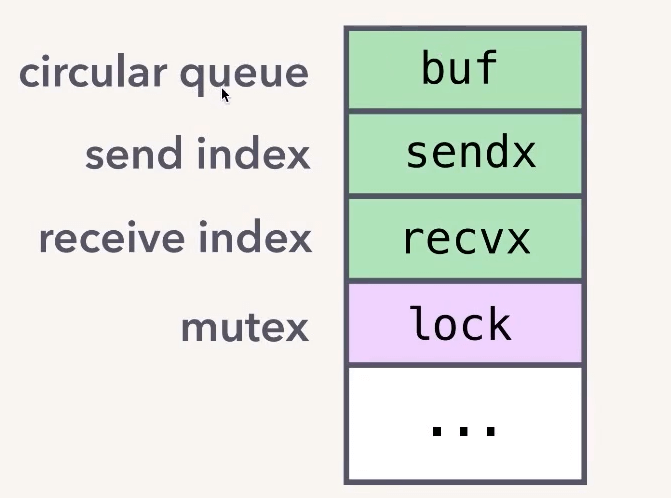
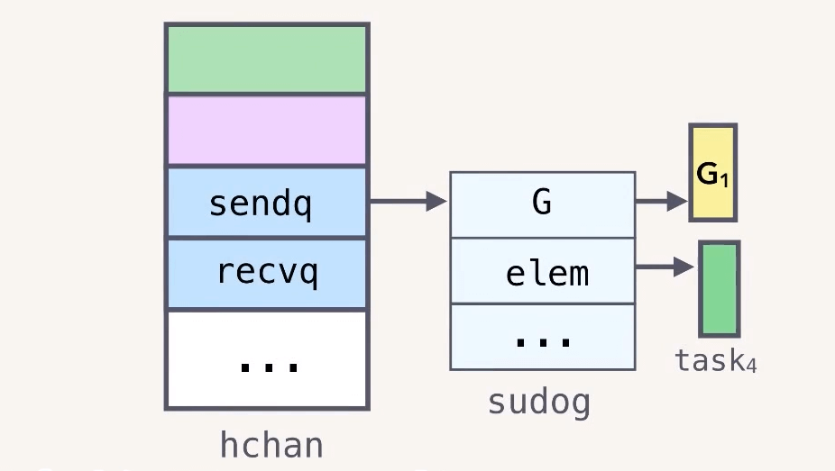
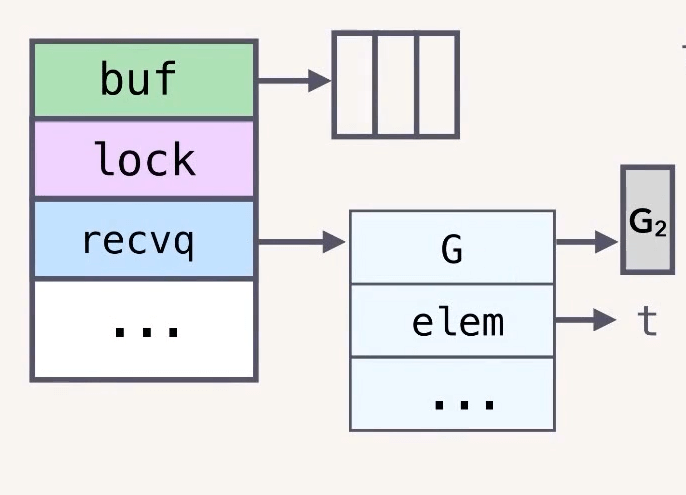

# runtime - chan

> 相关笔记https://blog.csdn.net/jiankunking/article/details/79100024
>
> https://www.cnblogs.com/jiujuan/p/12026551.html
>
> 官方文档 https://about.sourcegraph.com/go/understanding-channels-kavya-joshi/
>
> PPT： https://github.com/gophercon/2017-talks/blob/master/KavyaJoshi-UnderstandingChannels/Kavya%20Joshi%20-%20Understanding%20Channels.pdf

## channel

* goroutines
  * to execute tasks **independently**,potentially in parallel.

* channels
  * for **communication, synchronization** between goroutines.

### taskquue

串行执行

```go
func main() {
    
    tasks := getTasks( )
    // Process each task.
    for task := range tasks {
       process(task)
     }
    // ...
}

```

并行

```go
func main() {
    // Buffered channel.
    ch := make(chan Task, 3)
    // Run fixed number of workers.
    for i := 0; i< numWorkers; i++ {
        go worker(ch)
    }
    // Send tasks to workers.
    hellaTasks := getTasks( )
    for _,task := range hellaTasks {
    taskCh <- task
    }
	// ...
}

func worker(ch) {
    for {
        // Receive task.
        task:= <-taskCh
        process(task)
    }
}

```


### chan 特性

* **goroutine-safe**.
* store and **pass values between goroutines**.
* provide **FIFO semantics**.
* can **cause goroutines to block and unblock**.


### 内部结构

chan 内部结构如下图：



主要包含以下几个部分：

* 1）circular queue：循环队列，用于存储数据
* 2）send index 记录发送的位置
* 3）receive index 记录接收的位置
* 4）mutex 锁，用于实现 goroutine safe。

完整结构体如下：

```go
// runtime/chan.go 32 行
type hchan struct {
	qcount   uint           // total data in the queue
	dataqsiz uint           // size of the circular queue
	buf      unsafe.Pointer // points to an array of dataqsiz elements
	elemsize uint16
	closed   uint32
	elemtype *_type // element type
	sendx    uint   // send index
	recvx    uint   // receive index
	recvq    waitq  // list of recv waiters
	sendq    waitq  // list of send waiters

	// lock protects all fields in hchan, as well as several
	// fields in sudogs blocked on this channel.
	//
	// Do not change another G's status while holding this lock
	// (in particular, do not ready a G), as this can deadlock
	// with stack shrinking.
	lock mutex
}
```


```go
ch := make(chan Task, 3)
```

上述代码中 make 返回的 ch 实际上是一个指向 heap 中 真正的 chan 对象的指针。

**chan（即 hchan 结构体） 默认会被分配在堆上，make 返回的只是一个指向该对象的指针**。这也是为什么我们可以在函数之间传递 chan，而不是 chan 的指针。


### 发送和接收

以上面的代码为例：

```go
func main() {
    ch := make(chan Task, 3)
    for _,task := range hellaTasks {
    taskCh <- task // 发送
    }
}

func worker(ch) {
    for {
        task:= <-taskCh // 接收
        process(task)
    }
}
```

main goroutine 发送 task 到 铲

worker goroutine 从 chan 中接收 task

具体**发送过程**如下：

* 1）acquire 加锁
* 2）enqueue
  * 将 task 对象拷贝到 数组里
  * 如果发送的是指针，拷贝成本就是 8 字节，是值就是浅拷贝。
* 3）release 释放锁


**接收过程**：

* 1）acquire 加锁
* 2）dequeue
  * 将 task 对象从 数组 中 拷贝出来赋值给用户用于接收的对象
  * ` task:= <-taskCh`,比如这里就是拷贝出来赋值给 task
* 3）release 释放锁


完美匹配 Go 哲学。整个过程中没有任何共享内存，数据都是通过 copy 进行传递。

> Do not communicate by sharing memory; instead, share memory by communicating.


### 阻塞与唤醒

hchan 中的 buf 数组大小就是 make chan 时指定的大小。

当 buf 满之后再往 chan 中发送值就会阻塞。

> 复习一下 goroutine 调度：G 阻塞之后并不会阻塞 M。M 会先把这个 G 暂停(gopark)，然后把执行栈切换到 g0，g0 会执行 schedule() 函数，从当前 M 绑定的 P 中查找有没有可以执行的G，有就捞出来继续执行。


#### 先发后收

假设 chan 中已经有 3 个 task 了,然后我们再试着往里面发送一个

```go
 taskCh <- task 
```

runtime 会调用 gopark 将这个 goroutine(姑且称作G1) 切换到 wait 状态。

*什么时候会被唤醒呢？*

hchan 结构体中还有 sendq、recvq 两个列表，分别记录了等待发送或者接收的 goroutine，如下图所示：

```go
type hchan struct {
	recvq    waitq  // list of recv waiters
	sendq    waitq  // list of send waiters
}
type waitq struct {
	first *sudog
	last  *sudog
}
```

> 比如前面被阻塞的 G1 就会存入 sendq




假设此时 G2 从 chan 中取走一个消息

```go
 task:= <-taskCh 
```

G2 取走一个消息后就会找到 sendq 中的第一个对象，把待发送的 elem 直接写入 buf 数组。然后 调用 goready 把对应的 goroutine  G1 设置为 runnable 状态。


#### 先收后发

之前是先发送，后接收。现在看一下先接收后发送的情况。

```go
 task:= <-taskCh 
```

G2 直接从空的 chan 中取消息，同样会被阻塞,然后被写入到 hchan 的 recqv 中。

> 注意：elem 这里的 t 存的是 G2 栈里的地址。



然后 G1 往 chan 中发送一条消息。

```go
 taskCh <- task 
```

按照上面的逻辑应该是，将 task 写入 buf 数组后，，再把 recvq 中的第一个 goroutine G2 唤醒。

但是 Go 官方这里进行了优化，可以说是一个骚操作。因为 recvq 里的 elem 对象t 存的就是**接收者的内存地址**。

所以我们可以直接把 G1 发送来的 task 写入 elem 对应的 t 里，即在 G1 里修改 G2 的栈对象。

> 因为这个时候 G2 还是 gopark，处于 waiting 状态，所以不会出问题。

> 正常情况下因为不知道两个线程谁先谁后，这样改肯定会出问题。但是在 go runtime 这里，肯定是 G2 先执行，满足 happen-before 所以不存在问题。

通过这样一个骚操作省去了发送和接收时的两次加解锁和内存拷贝。


### 特性实现原理

到此我们应该明白了 chan 的这些特性的实现原理

* **goroutine-safe**.
  * hchan **mutex**
* store and **pass values between goroutines**.provide **FIFO semantics**.
  * copying into and out of hchan **buffer**
* can **cause goroutines to block and unblock**.
  * hchan **sudog queues**
  * calls into the **runtime scheduler**(gopark, goready)


### Note

**unbuffered channels **

unbuffered channels always work like the **"direct send" case**:

> 对于无缓冲 channel，可以直接操作对方的栈

* receiver first -> sender writes to receiver's stack.
  * 接收者先行的时候，发送者可以直接写到接收者栈
* sender first -> receiver receives directly from the sudog.
  * 发送者先行时接收者直接从发送者栈中取值

**select (general-case)**

* **all** channels locked.

* a sudog is put in the sendq /recvq queues of **all** channels.

* channels unlocked, and the se lect-ing G is **paused**.

* CAS operation so there's one winning case.
* **resuming **mirrors the pause sequence.


### simplicity

queue with a lock preferred to lock-free implementation:

"The performance improvement does not materialize from the air,
it comes with code complexity increase."一dvyokov

有锁队列优先于无锁实现，因为性能的提升一定伴随着代码复杂度的增加，性能不会凭空提升。

> 不是极端场景，没必要追求极限性能。毕竟代码首先是给人看的，其次才是刚好能被计算机执行。


