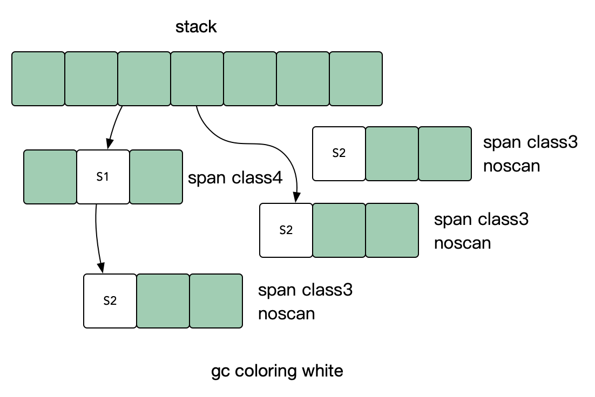
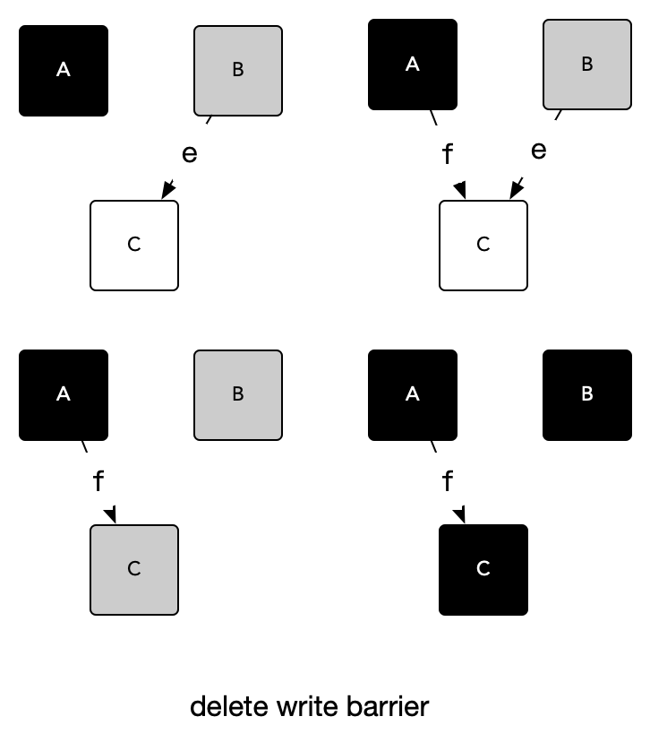
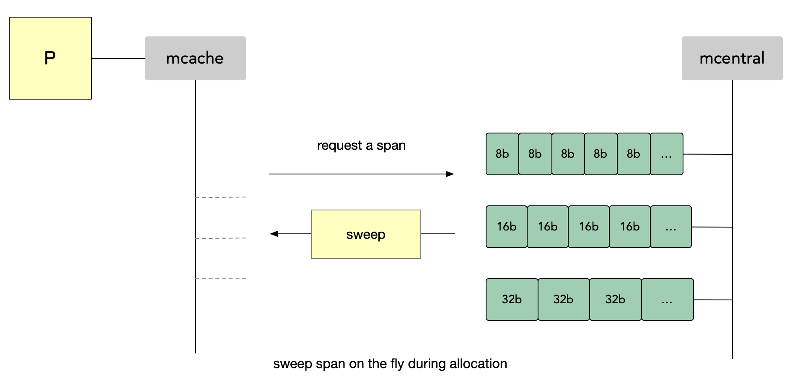

# GC 原理


## Mark & Sweep

### Garbage Collection 

现代高级编程语言管理内存的方式分为两种：自动和手动，像 C、C++、Rust 等编程语言使用手动管理内存的方式，工程师编写代码过程中需要主动申请或者释放内存；而 PHP、Java 和 Go 等语言使用自动的内存管理系统，有内存分配器和垃圾收集器来代为分配和回收内存，其中垃圾收集器就是我们常说的 GC。主流的垃圾回收算法：

* 引用计数
* 追踪式垃圾回收

> Go 现在用的三色标记法就属于追踪式垃圾回收算法的一种。


### Mark & Sweep

**STW**

stop the world, GC 的一些阶段需要停止所有的 mutator 以确定当前的引用关系。这便是很多人对 GC 担心的来源，这也是 GC 算法优化的重点。

**Root**

根对象是 mutator 不需要通过其他对象就可以直接访问到的对象。比如全局对象，栈对象中的数据等。通过Root对象。可以追踪到其他存活的对象。


> Mark Sweep 两个阶段：标记(Mark)和 清除(Sweep)两个阶段，所以也叫标记清除算法。


**Go v1.1**

Go v1.1 的 GC 算法就是严格按照追踪式算法的思路来实现的：

* Stop the World
* Mark：通过 Root 和 Root 直接间接访问到的对象， 来寻找所有可达的对象，并进行标记。
* Sweep：对堆对象迭代，已标记的对象置位标记。所有未标记的对象加入freelist， 可用于再分配。
* Start the Wrold

这个算法最大的问题是 GC 执行期间需要把整个程序完全暂停，朴素的 Mark Sweep 是整体 STW，并且分配速度慢，内存碎片率高。

> Go v1.1 一次 STW 甚至是秒级的。

标记过程需的要 STW，因为对象引用关系如果在标记阶段做了修改，会影响标记结果的正确性。

> 边标记程序边运行，可能刚把某个对象标记成垃圾，然后应用程序就用到了这个对象，最后该对象被回收了肯定会出问题。

**Go v1.3**

**Go v1.3 开始优化为并发 GC**，并发 GC 分为两层含义：

* 每个 mark 或 sweep 本身是多个线程(协程)执行的(**concurrent**)
  * 并发 mark 或者 并发 sweep
* mutator 和 collector 同时运行(**background**)
  * 垃圾收集和应用程序同时运行


concurrent 这一层是比较好实现的, GC 时整体进行STW，那么对象引用关系不会再改变，对 mark 或者sweep 任务进行分块，就能多个线程(协程) conncurrent 执行任务 mark 或 sweep。

而对于 backgroud 这一层, 也就是说 mutator 和 mark，sweep 同时运行，则相对复杂。

* 1.3以前的版本使用标记-清扫的方式，整个过程都需要 STW。
* 1.3版本分离了标记和清扫的操作，标记过程STW，清扫过程并发执行。

backgroup sweep 是比较容易实现的，**因为 mark 后，哪些对象是存活，哪些是要被 sweep 是已知的，sweep 的是不再引用的对象。sweep 结束前，这些对象不会再被分配到，所以 sweep 和 mutator 运行共存**。无论全局还是栈不可能能访问的到这些对象，可以安全清理。

> 标记为垃圾后，表示这些对象都不会被用到了，同时由于还没有被回收所以也不会被再次分配出去。

**Go v1.5**

1.5版本在标记过程中使用**三色标记法**。标记和清扫都并发执行的，但标记阶段的前后需要 STW 一定时间来做 GC 的准备工作和栈的re-scan。


## Tri-color Mark & Sweep

**三色标记是对标记清楚法的改进**，标记清楚法在整个执行时要求长时间 STW，Go 从1.5版本开始改为三色标记法，初始将所有内存标记为白色，然后将 roots 加入待扫描队列(进入队列即被视为变成灰色)，然后使用并发 goroutine 扫描队列中的指针，如果指针还引用了其他指针，那么被引用的也进入队列，被扫描的对象视为黑色。

* **白色对象：潜在的垃圾**，其内存可能会被垃圾收集器回收。
* **黑色对象：活跃的对象**，包括不存在任何引用外部指针的对象以及从根对象可达的对象，垃圾回收器不会扫描这些对象的子对象。
* **灰色对象 ：活跃的对象**，因为存在指向白色对象的外部指针，垃圾收集器会扫描这些对象的子对象。


垃圾收集器从 root 开始然后跟随指针递归整个内存空间。

> 分配于 noscan 的 span 的对象, 不会进行扫描。Go 内存分配时进行了区分。如果该对象内部不存在指向其他对象的指针就放入到 noscan 区域，表明该对象不需要进行扫描。因为不存在对其他对象的引用，扫了也白扫。


然而，此过程不是由同一个 goroutine 完成的，每个指针都排队在工作池中 然后，先看到的被标记为工作协程的后台协程从该池中出队，扫描对象，然后将在其中找到的指针排入队列。


### Tri-color Coloring 

染色流程：

* 一开始所有对象被认为是白色

* 根节点(stacks，heap global variables)被染色为灰色

一旦主流程走完，gc 会：

* 选一个灰色对象，标记为黑色

* 遍历这个对象的所有指针，标记所有其引用的对象为灰色

最终直到所有对象都扫描过为止。

> 最初全为白色，接着把 root 对象设置为灰色，然后从灰色对象开始扫描，把灰色对象可达的对象在设置为灰色，扫描完成后把这个灰色对象设置为黑色，重复这个过程，直到没有灰色对象。


1）一开始所有对象被认为是白色



2）根节点(stacks，heap global variables)被染色为灰色

> 这里 S2 被标记为黑色是因为 noscan 的原因。


3）选一个灰色对象，标记为黑色，并遍历这个对象的所有指针，标记所有其引用的对象为灰色。

> S1 标记为黑色后，又把遍历到的 S2 标记成灰色。


4）最终直到所有对象都被扫过了，整个标记过程结束。

> 这个灰色 S2 也是 noscan 所以也标记为黑色了。


标记结束后，黑色对象是内存中正在使用的对象，而白色对象是要收集的对象。由于struct2的实例是在匿名函数中创建的，并且无法从堆栈访问，因此它保持为白色，可以清除。

颜色在内部实现原理:

每个span中有一个名为gcmarkBits的位图属性，该属性跟踪扫描，并将相应的位设置为1。


## Write Barrier


1.5版本在标记过程中使用三色标记法。回收过程主要有四个阶段，其中，标记和清扫都并发执行的，但标记阶段的前后需要 STW 一定时间来做GC 的准备工作和栈的 re-scan。

使用并发的垃圾回收，也就是多个 Mutator 与 Mark 并发执行，想要在并发或者增量的标记算法中保证正确性，我们需要达成以下两种三色不变性(Tri-color invariant)中的任意一种：

* 强三色不变性：黑色对象不会指向白色对象，只会指向灰色对象或者黑色对象。
  * 黑色为活跃对象，白色为待回收的垃圾，如果出现黑色指向白色这种情况说明程序出现了错误
* 弱三色不变性 ：黑色对象指向的白色对象必须包含一条从灰色对象经由多个白色对象的可达路径。
  * 灰色表示该对象还没有扫描过，如果白色对象包含一条从灰色对象经由多个白色对象的可达路径。那么最终这个白色对象肯定会被扫描到，然后标记为灰色。

以下图为例：


* 1）灰色对象 B 指向 C，比如 B.e = C
* 2）黑色对象 A 也指向了 C，比如 A.f  = C
* 3）B 对 C 的引用被取消了,比如 B.e = nil
* 4）最后 B 对象也经过扫描后被标记为了黑色
* 5）虽然一直有一个黑色对象 A 在指向 C，但是最终 C 还是炸了。

> 因为只有 mark 过程中才会对这些对象进行染色，本来 C 对象是可以被染为灰色的，因为 mark 过程中用户程序也在运行，最终导致 C 没有被扫描到，也没有染色，最后被误回收了。


可以看出，一个白色对象被黑色对象引用，是注定无法通过这个黑色对象来保证自身存活的。

> 标记为黑色，说明该对象已经扫描结束了，那该黑色对象指向的白色对象最终不会被改为灰色了。

与此同时，如果所有能到达它的灰色对象与它之间的可达关系全部遭到破坏，那么这个白色对象必然会被视为垃圾清除掉。 故当上述两个条件同时满足时，就会出现对象丢失的问题。如果这个白色对象下游还引用了其他对象，并且这条路径是指向下游对象的唯一路径，那么他们也是必死无疑的。

为了防止这种现象的发生，**最简单的方式就是 STW，直接禁止掉其他用户程序对对象引用关系的干扰**，但是 STW 的过程有明显的资源浪费，对所有的用户程序都有很大影响，如何能在保证对象不丢失的情况下合理的尽可能的提高 GC 效率，减少 STW 时间呢？


### Write Barrier - Dijkstra 写屏障 

**Go1.5版本使用的Di jkstra写屏障就是这个原理。**

> 之前只有 mark 过程中才会对这些对象进行染色，由于用户程序的修改导致某些对象无法被染色，那么**在用户程序执行某些会干扰染色的操作时也给相关对象进行染色**，不就可以解决该问题了。

**插入屏障拦截将白色指针插入黑色对象的操作，标记其对应对象为灰色状态**，这样就不存在黑色对象引用白色对象的情况了，满足强三色不变式。

大概是像这样的：

```go
writePointer(slot,ptr):
	shade(ptr)
	*Slot = ptr
```

如下图所示，在插入指针 f 时将 C 对象标记为灰色:


**如果对栈上的写做拦截，那么流程代码会非常复杂，并且性能下降会非常大，得不偿失**。

> 根据局部性的原理来说，其实我们程序跑起来，大部分的其实都是操作在栈上，函数参数啊、函数调用导致的压栈出栈、局部变量啊，协程栈，这些如果也弄起写屏障，那么可想而知了，根本就不现实，复杂度和性能就是越不过去的坎。

**所以 Go 的实现上没有对栈上的写做拦截，只对 堆 上的对象写做了拦截。**

正是因为这个特殊的实现，导致 Go 的 GC 流程变得比较复杂了，具体流程如下图：


* 1）初始化 GC 任务，包括开启写屏障(write barrier)和开启辅助 GC(mutator assist)，统计 root 对象的任务数量等，这个过程需要STW。
  * 这个 STW 过程非常短，很快就结束了，基本不影响程序运行。
* 2）扫描所有 root 对象，包括全局指针和 goroutine(G) 栈上的指针(扫描对应 G 栈时需停止该 G)，将其加入标记队列(灰色队列)，并循环处理灰色队列的对象，直到灰色队列为空，该过程后台并行执行。
  * 扫描过程中都是没有 STW 的
* 3）完成标记工作，重新扫描(re-scan)全局指针和栈。因为 Mark 和 mutator 是并行的，所以在 Mark 过程中可能会有新的对象分配和指针赋值，这个时候就需要通过写屏障(write barrier)记录下来，re-scan 再检查一下，这个过程也是会 STW 的。
  * 栈上的对象没有做拦截，所以这里需要re-scan
  * 然后因为这里是扫描栈，所以用不了前面的写屏障，必须要 STW
  * 最后要把这过程中新分配的对象都标记为黑色，防止被错误的回收。
* 4）按照标记结果回收所有的白色对象，该过程后台并行执行。


> 将 mark 过程分为几个阶段，并依靠写屏障缩小饿了 STW 的范围。


### Write Barrier - Yuasa 删屏障 

**删除屏障也是拦截写操作的，但是是通过保护灰色对象到白色对象的路径不会断来实现的**。如上图例中，在删除指针 e 时将对象 C 标记为灰色，这样 C 下游的所有白色对象，即使会被黑色对象引用，最终也还是会被扫描标记的，满足了弱三色不变式。这种方式的回收精度低，一个对象即使被删除了最后一个指向它的指针也依旧可以活过这一轮，在下一轮 GC 中被清理掉。


```c
writePointer(slot, ptr):
	shade (*slot)
if current stack is grey:
		shade(ptr)
	*slot = ptr
```




### Write Barrier - 混合屏障 

插入屏障和删除屏障各有优缺点：

* Dijkstra 的插入写屏障在标记开始时‘无需’ STW，可直接开始，并发进行，但结束时需要 STW 来重新扫描栈，标记栈上引用的白色对象的存活；
  * 开始时也需要 STW，只不过时间特别短
* Yuasa 的删除写屏障则需要在 GC 开始时 STW 扫描堆栈来记录初始快照，这个过程会保护开始时刻的所有存活对象，但结束时无需 STW。

**Go1.8 混合写屏障结合了Yuasa的删除写屏障和Dijkstra的插入写屏障。**

```c
writePointer(slot, ptr):
	shade (*slot)
if current stack is grey:
		shade(ptr)
	*slot = ptr
```


Golang 中的混合写屏障满足的是变形的弱三色不变式，同样允许黑色对象引用白色对象，白色对象处于灰色保护状态，但是只由堆上的灰色对象保护。


Go 1.8 使用混合写屏障之后就不需要 re-scan 了。

> 之前 re-scan 是因为性能问题，只加了堆上写屏障，然后担心栈上的对象被误清理掉，混合写屏障中增加了 删除写屏障，把灰色对象删除保护加上后就不会出现这个问题了。


由于结合了 Yuasa 的删除写屏障和 Dijkstra 的插入写屏障的优点，通过以下方法省去了 re-scan 的 STW 时间：

只需要在开始时并发扫描各个goroutine 的栈，使其变黑并一直保持，这个过程不需要 STW，**而标记结束后，因为栈在扫描后始终是黑色的，也无需再进行 re-scan 操作了，减少了 STW 的时间。**


为了移除栈的重扫描过程，除了引入混合写屏障之外，在垃圾收集的标记阶段，我们还需要**将创建的所有新对象都标记成黑色，防止新分配的栈内存和堆内存中的对象被错误地回收，**因为栈内存在标记阶段最终都会变为黑色，所以不再需要重新扫描栈空间。


### Sweep

Sweep 让 Go 知道哪些内存可以重新分配使用，然而，Sweep 过程并不会将要被释放的对象的内存置为0(zeroing the memory)，而是在分配重新使用的时候，重新 reset bit。

> 即先标记，然后等重新分配的时候再去 reset。加快 Sweep 的速度，将这些 reset 过程分散到后续的分配过程中执行，有点渐进式 reset 的味道。


每个 span 内有一个 bitmap `allocBits`，他表示上一次 GC 之后每一个 object 的分配情况，**1：表示已分配，0：表示未使用或释放**。

> 内部还使用了 uint64 allocCache(deBruijn)，加速寻找 freeobject。


GC 将会启动去释放不再被使用的内存。在标记期间，GC 会用一个位图 gcmarkBits 来跟踪在使用中的内存。


正在被使用的内存被标记为黑色，然而当前执行并不能够到达的那些内存会保持为白色。

现在，我们可以使用 gcmarkBits 精确查看可用于分配的内存。**Go 使用 gcmarkBits 赋值了 allocBits，这个操作就是内存清理。**

> 扫描后 gcmarkBits 就记录了内存的使用状态，可以将 gcmarkBits 直接当做 allocBits 来使用，所以直接使用 gcmarkBits 赋值给 allocBits。


然而必须每个 span 都来一次类似的处理，需要耗费大量时间。Go 的目标是在清理内存时不阻碍执行，并为此提供了两种策略。

Go 提供两种方式来清理内存：

* 在后台启动一个 worker 等待清理内存，一个一个 mspan 处理
  * 当开始运行程序时，Go 将设置一个后台运行的 Worker(唯一的任务就是去清理内存)，它将进入睡眠状态并等待内存段扫描。
* 当申请分配内存时候 lazy 触发
  * 当应用程序 goroutine 尝试在堆内存中分配新内存时，会触发该操作。**清理导致的延迟和吞吐量降低被分散到每次内存分配时**。

清理内存段的第二种方式是即时执行。但是，由于这些内存段已经被分发到每一个处理器 P 的本地缓存 mcache 中，因此很难追踪首先清理哪些内存。这就是为什么 **Go 首先将所有内存段移动到 mcentral **的原因。然后，它将会让本地缓存 mcache 再次请求它们，去即时清理。

> Go 首先将所有内存段移动到 mcentral，然后 mcache 再从 mcentral 中申请时就会触发清理。这样就能保证会立马被清理掉。

> 即时扫描确保所有内存段在保存资源的过程中都会得到清理，同时会保存资源以及不会阻塞程序执行。





由于后台只有一个 worker 在清理内存块，清理过程可能会花费一些时间。但是，我们可能想知道如果另一个 GC 周期在一次清理过程中启动会发生什么。在这种情况下，**这个运行 GC 的 Goroutine 就会在开始标记阶段前去协助完成剩余的清理工作**。

> 默认情况下 Go 会使用 1/4 的资源用来做 GC，如果发现内存申请速度比GC速度还快就会启动一个叫做 Mark Assistant 的 goroutine 再增加1/4资源来做GC，即一共1/2资源来做GC，以加快GC速度。


## Stop The World

在垃圾回收机制 (GC) 中，"Stop the World" (STW) 是一个重要阶段。顾名思义， 在 "Stop the World" 阶段， 当前运行的所有程序将被暂停， 扫描内存的 root 节点和添加写屏障 (write barrier) 。

### STW

**这个阶段的第一步， 是抢占所有正在运行的 goroutine**，被抢占之后， 这些 goroutine 会被悬停在一个相对安全的状态。


处理器 P (无论是正在运行代码的处理器还是已在 idle 列表中的处理器)， 都会被被标记成停止状态 (stopped)， 不再运行任何代码。 调度器把每个处理器的 M  从各自对应的处理器 P 分离出来， 放到 idle 列表中去。

> 对于 Goroutine 本身， 他们会被放到一个全局队列中等待。


### Pacing

运行时中有 GC Percentage（GC百分比） 的配置选项，默认情况下为100。

> 此值表示在下一次垃圾收集必须启动之前可以分配多少新内存的比率。将 GC 百分比设置为100意味着，基于在垃圾收集完成后标记为活动的堆内存量，下次垃圾收集前，堆内存使用可以增加100%。

如果超过2分钟没有触发，会强制触发 GC。


```sh
使用环境变量 GODEBUG 和 gctrace = 1选项生成GC trace
GODEBUG=gctrace=1 ./app
```


## Referens

```sh
https://medium.com/a-journey-with-go/go-goroutine-os-thread-and-cpu-management-2f5a5eaf518a
http://www.sizeofvoid.net/goroutine-under-the-hood/
https://zhuanlan.zhihu.com/p/84591715
https://rakyll.org/scheduler/
https://zhuanlan.zhihu.com/p/248697371
https://zhuanlan.zhihu.com/p/68299348
https://blog.csdn.net/qq_25504271/article/details/81000217
https://blog.csdn.net/ABo_Zhang/article/details/90106910
https://zhuanlan.zhihu.com/p/66090420
https://zhuanlan.zhihu.com/p/27056944
https://www.cnblogs.com/sunsky303/p/11058728.html
https://www.cnblogs.com/zkweb/p/7815600.html

https://yizhi.ren/2019/06/03/goscheduler/
https://morsmachine.dk/netpoller
https://segmentfault.com/a/1190000022030353?utm_source=sf-related
https://www.jianshu.com/p/0083a90a8f7e
https://www.jianshu.com/p/1ffde2de153f
https://www.jianshu.com/p/63404461e520
https://www.jianshu.com/p/7405b4e11ee2
https://www.jianshu.com/p/518466b4ee96
https://zhuanlan.zhihu.com/p/59125443
https://www.codercto.com/a/116486.html
https://www.jianshu.com/p/db0aea4d60ed
https://www.jianshu.com/p/ef654413f2c1
https://zhuanlan.zhihu.com/p/248697371

https://medium.com/a-journey-with-go/go-how-does-a-goroutine-start-and-exit-2b3303890452
https://medium.com/a-journey-with-go/go-g0-special-goroutine-8c778c6704d8
https://medium.com/a-journey-with-go/go-how-does-go-recycle-goroutines-f047a79ab352
https://medium.com/a-journey-with-go/go-what-does-a-goroutine-switch-actually-involve-394c202dddb7
http://xiaorui.cc/archives/6535
http://xiaorui.cc/archives/category/golang
https://docs.google.com/document/d/1lyPIbmsYbXnpNj57a261hgOYVpNRcgydurVQIyZOz_o/pub


https://medium.com/a-journey-with-go/go-asynchronous-preemption-b5194227371c
https://medium.com/a-journey-with-go/go-goroutine-and-preemption-d6bc2aa2f4b7
http://xiaorui.cc/archives/6535
https://medium.com/a-journey-with-go/go-gsignal-master-of-signals-329f7ff39391
https://www.jianshu.com/p/1ffde2de153f
https://kirk91.github.io/posts/2d571d09/
http://yangxikun.github.io/golang/2019/11/12/go-goroutine-stack.html
https://www.ardanlabs.com/blog/2017/05/language-mechanics-on-stacks-and-pointers.html
https://www.ardanlabs.com/blog/2017/05/language-mechanics-on-escape-analysis.html
https://zhuanlan.zhihu.com/p/237870981


https://www.ardanlabs.com/blog/2017/05/language-mechanics-on-stacks-and-pointers.html
https://blog.csdn.net/qq_35587463/article/details/104221280
https://www.jianshu.com/p/63404461e520
https://www.do1618.com/archives/1328/go-%E5%86%85%E5%AD%98%E9%80%83%E9%80%B8%E8%AF%A6%E7%BB%86%E5%88%86%E6%9E%90/
https://www.jianshu.com/p/518466b4ee96
https://zhuanlan.zhihu.com/p/28484133
http://yangxikun.github.io/golang/2019/11/12/go-goroutine-stack.html
https://kirk91.github.io/posts/2d571d09/
https://zhuanlan.zhihu.com/p/237870981
https://agis.io/post/contiguous-stacks-golang/


https://docs.google.com/document/d/13v_u3UrN2pgUtPnH4y-qfmlXwEEryikFu0SQiwk35SA/pub
https://docs.google.com/document/d/1lyPIbmsYbXnpNj57a261hgOYVpNRcgydurVQIyZOz_o/pub
https://zhuanlan.zhihu.com/p/266496735
http://dmitrysoshnikov.com/compilers/writing-a-memory-allocator/
https://studygolang.com/articles/22652?fr=sidebar
https://studygolang.com/articles/22500?fr=sidebar
https://www.cnblogs.com/unqiang/p/12052308.html
https://blog.csdn.net/weixin_33869377/article/details/89801587?utm_medium=distribute.pc_relevant.none-task-blog-title-7&spm=1001.2101.3001.4242


https://www.cnblogs.com/smallJunJun/p/11913750.html
https://zhuanlan.zhihu.com/p/53581298
https://zhuanlan.zhihu.com/p/141908054
https://zhuanlan.zhihu.com/p/143573649
https://zhuanlan.zhihu.com/p/145205154
https://www.jianshu.com/p/47735dfb0b81
https://zhuanlan.zhihu.com/p/266496735
https://dave.cheney.net/high-performance-go-workshop/dotgo-paris.html#memory-and-gc
https://juejin.im/post/6844903917650722829


https://spin.atomicobject.com/2014/09/03/visualizing-garbage-collection-algorithms/
https://zhuanlan.zhihu.com/p/245214547
https://www.jianshu.com/p/2f94e9364ec4
https://www.jianshu.com/p/ebd8b012572e
https://www.ardanlabs.com/blog/2018/12/garbage-collection-in-go-part1-semantics.html
https://segmentfault.com/a/1190000012597428
https://www.jianshu.com/p/bfc3c65c05d1
https://golang.design/under-the-hood/zh-cn/part2runtime/ch08gc/sweep/
https://zhuanlan.zhihu.com/p/74853110
https://www.jianshu.com/p/2f94e9364ec4
https://juejin.im/post/6844903917650722829
https://zhuanlan.zhihu.com/p/74853110


https://www.jianshu.com/p/ebd8b012572e
https://www.jianshu.com/p/2f94e9364ec4
https://www.jianshu.com/p/bfc3c65c05d1
https://zhuanlan.zhihu.com/p/92210761
https://blog.csdn.net/u010853261/article/details/102945046
https://blog.csdn.net/hello_bravo_/article/details/103840054
https://segmentfault.com/a/1190000020086769
https://blog.csdn.net/cyq6239075/article/details/106412038
https://zhuanlan.zhihu.com/p/77943973
https://www.ardanlabs.com/blog/2018/12/garbage-collection-in-go-part1-semantics.html
https://www.ardanlabs.com/blog/2019/05/garbage-collection-in-go-part2-gctraces.html


https://www.ardanlabs.com/blog/2019/07/garbage-collection-in-go-part3-gcpacing.html
https://github.com/dgraph-io/badger/tree/master/skl
https://dgraph.io/blog/post/manual-memory-management-golang-jemalloc/

```

