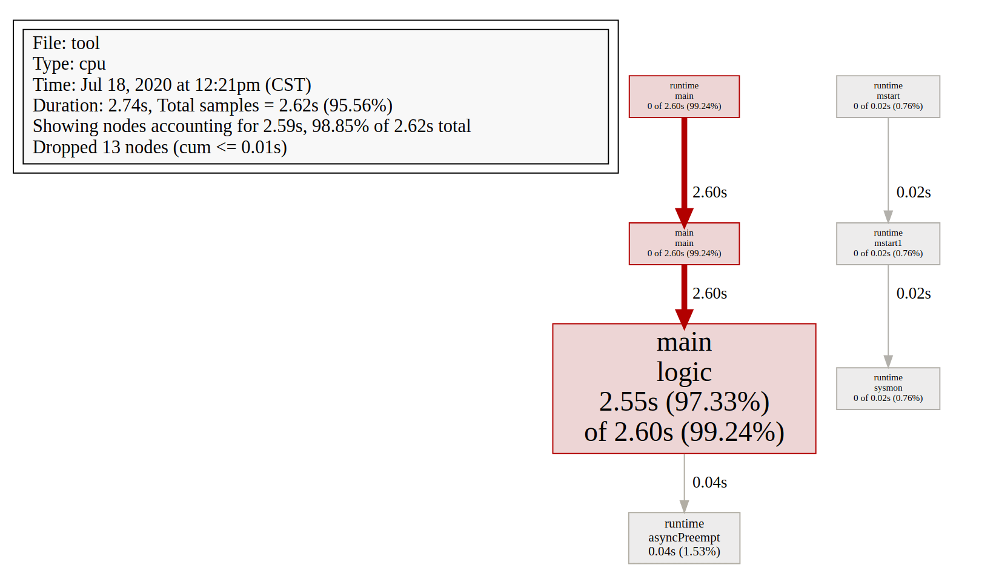
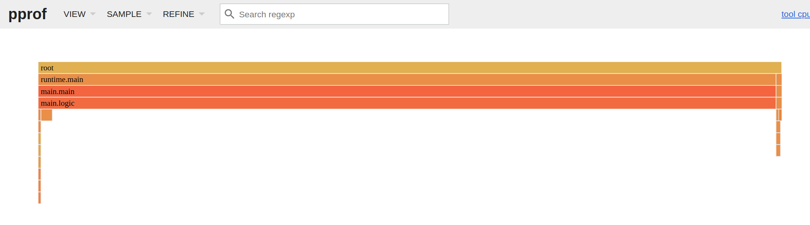

# pprof

## 1. 概述

### 1. 是什么

**`Profiling` 是指在程序执行过程中，收集能够反映程序执行状态的数据。**

在软件工程中，性能分析（performance analysis，也称为 profiling），是以收集程序运行时信息为手段研究程序行为的分析方法，是一种动态程序分析的方法。

Go 语言自带的 pprof 库就可以分析程序的运行情况，并且提供可视化的功能。它包含两个相关的库：

- runtime/pprof：对于只跑一次的程序，例如每天只跑一次的离线预处理程序，调用 pprof 包提供的函数，手动开启性能数据采集。
- net/http/pprof：对于在线服务，对于一个 HTTP Server，访问 pprof 提供的 HTTP 接口，获得性能数据。当然，实际上这里底层也是调用的 runtime/pprof 提供的函数，封装成接口对外提供网络访问。


### 2. 可以做什么

`pprof` 是 Go 语言中分析程序运行性能的工具，它能提供各种性能数据：

| 类型         | 描述                       | 备注                                                         |
| :----------- | :------------------------- | :----------------------------------------------------------- |
| allocs       | 内存分配情况的采样信息     | 可以用浏览器打开，但可读性不高                               |
| blocks       | 阻塞操作情况的采样信息     | 可以用浏览器打开，但可读性不高                               |
| cmdline      | 显示程序启动命令及参数     | 可以用浏览器打开，这里会显示 `./go-pprof-practice`           |
| goroutine    | 当前所有协程的堆栈信息     | 可以用浏览器打开，但可读性不高                               |
| heap         | 堆上内存使用情况的采样信息 | 可以用浏览器打开，但可读性不高                               |
| mutex        | 锁争用情况的采样信息       | 可以用浏览器打开，但可读性不高                               |
| profile      | CPU 占用情况的采样信息     | 浏览器打开会下载文件                                         |
| threadcreate | 系统线程创建情况的采样信息 | 可以用浏览器打开，但可读性不高                               |
| trace        | 程序运行跟踪信息           | 浏览器打开会下载文件，本文不涉及，可另行参阅[《深入浅出 Go trace》](https://mp.weixin.qq.com/s/I9xSMxy32cALSNQAN8wlnQ) |

由于直接阅读采样信息缺乏直观性，我们需要借助 `go tool pprof` 命令来排查问题，这个命令是 go 原生自带的，所以不用额外安装。

### 3. 怎么用

流程其实很简单，可以分为两个部分

* 1）首先是采集数据 - 两种方式
  * 工具型应用
  * HTTP Server
* 2）然后就是进行分析了
  * Report generation：报告生成
  * Interactive terminal use：交互式终端使用
  * Web interface：Web 界面

### 4. 环境准备

* 1）graphviz
  * 生成 svg 图的时候需要用到该工具
  * 安装方式可以看这里`https://graphviz.gitlab.io/download/`


## 2. 数据采集

工具型应用和服务型应用数据采集稍微有一点点不一样，分开讲。

### 1. 工具型应用

**如果你的应用程序是运行一段时间就结束退出类型。**

那么最好的办法是在应用退出的时候把 profiling 的报告保存到文件中，进行分析。对于这种情况，可以使用 runtime/pprof 库。 

首先在代码中导入runtime/pprof工具：

```go
  import "runtime/pprof"
```

#### 1. CPU

```go
// 程序运行时开启统计
pprof.StartCPUProfile(w io.Writer)
// 程序结束时关闭
pprof.StopCPUProfile()
```

例如

```go
file, _ := os.Create("./cpu.pprof") // 在当前路径下创建一个cpu.pprof文件
pprof.StartCPUProfile(file) // 往文件中记录CPU profile信息
defer func() {
    // 退出之前 停止采集
    pprof.StopCPUProfile()
    file.Close()
}()
```

#### 2. Heap

```go
// 程序退出前记录即可 
pprof.WriteHeapProfile(w io.Writer)
```

例如

```go
file, _ := os.Create("./mem.pprof")
pprof.WriteHeapProfile(file)
f2.Close()
```

#### 3. 指定采集指标

也可以指定采集指标

```go
// 可选值 goroutine、threadcreate、heap、allocs、block、mutex
pprof.Lookup("Name")
```

例如

```go
fileG, _ := os.Create("./goroutine.pprof")
pprof.Lookup("goroutine").WriteTo(fileG, 1)
```

#### 4. 优点

这种形式的优点就是**灵活**。

```go
pprof.StartCPUProfile() 
pprof.StopCPUProfile()
```

可以在任意地方进行采集，可以针对单个方法甚至某一行代码，而不是整个应用。

采集内存信息之前甚至可以手动调用 GC ,模拟出各种情况。

```go
runtime.GC()
pprof.WriteHeapProfile()
```


### 2. 服务型应用

如果你的应用程序是一直运行的，比如 web 应用，那么可以使用 net/http/pprof 库，它能够在提供 HTTP 服务进行分析。

如果使用了默认的 http.DefaultServeMux，只需要在你的web server端代码中按如下方式导入net/http/pprof

```go
 import _ "net/http/pprof"
```

如果你使用自定义的 Mux，则需要手动注册一些路由规则：

```go
    r.HandleFunc("/debug/pprof/", pprof.Index)
    r.HandleFunc("/debug/pprof/cmdline", pprof.Cmdline)
    r.HandleFunc("/debug/pprof/profile", pprof.Profile)
    r.HandleFunc("/debug/pprof/symbol", pprof.Symbol)
    r.HandleFunc("/debug/pprof/trace", pprof.Trace)
```

如果你使用的是gin框架，那么推荐使用`github.com/DeanThompson/ginpprof`

例如

```go
import (
    // 省略...
    _ "net/http/pprof"
)
func main() {
    flag.Parse()

    //远程获取pprof数据
    go func() {
        log.Println(http.ListenAndServe("localhost:8080", nil))
    }()
	// 省略...
}
```


编译运行之后在浏览器访问 `http://localhost:8080/debug/pprof/`

这个路径下还有几个子页面：

- /debug/pprof/profile：访问这个链接会自动进行 CPU profiling，持续 30s，并生成一个文件供下载
- /debug/pprof/heap： Memory Profiling 的路径，访问这个链接会得到一个内存 Profiling 结果的文件
- /debug/pprof/block：block Profiling 的路径
- /debug/pprof/goroutines：运行的 goroutines 列表，以及调用关系


**其实就是 pprof 包对外提供了接口，当我们调用这些接口的时候，就会去实时的采集对应 profile 信息。**

例如

```shell
# syntax go tool pprof  source
# -seconds 指定采集时间 默认是 30s
go tool pprof http://127.0.0.1:8080/debug/pprof/profile?-seconds=10
```

采集成功后或自动保存到 home 目录下。

```shell
Saved profile in /home/lixd/pprof/pprof.server.samples.cpu.002.pb.gz
```


### 3. 模拟负载

由于获取的 Profiling 数据是动态的，要想获得有效的数据，需要保证应用处于较大的负载。否则如果应用处于空闲状态，得到的结果可能没有任何意义。

#### 1. 压测

使用压测工具的同时，进行 pprof 以达到最好的效果。

压测工具推荐使用

```shell
https://github.com/wg/wrk
https://github.com/adjust/go-wrk
```

压测同时采集数据。

例如

```shell
# 压测
go-wrk -n 50000 http://127.0.0.1:8080/hello
# 采集
go tool pprof http://127.0.0.1:8080/debug/pprof/profile?-seconds=10
```


#### 2. 性能测试

go test 命令有两个参数和 pprof 相关，它们分别指定生成的 CPU 和 Memory profiling 保存的文件：

- -cpuprofile：cpu profiling 数据要保存的文件地址
- -memprofile：memory profiling 数据要报文的文件地址

我们还可以选择将pprof与性能测试相结合，比如：

比如下面执行测试的同时，也会执行 CPU profiling，并把结果保存在 cpu.prof 文件中：

```
go test -bench . -cpuprofile=cpu.prof
```

比如下面执行测试的同时，也会执行 Mem profiling，并把结果保存在 cpu.prof 文件中：

```
go test -bench . -memprofile=./mem.prof
```


## 3. 数据分析

通过前面两种方式，获取到数据后即可进行分析。

我们可以使用 `go tool pprof `命令行工具。

go tool pprof 最简单的使用方式为:

```shell
go tool pprof [binary] [source]
```

其中：

- binary 是应用的二进制文件，用来解析各种符号；
- source 表示 profile 数据的来源，可以是本地的文件，也可以是 http 地址。


#### 1. 通过交互式终端使用

例如：分析前面保存的 cpu.pprof

```shell
go tool pprof cpu.pprof
```

会进入一个交互式界面：

```shell
Type: cpu
Time: Jul 18, 2020 at 12:21pm (CST)
Duration: 2.74s, Total samples = 2.62s (95.56%)
Entering interactive mode (type "help" for commands, "o" for options)
(pprof) 

```

>输入 `help`查看命令列表，输入`o`查看参数列表。

不过比较常用的只有 3 个命令：

* `top`
   * 查看资源较高的调用。
* `list`
   * ``list 代码片段`查看问题代码具体位置。
* `web`
   * 在Web Browser上图形化显示当前的资源监控内容
   * 这里就要用到前面安装的 graphviz


我们可以在交互界面输入`top(也可以指定个数 比如 top3)`来查看程序中占用 CPU 比较多的函数：

```shell
(pprof) top
Showing nodes accounting for 2.59s, 98.85% of 2.62s total
Dropped 13 nodes (cum <= 0.01s)
      flat  flat%   sum%        cum   cum%
     2.55s 97.33% 97.33%      2.60s 99.24%  main.logic
     0.04s  1.53% 98.85%      0.04s  1.53%  runtime.asyncPreempt
         0     0% 98.85%      2.60s 99.24%  main.main
         0     0% 98.85%      2.60s 99.24%  runtime.main
         0     0% 98.85%      0.02s  0.76%  runtime.mstart
         0     0% 98.85%      0.02s  0.76%  runtime.mstart1
         0     0% 98.85%      0.02s  0.76%  runtime.sysmon
```

参数说明

- flat：给定函数上运行耗时
- flat%：同上的 CPU 运行耗时总比例
- sum%：给定函数累积使用 CPU 总比例
- cum：当前函数加上它之上的调用运行总耗时
- cum%：同上的 CPU 运行耗时总比例

最后一列为函数名称，在大多数的情况下，我们可以通过这五列得出一个应用程序的运行情况，加以优化

可以看到 大部分 CPU 都消耗在了 main.logic 这个函数。

接下来就可以使用`list`命令具体分析一个这个函数

```shell
(pprof) list main.logic
Total: 2.62s
ROUTINE ======================== main.logic in /home/lixd/17x/projects/hello/test/pprof/tool/tool.go
     2.55s      2.60s (flat, cum) 99.24% of Total
         .          .     50:}
         .          .     51:
         .          .     52:// logic logic code with some bug for test
         .          .     53:func logic() {
         .          .     54:   // normal logic
         .       50ms     55:   fmt.Println("logic")
         .          .     56:   // bad logic loop
     2.55s      2.55s     57:   for i := 0; i < 1000000000; i++ {
         .          .     58:
         .          .     59:   }
         .          .     60:}
         .          .     61:
         .          .     62:// memory record memory info to file

```

可以清楚的看到，大部分时间都消耗在 for loop 了。


#### 2. svg

如果觉得在命令行查看不够直观的话，也可以直接输入`web`命令，生成 svg 图像进行查看。

> `web`命令的实际行为是产生一个 `.svg`文件，并调用系统里设置的默认打开 `.svg` 的程序打开它。如果系统里打开 `.svg` 的默认程序并不是浏览器（比如代码编辑器），需要设置一下默认使用浏览器打开 `.svg` 文件。

大概是这个样子的。



关于图形的说明： 

* 每个框代表一个函数，理论上框的越大表示占用的CPU资源越多。 
* 方框之间的线条代表函数之间的调用关系，线条上的数字表示函数调用的次数。 
* 方框中的第一行数字表示当前函数占用CPU的百分比，第二行数字表示当前函数累计占用CPU的百分比。

这样的话遇到比较复杂的调用关系，还是比较麻烦，很难看出其中的关系，所以可以使用下面的  火焰图。

#### 3. 火焰图

也可以使用 go 自带的工具生成火焰图。


**获取cpuprofile**

```shell
go tool pprof http://127.0.0.1:8080/debug/pprof/profile?-seconds=10
```

时间到后会生成一个类似`pprof.samples.cpu.003.pb.gz`的文件

**生成火焰图**

```shell
go tool pprof -http=:8081 ~/pprof/pprof.samples.cpu.001.pb.gz
```

在浏览器中即可查看到相关信息了 view 中可以选择查询各种内容：具体如下



说明：

* 宽度越大表示占用的 CPU 时间越多。
* 然后图中的各种条是可以点的，这样看起来更加方便


> 感觉下来还是这种方式比较方便


## 4. 小结

pprof 使用一共两个步骤：

* 1）采集数据
  * 工具型应用
  * 服务型应用
* 2）分析数据
  * 交互式终端
  * svg
  * 火焰图

最后附上一个又有意思的故事:

> 事情的起因是这样的，有人发表了一篇文章，用各种语言实现了一个算法，结果用 go 写的程序非常慢，而 C++ 则最快。然后 Russ Cox 就鸣不平了，哪受得了这个气？马上启用 pprof 大杀器进行优化。最后，程序不仅更快，而且使用的内存更少了！
>
> 链接 `https://blog.golang.org/pprof`


## 5. 参考

`https://golang.org/pkg/net/http/pprof/`

`https://segmentfault.com/a/1190000016412013`

`https://blog.wolfogre.com/posts/go-ppof-practice/`

`https://cizixs.com/2017/09/11/profiling-golang-program/`

`https://xargin.com/pprof-and-flamegraph/`