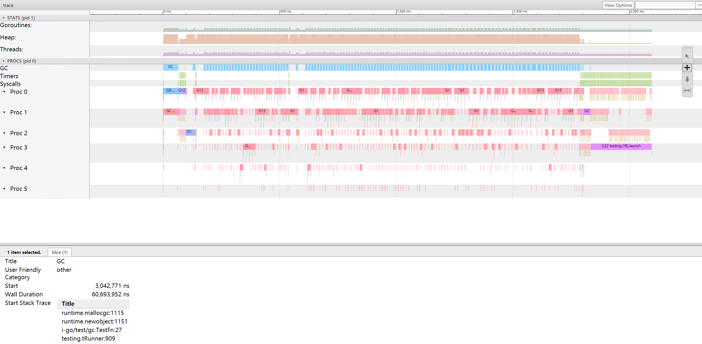

# Go GC

## 1. 概述


## 2. 如何检测

### 1. 打开 GC 日志

在程序执行之前加上环境变量 `GODEBUG=gctrace=1`，即可开启日志。

如：

```go 
GODEBUG=gctrace=1 go test -bench="."
GODEBUG=gctrace=1 go run main.go
```


Linux

一般是通过 `./app` 启动，如果要开启GC日志就需要像这样：

```sh
GODEBUG=gctrace=1 ./app
```

GC日志会以标准错误方式输出，也可以输出到指定的文件中

```go
GODEBUG=gctrace=1 ./app 2 > gc.log
```


### 2. go tool trace

**普通程序输出 trace 信息**

```go
package main

import (
	"os"
	"runtime/trace"
)

func main() {
	file, err := os.Create("trace.out")
	if err != nil {
		panic(err)
	}
	defer file.Close()
	err = trace.Start(file)
	if err != nil {
		panic(err)
	}
	defer trace.Stop()

	// 	your program here
}

```

**测试程序输出**

```shell
go test -trace trace.out
```


**可视化 trace 信息**

```shell
go tool trace trace.out 
```

大概是这样的




## 3. GC信息分析

具体日志格式如下：

```sh
gc 3 @33.250s 0%: 0.013+42+0.005 ms clock, 0.013+0.41/10/0+0.005 ms cpu, 30->30->26 MB, 38 MB goal, 1 P
gc 4 @33.431s 0%: 0.010+24+0.004 ms clock, 0.010+10/5.5/0+0.004 ms cpu, 47->56->42 MB, 52 MB goal, 1 P
gc 5 @33.496s 0%: 0.011+23+0.004 ms clock, 0.011+5.7/5.5/0+0.004 ms cpu, 68->81->42 MB, 85 MB goal, 1 P
gc 6 @62.634s 0%: 0.015+14+0.004 ms clock, 0.015+0.22/3.7/9.3+0.004 ms cpu, 68->68->29 MB, 85 MB goal, 1 P
```

* gc：表示GC过程
* 3：表示第三次GC
* @33.250s：程序总执行时间
* 0%：表示gc时时间和程序运行总时间的百分比
* 0.013+42+0.005 ms clock：*wall-clock* (***还不清楚什么意思***)
* 0.013+0.41/10/0+0.005 ms cpu：*CPU times for the phases of the GC* (***还不清楚什么意思***)
* 30->30->26 MB：gc开始时的堆大小；GC结束时的堆大小；存活的堆大小
* 38 MB goal：整体堆的大小
* 1 P：使用的处理器的数量

```sh
scvg4: inuse: 143, idle: 70, sys: 213, released: 0, consumed: 213 (MB)
```

`inuse: 143,`：使用多少M内存
`idle: 70,`：0 剩下要清除的内存
`sys: 213,`： 系统映射的内存
`released: 0,`： 释放的系统内存
`consumed: 213`： 申请的系统内存


官方解释：

```sh
gctrace: setting gctrace=1 causes the garbage collector to emit a single line to standard
error at each collection, summarizing the amount of memory collected and the
length of the pause. Setting gctrace=2 emits the same summary but also
repeats each collection. The format of this line is subject to change.
Currently, it is:
	gc # @#s #%: #+#+# ms clock, #+#/#/#+# ms cpu, #->#-># MB, # MB goal, # P
where the fields are as follows:
	gc #        the GC number, incremented at each GC
	@#s         time in seconds since program start
	#%          percentage of time spent in GC since program start
	#+...+#     wall-clock/CPU times for the phases of the GC
	#->#-># MB  heap size at GC start, at GC end, and live heap
	# MB goal   goal heap size
	# P         number of processors used
The phases are stop-the-world (STW) sweep termination, concurrent
mark and scan, and STW mark termination. The CPU times
for mark/scan are broken down in to assist time (GC performed in
line with allocation), background GC time, and idle GC time.
If the line ends with "(forced)", this GC was forced by a
runtime.GC() call and all phases are STW.

Setting gctrace to any value > 0 also causes the garbage collector
to emit a summary when memory is released back to the system.
This process of returning memory to the system is called scavenging.
The format of this summary is subject to change.
Currently it is:
	scvg#: # MB released  printed only if non-zero
	scvg#: inuse: # idle: # sys: # released: # consumed: # (MB)
where the fields are as follows:
	scvg#        the scavenge cycle number, incremented at each scavenge
	inuse: #     MB used or partially used spans
	idle: #      MB spans pending scavenging
	sys: #       MB mapped from the system
	released: #  MB released to the system
	consumed: #  MB allocated from the system
```


## 4. 参考资料

https://godoc.org/runtime

https://zhuanlan.zhihu.com/p/77943973

http://legendtkl.com/2017/04/28/golang-gc/

https://juejin.im/post/5c8525666fb9a049ea39c3e6

https://juejin.im/post/5d56b47a5188250541792ede

