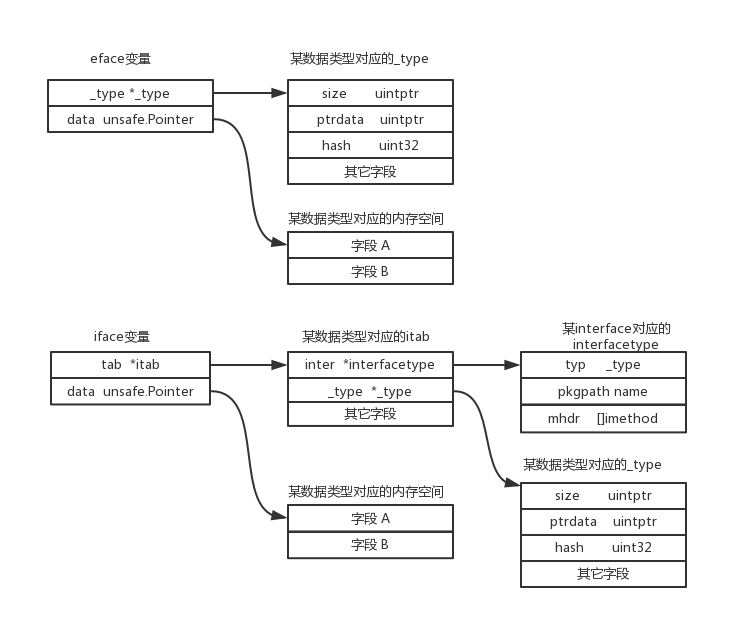
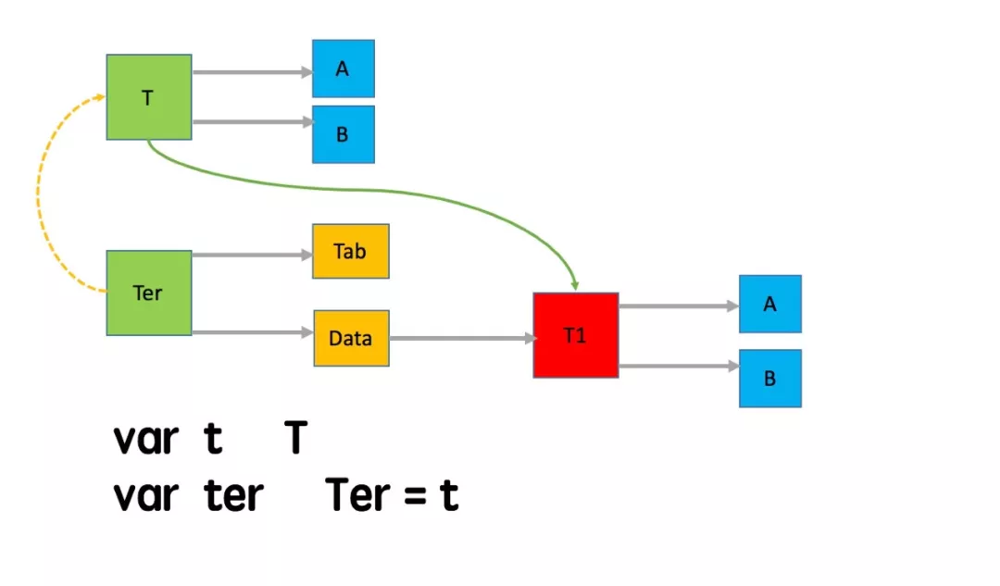

# Go语言Interface详解

## 1. 概述

在Go语言中interface是一个非常重要的概念，也是与其它语言相比存在很大特色的地方。interface也是一个Go语言中的一种类型，是一种比较特殊的类型，存在两种interface，一种是带有方法的interface，一种是不带方法的interface。Go语言中的所有变量都可以赋值给空interface变量，实现了interface中定义方法的变量可以赋值给带方法的interface变量，并且可以通过interface直接调用对应的方法，实现了其它面向对象语言的多态的概念。


## 2. 定义

### 1. eface

不带方法的`interface`定义如下

```go
// runtime2.go 205行
type eface struct {
	_type *_type
	data  unsafe.Pointer
}
```


```go
// 数据类型的元数据
type _type struct {
	size       uintptr
	ptrdata    uintptr // size of memory prefix holding all pointers
	hash       uint32
	tflag      tflag
	align      uint8
	fieldAlign uint8
	kind       uint8
	// function for comparing objects of this type
	// (ptr to object A, ptr to object B) -> ==?
	equal func(unsafe.Pointer, unsafe.Pointer) bool
	// gcdata stores the GC type data for the garbage collector.
	// If the KindGCProg bit is set in kind, gcdata is a GC program.
	// Otherwise it is a ptrmask bitmap. See mbitmap.go for details.
	gcdata    *byte
	str       nameOff
	ptrToThis typeOff
}
```


### 2. iface

带方法的`interface`定义如下:

```go
type iface struct {
	tab  *itab
	data unsafe.Pointer
}
```


```go
type itab struct {
   inter *interfacetype
   _type *_type
   hash  uint32 // copy of _type.hash. Used for type switches.
   _     [4]byte
   fun   [1]uintptr // variable sized. fun[0]==0 means _type does not implement inter.
}
```


接口对应的类型

```go
type interfacetype struct {
	typ     _type
	pkgpath name
	mhdr    []imethod
}
```

### 3. 数据结构

interface结构中第一个字段`_type`或`tab` 是**指向实际类型描述的指针**，用于存储真实的数据类型。

> iface对`_type`进行了扩展所以使用tab结构来存储，tab中同样存储了`_type`信息，同时还有其他扩展记录。

第二个字段`data`代表**数据指针**。如果存储的数据是指针，则直接存储。如果存储的数据是一个值，则存储指向该值的指针。

**go语言中`_type`类型主要用于记录各个类型的元数据,包括go原生类型和用户自定义类型。**




## 3. 赋值

### 1. 按值实现接口

```go
type T struct {}
type Ter interface{
    A()
    B()
}

func(t T) A(){}
func(t *T) B(){}

var o T
var i Ter = o
```

当将o实现接口Ter时，其实是将T类型内存拷贝一份，然后i.data指向新生成复制品的内存地址。当调用i.A()方法时，经过以下3个步骤：

* 1) 通过i.(*data)变量获取复制品内的内容。

* 2) 获取i.(*data).A内存。

* 3) 调用i.(*data).A()方法。



当调用i.B()方法时，由于receiver的是*T.B()和T.A()是不一样的,调用经过也存在区别：

* 1) 通过i.(*data)变量获取其内容(此时的内容指向类型T的指针)。

* 2) 由于i.(*data)变量获取的内容是地址，所以需要进行取地址操作。但Go内部实现禁止对该复制品进行取地址操作，所以无法调用i.B()方法。


### 2. 按指针实现接口

```go
type T struct {}
type Ter interface{
    A()
    B()
}

func(t T) A(){}
func(t *T) B(){}

var o T
var i Ter = &o
```

此时通过调用i.A()和i.B()方法时是如何实现的呢？

* 1) 通过i.(*data)变量获取复制品内容(此时内容为指向类型T的指针)。
* 2) 获取复制品内容(即T类型地址)，然后调用类型T的A和B方法。

### 3. 接口方法集合

通过以上对接口实现分析,可以得出接口的方法集是：

* 1) 类型T的方法集包含所有receiver T方法。
* 2) 类型*T的方法集合包含所有Receiver T + *T方法。


## 4. nil interface和nil区别

### 1. nil

**接口内部`tab`和`data`均为空时，接口才为nil。**

```go
package main

import "fmt"
// nil
func main() {
	var i interface{}
	fmt.Printf("%#v \n",i)
	if i == nil {
		fmt.Println("The interface is nil.")
	}
}
// output
// <nil> 
// The interface is nil.
```


### 2. nil interface

**如果接口内部data值为nil，但tab不为空时，此时接口为nil interface。**

```go
// nil interface
func main() {
	var o *int = nil
	var i interface{} = o
	fmt.Printf("%#v \n",i)
	if i == nil {
		fmt.Println("The interface is nil.")
	}
}
// output
// (*int)(nil) 
```

### 3. 接口nil检查

可以利用reflect（反射）进行nil检查：

```go
// reflect检查nil接口
func main() {
	var o *int = nil
	var i interface{} = o
	var j interface{}
	fmt.Printf("i==nil:%t,j==nil:%t \n", i == nil, j == nil)
	v := reflect.ValueOf(i)
	if v.IsValid() {
		fmt.Println(v.IsNil())
	}
}
```


## 参考

`https://www.cnblogs.com/shijingxiang/articles/12201984.html`

`https://mp.weixin.qq.com/s/px9BRQrTCLX6BbvXJbysCA`