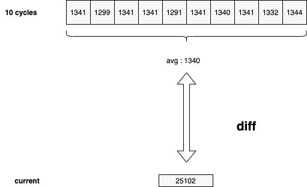

# pprof 自动采样

## 1. 概述

之前文章 [Go语言之pprof性能分析利器](https://www.lixueduan.com/post/go/pprof/) 中讲了如何使用 pprof 来进行性能分析，一般是在测试环境才能这么方便的采集数据，这种方式在线上环境则行不通了。

由于无法再性能出现异常的当时捕捉到现场信息，导致线上性能分析一直比较困难。


以下情况是比较常见的：

- 程序老是半夜崩，崩了以后就重启了，我也醒不来，现场早就丢了，不知道怎么定位
- 这压测开压之后，随机出问题，可能两小时，也可能五小时以后才出问题，这我蹲点蹲出痔疮都不一定能等到崩溃的那个时间点啊
- 有些级联失败，最后留下现场并不能帮助我们准确地判断问题的根因，我们需要出问题时第一时间的现场

> 特别是一些随机出现的内存泄露、CPU 抖动，等你发现有泄露的时候，可能程序已经 OOM 被 kill 掉了。而 CPU 抖动，你可以蹲了一星期都不一定蹲得到。


从现象上，可以将出问题的症状简单分个类：

- cpu 抖动：有可能是模块内有一些比较冷门的逻辑，触发概率比较低，比如半夜的定时脚本，触发了以后你还在睡觉，这时候要定位就比较闹心了。
  - 定时脚本就采过一次坑，定时任务越加越多，都设置的凌晨执行。每次执行CPU都有一个峰值出现
- 内存使用抖动：有很多种情况会导致内存使用抖动，比如突然涌入了大量请求，导致本身创建了过多的对象。也可能是 goroutine 泄露。也可能是突然有锁冲突，也可能是突然有 IO 抖动。原因太多了，猜是没法猜出根因的。
  - 之前是某个特定case下的一个逻辑写的有点问题，从DB中加载了大量数据导致占用大量内存，后期直接OOM。
- goroutine 数暴涨，可能是死锁，可能是数据生产完了 channel 没关闭，也可能是 IO 抖了什么的。

> 很多低频执行的逻辑如果有问题，测试时也不一定能测出来，需要长时间运行才会暴露出来。
>
> 如果没有自动采样，排查问题基本职能靠开发人员对代码逻辑的掌控程度了。
>
> 有时候真滴是`当局者迷,旁观者清`，自己写的逻辑可能存在问题，然后反复看了几遍都找不到问题，换其他人来一下就能看出问题。
>
> 论 code review 的重要性。


这个问题最好的解决办法是 `continuous profiling`，不过这个理念需要公司的监控系统配合，实现成本较高。

在监控系统完善前我们也可以先弄个简易版本。


## 2. 自动采样

没有监控系统配合的简易版本大致思路为：在起个后台 Goroutine 监控 CPU、Mem 等信息，在出现抖动或者异常情况时执行一次采样。

### 监控工具

#### 普通环境

> 该方法之一在普通的宿主机和虚拟机环境有效。


获取`Go`进程的资源使用情况使用`gopstuil`库即可完成，它我们屏蔽了各个系统之间的差异，帮助我们方便地获取各种系统和硬件信息。`gopsutil`将不同的功能划分到不同的子包中，它提供的模块主要有：

- `cpu`：系统CPU 相关模块；
- `disk`：系统磁盘相关模块；
- `docker`：docker 相关模块；
- `mem`：内存相关模块；
- `net`：网络相关；
- `process`：进程相关模块；
- `winservices`：Windows 服务相关模块。

具体使用还是比较简单：

```go
func main() {
	go func() {
		for { // for循环用于消耗CPU
		}
	}()
	_ = make([]int64, 123456789) // 用于消耗内存

	p, _ := process.NewProcess(int32(os.Getpid()))
	cpuPercent, _ := p.Percent(time.Second)
	cp := cpuPercent / float64(runtime.NumCPU())
	// 获取进程占用内存的比例
	mp, _ := p.MemoryPercent()
	// 创建的线程数
	threadCount := pprof.Lookup("threadcreate").Count()
	// Goroutine数
	gNum := runtime.NumGoroutine()
	// output: cpuPercentTotal: 96.93539875444107 cpuPercentSingle:24.233849688610267 mp:0.4705571 threadCount:7 gNum:2
	fmt.Printf("cpuPercentTotal: %v cpuPercentSingle:%v mp:%v threadCount:%v gNum:%v\n", cpuPercent, cp, mp, threadCount, gNum)
}
```


#### 容器环境

> 在容器环境下直接读取到的数据其实是不准确的，因为容器会受到 Cgroups 限制。
>
> 比如限制进程只能用20%的CPU，那么当进程占用宿主机的10% CPU时其实已经用了50%了。

在`Linux`中，`Cgroups`给用户暴露出来的操作接口是文件系统，它以文件和目录的方式组织在操作系统的`/sys/fs/cgroup`路径下，在 `/sys/fs/cgroup`下面有很多诸`cpuset`、`cpu`、 `memory`这样的子目录，**每个子目录都代表系统当前可以被`Cgroups`进行限制的资源种类**。

针对我们监控`Go`进程内存和`CPU`指标的需求，我们只要知道`cpu.cfs_period_us`、`cpu.cfs_quota_us` 和`memory.limit_in_bytes` 就行。前两个参数需要组合使用，可以用来限制进程在长度为`cfs_period`的一段时间内，只能被分配到总量为`cfs_quota`的`CPU`时间， **可以简单的理解为容器能使用的核心数 = cfs_quota / cfs_period**。


所以在容器里获取`Go`进程`CPU`的占比的方法，需要做一些调整，利用我们上面给出的公式计算出容器能使用的最大核心数。

```go
cpuPeriod, err := readUint("/sys/fs/cgroup/cpu/cpu.cfs_period_us")

cpuQuota, err := readUint("/sys/fs/cgroup/cpu/cpu.cfs_quota_us")

cpuNum := float64(cpuQuota) / float64(cpuPeriod)
```

然后再把通过`p.Percent`获取到的进程占用机器所有`CPU`时间的比例除以计算出的核心数即可算出`Go`进程在容器里对`CPU`的占比。

```go
cpuPercent, err := p.Percent(time.Second)
// cp := cpuPercent / float64(runtime.NumCPU())
// 调整为
cp := cpuPercent / cpuNum
```

而容器的能使用的最大内存数，自然就是在`memory.limit_in_bytes`里指定的啦，所以`Go`进程在容器中占用的内存比例需要通过下面这种方法获取

```
memLimit, err := readUint("/sys/fs/cgroup/memory/memory.limit_in_bytes")
memInfo, err := p.MemoryInfo
mp := memInfo.RSS * 100 / memLimit
```

上面进程内存信息里的 [RSS](https://stackoverflow.com/questions/7880784/what-is-rss-and-vsz-in-linux-memory-management) 叫常驻内存，是在RAM里分配给进程，允许进程访问的内存量。

而读取容器资源用的`readUint`，是`containerd`组织在`cgroups`实现里给出的[方法](https://github.com/containerd/cgroups/blob/318312a373405e5e91134d8063d04d59768a1bff/utils.go#L243-L267)。

```go
func readUint(path string) (uint64, error) {
 v, err := ioutil.ReadFile(path)
 if err != nil {
  return 0, err
 }
 return parseUint(strings.TrimSpace(string(v)), 10, 64)
}

func parseUint(s string, base, bitSize int) (uint64, error) {
 v, err := strconv.ParseUint(s, base, bitSize)
 if err != nil {
  intValue, intErr := strconv.ParseInt(s, base, bitSize)
  // 1. Handle negative values greater than MinInt64 (and)
  // 2. Handle negative values lesser than MinInt64
  if intErr == nil && intValue < 0 {
   return 0, nil
  } else if intErr != nil &&
   intErr.(*strconv.NumError).Err == strconv.ErrRange &&
   intValue < 0 {
   return 0, nil
  }
  return 0, err
 }
 return v, nil
}
```


### 采样工具

`Go`的`pprof`工具集，提供了`Go`程序内部多种性能指标的采样能力，我们常会用到的性能采样指标有这些：

- profile：CPU采样
- heap：堆中活跃对象的内存分配情况的采样
- goroutine：当前所有goroutine的堆栈信息
- allocs: 会采样自程序启动所有对象的内存分配信息（包括已经被GC回收的内存）
- threadcreate：采样导致创建新系统线程的堆栈信息

采样工具用 pprof 就够了。


### 采样时间点

线上环境对性能比较敏感，肯定不能一直采样，**最好能在合适的时间点才进行采样**。

常见的一些指标，比如CPU 使用，内存占用和 goroutine 数等，都可以用数值表示，所以不管是“暴涨”还是抖动，都可以用简单的规则来表示：

- cpu/mem/goroutine数 突然比正常情况下的平均值高出了一定的比例，比如说资源占用率突增25%就是出现了资源尖刺。
  - 可以表示瞬时的，剧烈的抖动
- cpu/mem/goroutine数 超过了程序正常运行情况下的阈值，比如说80%就定义为服务资源紧张。
  - 可以用来表示那些缓慢上升，但最终超出系统负荷的情况，例如 1s 泄露一兆内存，直至几小时后 OOM。

这两条规则基本上可以描述大部分情况下的异常了。

计算与均值的 diff，在没有历史数据的情况下，就只能在程序内自行收集了。比如 goroutine 的数据，我们可以每 x 秒运行一次采集，在内存中保留最近 N 个周期的 goroutine 计数，并持续与之前记录的 goroutine 数据均值进行 diff：



比如像图里的情况，前十个周期收集到的 goroutine 数在 1300 左右波动，而最新周期收集到的数据为 2w+，这显然是瞬时触发导致的异常情况，那么我们就可以在这个点自动地去做一些事情，比如：

- 把当前的 goroutine 栈 dump 下来
- 把当前的 cpu profile dump 下来
- 把当前的 off-cpu profile dump 下来
- 不怕死的话，也可以 dump 几秒的 trace

文件保存下来，模块挂掉也就无所谓了。后续发现线上曾经出现过崩溃，那再去线上机器把文件捞下来慢慢分析就可以了。


> 流程大概就是这样，实现也不是很复杂，现在社区已经有相应的开源工具了，没错就是 [holmes](https://github.com/mosn/holmes)。

## 3. 开源工具

 [holmes](https://github.com/mosn/holmes)：self-aware Golang profile dumper。

使用方法也比较简单：

```go
package main

import (
	"net/http"
	"time"

	"github.com/mosn/holmes"
)

func init() {
	http.HandleFunc("/make1gb", make1gbSlice)
	go http.ListenAndServe(":10003", nil)
}

func main() {
	h, _ := holmes.New(
		holmes.WithCollectInterval("2s"),
		holmes.WithCoolDown("1m"),
		holmes.WithDumpPath("/tmp"),
		holmes.WithTextDump(),
		holmes.WithMemDump(3, 25, 80),
	)
	h.EnableCPUDump()
	h.EnableThreadDump()
	h.EnableGoroutineDump()
	h.EnableMemDump().Start()
	time.Sleep(time.Hour)
}

func make1gbSlice(wr http.ResponseWriter, req *http.Request) {
	var a = make([]byte, 1073741824)
	_ = a
}
```

- WithCollectInterval("2s")  指定 2s 为区间监控进程的资源占用率， 线上建议设置大于10s的采样区间。
- WithMemDump(3, 25, 80) 指定进程的mem占用率超过3%后（线上建议设置成30），如果有25%突增，或者总占用率超过80%后进行采样

程序运行起来后，连续访问几次`http://localhost:10003/make1gb`，让内存占用量达到阈值，holmes 就会自动 dump，具体信息会在 `/tmp/holmes.log`文件中。

大致内容如下：

```log
[Holmes] NODUMP mem, config_min : 3, config_diff : 25, config_abs : 80, config_max : 0, previous : [12 12 13 13 13 12 12 12 12 12], current: 13
[Holmes] NODUMP mem, config_min : 3, config_diff : 25, config_abs : 80, config_max : 0, previous : [12 12 13 13 13 13 12 12 12 12], current: 13
[2022-02-07 12:38:08.148][Holmes] pprof mem, config_min : 3, config_diff : 25, config_abs : 80, config_max : 0, previous : [12 12 13 13 13 13 22 12 12 12], current: 22
[2022-02-07 12:38:08.150]heap profile: 5: 2147485136 [21: 16106129168] @ heap/1048576
2: 2147483648 [15: 16106127360] @ 0x78b1c8 0x73cdaf 0x73e6a9 0x73f9db 0x73c108 0x5c7561
#	0x78b1c7	main.make1gbSlice+0x27			D:/lillusory/projects/i-go/test/pprof/auto_pprof/main.go:28
#	0x73cdae	net/http.HandlerFunc.ServeHTTP+0x2e	C:/Go/src/net/http/server.go:2046
#	0x73e6a8	net/http.(*ServeMux).ServeHTTP+0x148	C:/Go/src/net/http/server.go:2424
#	0x73f9da	net/http.serverHandler.ServeHTTP+0x43a	C:/Go/src/net/http/server.go:2878
#	0x73c107	net/http.(*conn).serve+0xb07		C:/Go/src/net/http/server.go:1929
```

其他特性可以参考 [holmes仓库中的教程](https://github.com/mosn/holmes)


## 4. 参考

[Go语言之pprof性能分析利器](https://www.lixueduan.com/post/go/pprof/)

[Go 服务进行自动采样性能分析的方案设计与实现](https://mp.weixin.qq.com/s/MNj7SqooyCYLo0ooUt5APA)

[无人值守的自动 dump（一）](https://mp.weixin.qq.com/s/2nbyWSZMT1HzvYAoaeWK_A)

[无人值守的自动 dump（二）](https://mp.weixin.qq.com/s/wKpTiyc1VkZQy0-J8x519g)