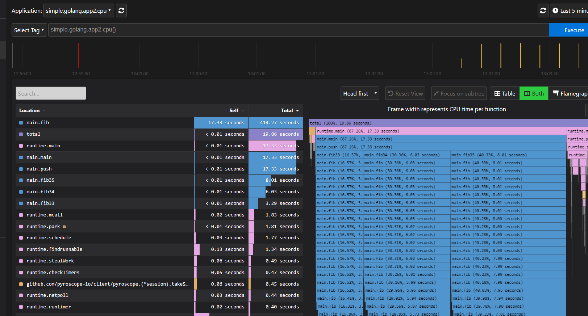

# 持续分析平台 pyroscope

## 1. 概述

[Github](https://github.com/pyroscope-io/pyroscope)

**Profiling** 是了解应用程序的哪些部分消耗最多资源的有效方法。

**Continuous Profiling** 增加了一个时间维度，使您可以了解系统资源使用情况（即 CPU、内存等）随着时间的推移，并让您能够定位、调试和修复与性能相关的问题。


整个项目主要分为**Pyroscope Server**和**Pyroscope Agent**两部分。

Agent 采集并汇总数据，最终发送给 Server。

Server 端则处理、聚合并存储数据，对外提供查询接口。

> 官方提供了一个 [在线 demo](https://demo.pyroscope.io/) 用于体验。


## 2. 演示

### 启动Server端

```shell
$ docker run -it -p 4040:4040 pyroscope/pyroscope:latest server
```

简单起见，直接 docker 跑一个。

### 推模式

dmeo 如下：

```go
func push() {
	pyroscope.Start(pyroscope.Config{
		ApplicationName: "simple.golang.app2",
		// replace this with the address of pyroscope server
		ServerAddress: "http://localhost:4040",
		SampleRate:    100, // 采样率，1~100，默认100
		// you can disable logging by setting this to nil
		Logger: pyroscope.StandardLogger,
		// by default all profilers are enabled,
		// but you can select the ones you want to use:
		ProfileTypes: []pyroscope.ProfileType{
			pyroscope.ProfileCPU,
			pyroscope.ProfileAllocObjects,
			pyroscope.ProfileAllocSpace,
			pyroscope.ProfileInuseObjects,
			pyroscope.ProfileInuseSpace,
		},
		DisableGCRuns: false,
	})

	// your code goes here
	doSomething()
}

func doSomething() {
	ticker := time.NewTicker(time.Millisecond * 200)
	for range ticker.C {
		fib35()
		fib34()
		fib33()
	}
}

func fib35() {
	fib(35)
}
func fib34() {
	fib(34)
}
func fib33() {
	fib(33)
}

func fib(n int) int {
	if n < 2 {
		return n
	}
	return fib(n-1) + fib(n-2)
}
```

简单跑了个 fibonacci ，看下CPU消耗情况：




几个计算 fib 的函数耗时比较多，看起来还是比较直观的。


### 拉模式

Go 集成支持拉模式，也就是我们可以在不添加任何额外代码的情况下分析应用程序。

只需要提供 `/debug/pprof` 路由即可，就像这样：

```go
import _ "net/http/pprof"
go func() {
    _ = http.ListenAndServe("0.0.0.0:8180", nil)
}()
```

由 pyroscope server 端主动来采集数据。


pyroscope 抓取使用的是和 Prometheus 完全相同的机制。因此，它的配置方式几乎相同， 可以参考[Prometheus 文档](https://prometheus.io/docs/prometheus/latest/configuration/configuration/#scrape_config)。

示例如下：

在配置文件 `pyroscope/server.yml` 中增加以下内容：

```yaml
---
# A list of scrape configurations.
scrape-configs:
  # The job name assigned to scraped profiles by default.
  - job-name: pyroscope

    # The list of profiles to be scraped from the targets.
    enabled-profiles: [cpu, mem]

    # List of labeled statically configured targets for this job.
    static-configs:
      - application: my-application-name
        targets:
          - localhost:8180
        labels:
          env: dev
```

配置可以说是和 Prometheus 一模一样了：

* application：应用名，主要用于区分
* targets： 数据采集地址


## 3. 其他

### Grafana 插件

pyroscope 提供了 [Grafana 插件](https://pyroscope.io/docs/grafana-plugins/)，可以在 Grafana 中查看火焰图。

> 一般监控系统的 UI 都用的 Grafana ，这样可以统一管理。


其他特性和具体细节请参考[官方文档](https://pyroscope.io/docs/)。