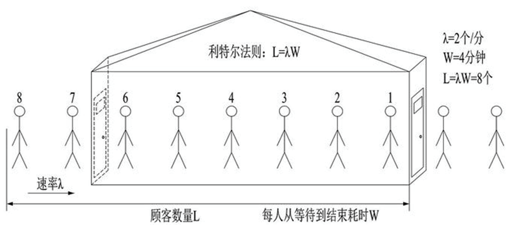
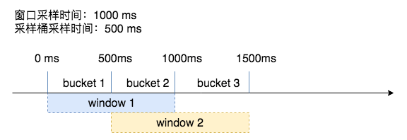
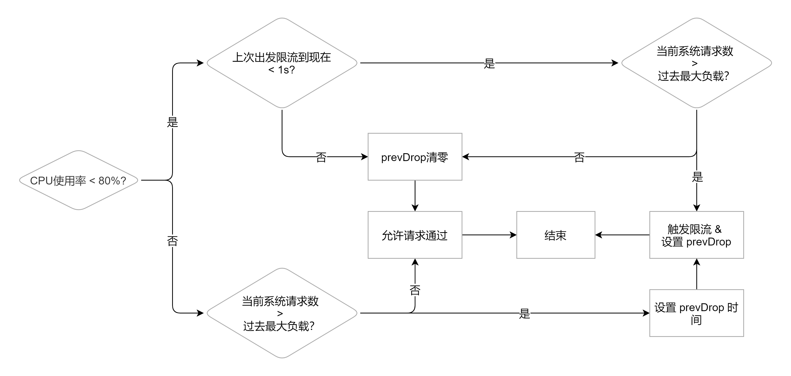

# 自适应限流

## 1. 概述

### What

自适应限流从整体维度对应用入口流量进行控制，结合应用的 Load、CPU 使用率、总体平均 RT、入口 QPS 和并发线程数等几个维度的监控指标，通过自适应的流控策略，让系统的入口流量和系统的负载达到一个平衡，让系统尽可能跑在最大吞吐量的同时保证系统整体的稳定性。

**核心目标：**

- 自动嗅探负载和 qps，减少人工配置
- 削顶，保证超载时系统不被拖垮，并能以高水位 qps 继续运行


### Why

常见限流算法，令牌桶、漏桶等都属于**需要提前设置阈值**的算法，基于 QPS 进行限流的时候最麻烦的就是这个阈值应该怎么设定。一般来说我们可以通过压测来决定这个阈值。

- 但是如果每个系统上线前都要经过很严格的压测，那么成本相对来说会比较大
- 并且我们很多时候压测都会在测试环境进行压测，测试环境一般来说和生产环境会有一定的差异，即使我们在生产环境做了压测，现在我们的应用都是以容器的形式跑在不同的宿主机上的，每台宿主机上的差异，以及不同的负载都会导致这个压测时的结果不一定就一定是正确的
- 当我们的机器型号、数量等发生改变时，之前压测的指标能不能用其实是一个问题，这些数据对于系统负载的影响其实不是线性的，举个例子之前一台机器，后面再加一台，负载就一定能到 2 倍么？其实是不一定的
- 如果需要修改限流的值，虽然之前我们将令牌桶的限流是可以动态调整，但是靠人去调整，如果真出现问题然后再叫运维或者是开发同学去调整可能黄花菜都凉了


### How

我们可以通过综合分析服务的 cpu 使用率、请求成功的 qps 和请求成功的 rt 来做自适应限流保护。

比如 CPU 超过 80%或者系统中处理的请求数已经超过了系统的最大吞吐量了，这时候可能就需要进行限流了。


## 2. 自适应限流怎么做

前面我们遇到的主要问题就是**每个服务实例的限流阈值实际应该是动态变化的**，我们应该根据系统能够承载的最大吞吐量，来进行限流，当当前的流量大于最大吞吐的时候就限制流量进入，反之则允许通过。那现在的问题就是

- **系统的吞吐量该如何计算？**
- **什么时候系统的吞吐量就是最大的吞吐量了？**


### 利特尔法则

**利特尔法则：L = λ * W**

> 利特尔法则由麻省理工大学斯隆商学院（MIT Sloan School of Management）的教授 John Little﹐于 1961 年所提出与证明。它是一个有关提前期与在制品关系的简单数学公式，这一法则为精益生产的改善方向指明了道路。 —- [MBA 智库百科 (mbalib.com)](https://wiki.mbalib.com/wiki/利特尔法则)



如上图所示，如果我们开一个小店，平均每分钟进店 2 个客人(λ)，每位客人从等待到完成交易需要 4 分钟(W)，那么在当前情况下我们店里能承载的客人数量就是 2 * 4 = 8 个人。

同理，我们可以将 `λ` 当做 QPS， `W` 呢是每个请求需要花费的时间，那我们系统当前的吞吐就是 `L = λ * W` ，所以我们可以使用利特尔法则来计算系统的吞吐量。


### 最大吞吐量

**什么时候系统的吞吐量就是最大的吞吐量？**

我们可以通过统计过去一段时间的数据，获取到平均每秒的请求量，也就是 QPS，以及请求的耗时时间以此来计算系统吞吐量。

> 为了避免出现前面 900ms 一个请求都没有最后 100ms 请求特别多的情况，我们可以使用滑动窗口算法来进行统计。


吞吐量是存在上限的，当请求超过系统最大承受能力后，吞吐量反而会下降。因此需要做流控，我们可以选择一个系统指标来做流控，只要这个指标达到了阈值那我们就进入流控当中，使得系统能一直保持最大吞吐量，而不是被大量请求压垮。

> 选定的指标数据达到阈值时，说明整个系统性能释放达到一个最佳状态了，请求再多一点可能都处理不过来了。

常见的选择一般是 CPU、Memory、System Load，这里我们以 CPU 为例：

只要我们的 CPU 负载超过 80% 的时候，整个系统能力获取过去 5s 的最大吞吐数据，然后再统计当前系统中的请求数量，只要当前系统中的请求数大于最大吞吐那么我们就丢弃这个请求。


## 3. kratos 自适应限流分析

### 概述

开源实现 [kratos-bbr](https://github.com/go-kratos/aegis/tree/main/ratelimit) 借鉴了 Sentinel 项目的自适应限流系统，通过综合分析服务的 cpu 使用率、请求成功的 qps 和请求成功的 rt 来做自适应限流保护。

判断是否丢弃当前请求的算法如下：

```go
(cpu > 800 OR (Now - PrevDrop) < 1s) AND (MaxPass * MinRt * windows / 1000) < InFlight
```

* `MaxPass` 表示最近 5s 内，单个采样窗口中最大的请求数。
* `MinRt` 表示最近 5s 内，单个采样窗口中最小的响应时间。 
* `windows` 表示一秒内采样窗口的数量，默认配置中是 5s 50 个采样，那么 windows 的值为 10。
* `MaxPass * MinRt * windows / 1000` 表示系统最大吞吐量。
* `InFlight` 表示当前系统中有多少请求

为了提高精确度，将数值扩大了 1000倍，比如CPU > 800 就是 CPU 整体使用率超过 80%的意思。

同时满足以下条件时将会丢弃请求：

* 1）CPU 超过 80%或者上次触发限流是在 1s 内（为了避免反复出现限流恢复导致请求时间和系统负载产生大量毛刺）
* 2）当前处理中正在处理的请求数量超过最近测试出来的最大吞吐量


### 演示

简单演示一下怎么使用 kratos 这个限流库。

```go
func main() {
	limiter := bbr.NewLimiter()
	doneFunc, err := limiter.Allow()
	if err != nil { // 返回错误则说明需要进行限流
		return
	}
	defer doneFunc(ratelimit.DoneInfo{})// 最好在 defer 中执行 doneFunc,保证panic之后也不会导致数据异常
	// 	your logic here
}
```

然后这个肯定是放在中间件里用的，gin 或者 gRPC 都能很方便的接入：

```go
// RateLimit is a server interceptor that rate limits requests.
func RateLimit(ctx context.Context, req interface{}, _ *grpc.UnaryServerInfo, handler grpc.UnaryHandler) (resp interface{}, err error) {
	doneFunc, err := limiter.Allow()
	if err != nil {
		return nil, err
	}
	defer doneFunc(ratelimit.DoneInfo{})
	return handler(ctx, req)
}

func RateLimit() gin.HandlerFunc {
	return func(ctx *gin.Context) {
		doneFunc, err := limiter.Allow()
		if err != nil {
			ctx.AbortWithStatusJSON(http.StatusOK, "request-limit")
			return
		}
		defer doneFunc(ratelimit.DoneInfo{})
		ctx.Next()
	}
}
```


### 源码分析

主要分为 3个 部分：

* CPU 数据采集
* 吞吐量计算
* 限流策略


#### CPU 数据采集

kratos 中实现了两套采集方案以适应不同的服务器环境：

* 容器环境下从 cgroup 中读取当前 CPU 状态
* 物理机环境下则使用 psutil 工具直接采集宿主机数据。

主要逻辑在 `pkg/cpu/stat.go` 文件。

```go
// pkg/cpu/stat.go 24 行
func init() {
	var (
		err error
	)
    // 默认当做容器环境处理
	stats, err = newCgroupCPU()
	if err != nil {
        // 如果失败说明不是容器环境或者没有限制 cgroup，那就采集宿主机的数据
		stats, err = newPsutilCPU(interval)
		if err != nil {
			panic(fmt.Sprintf("cgroup cpu init failed!err:=%v", err))
		}
	}
	go func() {
		ticker := time.NewTicker(interval)
		defer ticker.Stop()
		for {
			<-ticker.C
			u, err := stats.Usage()
			if err == nil && u != 0 {
				atomic.StoreUint64(&usage, u)
			}
		}
	}()
}
```

默认当做容器环境处理，如果失败说明不是容器环境或者没有限制 cgroup，那就切换到 psutil，采集宿主机的数据。

然后用一个后台 goroutine 借助 ticker 定时（默认为 500ms）采集数据。

cpu 并不是用的实时值，具体计算公式如下：

```go
// cpu = cpuᵗ⁻¹ * decay + cpuᵗ * (1 - decay)
func cpuproc() {
	ticker := time.NewTicker(time.Millisecond * 500) // same to cpu sample rate
	defer func() {
		ticker.Stop()
		if err := recover(); err != nil {
			go cpuproc()
		}
	}()

	// EMA algorithm: https://blog.csdn.net/m0_38106113/article/details/81542863
	for range ticker.C {
		stat := &cpu.Stat{}
		cpu.ReadStat(stat)
		prevCPU := atomic.LoadInt64(&gCPU)
		curCPU := int64(float64(prevCPU)*decay + float64(stat.Usage)*(1.0-decay))
		atomic.StoreInt64(&gCPU, curCPU)
	}
}
```

可以看到，用的是一个滑动平均算法：

```
cpu = cpuᵗ⁻¹ * decay + cpuᵗ * (1 - decay)
```

具体算法参考：[EMA algorithm](https://blog.csdn.net/m0_38106113/article/details/81542863)


#### 吞吐量计算

为了计算系统吞吐量，kratos 采用滑动窗口方式记录个相关数据。




kratos 中系统最大吞吐量计算公式如下：

```go
// MaxPass * MinRt * windows / 1000
func (l *BBR) maxInFlight() int64 {
   // +0.5 主要是把 Floor 转成四舍五入
	return int64(math.Floor(float64(l.maxPASS()*l.minRT()*l.bucketPerSecond)/1000.0) + 0.5)
}
```

其中 l.bucketPerSecond 为每次采样时间，即上图中的 bucket，而maxPass 和 minRT 都是实时根据滑动窗口中的数据计算出来的，具体计算逻辑如下：

```go
	rawMaxPass := int64(l.passStat.Reduce(func(iterator window.Iterator) float64 {
		var result = 1.0
		for i := 1; iterator.Next() && i < l.opts.Bucket; i++ {
			bucket := iterator.Bucket()
			count := 0.0
			for _, p := range bucket.Points {
				count += p
			}
			result = math.Max(result, count)
		}
		return result
	}))
```


```go
	rawMinRT := int64(math.Ceil(l.rtStat.Reduce(func(iterator window.Iterator) float64 {
		var result = math.MaxFloat64
		for i := 1; iterator.Next() && i < l.opts.Bucket; i++ {
			bucket := iterator.Bucket()
			if len(bucket.Points) == 0 {
				continue
			}
			total := 0.0
			for _, p := range bucket.Points {
				total += p
			}
			avg := total / float64(bucket.Count)
			result = math.Min(result, avg)
		}
		return result
	}
```

这样就计算出了系统最大的吞吐量。


#### 限流策略

策略如下：

```go
(cpu > 800 OR (Now - PrevDrop) < 1s) AND (MaxPass * MinRt * windows / 1000) < InFlight
```

or 条件可以先忽略，这个是为了优化而添加的。

就是 CPU 超过 80% 且系统处理中的请求超过了最大吞吐量，和前面分析的一致。

第一版本就是这样实现的，然后存在一个问题，CPU 在 80% 边缘反复很跳，一会限流一会不限流，导致出现很多毛刺。

因此加上了 or 这个条件，每次开启限流最少也要保持一秒，即使后续 CPU 降下去了，只要在 1秒 内都限流，从而消除了毛刺。


InFlight 就是系统中正在处理的请求，这个值的增加也比较简单：

```go
func (l *BBR) Allow() (ratelimit.DoneFunc, error) {
	if l.shouldDrop() {
		return nil, ratelimit.ErrLimitExceed
	}
    // 请求allow方法时+1
	atomic.AddInt64(&l.inFlight, 1)
	start := time.Now().UnixNano()
	return func(ratelimit.DoneInfo) {
		rt := (time.Now().UnixNano() - start) / int64(time.Millisecond)
		l.rtStat.Add(rt)
        // 用户执行done方法时-1
		atomic.AddInt64(&l.inFlight, -1)
		l.passStat.Add(1)
	}, nil
}
```

根据这个描述可知，调用者必须在处理完成后调用 done 方法，不然 inFlight 会一直累积，导致整个限流算法无法正常使用。

具体限流逻辑为：

```go
func (l *BBR) shouldDrop() bool {
	now := time.Duration(time.Now().UnixNano())
	if l.cpu() < l.opts.CPUThreshold {
		// current cpu payload below the threshold
		prevDropTime, _ := l.prevDropTime.Load().(time.Duration)
		if prevDropTime == 0 {
			// haven't start drop,
			// accept current request
			return false
		}
		if time.Duration(now-prevDropTime) <= time.Second {
			// just start drop one second ago,
			// check current inflight count
			inFlight := atomic.LoadInt64(&l.inFlight)
			return inFlight > 1 && inFlight > l.maxInFlight()
		}
		l.prevDropTime.Store(time.Duration(0))
		return false
	}
	// current cpu payload exceeds the threshold
	inFlight := atomic.LoadInt64(&l.inFlight)
	drop := inFlight > 1 && inFlight > l.maxInFlight()
	if drop {
		prevDrop, _ := l.prevDropTime.Load().(time.Duration)
		if prevDrop != 0 {
			// already started drop, return directly
			return drop
		}
		// store start drop time
		l.prevDropTime.Store(now)
	}
	return drop
}
```

逻辑和分析的一致：

* 如果 CPU 小于阈值也判断一下是否在 1秒 的限流时间内，是则根据处理中的请求数是否超过了最大吞吐量来判断是否进行限流。
  * 不需要限流则把 prevDropTime 重置为 0，下次就不需要判断吞吐量了。
* 如果 CPU 超过阈值则直接判断是否超过了最大吞吐量。
  * 超过则进行限流同时还更新 prevDropTime 为当前时间。


逻辑如下图所示：



> 图源：[Go可用性(五) 自适应限流](https://lailin.xyz/post/go-training-week6-4-auto-limiter.html)


## 4. FAQ

**1）Kata 容器等类虚拟机环境下程序中采集到的 CPU 数据不准确。**

> 比如实际限制 CPU Quota 为0.5，但是 Kata 虚拟机分配的是两个 CPU 核心，平均下来每个核心能用0.25。
> 由于无法准确采集到 CPU Quota，导致程序中还是按照两个 CPU 核心在计算当前的 CPU 使用率。
> 比如使用了10%的时候，由于进程只能用0.5，因此真实情况是已经占用了20%了。

**解决方案一：曲线救国**

可以通过设置 `WithCPUThreshold` 来配合限流，比如两核 CPU 只能用 0.5，那综合下来就是最多不能超过 25%，如果要限制为 80% 时限流，那就需要设置为25%*80%=20% 时开始限流。


**解决方案二：手动设置 Quota**

既然是 Quota 采集不准，那就添加一个 Option 手动注入进去。

```go
func WithCPUQuota(quota float64) Option {
	return func(o *options) {
		o.CPUQuota = quota
	}
}
```

[github.com/lixd/aegis](github.com/lixd/aegis)

主要调整了有 Quota 时 CPU使用率计算方式。

```go
	if opt.CPUQuota != 0 {
		// if cpuQuota is set, use new cpuGetter,Calculate the real CPU value based on the number of CPUs and Quota.
		limiter.cpu = func() int64 {
			return int64(float64(atomic.LoadInt64(&gCPU)) * float64(runtime.NumCPU()) / opt.CPUQuota)
		}
	}
```


## 5. 参考

[kratos 官方文档](https://github.com/go-kratos/kratos/blob/v1.0.x/docs/ratelimit.md)

[Sentinel 系统自适应限流](https://github.com/alibaba/Sentinel/wiki/%E7%B3%BB%E7%BB%9F%E8%87%AA%E9%80%82%E5%BA%94%E9%99%90%E6%B5%81)

[go-kratos/aegis](https://github.com/go-kratos/aegis/)

[Go可用性(五) 自适应限流](https://lailin.xyz/post/go-training-week6-4-auto-limiter.html)